# 前言

https://www.bilibili.com/video/BV1xR4y177LR

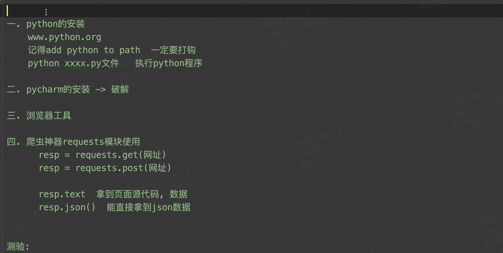


# 初识爬虫

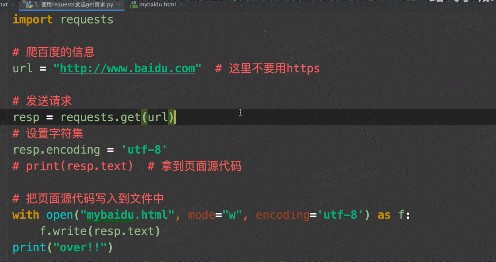


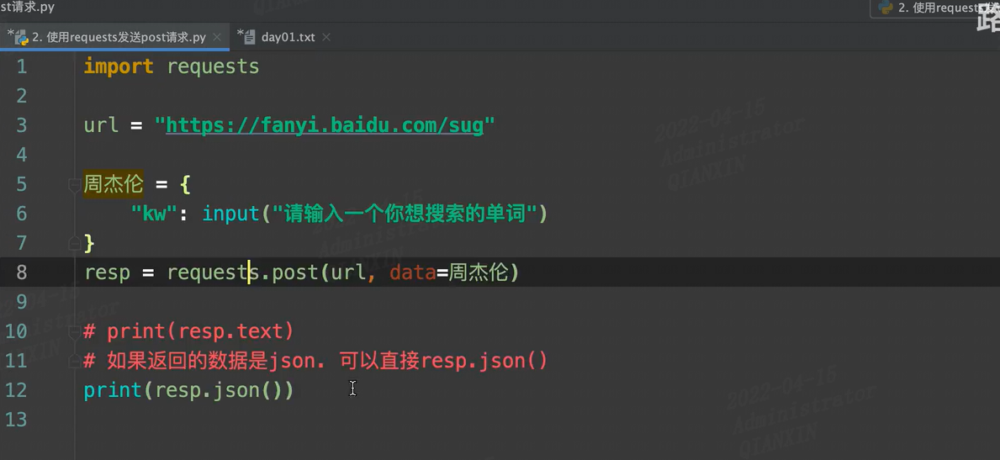


# 正则

https://tool.oschina.net/regex

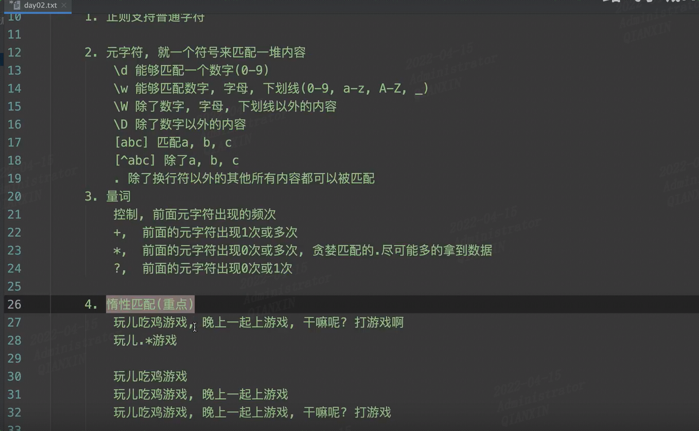

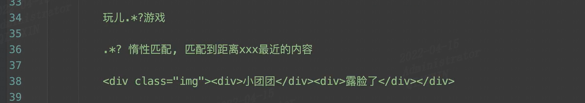

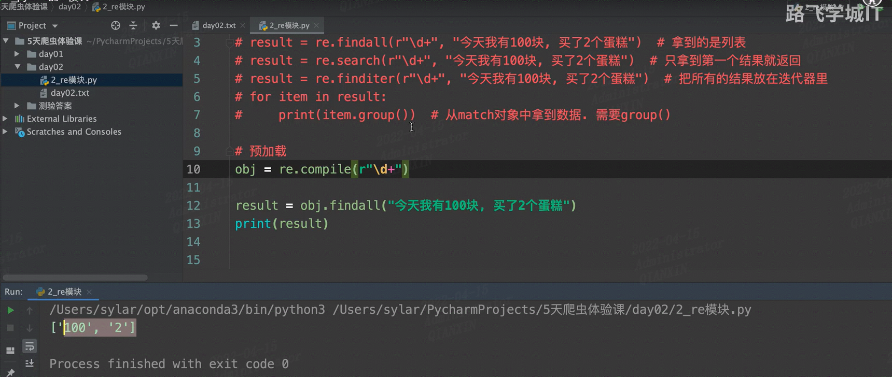

```python
result = re.findall(r"\d+","今天我有100块钱，买了2个蛋糕")        #正则匹配所有,返回列表
result = re.search(r"\d+","今天我有100块钱，买了2个蛋糕")         #只拿到一个结果就返回，match对象，需要后面加group方法获取数据
result = re.finditer(r"\d+","今天我有100块钱，买了2个蛋糕")     #把所有的结果放到迭代器中
for item in result:
    print(item.group()) #从match对象中拿到数据，需要group()

# 预加载
re.compile()
obj= re.compile(r"\d+")

result = obj.findall("今天我有100块钱，买了2个蛋糕")
print(result)
```

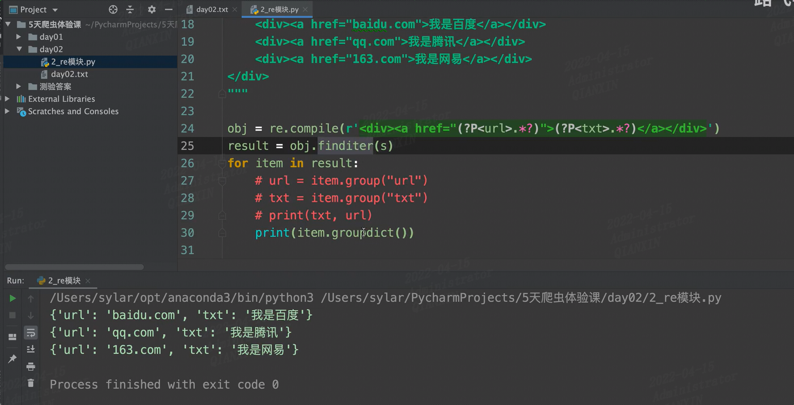


爬虫实战

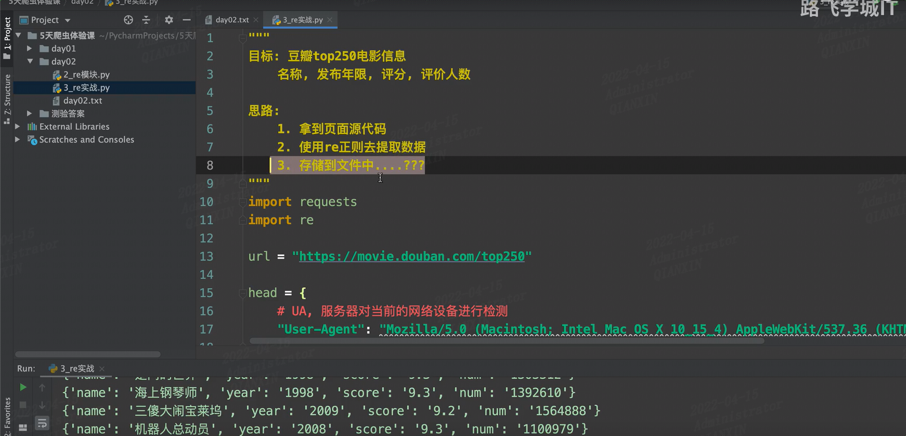

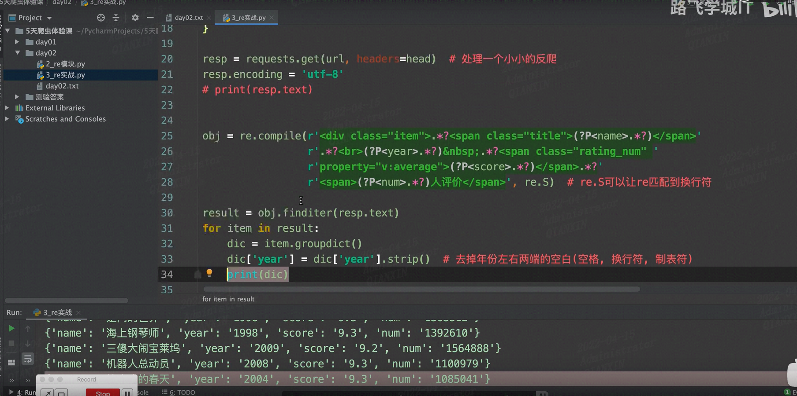


# 其它

## 爬虫url的两种请求方法

- urllib模块

- requests模块


## 几种获取页面内容的方法

- re
- xpath
- from bs4 import BeautifulSoup


# 爬虫实战


## 提取文本

### 0x01 re

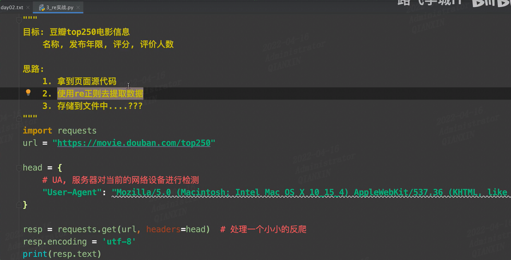

https://movie.douban.com/top250/

```python
# encoding = utf-8
import re
import requests

for i in range(1,11):
    page = (i-1) * 25
    url = f"https://movie.douban.com/top250?start={page}&filter="

    head = {
        #UA,服务器对当前的网络设备进行检测
        "User-Agent":"Mozilla/5.0 (Windows NT 10.0; Win64; x64) AppleWebKit/537.36 (KHTML, like Gecko) Chrome/100.0.4896.88 Safari/537.36"
    }

    resp = requests.get(url,headers = head) #处理一个小反爬
    resp.encoding = 'utf-8'
    # print(resp.text)

    obj = re.compile(r'<div class="item">.*?<span class="title">'
                     r'(?P<name>.*?)</span>.*?<br>(?P<year>.*?)&nbsp.*?'
                     r'property="v:average">(?P<score>.*?)</span>.*?<span>(?P<num>.*?)人评价</span>',re.S)

    result = obj.finditer(resp.text)
    for item in result:
        dic = item.groupdict()
        dic['year'] = dic['year'].strip()
        print(dic)
```

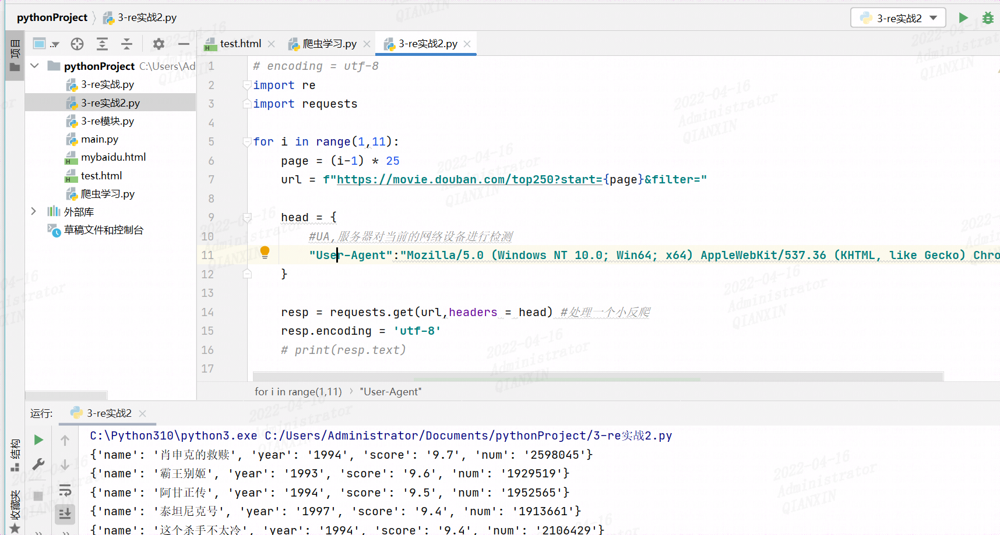


### 0x02 xpath

https://www.bilibili.com/video/BV1xR4y177LR?p=15

https://www.w3school.com.cn/xpath/xpath_syntax.asp

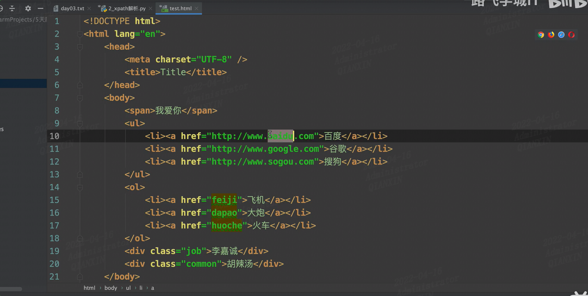


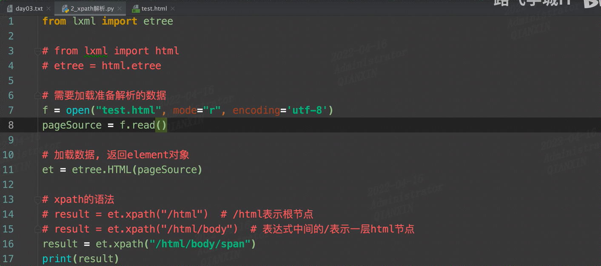

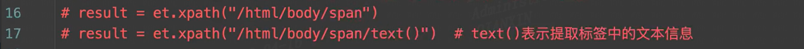

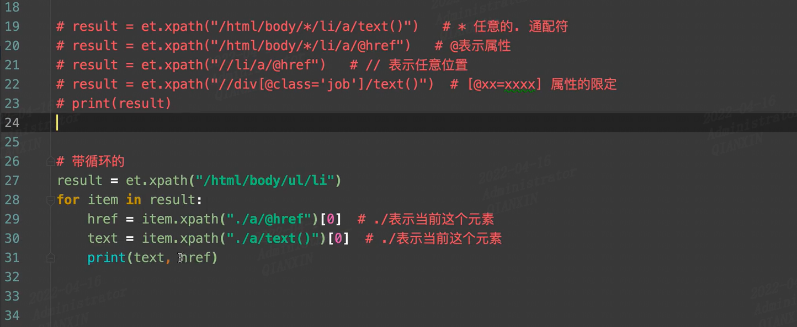


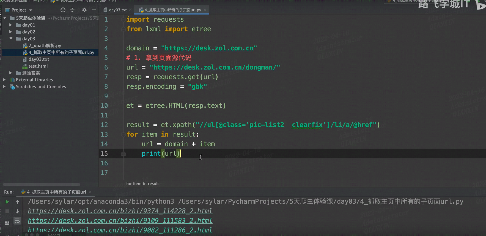


## 提取图片

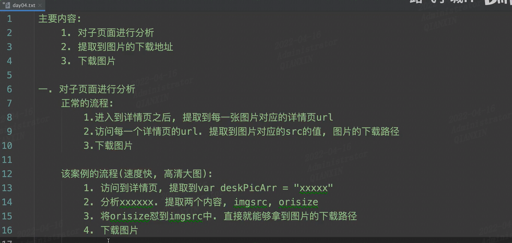


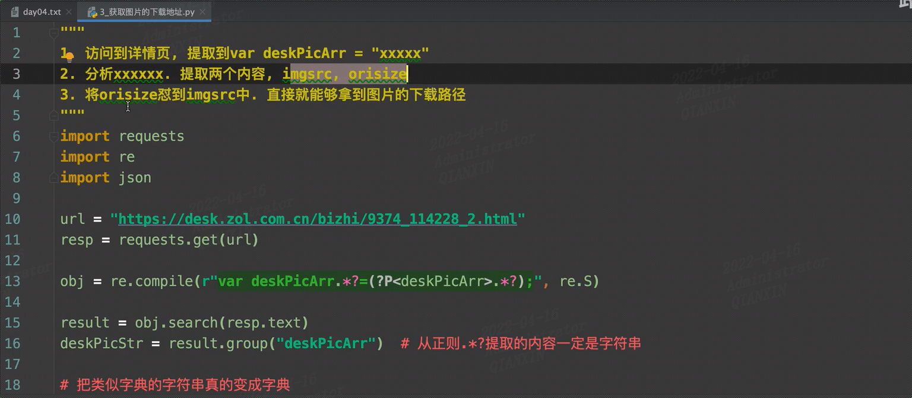

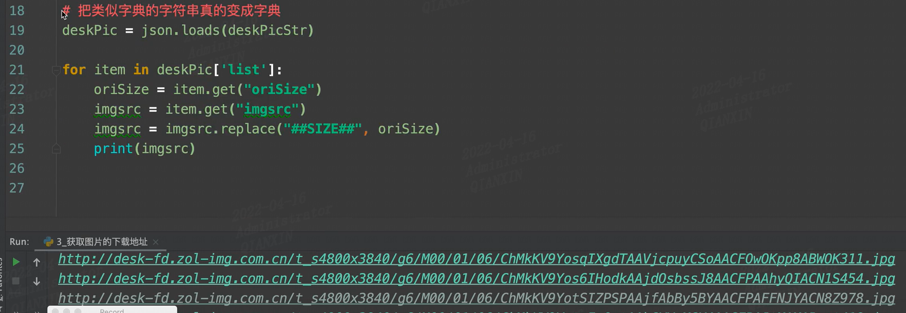


图片下载

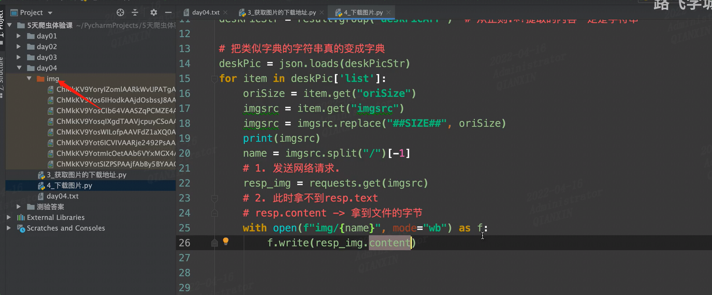


```python
'''
1.访问详情页，提取到var deskPicarr = "xxxxx"
2.分析xxxxx，提取两个内容，imgsrc,orisize
3.将orisize怼到imgsrc中，直接就能够拿到图片的下载路径
'''


import requests
import re
import json

url = "https://desk.zol.com.cn/bizhi/9905_119042_2.html"
resp = requests.get(url)

obj = re.compile(r"var deskPicArr.*?=(?P<deskPicArr>.*?);",re.S)

result = obj.search(resp.text)
deskPicStr = result.group("deskPicArr") #从正则.*?提取的内容一定是字符串

# 把类似于字典的字符串真的变成字典
deskPic = json.loads(deskPicStr)

for item in deskPic['list']:
    oriSize = item.get("oriSize")
    imgsrc = item.get("imgsrc")
    imgsrc = imgsrc.replace("##SIZE##",oriSize)
    print(imgsrc)

    name = imgsrc.split("/")[-1]
    # 1.发送网络请求
    resp_img = requests.get(imgsrc)
    # 2.此时拿不到resp.text
    # resp.content ->拿到文件的字节
    with open(f"img/{name}",mode="wb") as f:
        f.write(resp_img.content)

```


# 防盗链

当页面做了动态加载，即想要的数据在源代码里看不到，这时候需要从分析网络请求，可以尝试用F12开发者工具，在网络->Fetch/XHR中获取真实的请求地址

如：梨视频案例 https://www.bilibili.com/video/BV1FV41177a6?p=154


# 代理

```python
#代理：通过第三方的一个机器去发送请求

import requests

proxies = {
	"http" : "http://127.0.0.1:10809"	#这里是我本地开启的代理
}

# resq = requests.get("http://www.hngslwgs.com/", proxies = proxies)
resq = requests.get("http://www.hngslwgs.com/")
resq.encoding="utf-8"

print(resq.text)
```

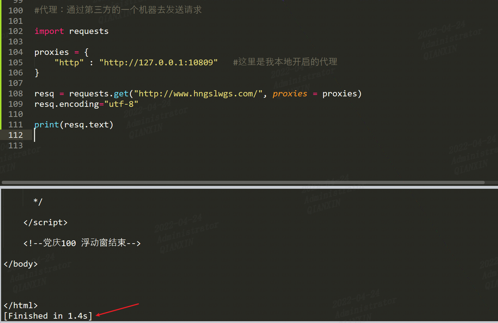

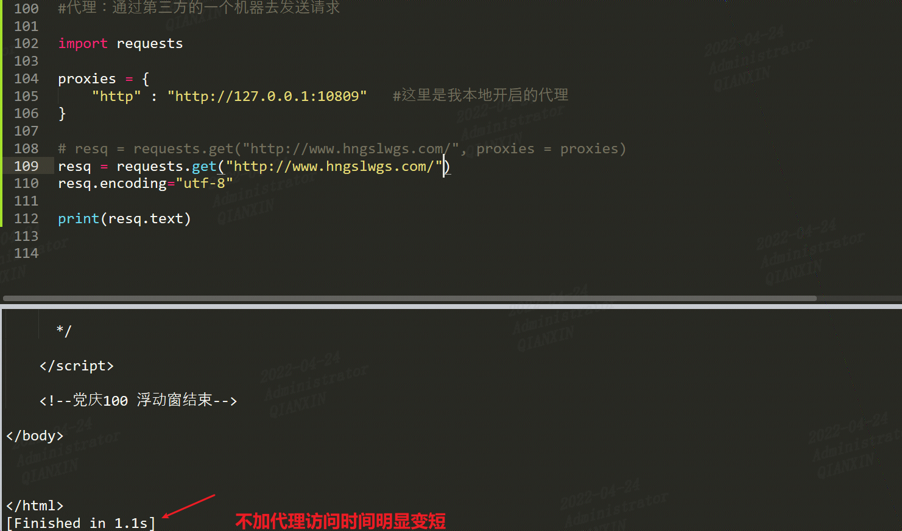


# 线程

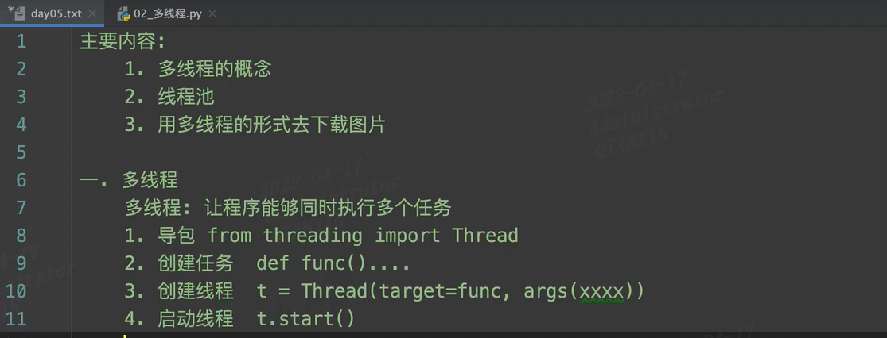

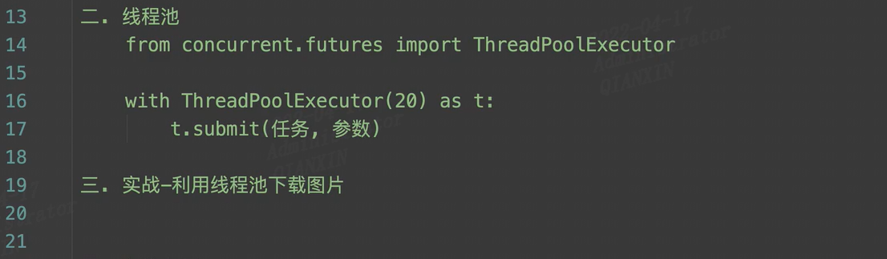


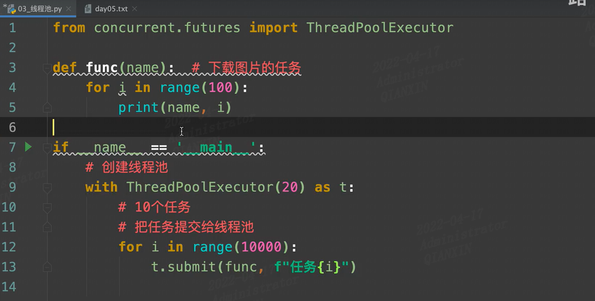


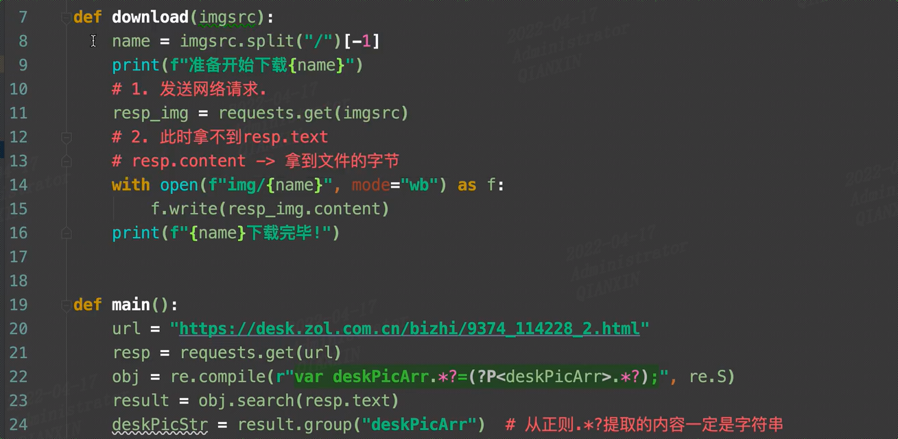

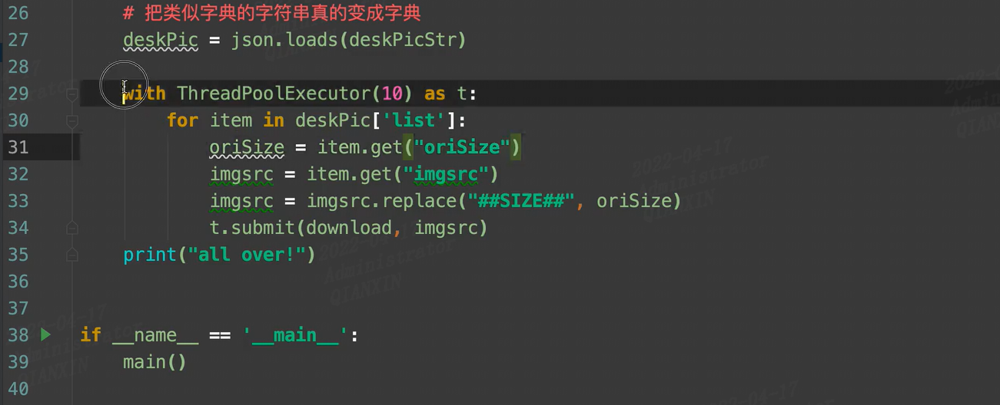


# 协程

async [ə'sɪŋk] 异步

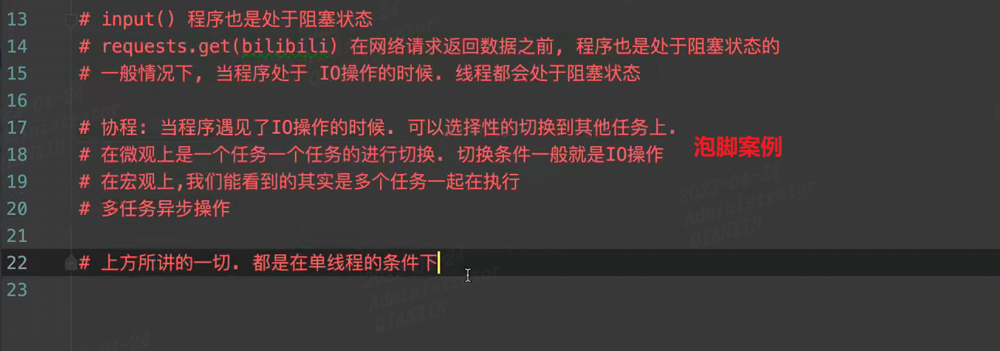


# 完整项目

```python
import re
import requests
from lxml import etree
import json
from concurrent.futures import ThreadPoolExecutor

domain = "https://desk.zol.com.cn"

def get_detail_href(url):
    """
    该函数负责获取到每一个详情页的href的值
    """
    resp = requests.get(url)
    resp.encoding = "gbk"

    et = etree.HTML(resp.text)
    hrefs = et.xpath("//ul[@class='pic-list2  clearfix']/li/a/@href")
    # 处理一下href,需要添加域名
    new_hrefs = []
    for href in hrefs:
        new_hrefs.append(domain + href)
    return new_hrefs

def get_img_src(href):
    """
    访问每一个详情页，得到每一个详情页背后对应的一组图片的下载路径
    """
    if "exe" not in href:   #处理第一个是【客户端】的情况
        resp = requests.get(href)
        resp.encoding = "gbk"
        obj = re.compile(r"var deskPicArr.*?=(?P<desk_str>.*?);", re.S)
        # 提取页面中关于图片路径的信息
        result = obj.search(resp.text).group("desk_str")
        desk_dict = json.loads(result)  #把页面中提取到的字符串处理成字典
        # print(desk_dict)

        img_src_list = []
        for item in desk_dict['list']:
            # print(item)
            ori = item.get("oriSize")
            img_src = item.get("imgsrc")
            img_src = img_src.replace("##SIZE##", ori)
            img_src_list.append(img_src)
        return img_src_list

    else:
        pass

def download_img(img_src):
    name = img_src.split("/")[-1]
    print(f"开始下载{name}")
    resp = requests.get(img_src)
    with open(f"img/{name}", mode="wb") as f:
        f.write(resp.content)
    print(f"{name}下载完毕")


def main():
    url = "https://desk.zol.com.cn/pc/"
    print("抓取首页中每个详情页的href......")
    #1.抓取首页中每个详情页的href
    hrefs = get_detail_href(url)
    print("抓取首页中每个详情页的href......搞定")

    print("访问每一个详情页，得到每个详情页背后的一组图片的下载地址")
    img_list= []    #装着网站所有的图片下载地址（这一层嵌套有点绕，注意）
    for href in hrefs:
        #2.访问每一个详情页，得到每个详情页背后的一组图片的下载地址
        img_src_list = get_img_src(href)
        if img_src_list is not None:    #处理第一个是None的情况
            for img_src in img_src_list:
                img_list.append(img_src)

        else:
            pass

    print("访问每一个详情页，得到每个详情页背后的一组图片的下载地址,搞定！！！")
    # 3.开始下载图片
    with ThreadPoolExecutor(20) as t:
        for img in img_list:    #img图片下载路径
            t.submit(download_img, img)

    print("全部下载完毕！")


if __name__ == '__main__':
    main()
```

