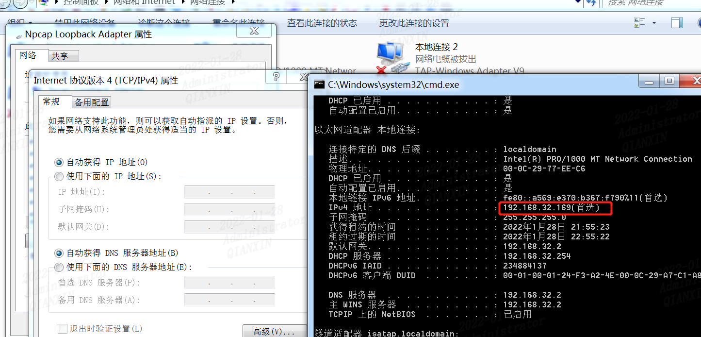
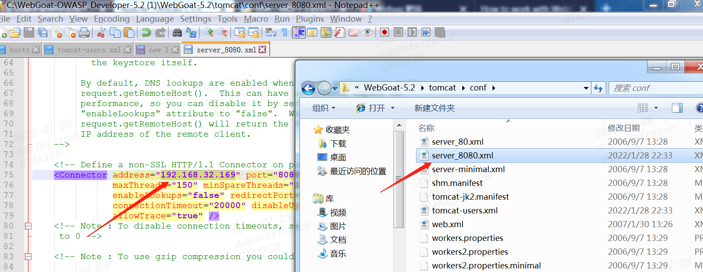
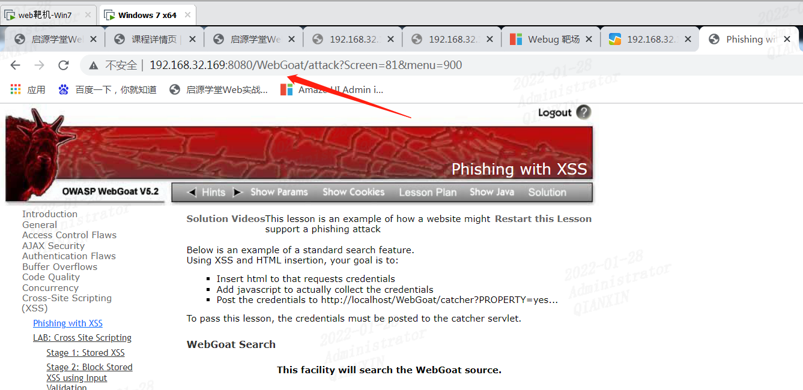
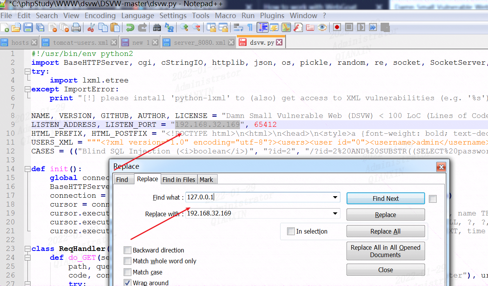

Web安全入门进阶实战课程靶场为我们提供了很多web攻击靶场，免去了自己搭建过程中遇到的各种问题。但是在实际搭建过程中，发现配置上还有有点小问题，记录一下。

因为默认配置是127.0.0.1，也就是说只能在本地访问，其它主机想去访问则访问不到。有时候需要用到集成工具如果kali等其它辅助渗透的时候会不太方便，这里记录下修改配置记录。

## 0x00 web服务器信息

web靶场IP地址信息




## 0x01 配置webgoat

由于默认是127.0.0.1，只能是http://localhost:8080/WebGoat，这里我修改下配置文件`server_8080.xml`



这样可以在其它机器访问了，默认登录名密码 guest/guest

```
http://192.168.32.169:8080/WebGoat/attack
```



## 0x02 配置dsvw

由于127.0.0.1只能本地访问，这里修改配置文件dsvw.py，将127.0.0.1改为`192.168.32.169`

