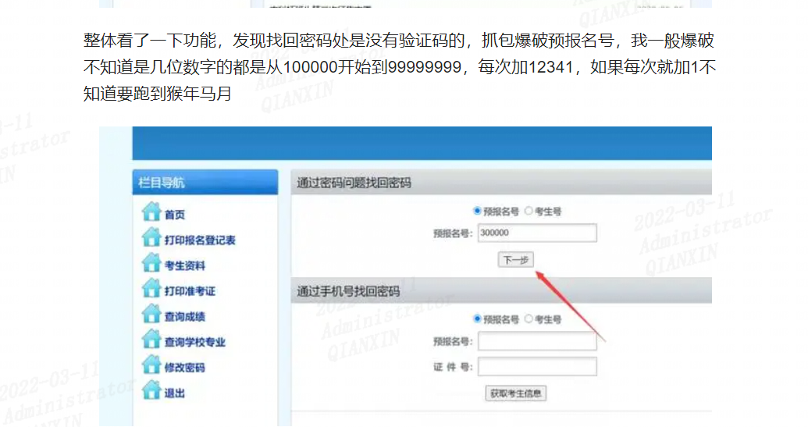

## Google Hacking

https://www.bianchengquan.com/article/243561.html

**site：可以限制你搜索范围的域名.**

**inurl：用于搜索网页上包含的URL，这个语法对寻找网页上的搜索，帮助之类的很有用.**

**intext: 只搜索网页部分中包含的文字(也就是忽略了标题、URL等的文字)**

**intitle: 查包含关键词的页面，一般用于社工别人的webshell密码**

**filetype：搜索文件的后缀或者扩展名**

**intitle：限制你搜索的网页标题.**

**link: 可以得到一个所有包含了某个指定URL的页面列表.**

site:zut.edu.cn inurl:login | admin | guanli | denglu | system   //这种检索方式效果不好，会比较杂
site:zut.edu.cn inurl:login|admin|guanli|denglu|system|user

**查找后台地址：site域名**

 **inurl:login|admin|manage|member|admin_login|login_admin|system|login|user|main|cms**

**查找文本内容：site:域名 intext:管理|后台|登陆|用户名|密码|验证码|系统|帐号|admin|login|sys|managetem|password|username**

**查找可注入点：site:域名 inurl:aspx|jsp|php|asp**

**查找上传漏洞：site:域名 inurl:file|load|editor|Files**

**找eweb编辑器：**

**site:域名 inurl:ewebeditor|editor|uploadfile|eweb|edit**

**存在的数据库：site:域名 filetype:mdb|asp|#**

**查看脚本类型：site:域名 filetype:asp/aspx/php/jsp**

**迂回策略入侵：inurl:cms/data/templates/images/index/** 

## fofa

https://blog.csdn.net/weixin_50464560/article/details/116419318

"系统" && org="China Education and Research Network Center"

其中可以在前面加一些：阅卷系统、评分系统、直播系统、录播系统。（我们需要找的是弱口令能进去的系统）

“点播系统” && org=“China Education and Research Network Center”

"网瑞达" && org="China Education and Research Network Center"

整体看了一下功能，发现找回密码处是没有验证码的，抓包爆破预报名号，我一般爆破不知道是几位数字的都是从100000开始到99999999，每次加12341，如果每次就加1不知道要跑到猴年马月

