## 中原工学院泄露内网信息

域名：zut.edu.cn

```
site:zut.edu.cn inurl:login | admin | guanli | denglu
```

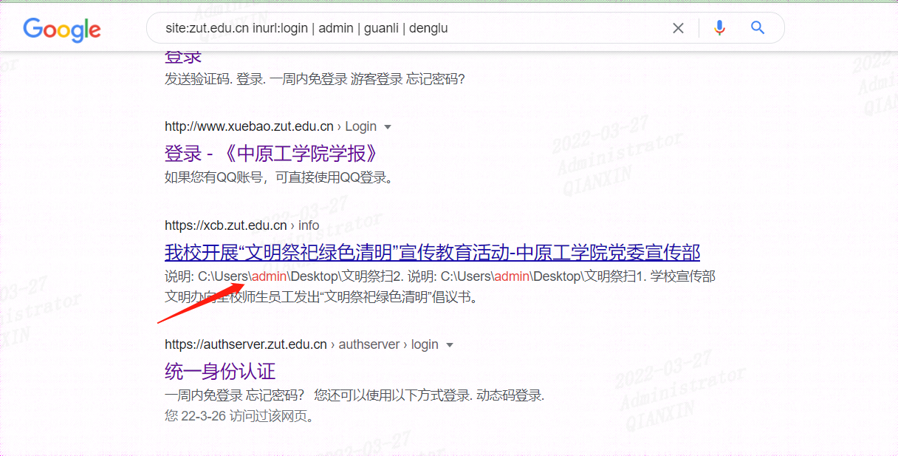


泄露内网地址

https://xcb.zut.edu.cn/info/1036/2451.htm

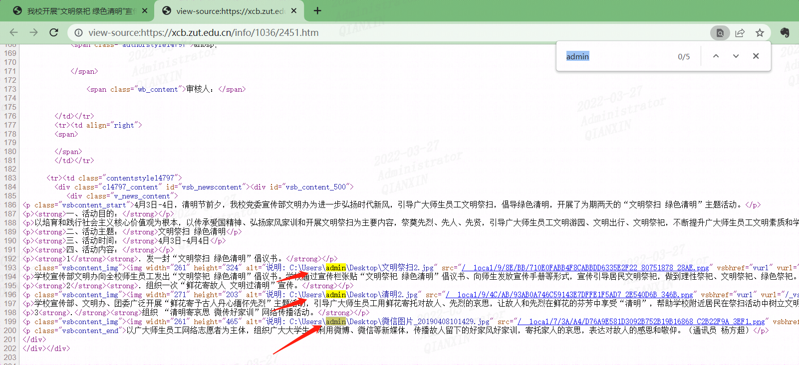

https://www.zut.edu.cn/info/1041/24240.htm

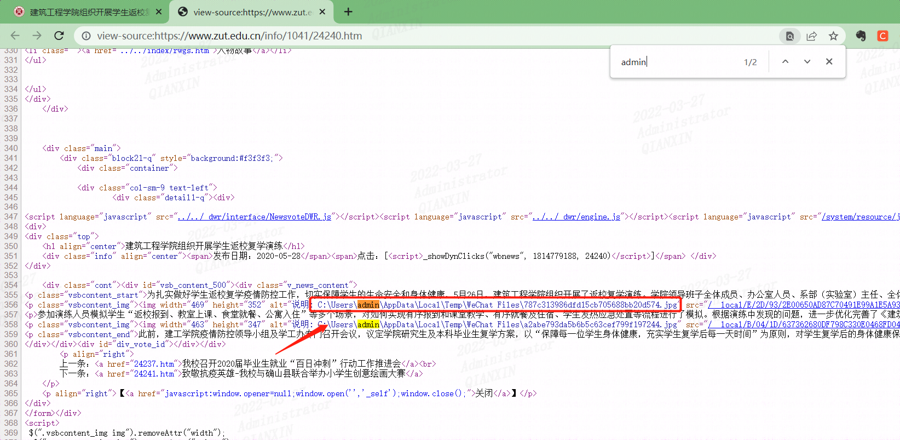

https://www.zut.edu.cn/info/1041/23200.htm

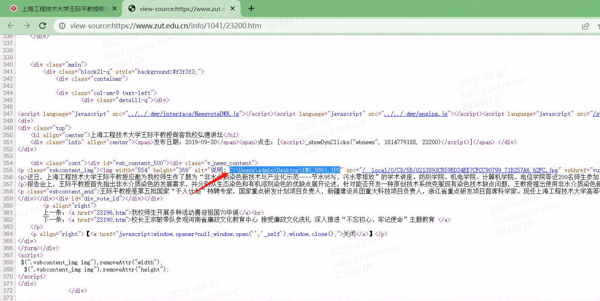


## 中南财经政法大学图书馆存在目录遍历漏洞

域名 lib.zuel.edu.cn

目录遍历地址：

https://lib.zuel.edu.cn/newlib/uploadfile/

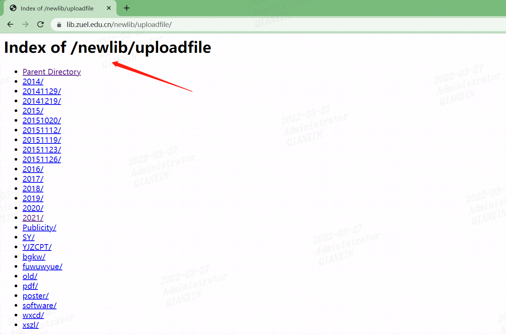

泄露内网信息

https://lib.zuel.edu.cn/newlib/uploadfile/20141129/1417233915720062.txt

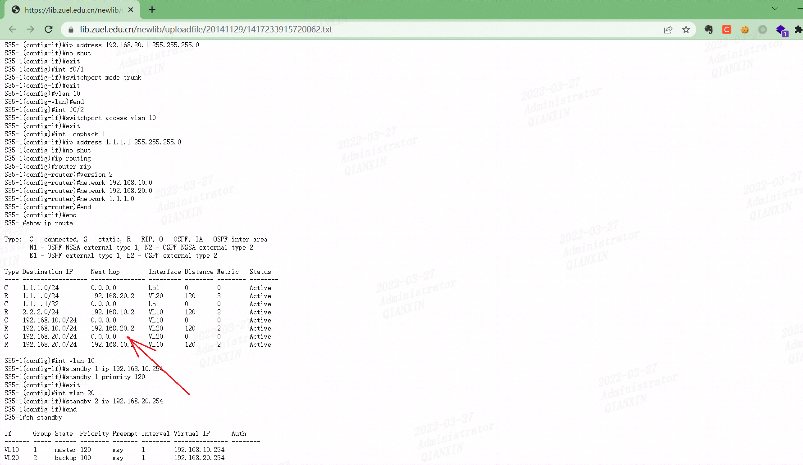


## 中南林业科技大学存在目录遍历漏洞

域名 ic.csuft.edu.cn


目录遍历地址：

https://ic.csuft.edu.cn/ybz/

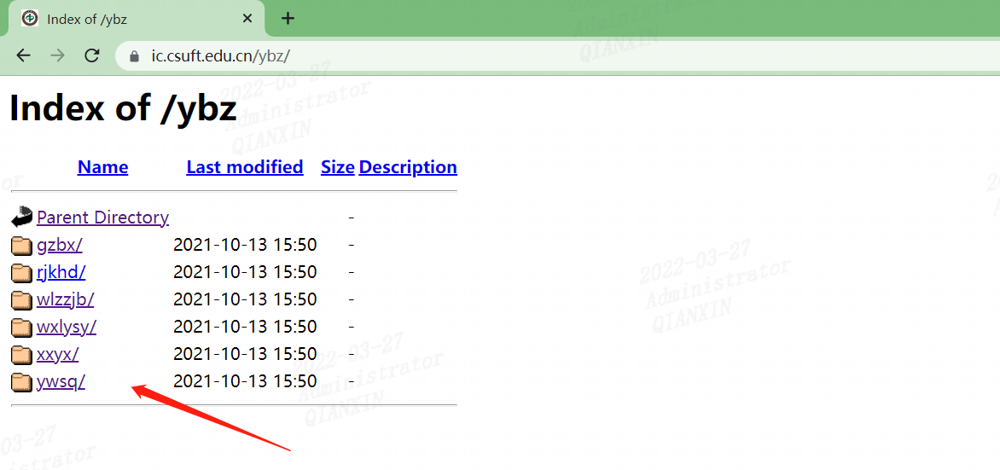


## 中国农业大学科研院存在目录遍历漏洞

域名 kyy.cau.edu.cn


目录遍历地址：

http://kyy.cau.edu.cn/art/

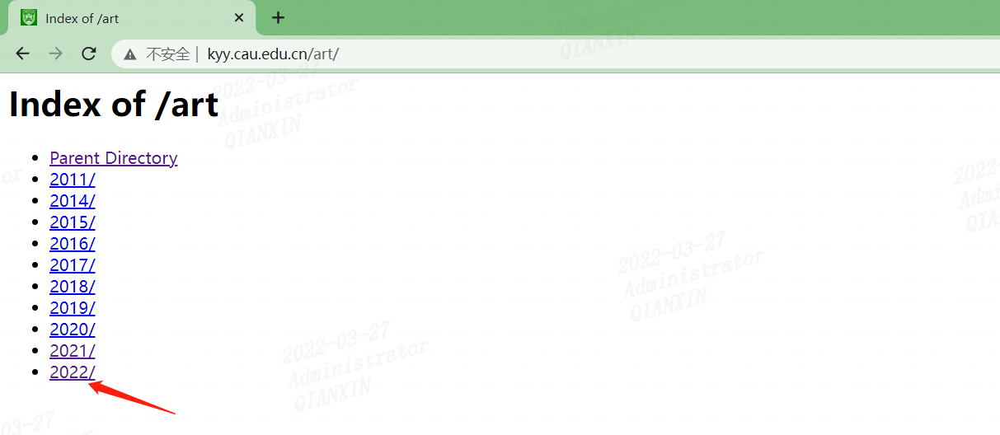

http://kyy.cau.edu.cn/art/2022/3/7/

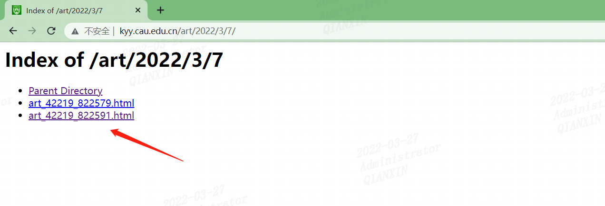

## 清华大学精准医学大数据存在目录遍历漏洞

域名 health.tsinghua.edu.cn


目录遍历地址：

http://health.tsinghua.edu.cn/SilencerDB/data/

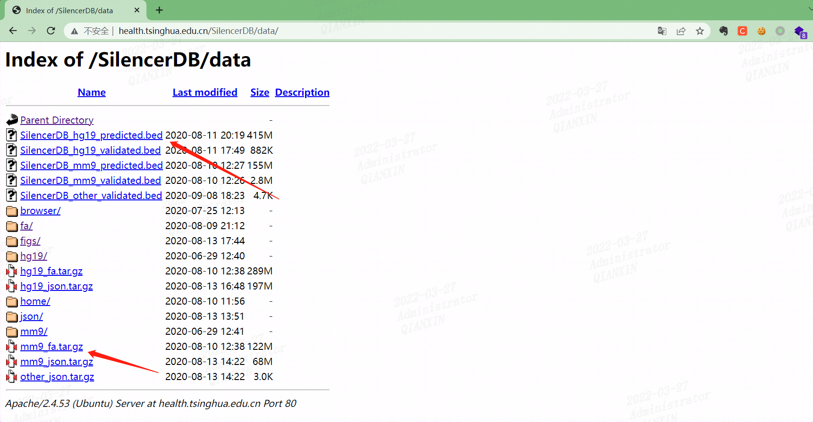

http://health.tsinghua.edu.cn/SilencerDB/data/home/human/

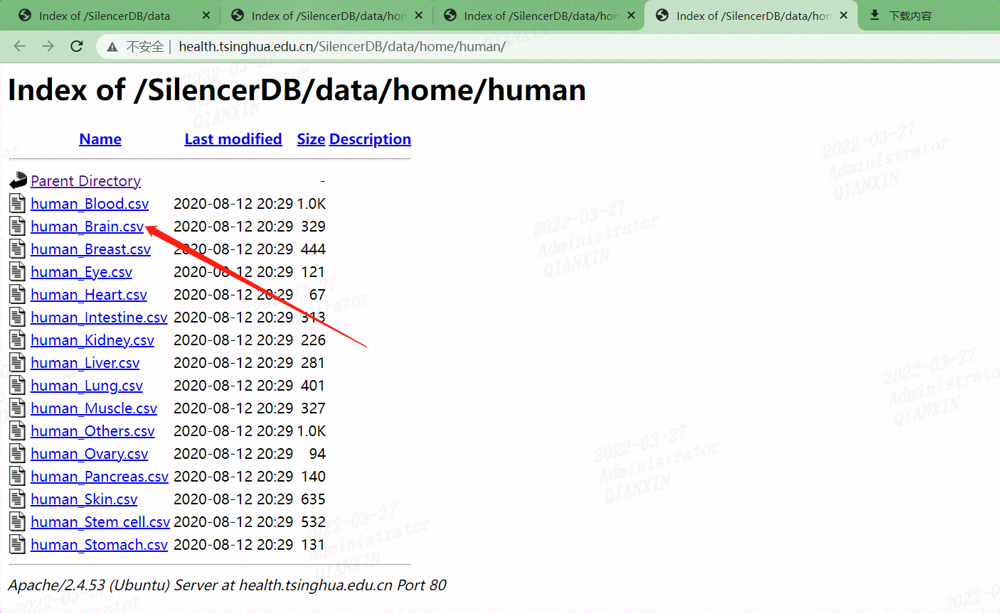

数据库信息

http://health.tsinghua.edu.cn/SilencerDB/data/fa/018/247/

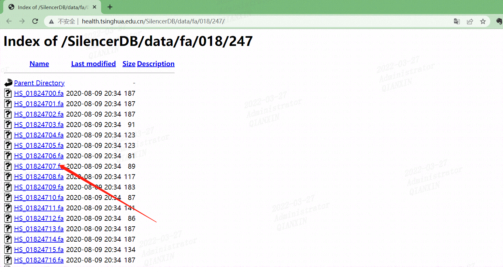


## 中国科学技术大学存在目录遍历漏洞

域名 base.ustc.edu.cn


目录遍历地址：

http://base.ustc.edu.cn/data/

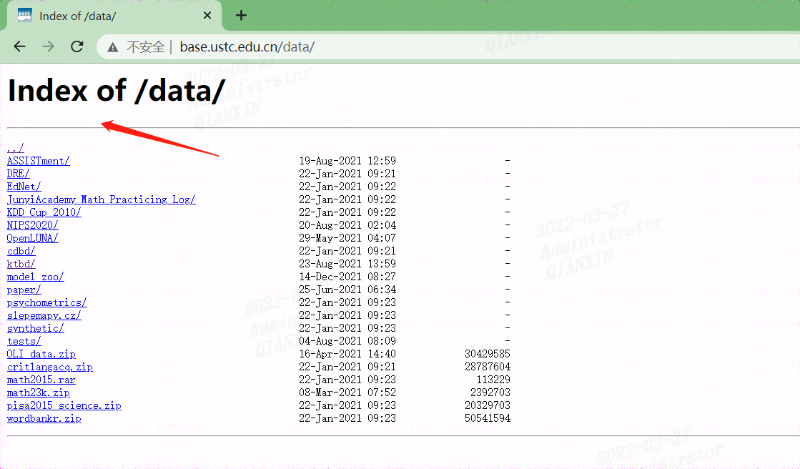


## 中原工学院泄露内网地址

http://ananas.zut.edu.cn/admin

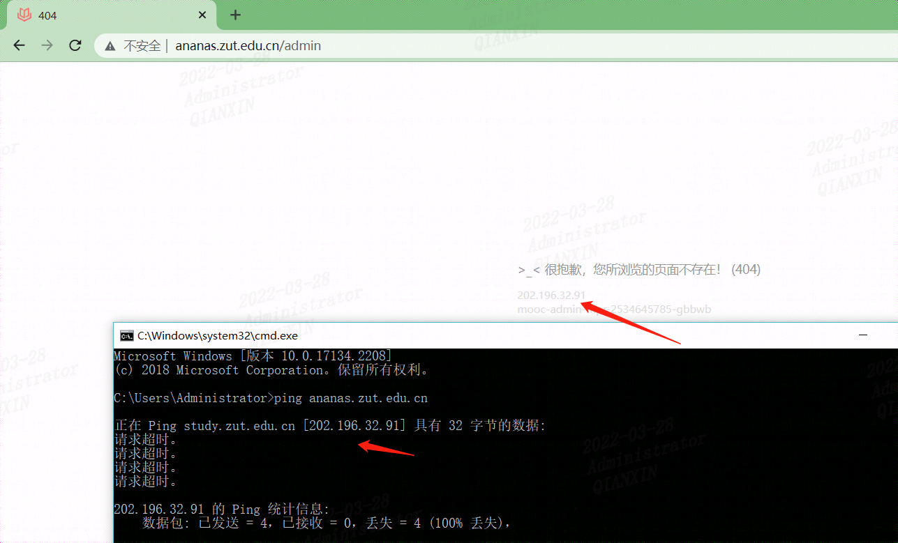


再次刷新访问，暴露内网地址

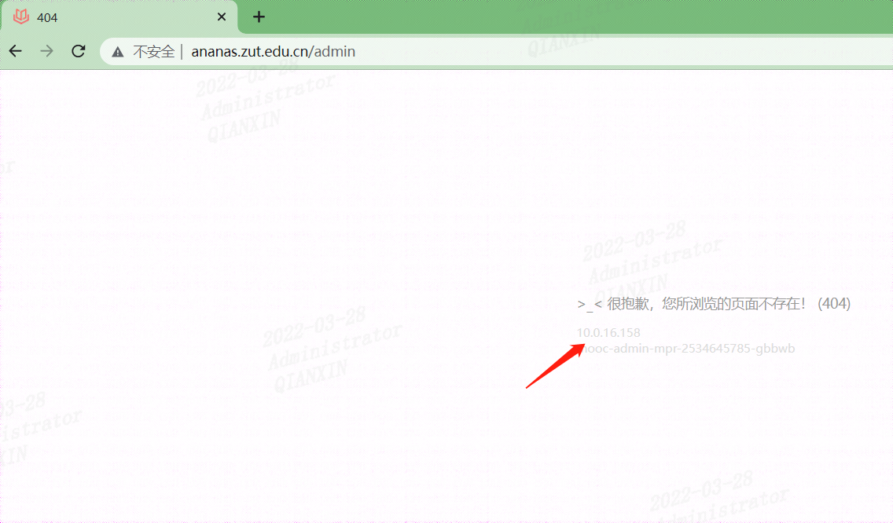