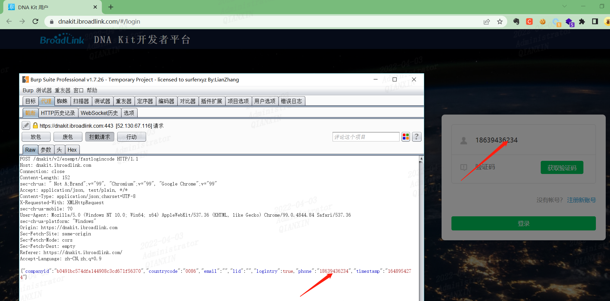
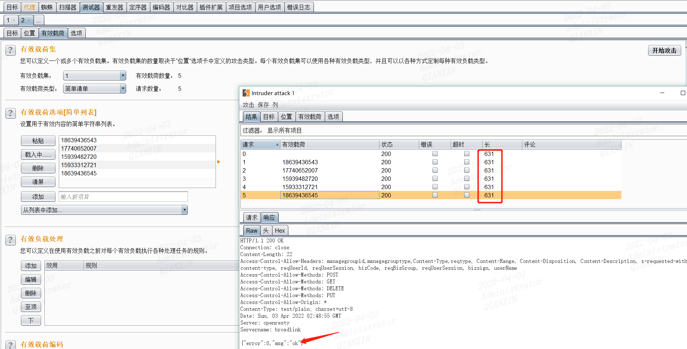
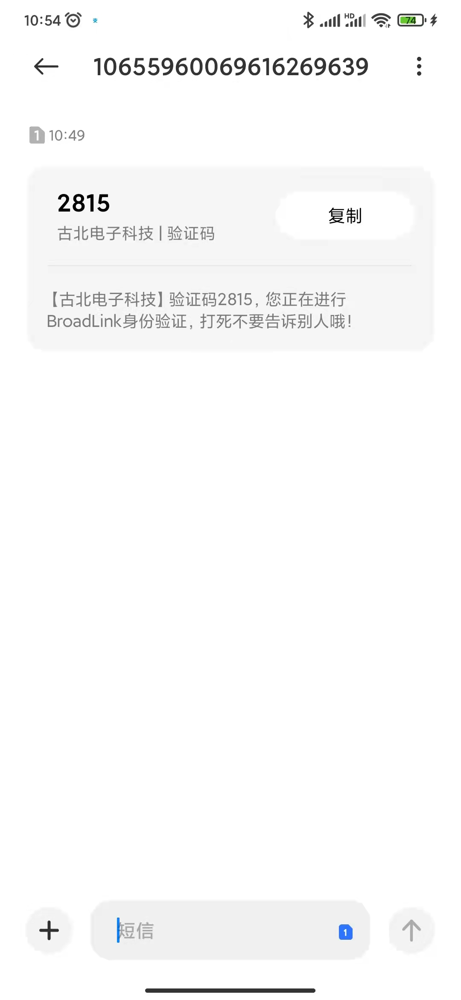
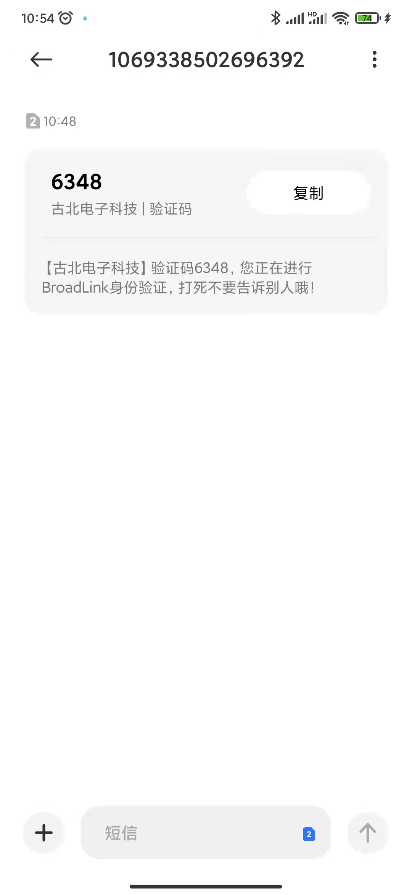
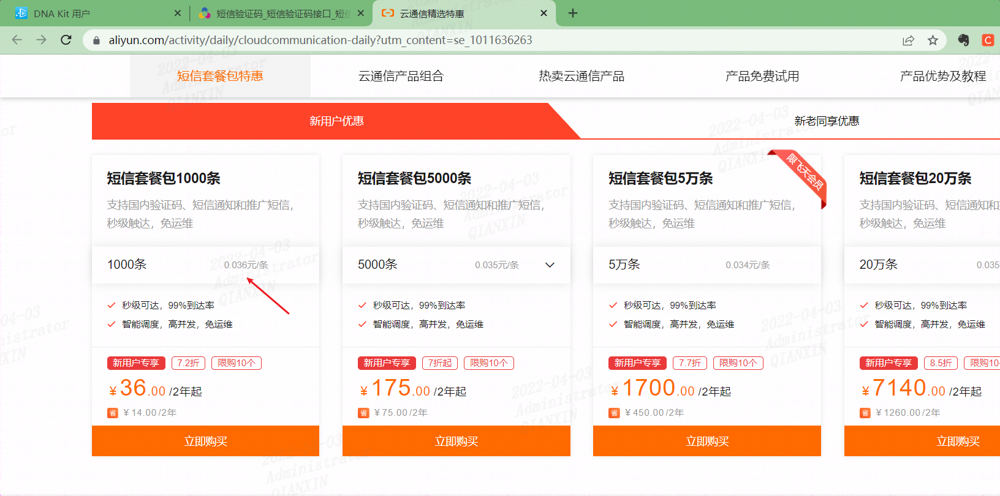
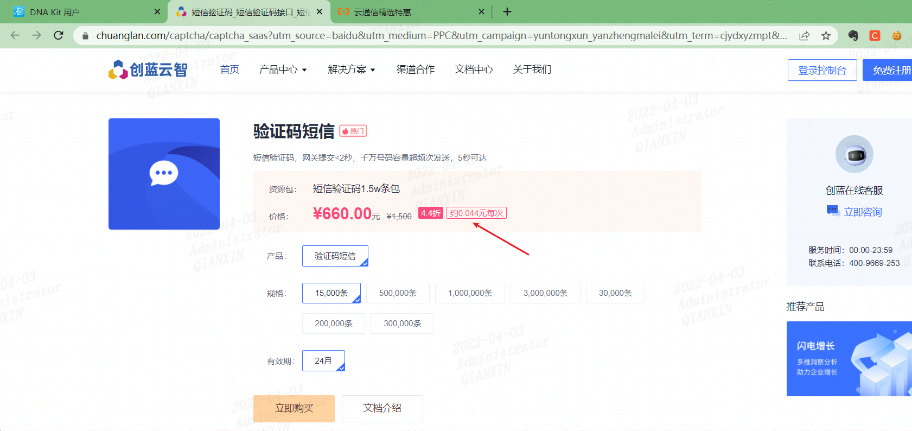

挖洞范围
https://dnakit.ibroadlink.com 不在测试范围的高危最高1000

https://dnakit.ibroadlink.com/#/login

抓包爆破

对phone位置爆破，批量输入一些手机号

随便用两个手机号测试，发现均可以收到验证码

后面不用测试了，会严重浪费验证码资源！！！恶意攻击可以导致验证码资源耗尽！

随便看下验证码服务，基本都需要0.04元/条左右

这是阿里云的

https://www.aliyun.com/activity/daily/cloudcommunication-daily?utm_content=se_1011636263

这个是其它服务商的

https://www.chuanglan.com/captcha/captcha_saas?utm_source=baidu&utm_medium=PPC&utm_campaign=yuntongxun_yanzhengmalei&utm_term=cjydxyzmpt&ecrm_source=6&e_keywordid=382948548072&e_keywordid2=382948548072

处置建议：在获取短信验证码之前，增加图形验证码机制。或者限制同一个IP地址短时间内大量短信验证码。

