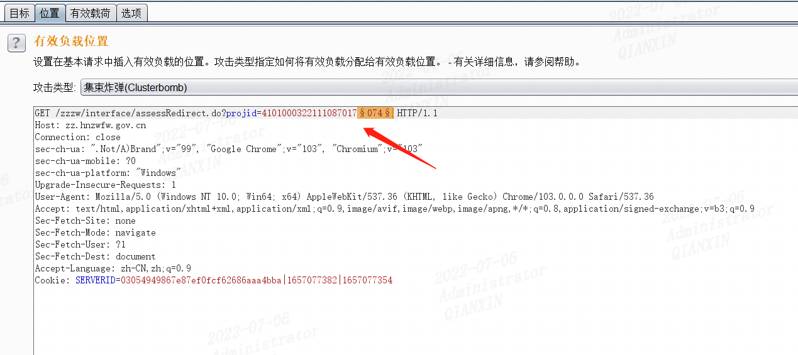
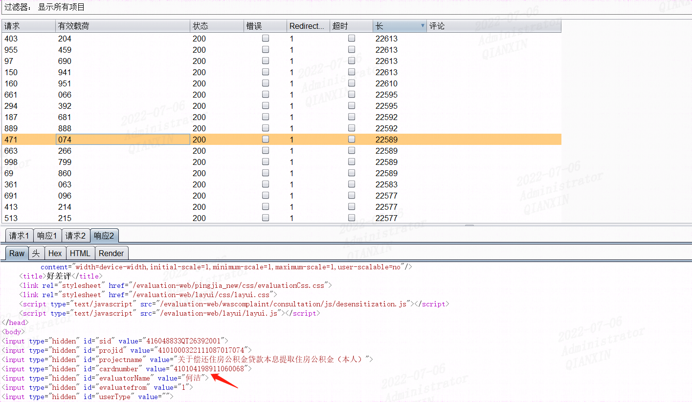
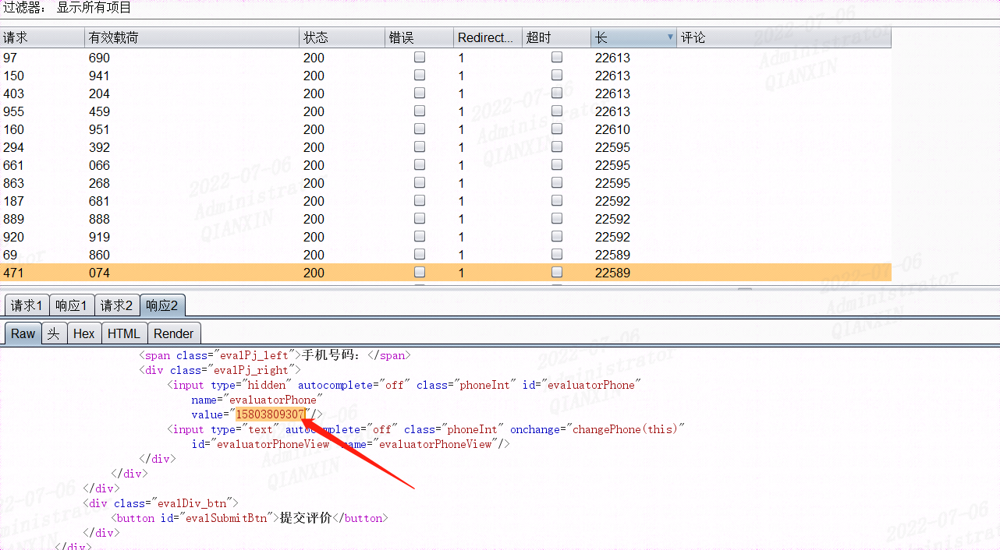
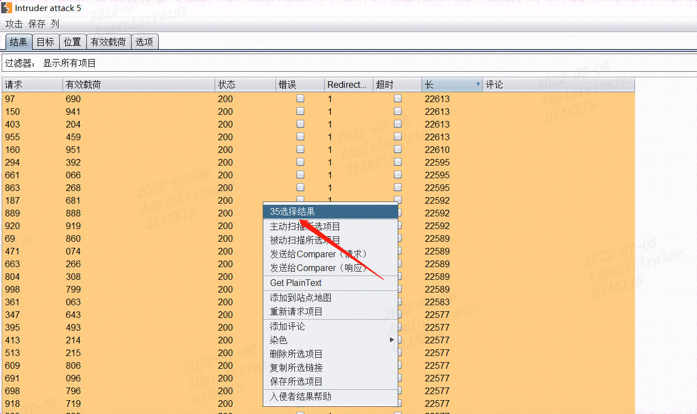
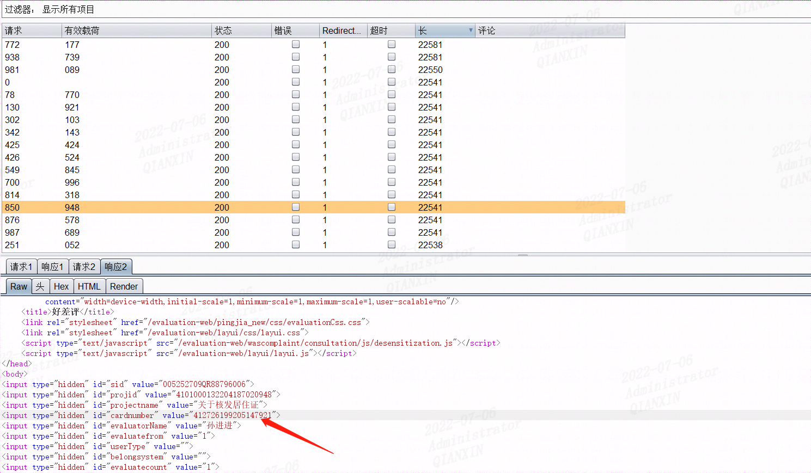
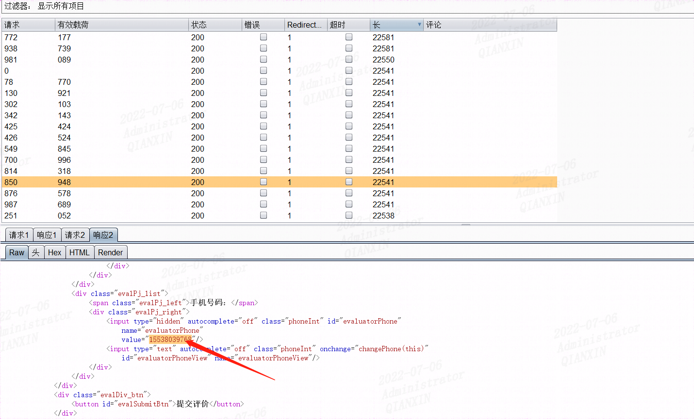

某天通过手机线上办理政务，在办理完成后，手机收到一条短信让对服务做出评价，第一感觉这里链接可能存在越权漏洞，于是简单做了下测试，如下：

评价链接

https://zz.hnzwfw.gov.cn/zzzw/interface/assessRedirect.do?projid=4101000322111087017074

这里选取了后三位进行爆破

可以发现泄露办理业务人员姓名、身份证号、手机号等敏感信息！

找到35条数据

结合我个人办理过的其它业务4101000132204187020xxx，同样尝试爆破后三位，同样可以找到几十条数据！

同理还有

4101040082207017024xxx

4101000202105137015xxx

等等

结合业务发现，可以发现第10位到第15位为办理业务时间，后面5位数字代表不同用户id

如果全部爆破，跑出上万条用户信息不成问题，这里只是为了证明漏洞存在不再逐一爆破了。。。

