## 0x01设置启动指定目录

文件->偏好设置->通用->启动选项

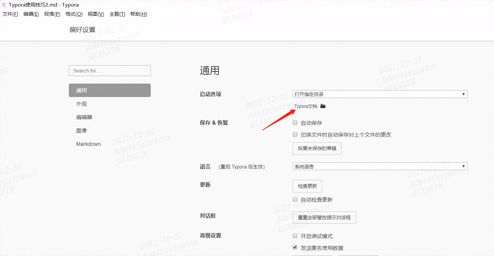


## 0x02修改代码字体大小

找到**codemirror.css**文件

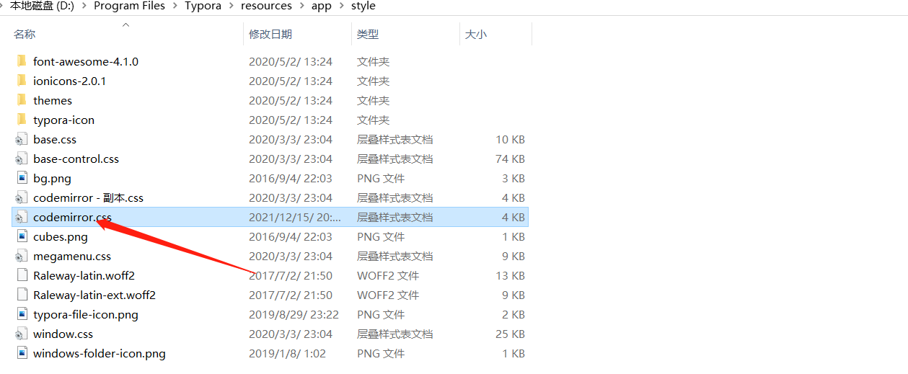

找到**font-size**，这里我修改为16px

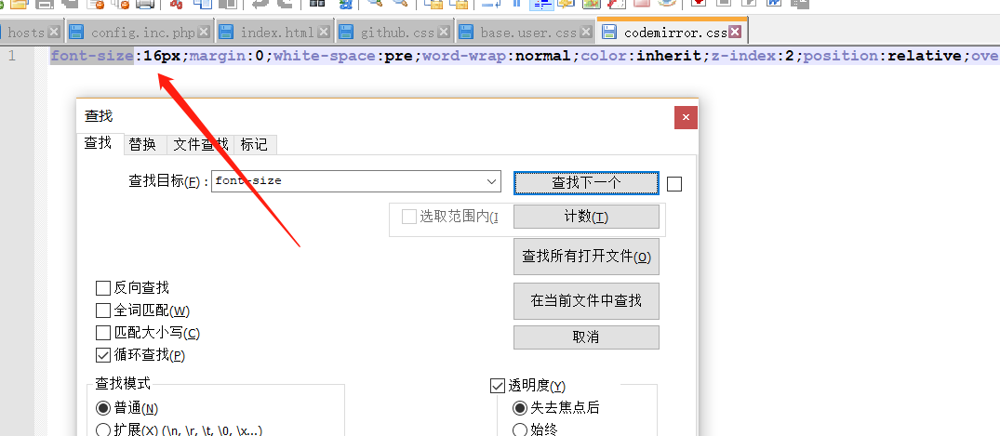


## 0x03修改字体

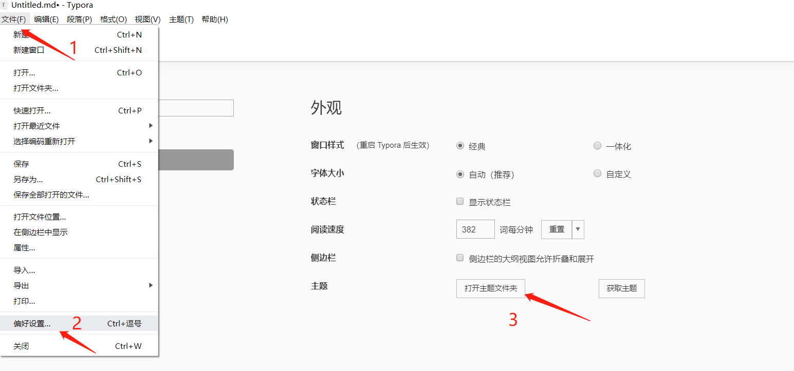

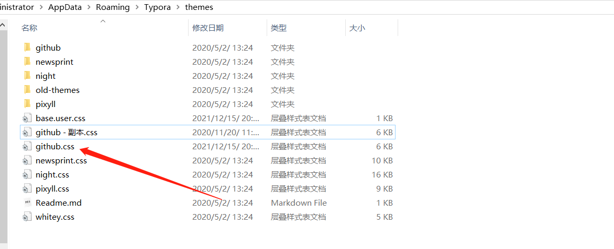

找到对应的主题，如这里我修改为微软雅黑**Microsoft YaHei** ，英文修改为新罗马**Times New Roman**

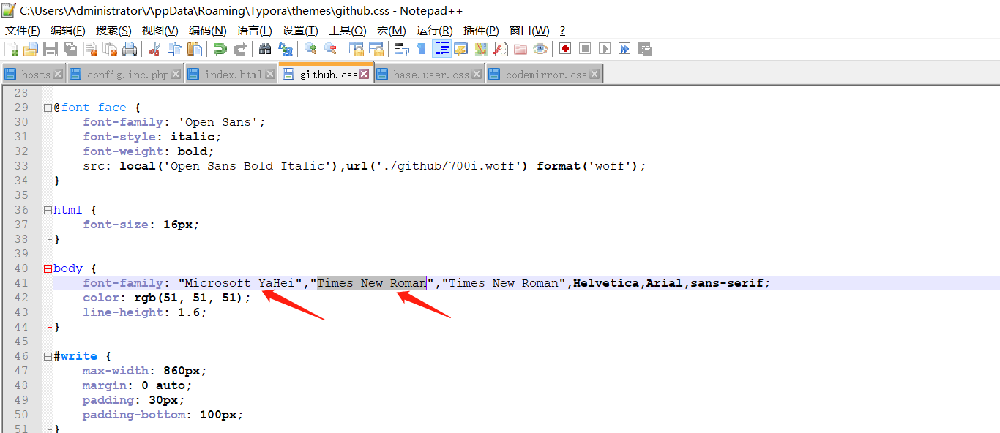


## 0x04设置代码块字体和行间距

在themes文件夹下，添加base.user.css文件，这里选择字体Consolas

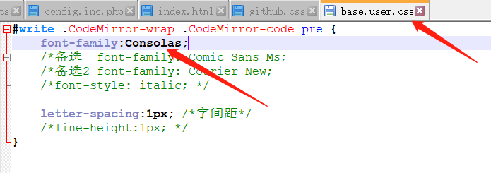

效果如下：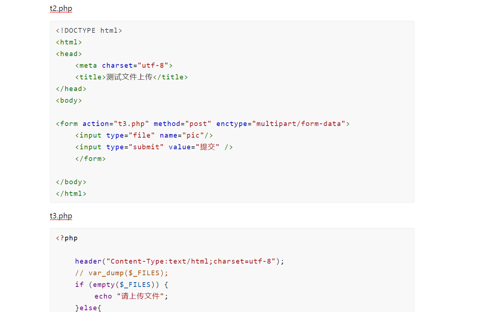


另外两种备选字体1：Comic Sans Ms

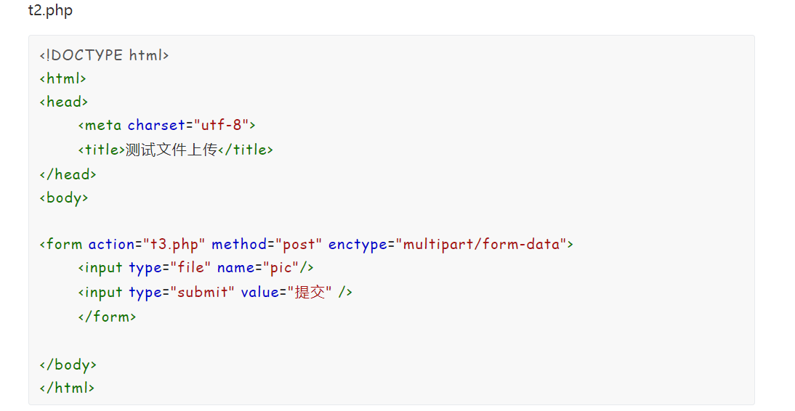

字体2：Courier New

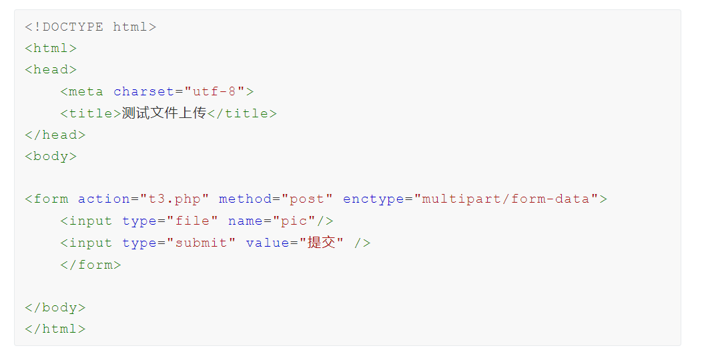

## 0x05设置代码块字体和行间距

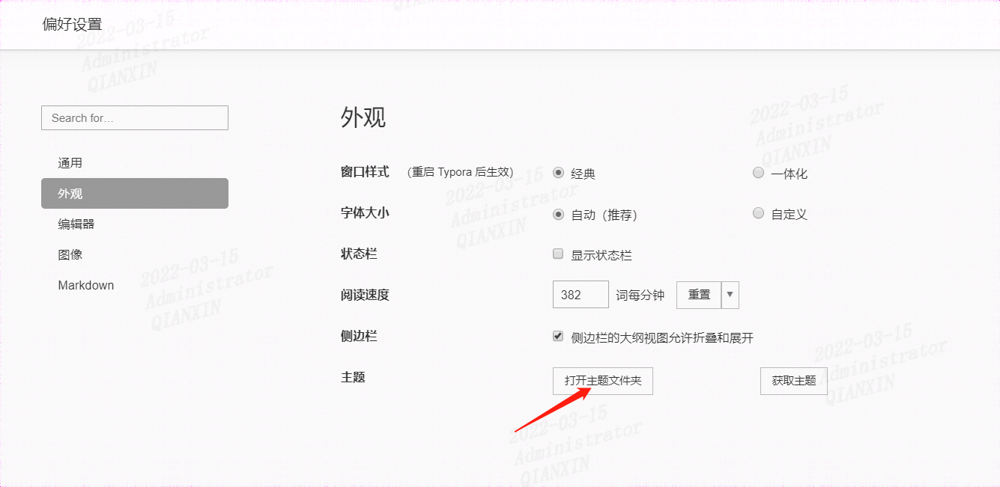

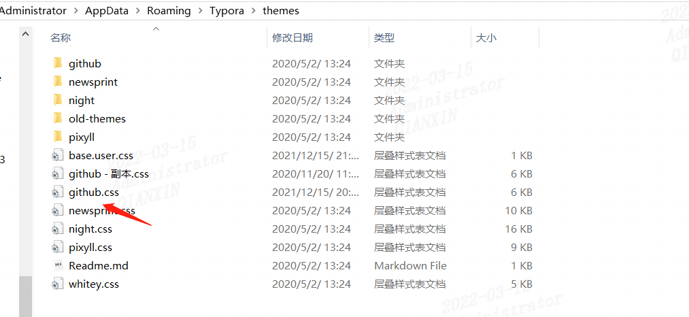

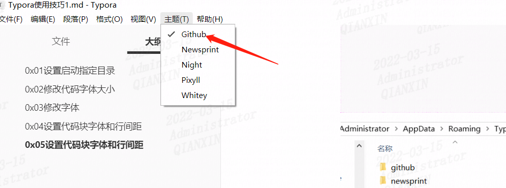

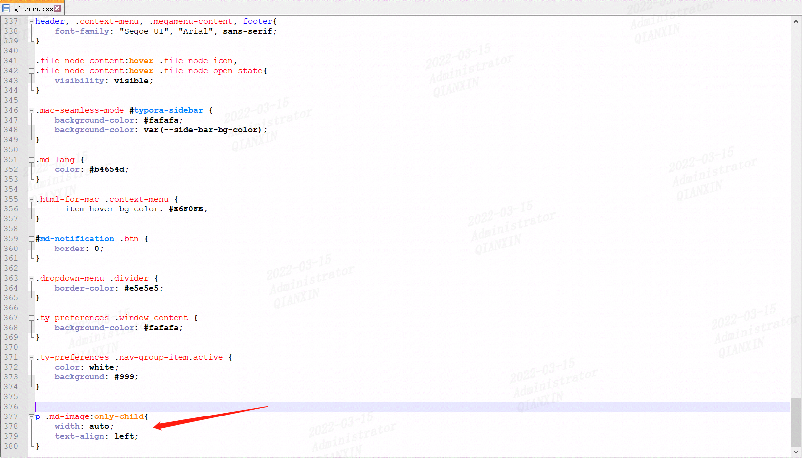

末尾添加

```css
p .md-image:only-child{
    width: auto;
    text-align: left;
}
```

