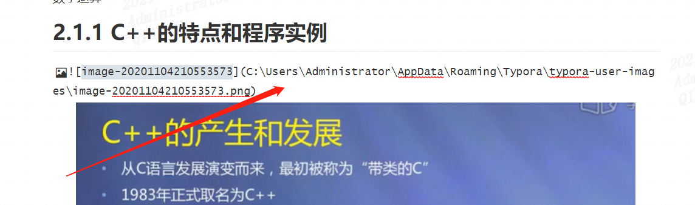
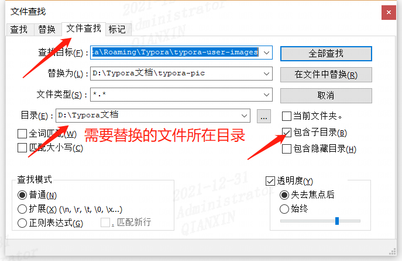
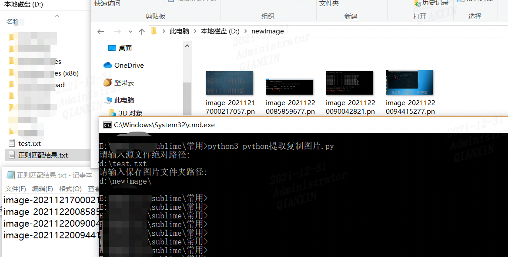
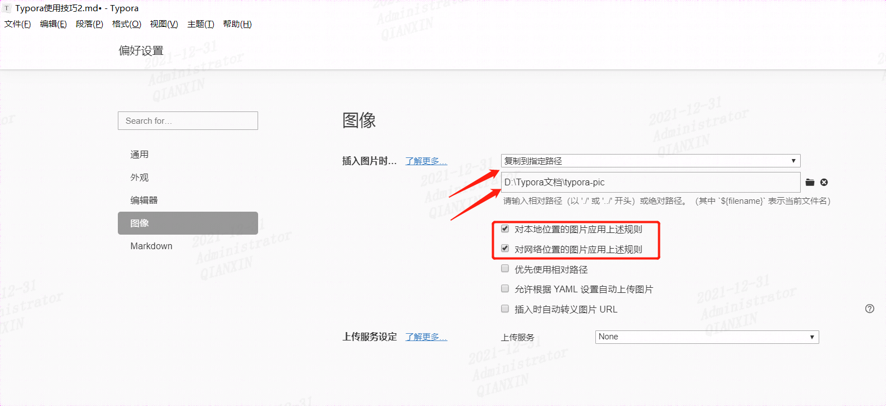

## 0x01 问题：怎么变更路径正常访问图片？

如这里路径是 (C:\Users\Administrator\AppData\Roaming\Typora\typora-user-images\image-20201104210553573.png)



需要将图片移动到新的文件夹下：D:\Typora文档\typora-pic，而且md文件能正常显示图片，该怎么操作呢？

## 0x02 替换文档内所有原图片路径为新路径

通过全选文件内容，用notepad++替换



参考：https://jingyan.baidu.com/article/597a0643536b06312b5243f2.html

## 0x03 使用脚本筛选出md文件中图片复制到新文件夹中

假设源图片所在的文件夹内很多图片，只想要复制出md文件所包含的图片到新文件，不要其它图片

原来图片所在路径 (C:\Users\Administrator\AppData\Roaming\Typora\typora-user-images\）

新路径（D:\Typora文档\typora-pic）




python提取复制图片.py

```python
#coding:utf-8
import re

#1、定义一个提取文件名的函数
def extractFileName(file):  #定义一个提取文件名函数
    with open(file,'r',encoding='utf-8') as file:   #with open方式打开输入文件
        for line in file:   #每次读取一行
            # print(line)
            rs = re.findall(r"\[image-(.+?)\]",str(line))   #正则匹配出图片名的数字部分
            for i in rs:
                if i is not None:   #判断当前内容不为空时
                    result = "image-"+str(i)+".png"     #拼接图片名
                    # print(result)
                    with open('d:\\正则匹配结果.txt','a+',encoding='utf-8') as file1: #重新打开一个新文本文件用来保存提取结果
                        file1.write(result+"\n")    #保存提取结果

    
file = input("请输入源文件绝对路径:"+"\n")   #在py3环境的cmd下执行
extractFileName(file)


#2、定义一个复制图片的函数
def copyFile(copyPath):
    with open('d:\\正则匹配结果.txt','r',encoding='utf-8') as fo:     #打开匹配结果
        for m in fo:
            if m is not None:   #判断读取内容不为空
                m = m.strip("\n")   #去除末尾的换行符
                with open("D:/Typora文档/typora-pic/" + m,'rb') as f_src: #拼接打开真实存在的图片路径
                    content = f_src.read()  #将读取到的结果暂时保存到content中
                with open(copyPath + m,'wb') as f_copy: #拼接新存放的图片路径
                    f_copy.write(content)   #复制图片到新文件夹


copyPath = input("请输入保存图片文件夹路径:"+"\n")   #在py3环境的cmd下执行，输入保存图片文件夹路径，注意该文件夹需要存在
copyFile(copyPath)


#coding:utf-8
import re
import os

# 1、定义一个提取文件名的函数
def extractFileName1(file):  #定义一个提取文件名函数1
    with open(file,'r',encoding='utf-8') as file:   #with open方式打开输入文件
        for line in file:   #每次读取一行
            # print(line)
            rs = re.findall(r"\[image-(.+?)\]",str(line))   #正则匹配出图片名的数字部分
            for i in rs:
                if i is not None:   #判断当前内容不为空时
                    result = "image-"+str(i)+".png"     #拼接图片名
                    print(result)
                    with open('d:\\正则匹配结果.txt','a',encoding='utf-8') as file1: #重新打开一个新文本文件用来保存提取结果
                        file1.write(result+"\n")    #保存提取结果

def extractFileName2(file):  #定义一个提取文件名函数2
    with open(file,'r',encoding='utf-8') as file:   #with open方式打开输入文件
        for line in file:   #每次读取一行
            # print(line)
            rs = re.findall(r"640-(.*?).webp",str(line))   #正则匹配出图片名的数字部分
            for i in rs:
                if i is not None:   #判断当前内容不为空时
                    result = "640-"+i+".webp"     #拼接图片名
                    print(result)
                    with open('d:\\正则匹配结果.txt','a',encoding='utf-8') as file1: #重新打开一个新文本文件用来保存提取结果
                        file1.write(result+"\n")    #保存提取结果

file = input("请输入源文件绝对路径:"+"\n")   #在py3环境的cmd下执行
extractFileName1(file)
extractFileName2(file)

#2、定义一个删除图片的函数
def DelFile():
    with open('d:\\正则匹配结果.txt','r',encoding='utf-8') as fo:     #打开匹配结果
        for m in fo:
            if m is not None:   #判断读取内容不为空
                m = m.strip("\n")   #去除末尾的换行符
                if os.path.exists(m):
                    os.remove("d:/Typora文档/typora-pic/"+ m)
   
DelFile()
os.remove("d:/正则匹配结果.txt")
```

参考
https://www.cnblogs.com/ilovepython/p/11068886.html

## 0x04 自定义typora路径

文件->偏好设置->图像，指定到绝对路径（D:\Typora文档\typora-pic）



此时即可实现图片路径变更，正常显示图片

