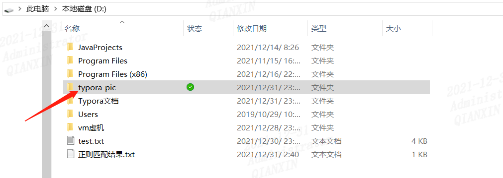
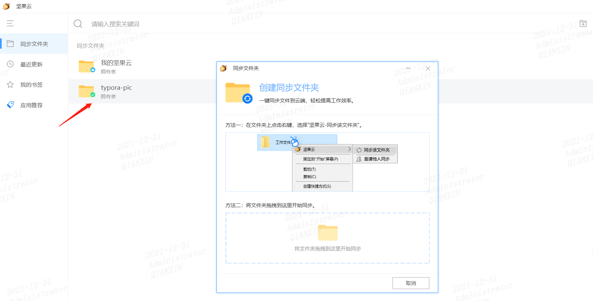
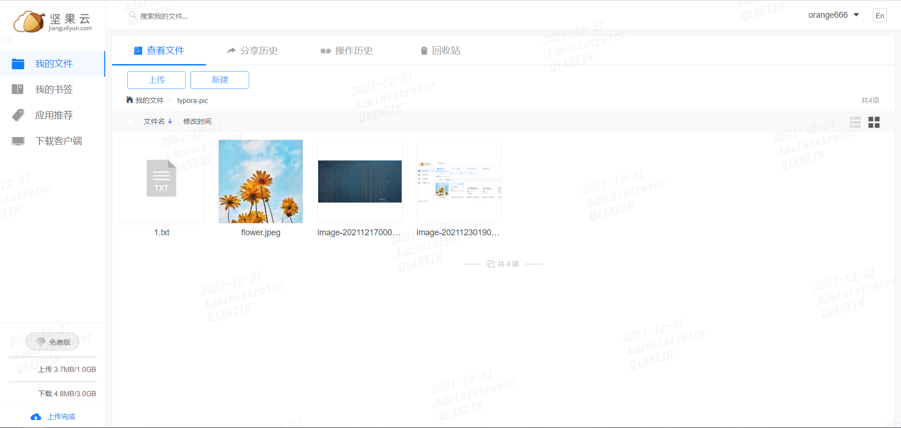

## Typora与坚果云联动

有时候我们在本地写的文档，需要保存到云端，方便下次查看和编辑。特别是当换了电脑时候不能正常打开里面图片，这时候需要同步图片数据

坚果云提供网页版和客户端版，我们可以随时随地访问共享文件。

启动坚果云客户端，这里我选择同步一个本地的typora-pic文件夹，如图

此时typora-文件夹下的文件都同步到坚果云了，可以看下

这样再用新的电脑时候就可以直接同步下载到本地了

另外说下三种状态的区别

状态1：云形状，代表文件存储在云端，不暂用本地空间，需要查看时候，需要先下载到本地。

状态2：**空心对号**，代表文件在本地可用，暂用本地空间，脱机下也可以使用。

状态3：**实心对号**，代表文件**始终**在本地可用，暂用本地空间，脱机下也可以使用。可以简单理解为和状态2无差别。

具体状态2和状态3的区别，参见：

https://www.bilibili.com/read/cv8299415

