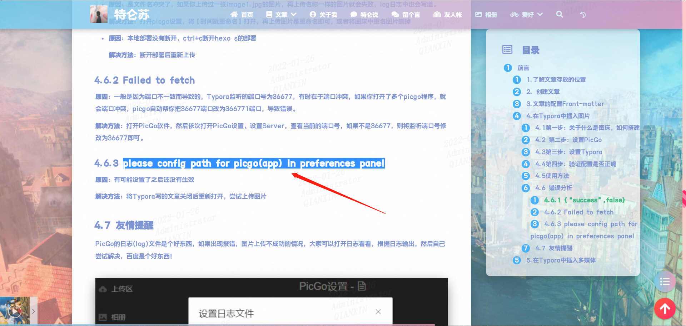
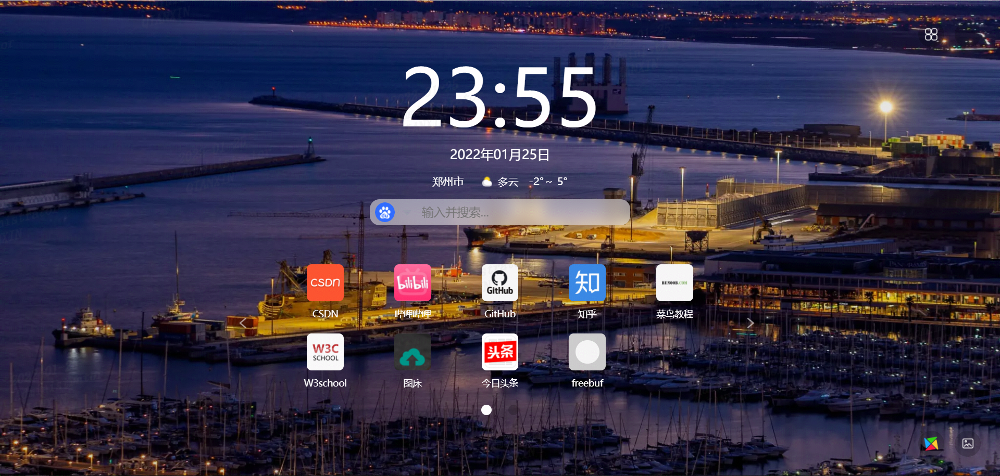
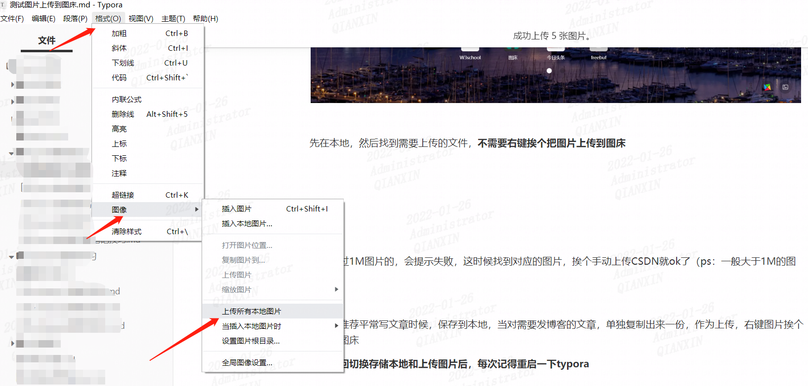

## 解决Typora笔记上传到CSDN图片问题

测试图片上传到图床

### 测试图片1

### 测试图片2

### 测试图片3

### 测试图片4

先在本地，然后找到需要上传的文件，**不需要右键挨个把图片上传到图床**，可以上传所有图片

> 格式->图像->上传所有本地图片

遇到超过1M图片的，会提示失败，这时候找到对应的图片，挨个手动上传CSDN就ok了（ps：一般大于1M的图片不多）

注意：推荐平常写文章时候，保存到本地，当对需要发博客的文章，单独复制出来一份，作为上传，右键图片挨个上传到图床

**注意来回切换存储本地和上传图片后，每次记得重启一下typora**

另外，直接复制要上传的图片，然后按快捷键Ctrl+Shift+P，会自动打开PicGo上传图片。

参考：

https://fenghen0918.github.io/2020/06/14/hexo/hexo-zhong-shi-yong-markdown-shu-xie-bo-ke/

https://blog.csdn.net/qq_39763246/article/details/115458972

https://blog.csdn.net/Small_Tsky/article/details/106871102

官方=="https://support.typora.io/Upload-Image/#upload-selected-image"==