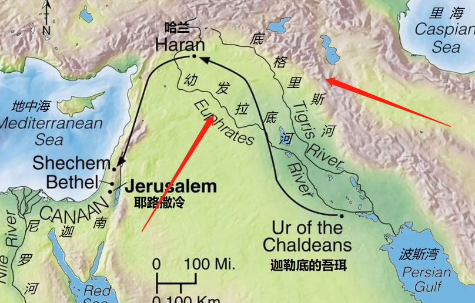
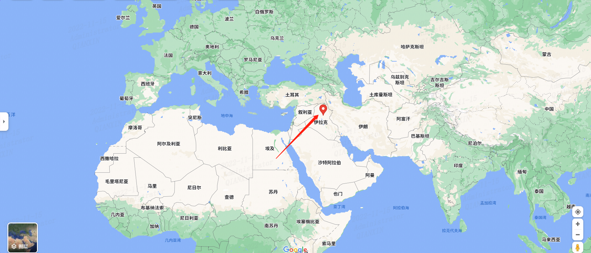
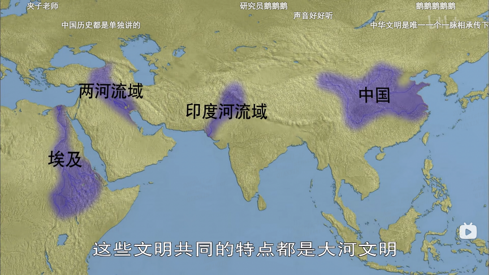

# 001 石器时代

刀耕火种

# 002文明的曙光

文明最早上溯到200万年前的旧石器时代->向新石器时代->农耕文明->部落冲突

# 003古代文字的起源

象形文字

楔形文字

# 004 古代两河流域文明（1）

==幼发拉底河== 和 ==底格里斯河==

公元前1792年汉谟拉比登上王位，颁布《汉谟拉比法典》

# 005 古代两河流域文明（2）

（亚述帝国覆灭）两河流域文明-》犹太文明&波斯文明-》公园332年，马其顿亚历山大大帝东征，结束波斯帝国统治

