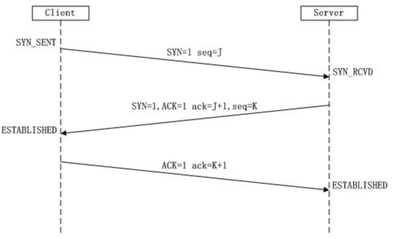
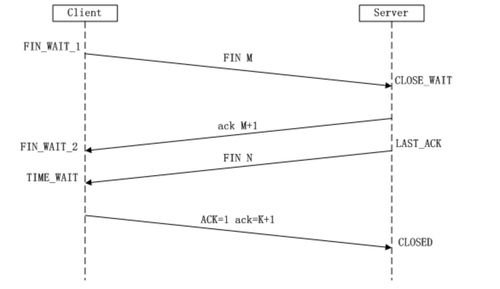

# 标题1

## 1、sql注入的分类？

union查询和堆叠注入区别？
dns带外注入

2、sql注入防御？
1、pdo预处理
2、WAF等过滤

mysql拿权限要求：
数据库允许导入导出(secure_file_priv)
dba
写入权限
绝对路径

## 挖到的最有意思的漏洞？

src漏洞案例

## 文件上传？

如果白名单限制，通过文件包含漏洞可以利用，比如上传图片马

%00截断利用条件？

## xss类型

## csrf和ssrf？

## 内网提权方法：？

Linux提权方式？
sudo提权
suid提权，常见程序：低版本的nmap、一些编辑器、vm等

1、密码明文存放
2、内核提权
3、token窃取
。。。。

## 代理

frp
socks5
如果限制http、tcp协议，可以用 dns协议

# 标题2

## mimikaze原理？

通过提升进程权限注入进程读取进程内存，从lsass.exe里获取windows处于active状态账号明文密码。

1）以管理员权限运行mimikatz
2）提升权限 privilege::debug
3）抓取密码 sekurlsa::logonpasswords

## cs进行流量混淆？

Cobalt Strike生成证书，修改C2 profile流量加密混淆
启动teamserver服务器命令的后面加上profile文件即可。

## 介绍协议？

Kerberos协议

LDAP协议
轻型目录访问协议，通过该协议可以访问域控389端口，进行一些域内信息搜集。

## 黄金票据和白银票据？

黄金票据：是直接抓取域控中ktbtgt账号的hash，来在client端生成一个TGT票据（门票发放票），那么该票据是针对所有机器的所有服务。
白银票据：实际就是在抓取到了域控服务hash的情况下，在client端以一个普通域用户的身份生成ST票据（门票），这样的好处是门票不会经过KDC（密钥分发中心），从而更加隐蔽，但是伪造的门票只对部分服务起作用，如cifs（文件共享服务），mssql，winrm（windows远程管理），DNS等等。

## tcp和udp区别？

三次握手和四次挥手？

​																			==三次握手==

​																			==四次挥手==

为什么需要4次挥手？

- 关闭连接时，客户端向服务端发送 FIN 时，仅仅表示客户端不再发送数据了但是还能接收数据。
- 服务器收到客户端的 FIN 报文时，先回一个 ACK 应答报文，而服务端可能还有数据需要处理和发送，等服务端不再发送数据时，才发送 FIN 报文给客户端来表示同意现在关闭连接。

## 免杀？

静态免杀和动态免杀区别？

shellcode免杀之命令行加载shellcode过杀软
shellcode免杀之VirtualAlloc函数加载shellcode过杀软

## 权限维持？

### Linux：

在攻击端生成密钥对，将公钥复制到目标~/.ssh/authorized_keys文件，直接私钥连接（redis未授权漏洞）
开源的rootkit，安装后门
添加用户
cron设置计划任务

