## 项目经理vs运营经理

 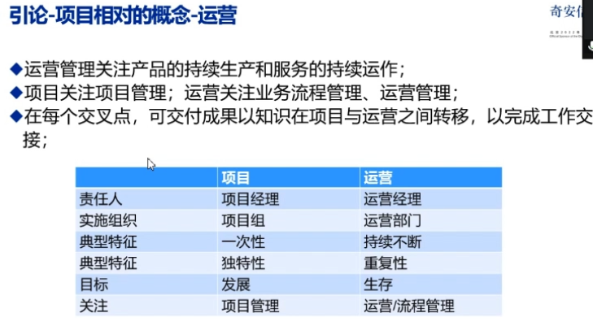

## 五大过程组十大知识领域

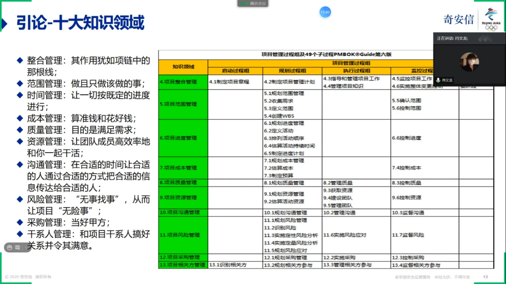

## 项目范围管理

规划范围-收集需求-定义范围-创建wbs-确定范围-控制范围

## 项目进度管理

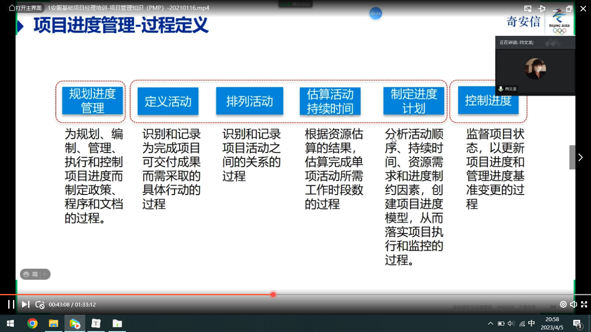

关键路径法

## 项目成本管理

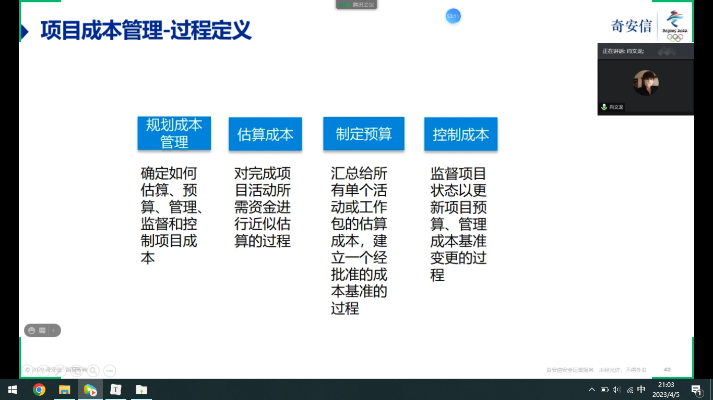

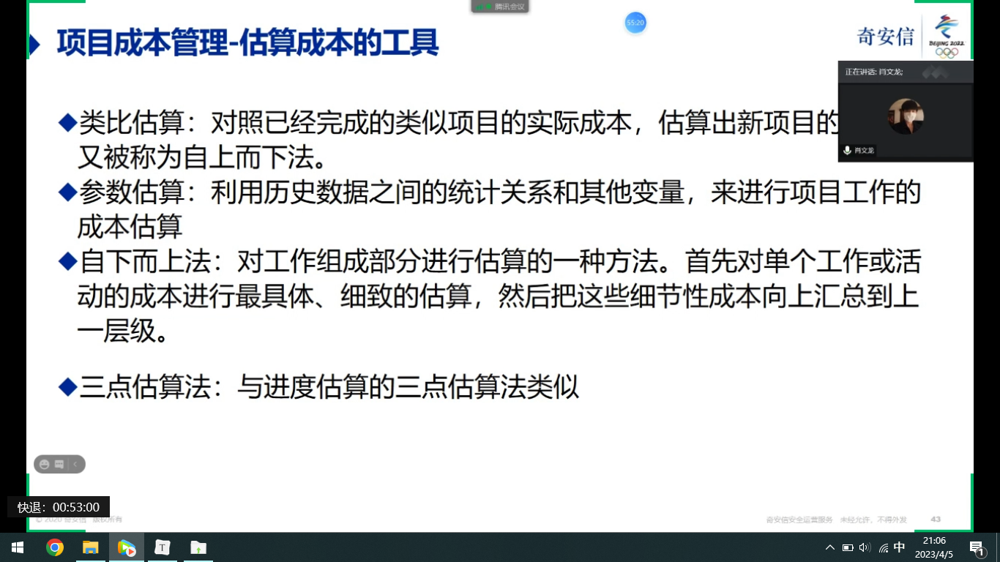

## 项目质量管理

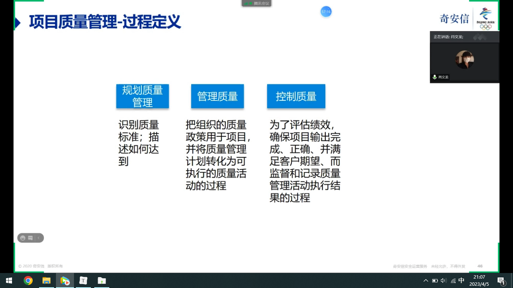

## 项目资源管理

人+实物

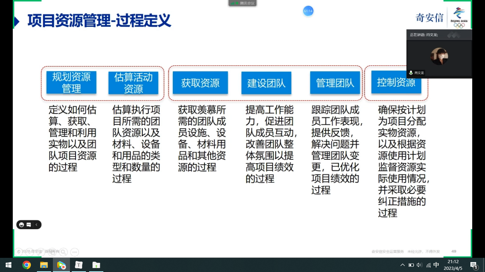

输出资源管理计划

RACI矩阵

资源冲突时：撤退/回避	缓和/包容	妥协	命令	合作

## 项目沟通管理

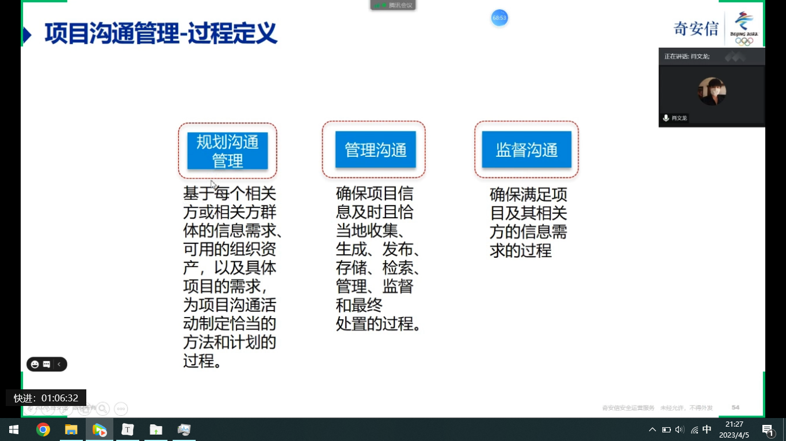

沟通管理计划

互通式沟通  推式   拉式

## 项目风险管理

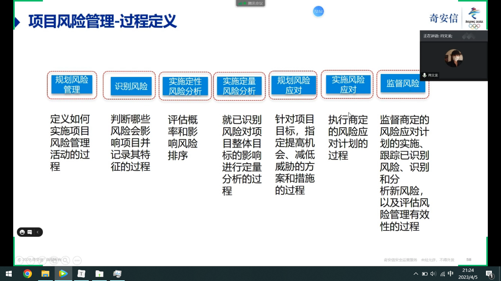

已知风险

未知风险

输出风险登记册

## 项目采购管理

甲方角度

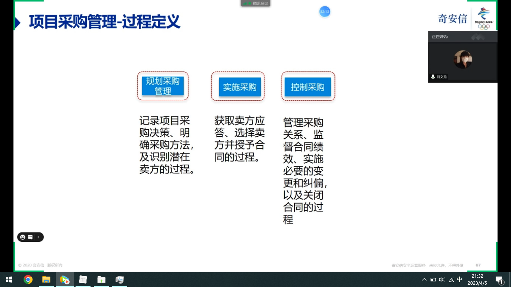

## 相关方管理

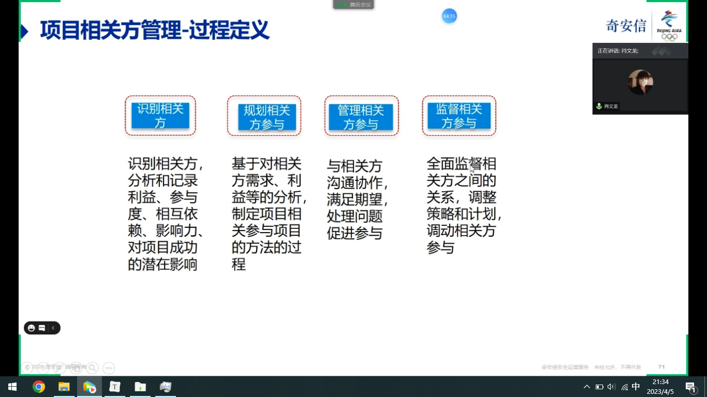

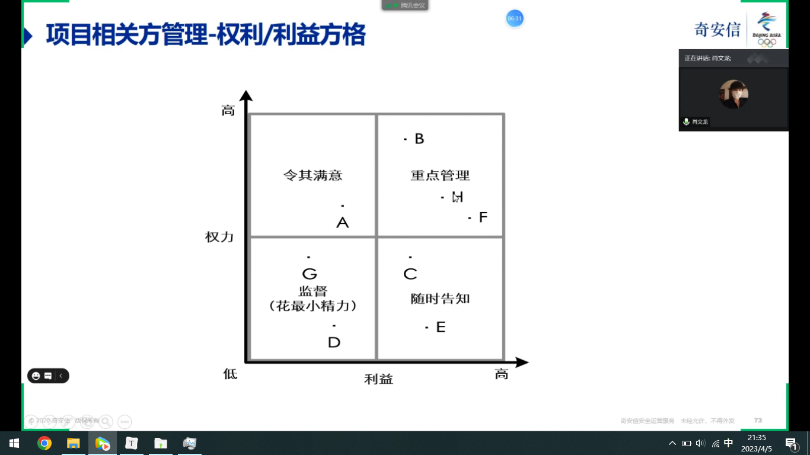

输出相关方登记册

## 项目整合管理

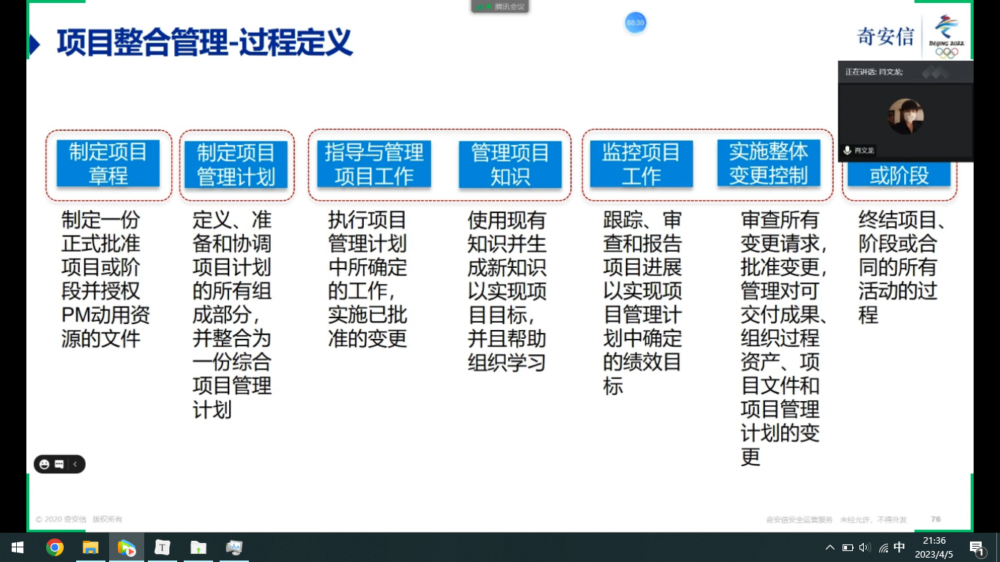

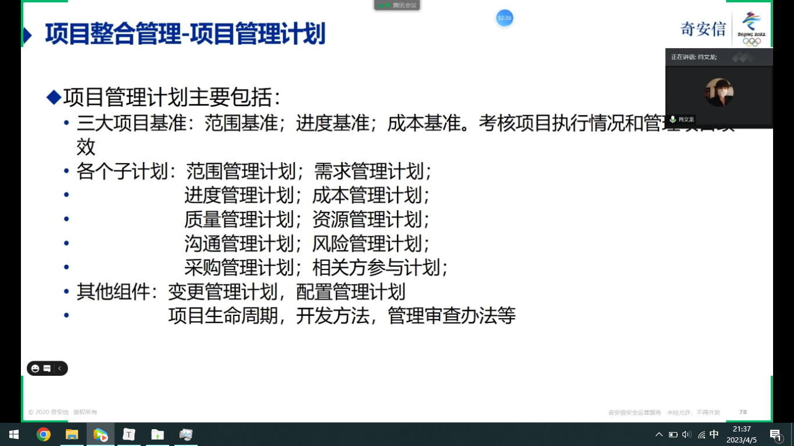

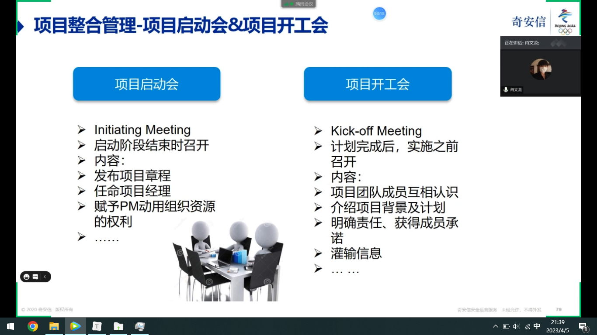

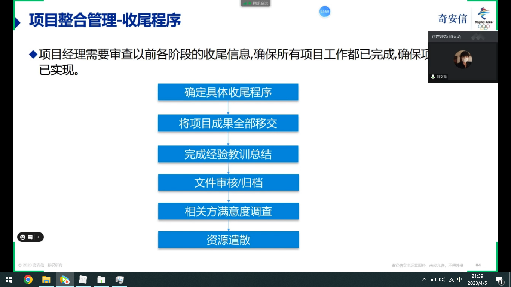

