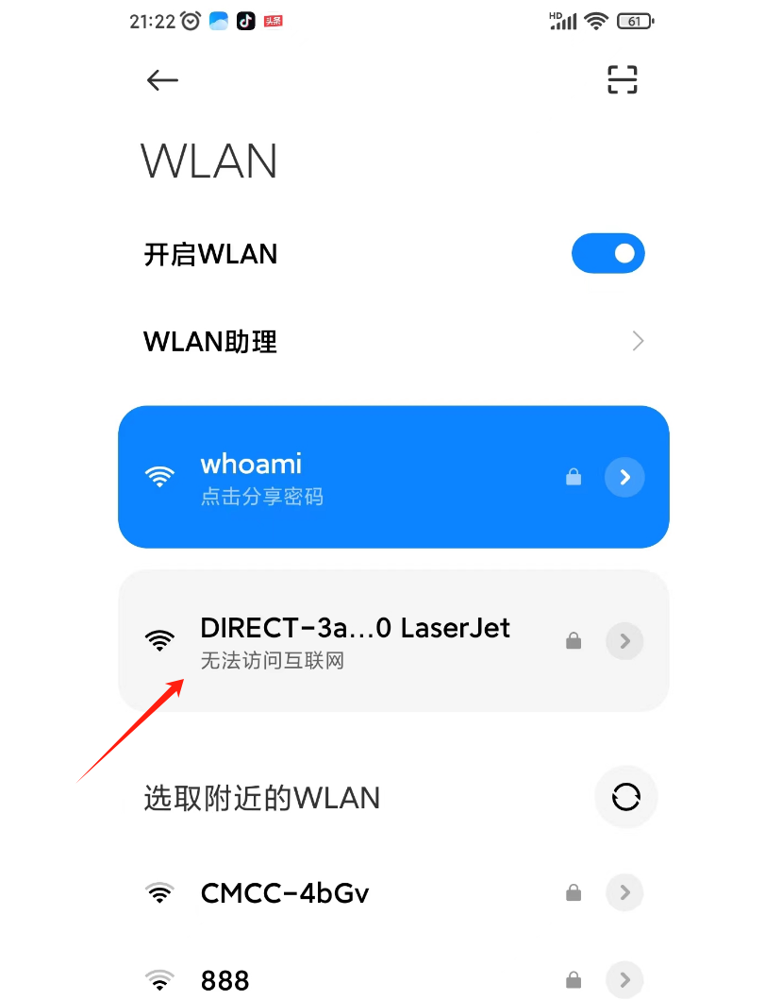
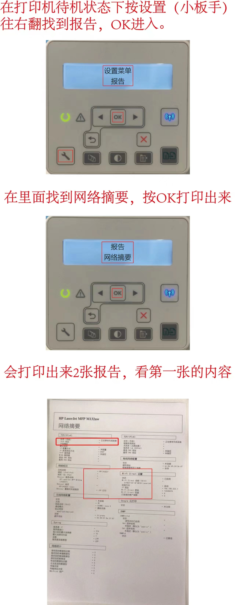
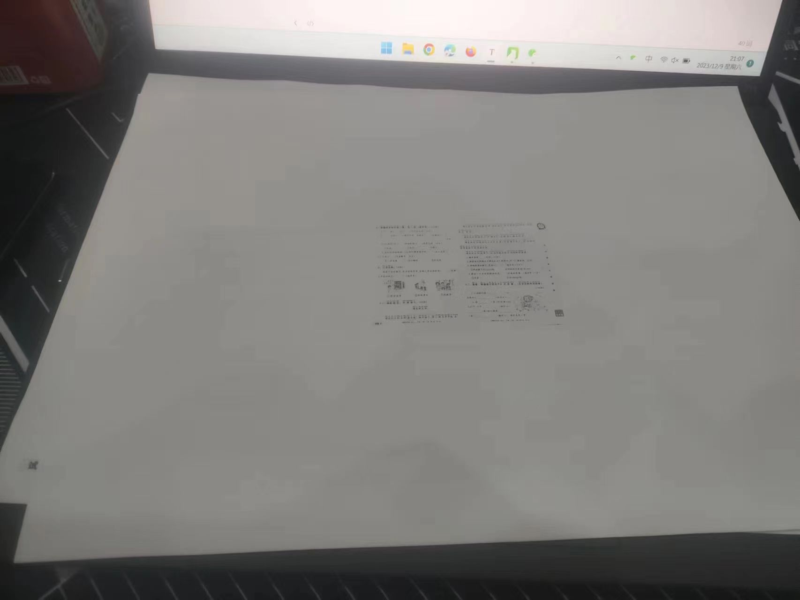
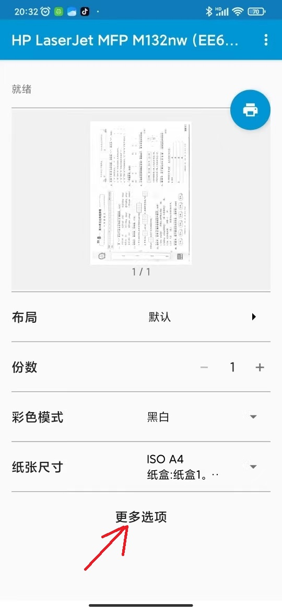
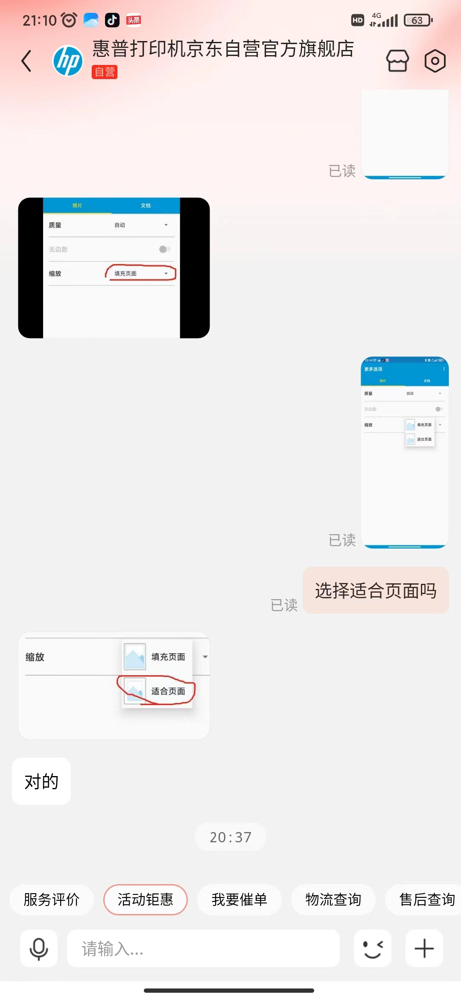
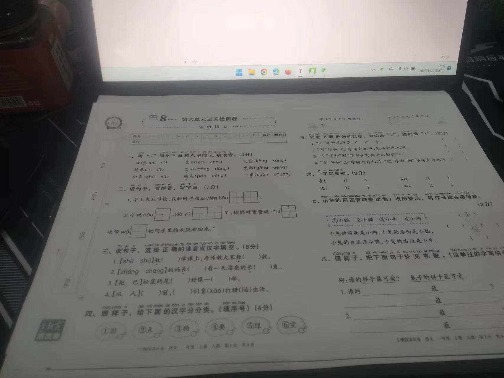

## 适用场景

在家里没有无线网的情况下，手机连接hp打印机，实现打印效果

## 打印环境

HP-m132nw

小米手机一部

HP Smart app

HP 打印服务插件app

## 过程步骤

首先需要连接到打印机

打印机本身有一个无线，比如我这里是DIRECT-3a-HP M130LaserJet

第一次连接时候，需要输入密码，输入默认12345678，如果不对的话，可以尝试使用下面的方法：

找到密码，连接上

按理说这时候应该就可以使用HP 打印服务插件app打印了，注意首次下载这个软件的话，需要添加打印机之类的，按照提示一步步操作即可。

但是这个时候，没有意外的情况偏偏出了以外

打印效果如图：

这肯定是不行的，懒得网上搜索了，问了客服直接解决了

其实就是做了下配置，如下：

然后打印就行了

## 最终结果

