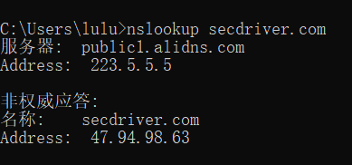
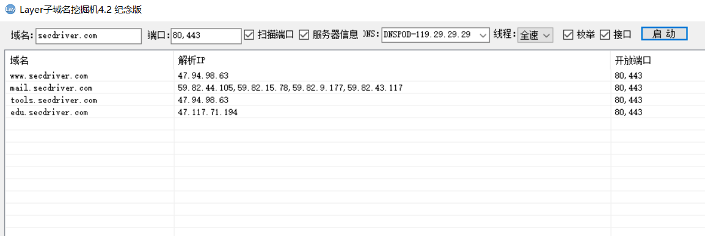
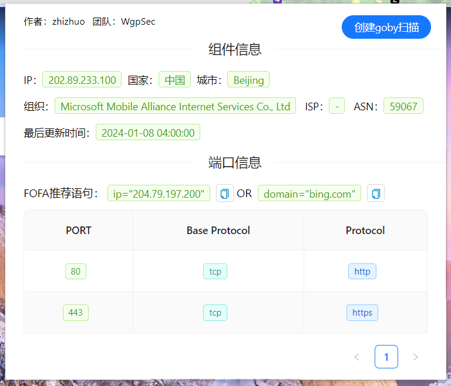
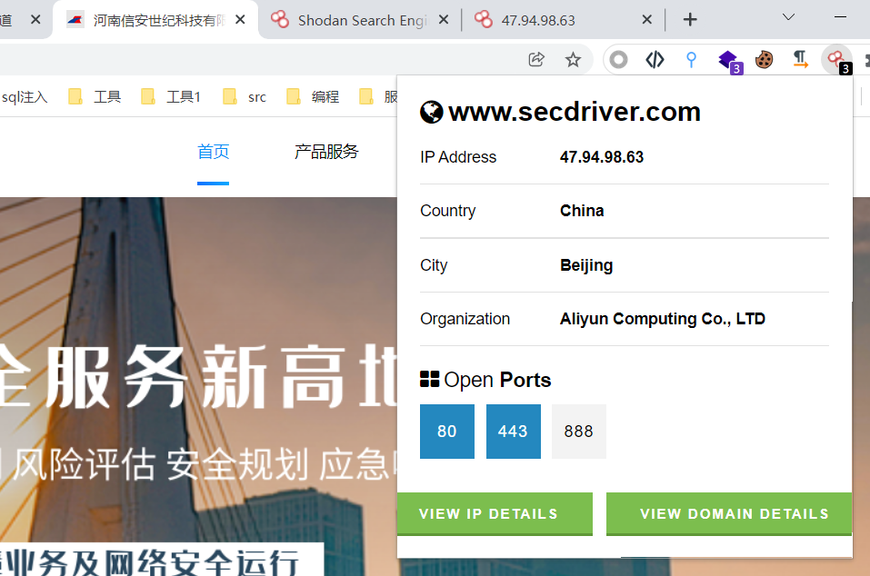
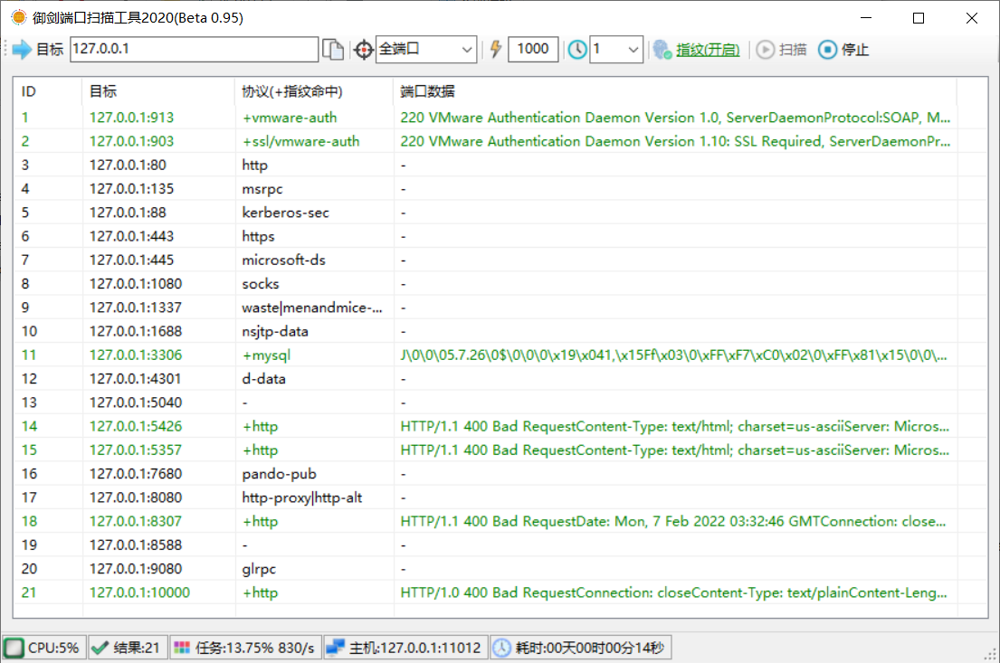
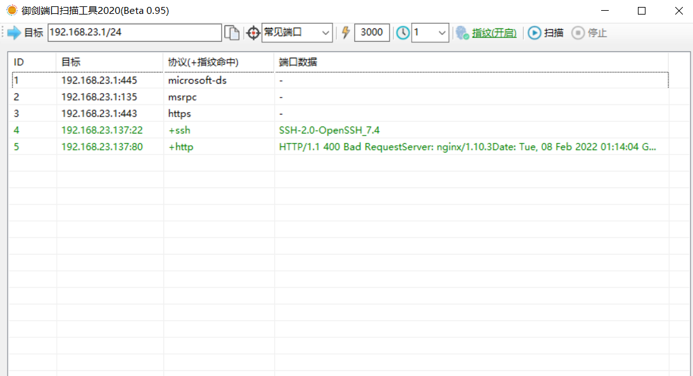

# 信息收集

信息收集——渗透测试的灵魂
为什么要信息收集？
有句话说“知己知彼，百战不殆”。最了解你的人往往都是你的对手。
当你所掌握到的信息比别人多且更详细的时候那么你就占据了先机，这一条不仅仅用于商业、战争、渗透测试中也适用。

信息收集的方向、究竟收集什么？
以 http://www.secdriver.com/ 这个网站为例，你知道这个网站是谁的(注册人/机构)吗？
当查到了网站所属的机构是某个公司后，那你能找到这个公司旗下拥有的其它网站吗？
你访问网站后发现他是某个机构的官网，那你能发现这个网站使用了什么编程语言，php还是jsp；使用了什么WEB容器，apache还是iis ; 网站的后台地址是什么；网站使用的服务器是windows还是linux，服务器的ip是什么, 这个ip上都开放了哪些端口?；这个网站是不是某一款流行的cms产品？。

带着这些问题，让我们开始今天的学习 ~~~

## 1.域名信息查询

### 什么是域名？

**域名**（**Domain Name**），又称**网域**，是由一串用点分隔的名字组成的Internet上某一台计算机或计算机组的名称，用于在数据传输时对计算机的定位标识（有时也指地理位置）。 

由于IP地址具有不方便记忆并且不能显示地址组织的名称和性质等缺点，人们设计出了域名，并通过网域名称系统（DNS，Domain Name System）来将域名和IP地址相互映射，使人更方便地访问互联网，而不用去记住能够被机器直接读取的IP地址数串。

计算机是不认识域名的，域名只是为了方便人们记忆而进行创建的

域名解析示例：secdriver.com  -> DNS 服务器  114.114.114.114  -> 47.94.98.63

域名ip查询：

```shell
ping secdriver.com   # ping DNS解析
nslookup secdriver.com  # nslookup DNS解析
```



### 域名级别

域名可分为不同级别，包括顶级域名、二级域名等

#### 顶级域名

**国家顶级域名**（national top-level domainnames，简称nTLDs），200多个国家都按照ISO3166国家代码分配了顶级域名，例如中国是 .cn，美国是 .us，日本是 .jp 等

**国际顶级域名**（international top-level domain names，简称iTDs），例如表示工商企业的 .com，表示网络提供商的 .net，表示顶级标杆、个人的 .top，表示非盈利组织的.org等


#### 二级域名

二级域名是指顶级域名之下的域名，在国际顶级域名下，它是指域名注册人的网上名称，例如 ".ibm"，".yahoo"，".microsoft"等；在国家顶级域名下，它是表示注册企业类别的符号

#### 三级域名

三级域名用字母（a～z）、数字（0～9）和连接符（－）组成， 各级域名之间用实点（.）连接，三级域名的长度不能超过20个字符，域名长度有限，最多可注册63个字符，域名总长度不能超过253个字符


### 什么是子域名？

**子域名**（**Subdomain**）是在域名系统等级中，属于更高一层域的域。比如，mail.example.com和calendar.example.com是example.com的两个子域，而example.com则是顶级域 .com 的子域。

子域名示例：

```shell
主域名：secdriver.com
子域名：
www.secdriver.com
edu.secdriver.com
mail.secdriver.com
ctf.secdriver.com
...
```

### IP反查域名

通过IP可以反查出绑定在该网站的域名，来发现更多资产

ip138:  https://site.ip138.com/

webscan: https://www.webscan.cc/

VirusTotal: https://www.virustotal.com

微步在线：https://x.threatbook.cn/


### Whois查询

whois指的是域名注册时留下的信息，比如留下管理员的名字、电话号码、邮箱。

知道目标的域名之后，我们要做的第一件事就是获取域名的whois信息，因为域名注册人可能是网站管理员，可以尝试社工、套路，查询是不是注册了其他域名扩大攻击范围。

#### 查询网站

爱站工具网: https://whois.aizhan.com

站长之家: http://whois.chinaz.com

VirusTotal: https://www.virustotal.com

通过这些网站可以查询域名的相关信息，如域名服务商、域名拥有者，以及他们的邮箱、电话、地址等。

#### kali工具

whois 域名

```shell
whois www.secdriver.com   
```

### ICP备案信息查询

网站备案是根据国家法律法规规定，需要网站的所有者向国家有关部门申请的备案，这是国家信息产业部对网站的一种管理，为了防止在网上从事非法的网站经营活动的发生。主要针对国内网站，如果网站搭建在其他国家，则不需要进行备案。

常用的网站有以下几个：

工业和信息化部政务服务平台：https://beian.miit.gov.cn/

全国互联网安全管理平台：http://www.beian.gov.cn/portal/recordQuery

天眼查：http://www.tianyancha.com


### 子域名收集

假设我们的目标网络规模比较大，直接从主域入手显然是很不理智的，因为对于这种规模的目标，一般其主域都是重点防护区域，所以不如先进入目标的某个子域，然后再想办法迂回接近真正的目标。


#### 网站查询子域名

VirusTotal  https://www.virustotal.com/gui/home/search

fofa  https://fofa.info/

#### 工具扫描

Layer子域名挖掘机




## 2.端口信息

计算机“端口”是英文port的义译，可以认为是计算机与外界通讯交流的出口，计算机有0~65535，共计65536个端口。

端口作为服务器和客户端交互的接口，起着非常重要的作用。一些常见的端口标识出服务器开启了什么服务，比如3389端口开启，可以认为服务器系统为windows并且开启了远程服务的功能。所以，端口扫描在渗透测试中是非常重要的。

### 插件探测

#### **Fofa search**



#### shodan




### 工具扫描

#### nmap

nmap 是一款开源免费的针对大型网络的端口扫描工具，nmap可以检测目标主机是否在线、主机端口开放情况、检测主机运行的服务类型及版本信息、检测操作系统与设备类型等信息

nmap常用参数

| 参数            | 解释                                                         |
| --------------- | ------------------------------------------------------------ |
| -sP             | Ping扫描                                                     |
| -sS             | 快速扫描，SYN 半开放扫描                                     |
| -sT             | TCP全连接扫描（默认）                                        |
| -sU             | UDP端口扫描，不准确                                          |
| -sA             | 穿过防火墙的规则集，速度慢                                   |
| -P0             | 空闲扫描，无Ping扫描                                         |
| -PN             | 防火墙禁ping，不使用ping扫描                                 |
| -PR             | ARP Ping 扫描，速度很快                                      |
| -PS             | TCP SYN Ping扫描                                             |
| -PA             | TCP ACK Ping扫描                                             |
| -sV             | 端口服务及版本                                               |
| -sC             | –script=default 默认的脚本扫描，主要是搜集各种应用服务的信息 |
| -O              | 探测目标系统版本                                             |
| -A              | 包含了-sV，-O，全面系统检测，启动脚本检测，扫描漏洞等（有误报） |
| -p              | 指定端口号 如: 80,81,8000-9000                               |
| -T              | 扫描速度T0~T5 ,默认T3， 速度越快精度越低                     |
| --open          | 只显示开放的端口                                             |
| -v / -vv        | 显示详细信息，-vv 比 -v 更详细                               |
| -iL             | 从文件导入要扫描的 ip 列表                                   |
| -oN / -oX / -oG | 将报告写入文件，格式分别为正常（自定义.txt）,XML,grepable    |
| -exclude        | 排除某些不需要扫描的 ip                                      |

##### 基本使用

```shell
nmap 192.168.23.1/24 # Nmap 默认发送⼀个arp的ping数据包，来探测⽬标主机在1-10000范围内所开放的端⼝
```

##### 主机发现

主机发现的原理与Ping命令类似，发送探测包到目标主机，如果收到回复，那么说明目标主机是开启的

```shell
nmap -sP 192.168.1.0/24  # 进行ping扫描，打印出对扫描做出响应的主机,不做进一步测试端口扫描或者操作系统探测
```

##### 操作系统识别

```shell
nmap -O 192.168.23.1     # 操作系统版本探测
nmap -O --osscan-limit 192.168.23.1  # 探测操作系统版本详细信息
nmap -O --osscan-guess 192.168.23.1  # 猜测操作系统版本

nmap -A 192.168.23.1     # 操作系统探测和服务版本探测等
```

##### 端口扫描

```shell
nmap -sT 192.168.23.1 -p 21,22,23,53,80,135,443,445 # (默认) TCP全连接扫描,常见端口
nmap -sS 192.168.23.1 -p 1-3000 --open -vv  # (常用) 快速扫描 1-3000 范围端口,只显示开放端口信息
nmap -PN 192.168.23.1 -p 1-3000  # 不使用ping命令扫描
nmap -PR 192.168.23.1 -p 1-3000  # arp扫描，内网中局域网防火墙不拦截，速度很快
nmap -P0 192.168.23.1 -p 1-3000  # 空闲扫描，不会留下记录

nmap -sV 192.168.81.148 -p 3389,5985,6588,999,21,80 -A  # 探测端口信息
```

##### 格式化输出

```shell
# 使用 nmap 结果美化 model, 美化 nmap 输出的 xml 文档，使用-oX xxx.xml 或者 -oA xxx 可将结果导出为 xml 格式
# 端口信息探测 + 系统探测 + 基础扫描
nmap -sV -A 192.168.23.1 -p 80,88,135,139,443,445,903,1080,1688,3306,5357 -oA mysite
nmap -sV -A 192.168.23.1 -p 80,88,135,139,443,445,903,1080,1688,3306,5357 -oX mysite.xml
# 格式化 xml 文档
xsltproc -o mysite.html mode.xsl mysite.xml

# 使用浏览器打开 html 文档
firefox mysite.html
```

##### 常见端口

```
80,89,8000,9090,1433,1521,3306,5432,445,135,443,873,5984,6379,7001,7002,9200,9300,11211,27017,27018,50000,50070,50030,21,22,23,2601,3389
```


#### masscan

masscan 是 Kali 下集成的高效扫描器 , 速度非常快

masscan 常用参数

| 参数                       | 解释                                                         |
| -------------------------- | ------------------------------------------------------------ |
| --ping                     | 发送icmp数据包，进行主机存活探测                             |
| -adapter-ip                | 指定发包的ip地址（伪造ip）                                   |
| --adapter-port             | 指定发包源端口                                               |
| --adapter-mac              | 指定发包的源MAC地址                                          |
| --router-mac               | 指定网关MAC地址                                              |
| --exclude                  | IP地址范围黑名单，不扫描的IP                                 |
| --excludefile              | 指定IP地址范围黑名单文件                                     |
| --includefile / -iL        | 读取一个范围列表进行扫描                                     |
| --wait                     | 指定在退出程序之前等待接收数据包，默认值为10秒               |
| -p                         | 指定要扫描的端口类型及范围  -p U：1024-1100                  |
| --rate                     | 指定线程数，推荐1000~3000                                    |
| --banners                  | 抓取端口服务信息，仅支持部分协议                             |
| --open-only                | 只显示开放的端口                                             |
| --http-user-agent          | 使用指定的user-agent发送http请求                             |
| -sL                        | 不执行扫描，而是创建一个随机地址列表                         |
| --output-format            | 指示输出文件的格式，可以是 xml，二进制，grepable，list , JSON |
| --output-filename          | 输出的文件名                                                 |
| -oX / -oB /-oG / -oL / -oJ | 格式化输出为某种文件形式 xml , 二进制 , grepable , list , json |


##### 基本用法

```
masscan 192.168.23.1 -p 1-3000
```

##### 枚举C段

```shell
-sL  参数可以枚举网段
masscan -sL 10.0.0.0/24 > c段.txt
masscan -sL 10.0.0.0/16 > b段.txt
masscan -sL 10.0.0.0/8  > a段.txt
```


#### 御剑端口扫描



## 3.C段和旁站

### 旁站

旁注：同服务器不同站点的渗透方案

旁站指的是网站所在服务器上部署的其他网站，同IP网站，一个IP上布置了多个网站
从同台服务器上的其他网站入手，获取到服务器权限，自然就获取到了目标网站的权限

### C段 

**C段：同网段不同服务器的渗透方案**

C 段嗅探指的是拿下同一C段下的服务器，也就是说是D段1-255中的一台服务器，再通过内网横向移动获取你想要的服务器权限。

例如192.168.1.66  -> 192.168.1.4 能够相互通讯

可以控制该网段中的192.168.1.66，再通过内网横向移动来控制 192.168.1.4 

注意：一般情况下云服务器C段的IP都是相互独立的，这些服务器分属不同用户，没有渗透的必要

#### 在线查询网站

https://www.webscan.cc/


#### 工具扫描C段

一般可以扫描一些常见端口，来发现C段中在线的主机，比如

#### nmap

```shell
nmap -A -vv 192.168.23.1/24    # 很慢，慎用可以加-T参数
nmap -PR -vv 192.168.23.1/24 -p 1-1000,8000-9000 --open  # arp 扫描, 速度快
nmap -PN -vv 192.168.23.1/24 -p 1-1000 --open # 不使用ping扫描，能发现禁ping主机
```

#### masscan

```shell
masscan 192.168.23.1/24 --ping   # icmp探测C段在线主机
masscan 192.168.23.1/24 -p 21,22,80,137,138,139,443,445,1433,1434,1521,3306,6379,7001,8000,8080,9001 --open-only
```

#### 御剑端口扫描



