# 信息收集

补天SRC：https://www.butian.net/

公益SRC：https://www.butian.net/Reward/plan/2

## 目录信息收集

- 寻找到网站后台管理

- 寻找未授权界面

- 寻找网站更多隐藏信息

- 发现这个网站存在多少个目录，多少个页面，探索出网站的整体结构
- 发现敏感文件，后台文件，数据库文件，和信息泄漏文件等等

### 常见的后台管理页面：

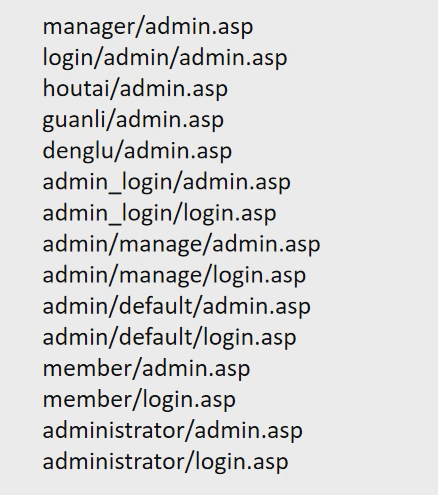

### robots.txt

Robots协议(Robots Exclusion Protocol)“网络爬虫排除标准”，网站通过Robots协议告诉搜索引擎哪些页面可以抓取，哪些页面不能抓取，同时也记录网站所具有基本的目录

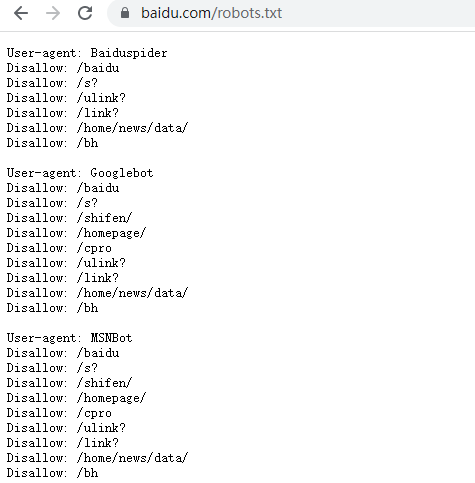

### 目录扫描工具

#### dirsearch

dirsearch是一个基于python3的命令行工具，旨在暴力扫描页面结构，包括网页中的目录和文件

依赖安装：`pip install -r requirements.txt`

简单使用：python dirsearch.py -u 目标地址

##### 常用参数

```shell
## 基本使用
-h  # 使用帮助
-u  # 指定目标url，最好加上协议类型 如http https
-L  # 指定url列表文件
-e  # 参数指定网站类型 php, jsp, asp, aspx, do, action, cgi, pl, html, htm, js, json, tar.gz, bak (-e *代表所有)


## 自定义选项
-w  # 指定字典扫描
-t  # 指定线程数（默认25）
-r  # 递归扫描 扫描到目录文件会进一步向下挖掘
-random-agents #使用随机UA
-H  # 使用指定headers (e.g. --header "Referer: example.com" --header "User-Agent: IE")
-m  # 指定http请求方式，默认get
-d  # 发送的 data 数据
--cookie    # 添加 cookie
--proxy  # 添加代理 e.g. --proxy 127.0.0.1:1080 


## 过滤扫描结果
-i /               # http 状态码白名单 (e.g. 200,300-399)
-x / --exclude-status    # 排除指定 http 状态码 （e.g.: 301,403,500-599) 
--exclude-texts     # 文本排除响应 (e.g.: "Not found", "Error") 
--exclude-regexps   # 按regexp排除响应，用逗号分隔(e.g.: "Not foun[a-z]{1}", "^Error$")


## 报告输出
-o 指定报告文件输出地址
--format  报告文件格式  (默认: simple, plain, json, xml,md, csv, html, sqlite)
--log  输出扫描日志文件 (一般不用)
```


## 网站指纹识别

在web渗透过程中，Web指纹识别是信息收集环节中一个比较重要的步骤，通过一些开源的工具、平台或者手工检测CMS系统是公开的CMS程序还是二次开发至关重要，能准确的获取CMS类型、Web服务组件类型及版本信息可以帮助安全工程师快速有效的去验证已知漏洞。对目标渗透测试过程中，目标的cms是十分重要的信息，有了目标的cms，就可以利用相关bug进行测试，进行代码审计等。

### 识别方式

1.网站特有文件

如/templets/default/style/dedecms.css  —  dedecms

2.网站独有文件的md5

如favicon.ico，但是该文件可以被修改导致不准确。

文件md5计算 `certutil -hashfile filename MD5`

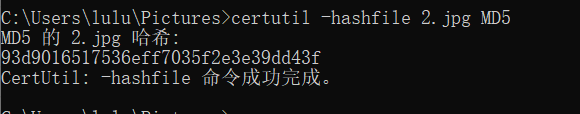

3.网站文件命名规则

4.返回头的关键字 如 header="rememberMe=deleteMe"

5.网页关键字

如 /data/sessions/index.html——dedecms

 /data/admin/ver.txt

6.Url特征

10.网站路径特征

11.网站静态资源

12.爬虫网站目录信息

**指纹识别的对象**

1、CMS信息：比如大汉CMS、织梦、帝国CMS、phpcms、ecshop等；

2、前端技术：比如HTML5、jquery、bootstrap、pure、ace等；

3、Web服务器：比如Apache、lighttpd, Nginx, IIS等；

4、应用服务器：比如Tomcat、Jboss、weblogic、websphere等；

5、开发语言：比如PHP、Java、Ruby、Python、C#等；

6、操作系统信息：比如linux、win2008、win7、kali、centos等；

7、CDN信息：是否使用CDN，如cloudflare、360cdn、365cyd、yunjiasu等；

8、WAF信息：是否使用waf，如Topsec、safedog、Yundun等；

9、IP及域名信息：IP和域名注册信息、服务商信息等；

10、端口信息：有些软件或平台还会探测服务器开放的常见端口。


### 识别工具

Kali工具：**whatweb**

whatweb 域名     # 单个域名识别

```
https://shop.zszlm.cn/ [200 OK] Cookies[h6Dz_2132_lastact,h6Dz_2132_lastvisit,h6Dz_2132_saltkey,h6Dz_2132_sid], Country[CHINA][CN], Email[admin@admin.com], HTTPServer[nginx], HttpOnly[h6Dz_2132_saltkey], IP[120.77.254.208], JQuery, Meta-Author[Discuz! Team and Comsenz UI Team], MetaGenerator[Discuz! X3.4], PHP[5.6.40], PoweredBy[Discuz!], Script[text/javascript], Title[论坛 -  Powered by Discuz!], X-Powered-By[PHP/5.6.40], nginx

```


### 在线指纹识别：

https://www.yunsee.cn/


#### 指纹探测插件：Wapplyzer

### CDN识别

#### 认识CDN

CDN是指内容分发网络。CDN是构建在现有网络基础之上的智能虚拟网络，依靠部署在各地的边缘服务器。


通过中心平台的负载均衡内容分发，调度等功能模块，使用户就近获取所需内容，降低网络拥塞，提高用户访问响应速度和命中率。

CDN的基本原理是广泛采用各种缓存服务器，将这些缓存服务器分布到用户访问相对集中的地区或网络内。

在用户访问网站时，利用全局负载技术将用户的访问**指向距离最近的工作正常的缓存服务器上**，由缓存服务器直接响应用户请求。


#### 识别CDN

nslookup

多地ping网站：https://ping.chinaz.com/        https://tools.ipip.net/ping.php

在线查询网站真实IP：https://get-site-ip.com/

有CDN加速的示例网站：https://royalapps.com/  、https://taobao.com

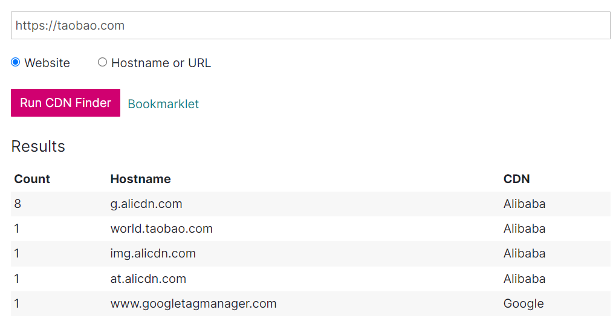


## 搜索引擎语法

### fofa语法

网址：https://fofa.info/

**高级搜索**

&& = and   

可以使用括号 和 && (与) 、|| (或)、 != (非)、等符号，如

```
title="powered by" && title!="discuz"

body="content=WordPress" || (header="X-Pingback" && header="/xmlrpc.php" && body="/wp-includes/") && host="gov.cn"
```


**常用语法**

```
domain="qq.com"	  #查询子域名
host=".gov.cn"    #从url中搜索".gov.cn"
header="thinkphp" #从http头中搜索thinkphp
port="6379"       #查找对应“6379”端口的资产
ip="1.1.1.1"      #从ip中搜索包含“1.1.1.1”的网站
ip="220.181.111.1/24"   #查询IP为“220.181.111.1”的C网段资产
status_code="402" #查询服务器状态为“402”的资产
app="通达OA网络智能办公系统"   # 搜索通达OA系统
country="CN"      # 搜索指定国家(编码)的资产
region="Henan"    # 搜索指定行政区的资产
city="beijing"
```

### 360Quake

https://quake.360.cn/

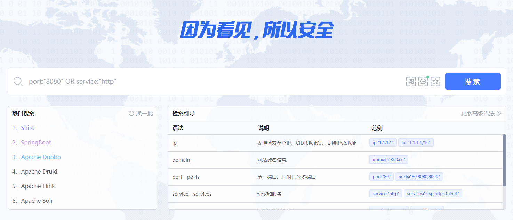

### 奇安信hunter

https://hunter.qianxin.com/


### google语法

基本语法
**AND：缺一不可**
谷歌的默认搜索是and逻辑，意思就是，我们在输入关键字后进行搜索时，如输入：“program google”后，会搜出包含“program”和“google”的文件内容，如图1。


基础布尔逻辑
对于一个搜索引擎来说，进行搜索的时候是要搜索到匹配到所有关键词的页面，还是包含关键词中的任意关键词就可以，取决于一个搜索引擎的一些特别算法，称之为搜索引擎的布尔逻辑默认值。

**OR：两者皆可**
而google就是用and作为默认逻辑（搜索到所有的关键词），当然这个前提是我们没有输入一些特殊的命令。如果你不确定你要搜索的内容，或者你想搜索两个中的任意一个，那么就要使用关键词“OR”。注意：OR是大写的，小写是不起作用的，而且，每一个关键词与“OR”之间是有一个空格的，我们来看一下搜索结果。

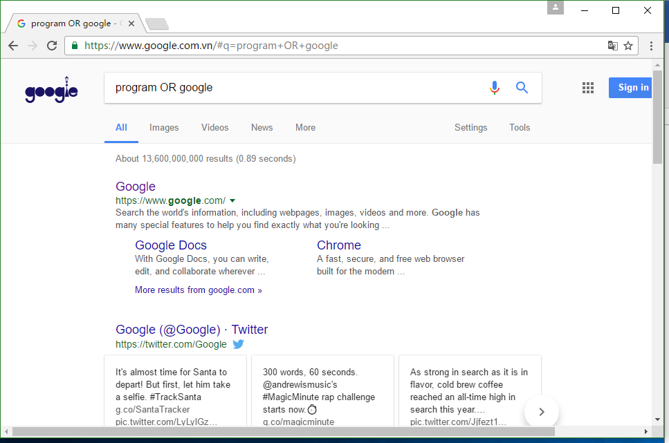

当然，可以预想的是，google的结果要比program多得多，所以结果第一页全是有关google的内容。此外，还可以借助计算机体系语言中的“|”来代替“OR”，效果是一样的。

**"" ：一刻都不能分割**
当然，如果你希望搜索“programgoogle”的内容，而不希望这两个单词之间有任何其他的内容，那么就要使用双引号把搜索的内容组成一个词组"programgoogle"来达到目的。如图所示。

　
如上图所示，结果中的programgoogle都是在一起的，没有分割。当然这样的结果比较少，只有2740个，但是看图1，结果却有7亿多个。而且，大部分搜索引擎都有智能断句的功能，如果没有特殊的命令，搜索引擎会一定量的根据大众的语言使用习惯来判断你要搜索什么，而这样的做法，不仅仅没有使搜索引擎显得不听话，反而对大众来讲搜索引擎变得十分智能和高效！

**- ：不想看到你**
但是如果我们只想看到“program”的内容，而不希望看到“google”的内容，就可以把“-”（减号或者破折号）应用到搜索当中去，语法为“program -google”，注意，“-”之前是有一个空格的，而其后却是和下一个关键词是紧紧相连的！搜索的结果如下图4所示。可以看得到结果中都会包含program，而不包含google。

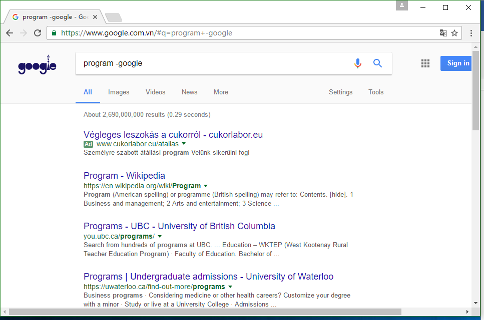

**+ ：就想看到你**
说到这里，还要提一下google的约束扩展问题了。一般来说，当输入关键词后，google会把相关网页和信息的结果呈现在我们面前。然而，有一些单词在搜索引擎中是会被智能忽略的，导致我们得不到想要的结果。比如十分常用的“www”和“the”，基本上任何一个网页上都会找到的东西，就会被google自动忽略（不要觉得这样不好，还是那个道理，在实际引用当中这样做反而显得更加高效和智能）。如果我们不想忽略这些词进行查询，就得在这些关键词的前面加上符号“+”。如下图5所示：

看上去两者好像没有什么大的区别，其实仔细比较一下搜索结果就可以看得出，加上加号的搜索结果有一万多个，而不加加号的结果却有着55亿多！而因为google和www的关联度比较高，所以在前面的结果表现的差别不大。

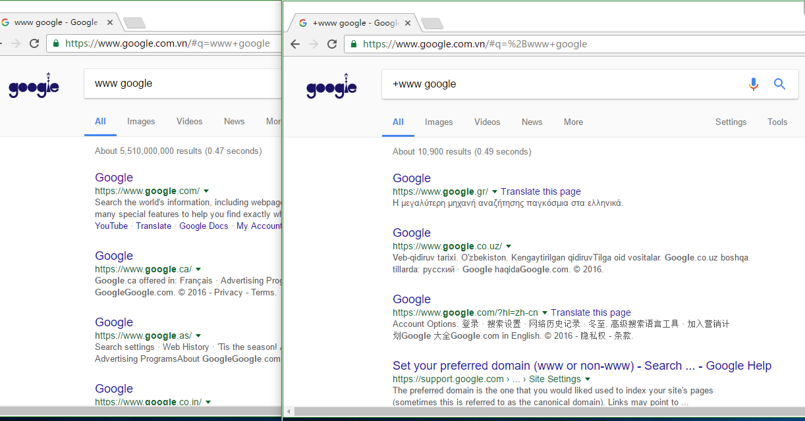

**“?”和“\*” ：占位通配符**
除了上述字符之外，一些搜索引擎支持一种叫做“stemming”（填充）的技术。Stemming是指在查询的关键词中添加一些通配符，通常是“\*”，有时候也可能是“？”，这些通配符的作用是要求搜索引擎进行查询是可以返回多个不同的结果。其中通配符代表占位，可以匹配其他任意字母和单词，而其他的字或词组与用户输入的相同。如我们想要搜索“Lionel Messi”的内容，却忘记了第一个单词的一些拼写，就可以输入“"l*Messi"”进行查询，注意：此处整个字符串是要用一个英文半角双引号括住的！结果如下图所示。　
可以看到，google自动匹配出Lionel Messi的内容并且进行了搜索。这样的方式有利于我们只能记住单词或短语的一部分的内容时使用。


**特殊语法**

```
site：可以限制你搜索范围的域名；
inurl：用于搜索网页上包含的URL，这个语法对寻找网页上的搜索，帮助之类的很有用；
intext: 只搜索网页<body>部分中包含的文字(也就是忽略了标题、URL等的文字)；
intitle: 查包含关键词的页面，一般用于社工别人的webshell密码；
filetype：搜索文件的后缀或者扩展名；
intitle：限制你搜索的网页标题；
inanchor: 搜素网站锚节点内容
cache   # 缓存搜索 cache  关键字  cache:secquan.org 当一个链接无法访问时（或信息被屏蔽时）；当信息已经被修改，想看以前的信息时
```

**常用技巧**

```
查找后台地址：
site:域名 inurl:login|admin|manage|member|admin_login|login_admin|system|user|main|cms
查找文本内容：
site:域名 intext:管理|后台|登陆|用户名|密码|验证码|系统|admin|login|sys|managetem|password|username
查找可注入点：
site:域名 inurl:aspx|jsp|php|asp
查找上传漏洞：
site:域名 inurl:file|load|editor|Files
找eweb编辑器：
site:域名 inurl:ewebeditor|editor|uploadfile|eweb|edit
存在的数据库：
site:域名 filetype:mdb|asp|#
查看脚本类型：
site:域名 filetype:asp/aspx/php/jsp
迂回策略入侵：
inurl:cms/data/templates/images/index/
```

### bing语法

bing 搜索语法与 google类似

```
inbody: 查找正文内容     inbody:密码|登陆
intitle: 查找标签内容
inanchor: 查找锚节点
filetype: 查找文件类型
site:返回属于指定网站的网页。若要搜索两个或更多域，请使用逻辑运算符OR对域进行分组
ip:  查找特点ip的网站
```


## Burp插件探测信息

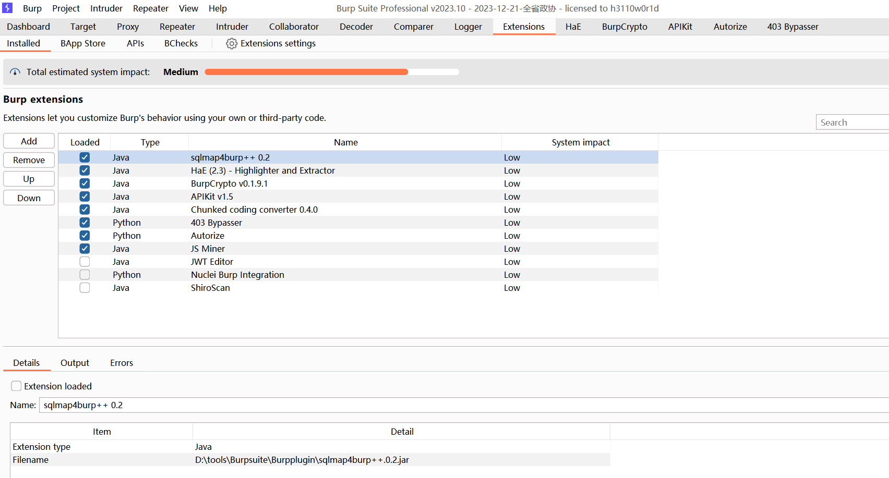

### HaE

Github项目地址 https://github.com/gh0stkey/HaE

**HaE**是一个基于`BurpSuite Java插件API`开发的辅助型框架式插件，旨在实现对HTTP消息的高亮标记和信息提取。该插件通过自定义正则表达式匹配响应报文或请求报文，并对匹配成功的报文进行标记和提取。

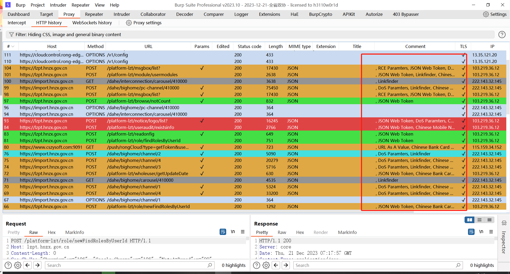

### JS Miner

js文件被动扫描，自动检索出js文件中的敏感信息，burp store下载。相似的插件有JS Link Finder

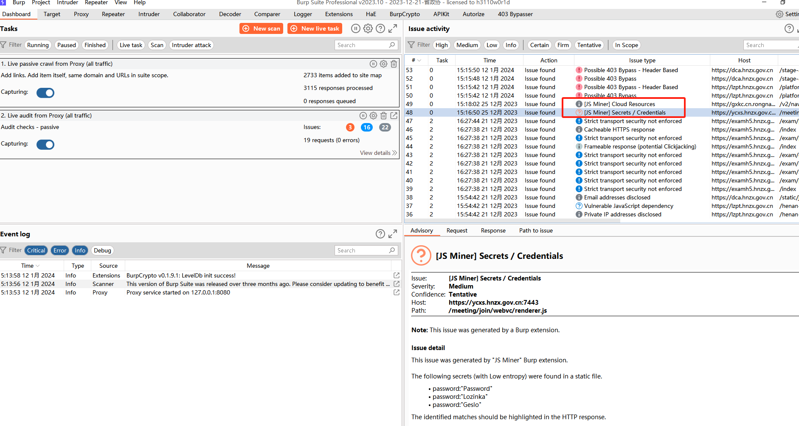

### 403bypass

尝试绕过403页面，burp store下载

使用方法：右键想要绕过的403请求，选择 Extensions -> 403 Bypasser

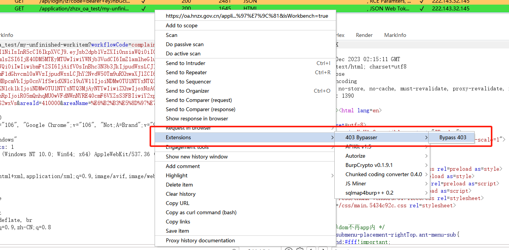

运行结果在 Dashboard 面板查看

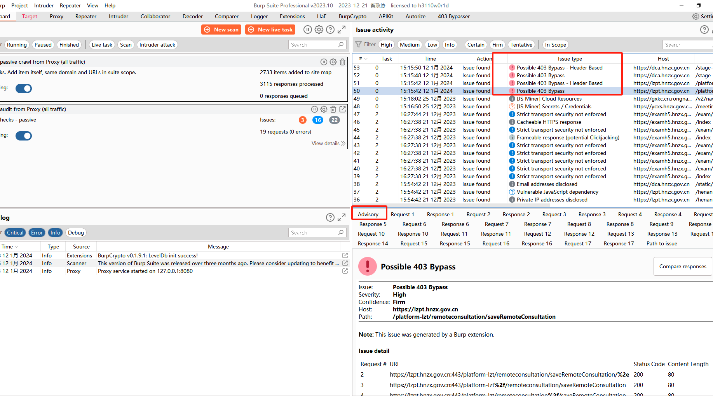

