# 最新burp抓取模拟器app包（2023.12.4）

记录一下碰到的app抓包问题，折腾了两个小时，太痛苦了。。。

## 思路

按照以往的经验都是简单的配置代理即可，不过多赘述，这里老方法走不通了。。。

多次实验均不行，后来查相关资料，说是安卓7.0后不支持了！真的难受！（APP在安卓7.0或更高的系统下，无法抓取数据包，是因为安卓从7.0开始应用只会信任系统预装的CA证书，而不会信任用户安装的CA证书，所谓的中间人攻击就不起效果了）

咋办，继续折腾，装证书呗、

## 步骤

思路就是把burp的证书伪装成系统证书，具体步骤如下：

1、使用burpsuite导出der证书，然后放到kali下，做如下操作

命令如下：

> openssl x509 -inform der -in burp.der -out burp.pem   #将der证书转为pem证书
> openssl x509 -inform PEM -subject_hash_old -in burp.pem  #生成pem证书的hash
> cp burp.pem 9a5ba575.0   #重命名/复制证书

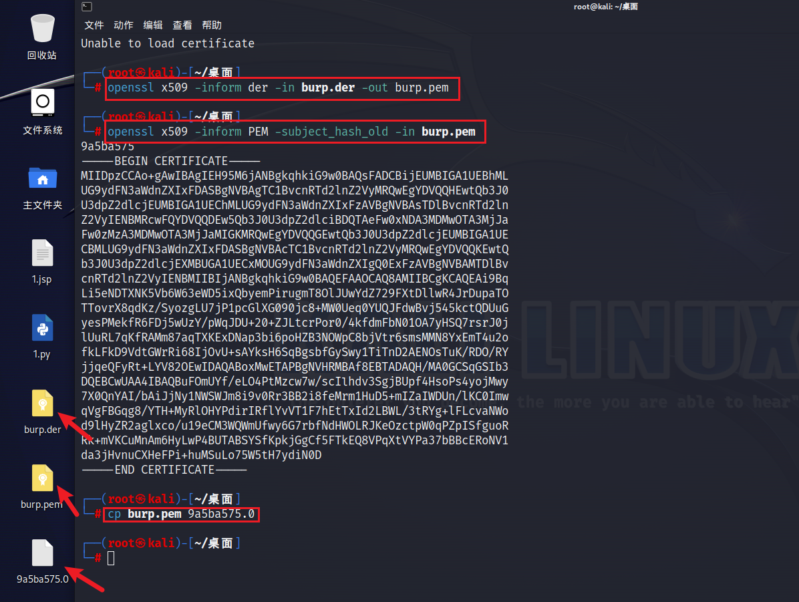

2、后面需要通过adb操作

在adb.exe的目录下执行下面操作：

> adb root // 提升到root权限
>
> adb remount //重新挂载system分区
>
> adb push 9a5ba575.0 /system/etc/security/cacerts/ //将证书放到系统证书目录

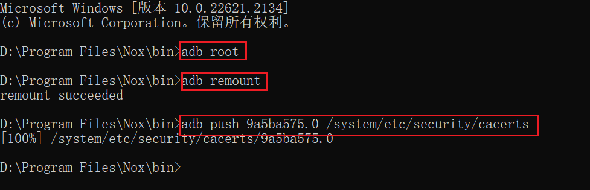

再在模拟器里配置同burp的代理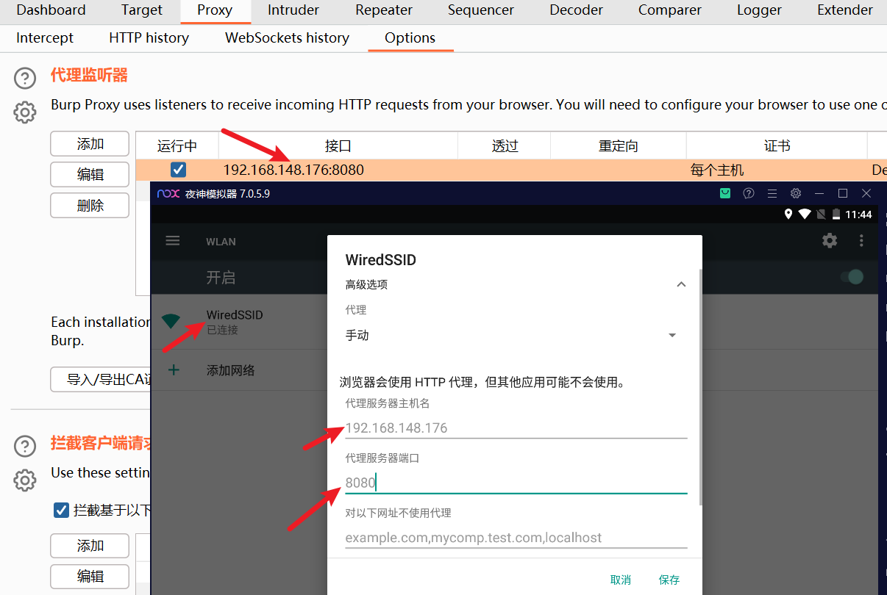

最终抓到了，如图：

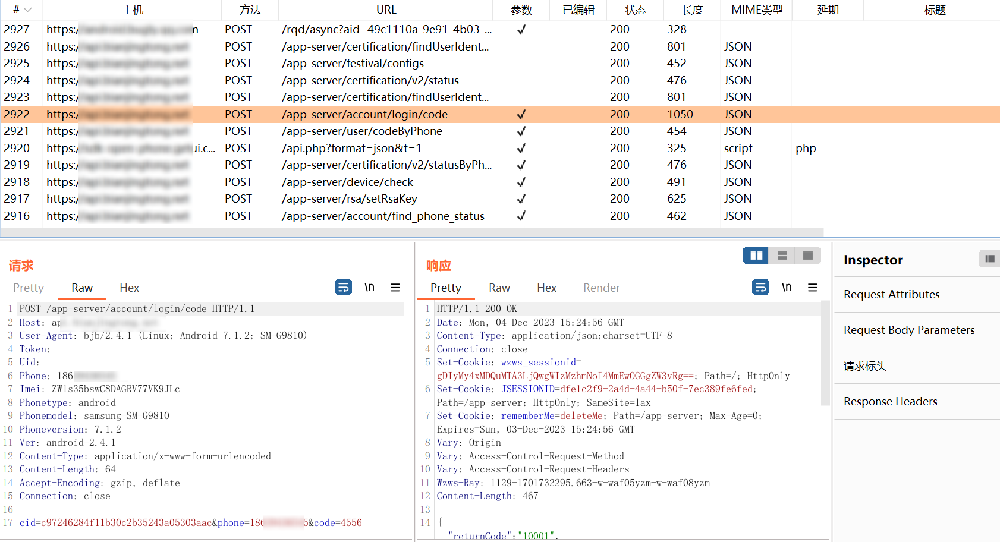

## 花絮

ps：雷电模拟器跟夜神应该是一样的，这里记录一下最现在雷电模拟器踩的坑（==这部分可以忽略==）

我在雷电模拟器里，安装证书，并且装了几遍

设置->安全性和位置信息->加密与凭据->信任的凭据/用户凭据

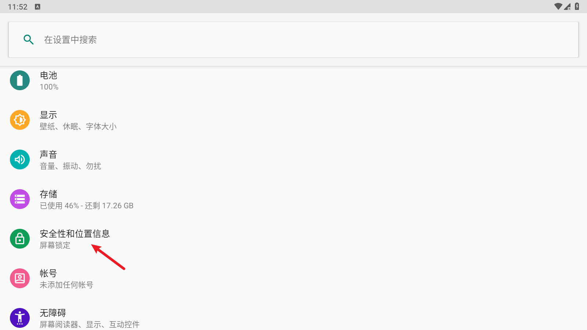

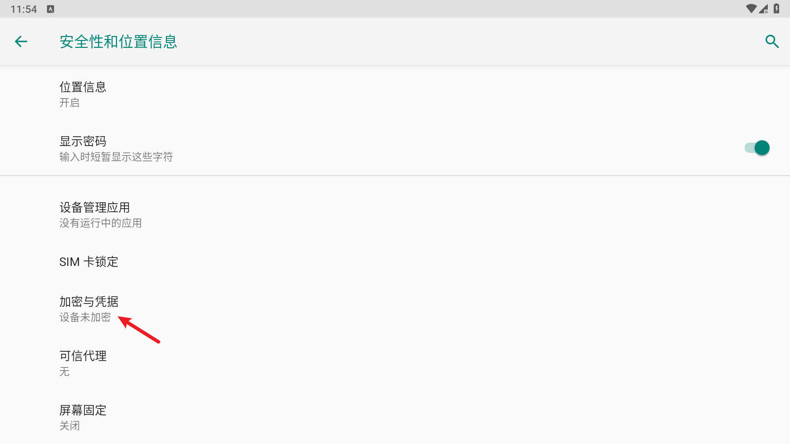

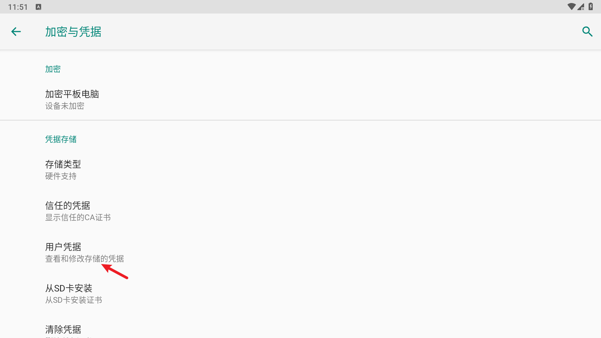

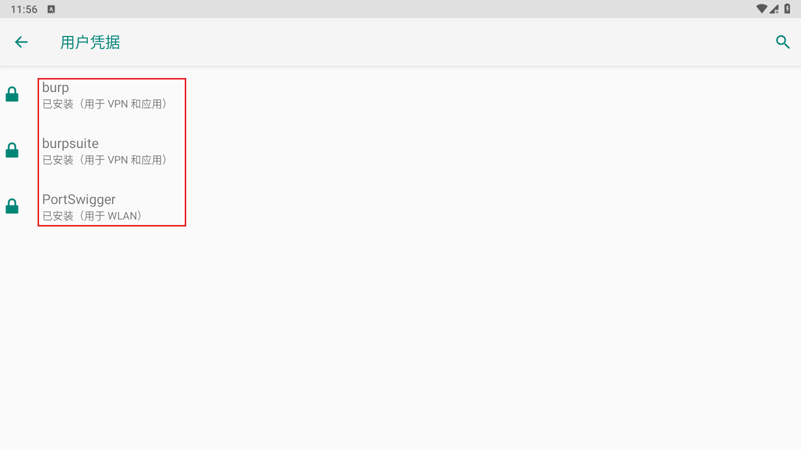

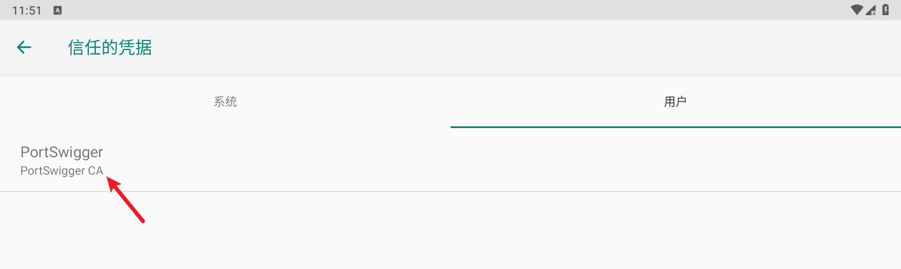

后来发现可以抓浏览器的包

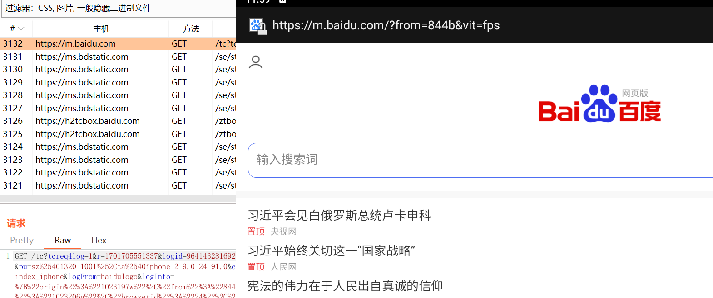

但是就是抓不到app的，抓app的时候会提示这种，感觉像是解析了一个app安装包名称，具体包并没有抓到

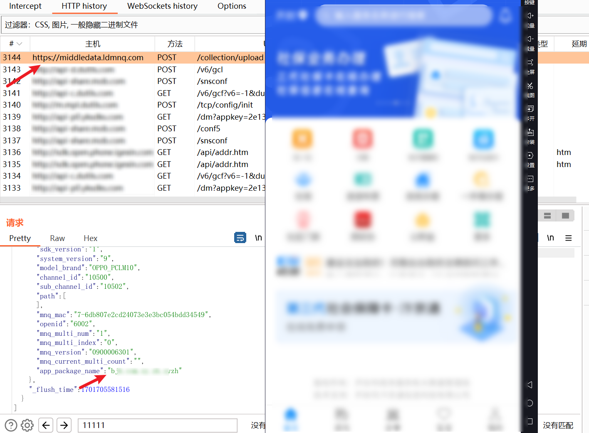

尝试复制，不行

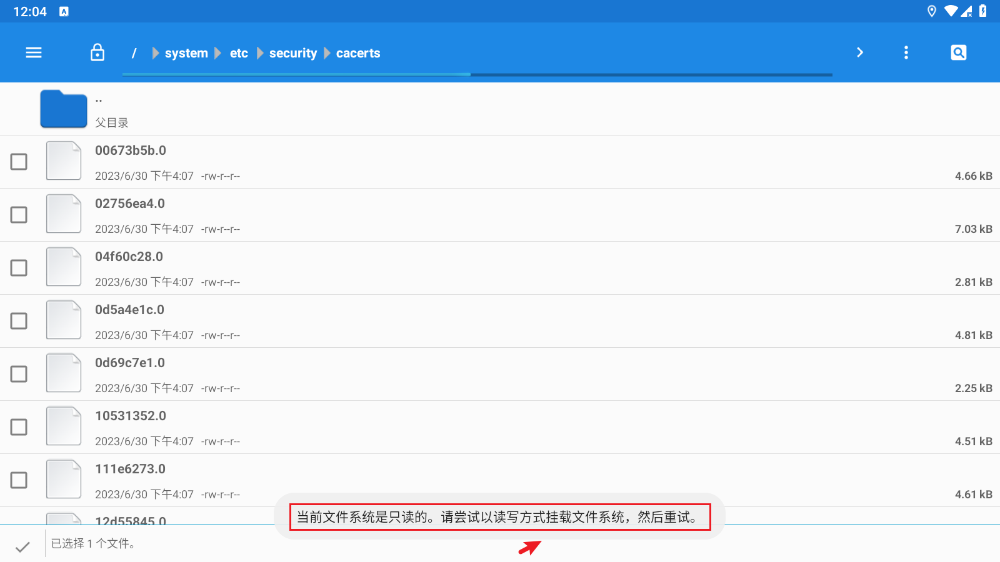

咋办呢，执行挂载的时候，老是报错

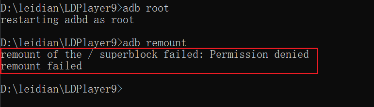

后面也没在折腾了，就在夜神模拟器上搞了

## 拓展

当burp与xray联动时候，会提示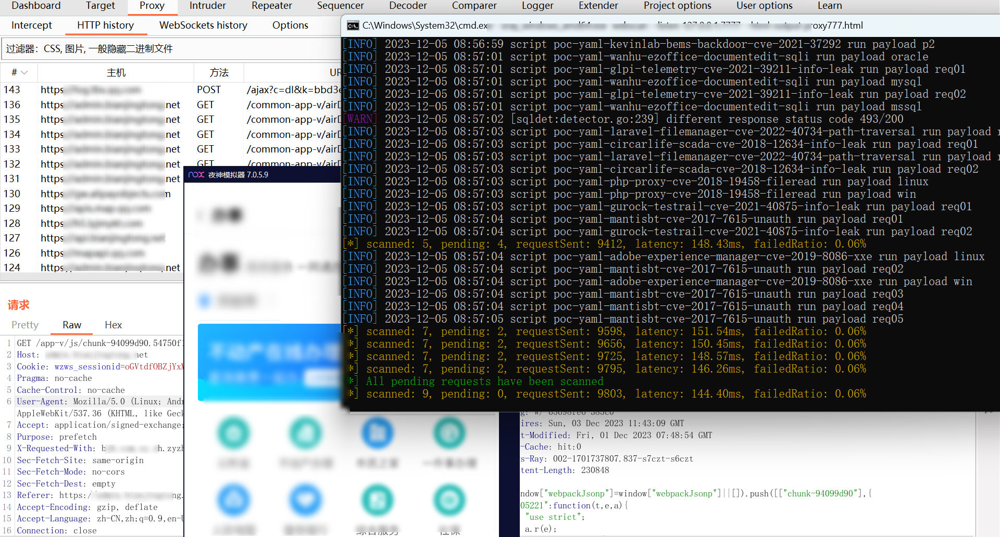需要安装xray证书

方法同上，不再赘述

效果图：

