## 前言

日常渗透过程中，有时候在web端没有突破，可以考虑从app或者小程序等入手。但是小程序的抓包中间还是有很多坑的，之前的抓包方法好像不太好用了，查阅了网上大佬文章，自己也是折腾了半天才配置好，这里记录一下。

## 工具环境

微信+burp+Proxifier

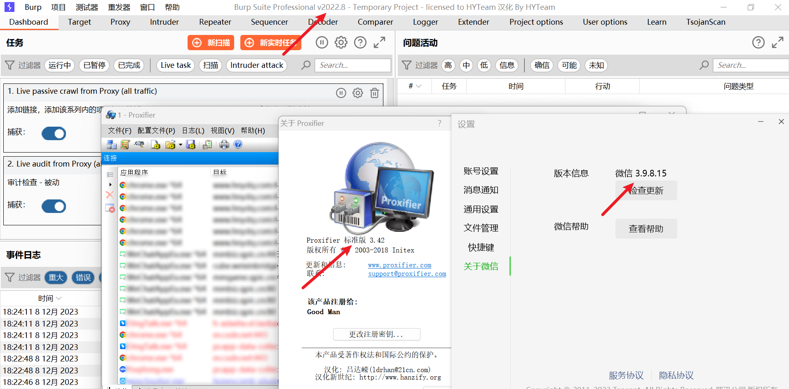

## 配置过程

### 配置burp

配置burp开启本地端口监听，这里不展开，不明白自行百度

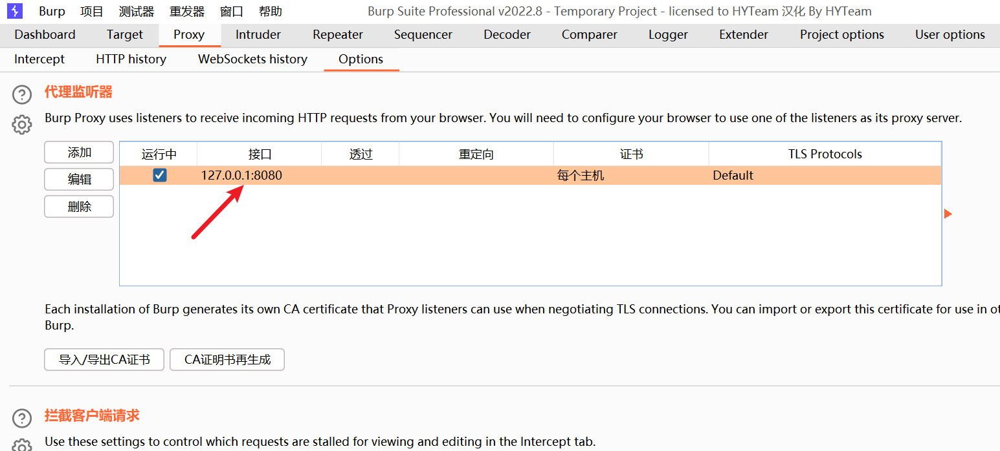

**安装burp证书**

浏览器访问http://127.0.0.1:8080/ 下载burp证书

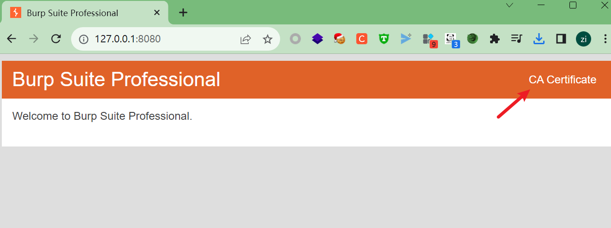

双击打开证书

ps：注意这里证书的问题是个大坑，如果你想当然的导入到个人，可能最终会抓不到包

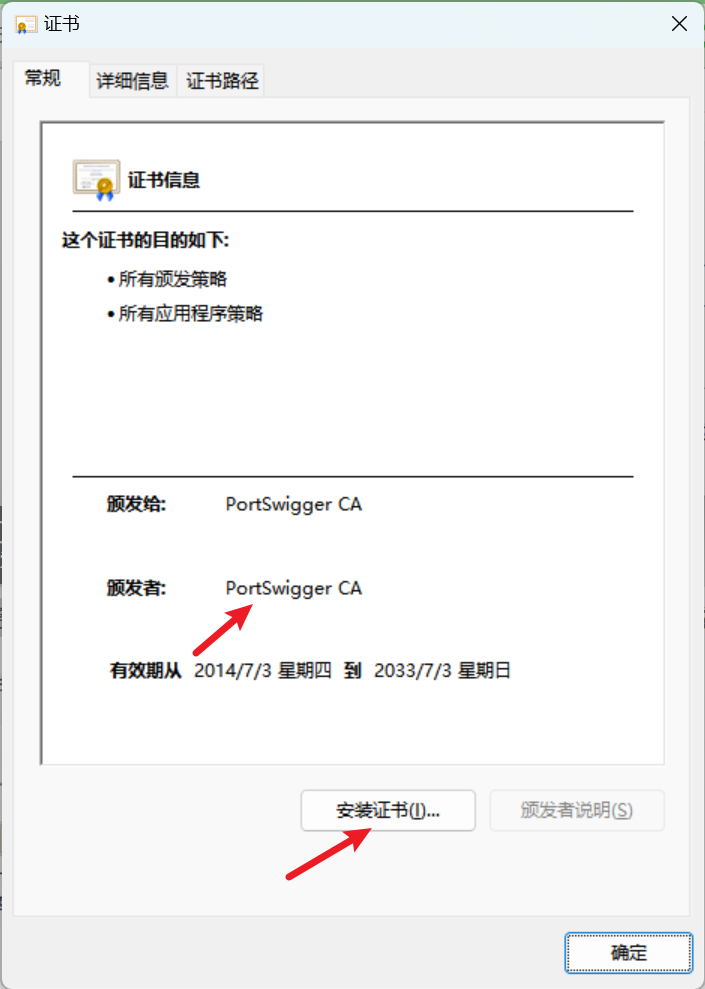

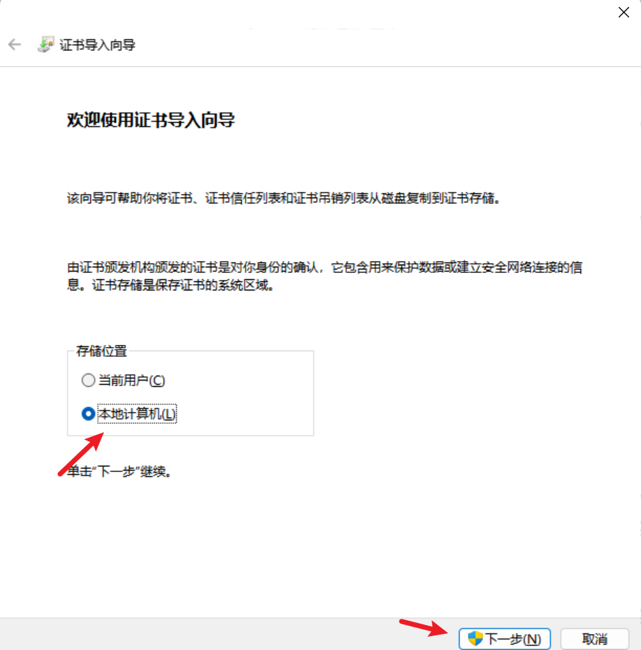

注意按图选择存放路径

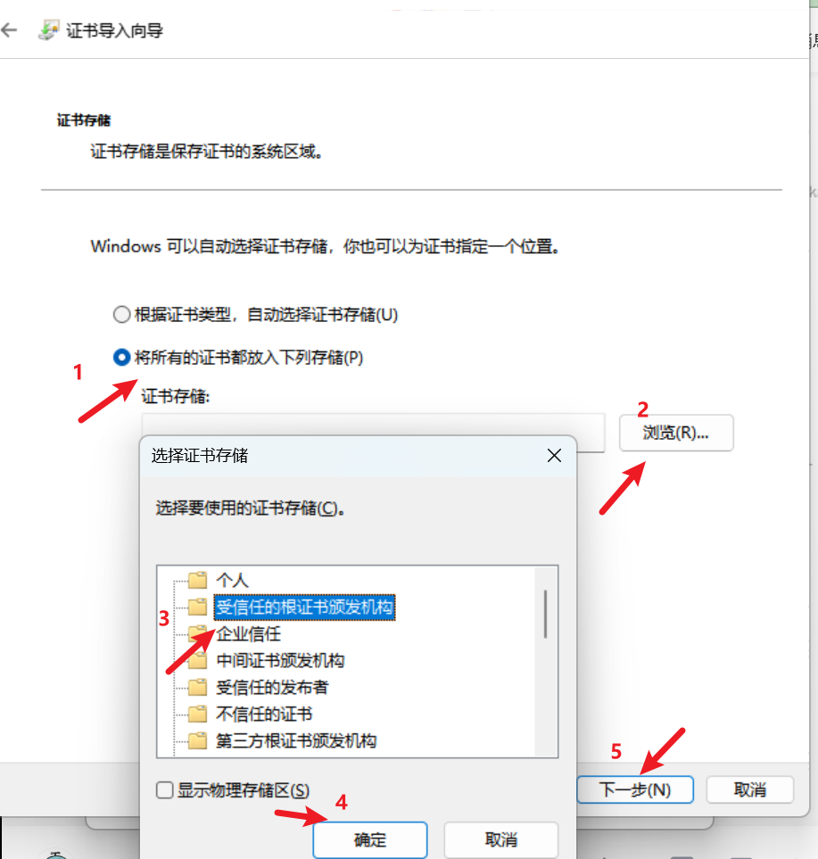

再点击完成，即导入成功

本地查看一下，如图即表示导入成功

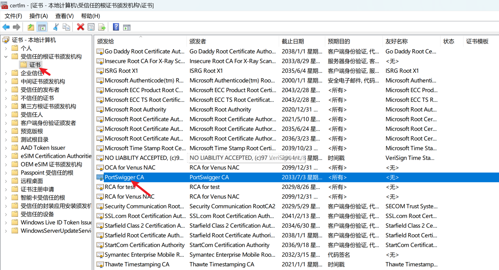

### 配置Proxifier

官方有试用版的，自行下载，这里我用的是一个汉化版的

打开Proxifier，在配置文件->代理服务器

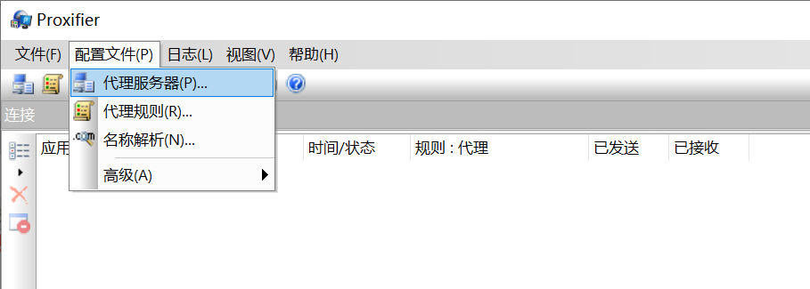

注意配置和burp一样

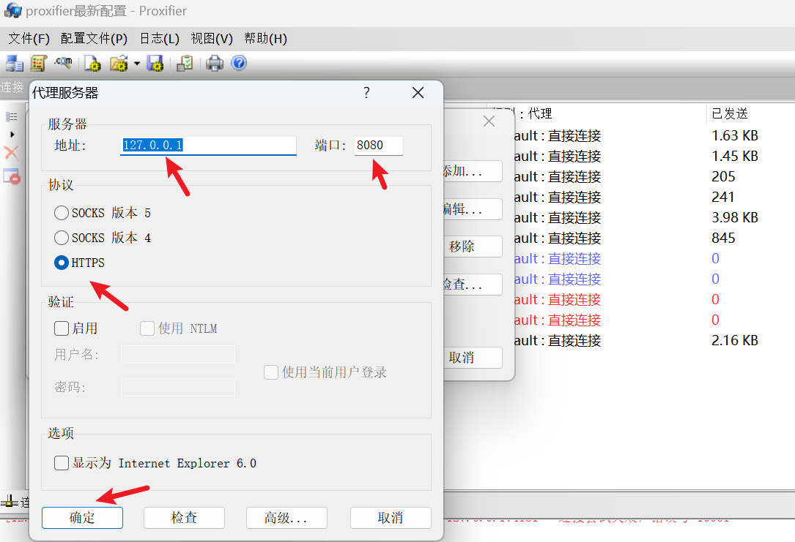

不知道代理服务器是否配置好，可以做下测试

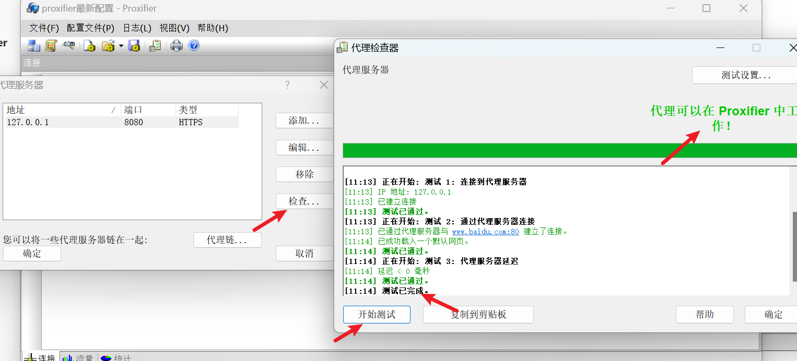

下一步配置代理规则

在配置代理规则之前需要做一件事情，需要找到小程序的路径

打开一个小程序，比如京东快递，然后打开任务管理器，找到WeChatAppEx.exe文件路径

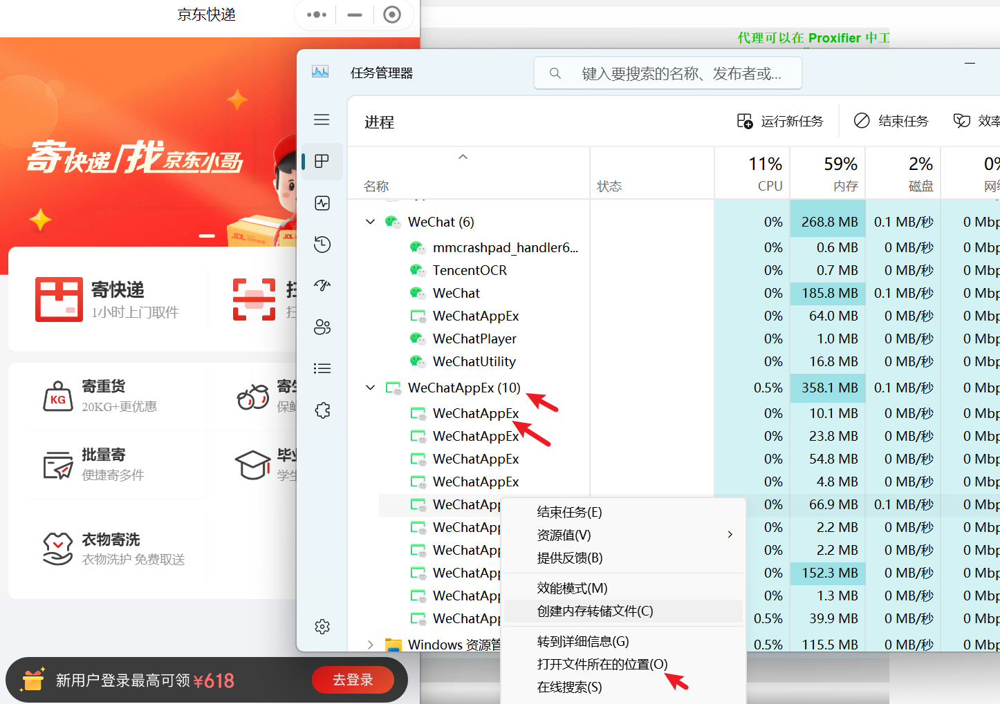

复制绝对路径

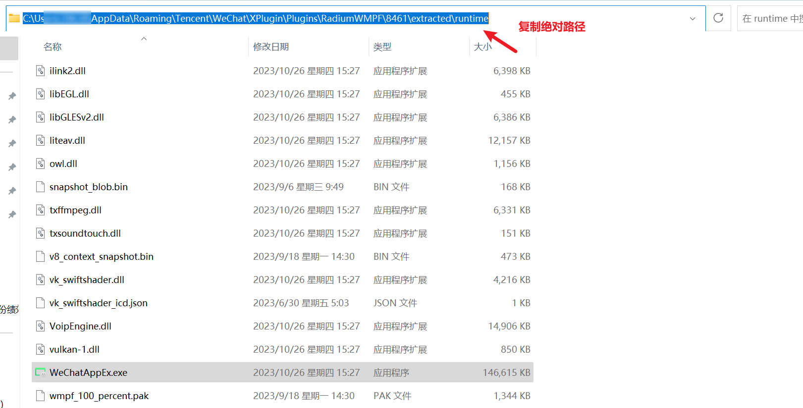

下面可以开始配置代理规则了

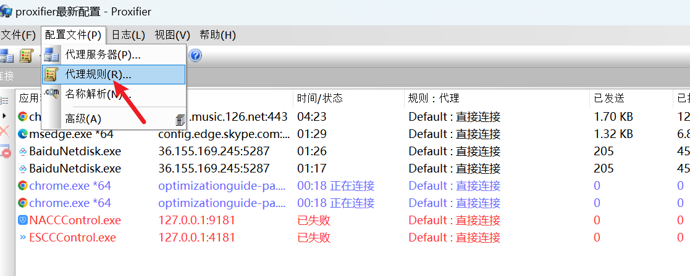

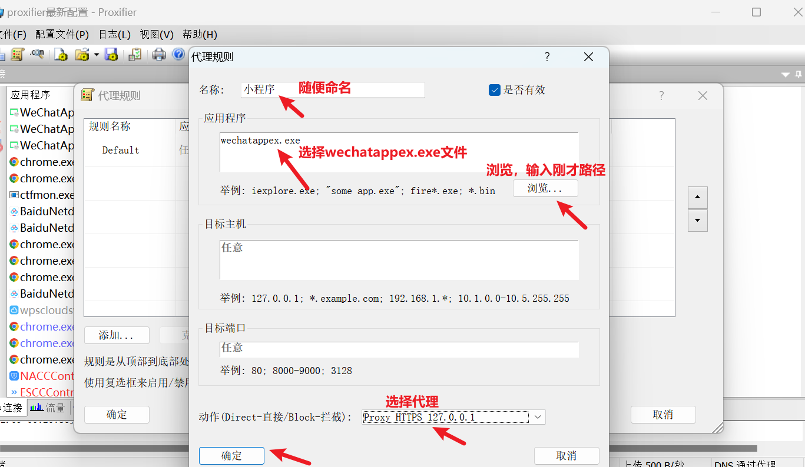

最后应该有3条规则，java那条是自动创建的

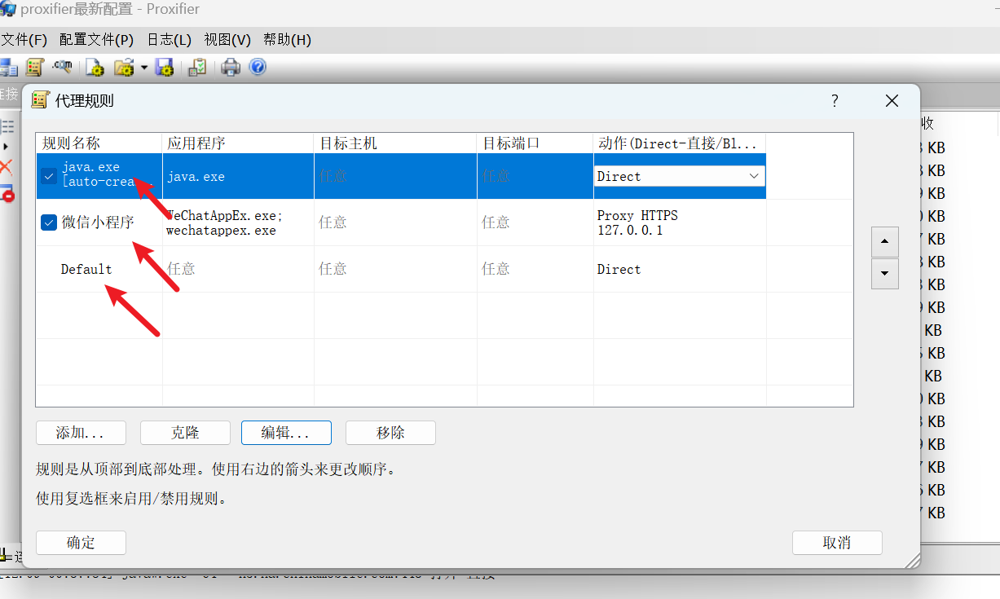

到这里应该就可以抓到了

如果还抓不到，可以尝试代理服务器支持，默认是关闭的

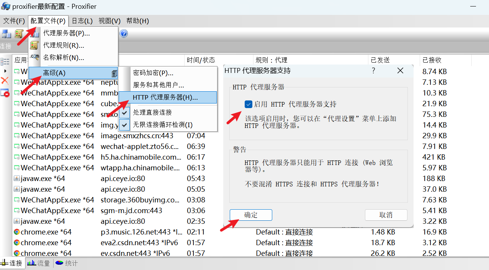

## 抓包验证

效果图：

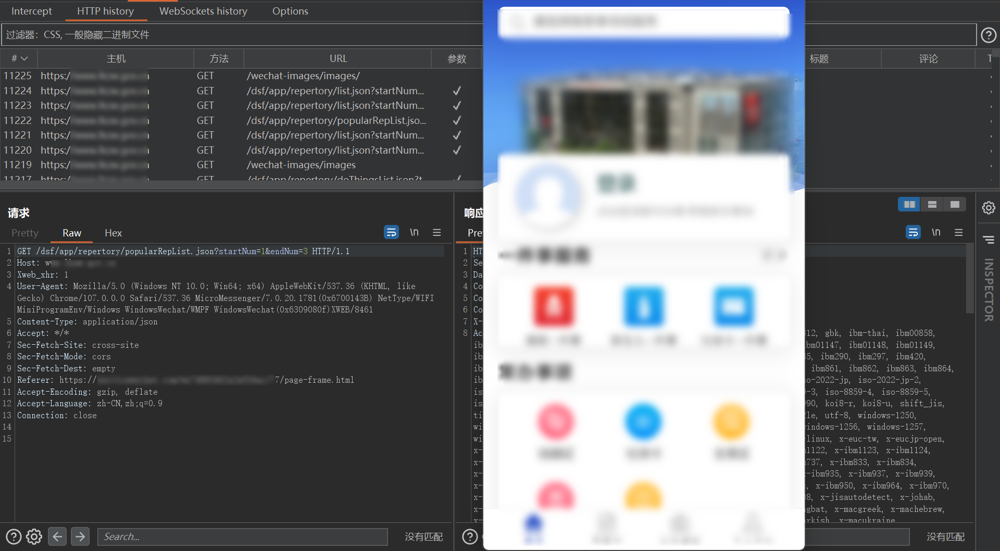

值得一提的是，可以导出当前proxifier配置文件，如果换了电脑或者重装系统了，直接导入配置文件即可

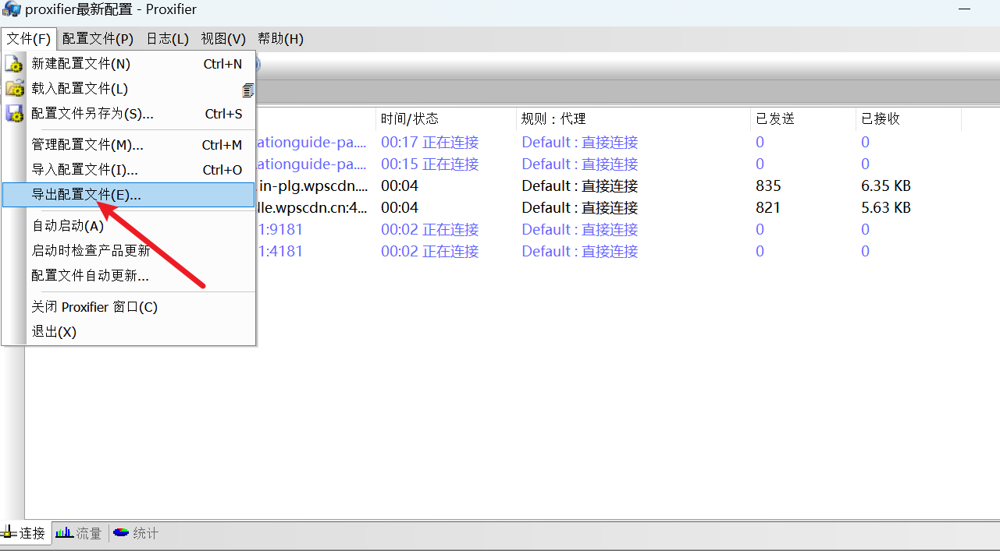

重点参考这一篇：

https://blog.csdn.net/CKT_GOD/article/details/134076065

下面这篇写的也不错

https://www.cnblogs.com/NoCirc1e/p/17467478.html